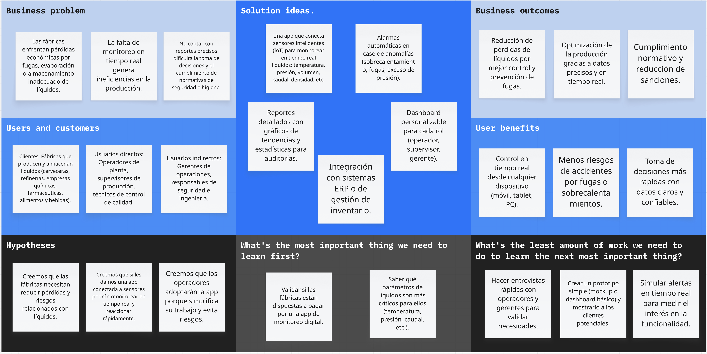

# Capítulo I: Introducción

## 1.1. Startup Profile

A continuación, se brindará información sobre a qué se dedica nuestra empresa, WASD, y sobre la solución móvil Qlic que se propone desarrollar para el curso de Aplicaciones Móviles.

### 1.1.1. Descripción de la Startup

WASD es una startup enfocada en la gestión inteligente del agua. Utilizamos tecnología IoT para optimizar el uso del recurso en negocios y hogares. La compañía combina sensores, analítica de datos y una aplicación móvil para transformar la manera en que las personas administran su agua. A través de Qlic, los usuarios podrán monitorear información relevante sobre el consumo de agua, recibir alertas y tomar decisiones oportunas desde sus dispositivos móviles.

- **Misión:** Ayudar a negocios y hogares a optimizar el uso de agua, reducir desperdicios, disminuir costos y garantizar el reabastecimiento oportuno.
- **Visión:** Ser la empresa más importante en Perú, en el ámbito de gestión y optimización de agua con el uso de soluciones tecnológicas.
- **Producto:** "Qlic" es un servicio el cual permite el monitoreo de puntos críticos del agua en hogares o pequeñas y medianas empresas , optimizando el uso de líquidos, reduciendo desperdicios y disminuyendo costos además de garantizar el reabastecimiento oportuno.

### 1.1.2. Perfiles de integrantes del equipo

| Foto de perfil                                   | Apellido y Nombre                             | Carrera                | Acerca de                                                                                                                                                       | Habilidades                                                                            |
|--------------------------------------------------|-----------------------------------------------|------------------------|-----------------------------------------------------------------------------------------------------------------------------------------------------------------|----------------------------------------------------------------------------------------|
|            | Avila Palacios, Aaron Alexander (u201823654)  | Ingeniería de Software | Estudiante interesado en el desarrollo de aplicaciones móviles y soluciones IoT que resuelvan problemas cotidianos con tecnología accesible.                    | Kotlin, Java, Android Studio, Jetpack Compose, Git/GitHub, APIs REST, SQL y diseño UX. |
|  | Condori Lozano, Alessandro Ramiro (u20211a118) | Ingeniería de Software | Actualmente soy estudiante de la carrera de Ingeniería de Software y trabajo en el área de sistemas de un grupo de clínicas. Me interesa el desarrollo de soluciones tecnológicas, la gestión de sistemas y la creación de aplicaciones que ayuden a resolver necesidades reales. | JavaScript, C++, HTML, CSS, C#, MongoDB, SQL Server, Angular, Vue, Python, Java, Git/GitHub y desarrollo de aplicaciones web. |
|                   | Briceño Llanos, Ayrton Omar (u202311077)      | Ingeniería de Software | Me apasiona el desarrollo de Software y la creación de soluciones tecnológicas que impacten positivamente en las personas.                                      | JavaScript, C++, HTML, CSS, C#, MongoDB, SQL server, Angular, Vue.                     |
|  | Conde Huashuayo, Sebasthian Alex (u20241e356) | Ingeniería de Software | Me gusta la programacion y el desarrollo de Software, buscar nuevas soluciones innovadoras y simples para problemas del dia a dia, a travez de buenas practicas | JavaScript, C++, HTML, CSS, SQL server, Angular, Vue, Kotlin, Git, APIs REST           |
|                                                  |                                               |                        |                                                                                                                                                                 |                                                                                        |
|                                                  |                                               |                        |                                                                                                                                                                 |                                                                                        |

## 1.2. Solution Profile

**Product Name:** Qlic  
**Product Description:** Qlic, es una Aplicación móvil que tiene como objetivo optimizar la gestión del agua. Para ello, este permite al usuario monitorear los IoT que tiene, mostrando información útil, ayudando a optimizar el uso de agua, reducir desperdicios, disminuir costos y garantizar el reabastecimiento oportuno. Qlic puede usarse en negocios y hogares con el fin de optimizar varios procesos.  
**Monetización:** Qlic funciona mediante un modelo de suscripción mensual o anual, en el cual se alquila el servicio de la aplicación y los diferentes dispositivos IoT.

### 1.2.1 Antecedentes y problemática

**Antecedentes:**

En el contexto actual de creciente preocupación por la sostenibilidad y la gestión de recursos básicos, el uso eficiente del agua potable representa un desafío crítico a nivel global y nacional. En el Perú, esta problemática se manifiesta tanto en la red pública como en las instalaciones del usuario final: según reportes de la Superintendencia Nacional de Servicios de Saneamiento [SUNASS] (2025), el índice de Agua No Facturada (ANF) supera el 43 % a nivel nacional, generado por deficiencias comerciales, conexiones clandestinas y fugas físicas no detectadas. Esta ineficiencia estructural deteriora la continuidad del servicio e impacta directamente en los costos operativos de los usuarios.

De acuerdo con el Ministerio de Vivienda, Construcción y Saneamiento [MVCS] (2024), a pesar de que más de 600 mil peruanos se incorporaron a la red de cobertura formal de agua potable tras el cierre del Plan Bicentenario, persiste una brecha severa en la cultura de micromedición y fiscalización. La expansión de las redes no ha venido acompañada de herramientas digitales accesibles que permitan a los usuarios finales fiscalizar su consumo diario, derivando en pérdidas constantes por averías internas.

En el ámbito regional, el Banco Interamericano de Desarrollo [BID] (2025) advierte que en América Latina las pérdidas físicas y comerciales alcanzan en promedio el 40 % del agua tratada, generando un impacto financiero negativo multimillonario anual. En el segmento comercial y residencial, la U.S. Environmental Protection Agency [EPA] (2024) y Zipdo (2025) señalan que entre el 12 % y el 30 % del agua suministrada a comercios y viviendas se desperdicia por fugas desapercibidas en tuberías internas, inodoros y tanques de almacenamiento.

Ante esta situación, surge la imperiosa necesidad de soluciones tecnológicas que integren hardware IoT y analítica móvil accesible, permitiendo a pequeñas y medianas empresas (PYMES) y hogares supervisar su consumo en tiempo real, anticipar incidentes y reducir desperdicios económicos y ambientales.

---

**Problemáticas (Técnica 5W - 2H):**

| Elemento              | Pregunta Guía                    | Descripción del Problema                                                                                                                                                                                                                                                   |
|:----------------------|:---------------------------------|:---------------------------------------------------------------------------------------------------------------------------------------------------------------------------------------------------------------------------------------------------------------------------|
| **What (Qué)**        | ¿Cuál es el problema?            | Falta de visibilidad y monitoreo en tiempo real del consumo hídrico y detección tardía de fugas en PYMES y hogares, lo que genera desperdicios desapercibidos y sobrecostos en la facturación.                                                                             |
| **When (Cuándo)**     | ¿Cuándo sucede el problema?      | De forma continua y acumulativa; se agrava durante las horas no laborables o nocturnas cuando las fugas no son advertidas visualmente, así como en temporadas de racionamiento o alza tarifaria.                                                                           |
| **Where (Dónde)**     | ¿Dónde se presenta el problema?  | En las instalaciones internas de micro, pequeñas y medianas empresas (restaurantes, hoteles, lavanderías) y en viviendas urbanas y periurbanas, inicialmente en Lima Metropolitana.                                                                                        |
| **Who (Quiénes)**     | ¿Quiénes están involucrados?     | Propietarios y administradores de PYMES, encargados de mantenimiento, jefes de hogar y las Empresas Prestadoras de Servicios de Saneamiento (EPS), afectadas indirectamente por la insatisfacción y reclamos de facturación.                                               |
| **Why (Por qué)**     | ¿Por qué se origina el problema? | Por la dependencia exclusiva de medidores analógicos tradicionales que solo muestran datos agregados a mes vencido, y por la ausencia de sistemas IoT comerciales accesibles para el monitoreo y alerta temprana.                                                          |
| **How (Cómo)**        | ¿Cómo afecta este problema?      | Afecta generando sobrecostos económicos significativos (hasta un 30 % de sobreprecio en recibos), riesgos de desabastecimiento operativo repentino y un grave impacto ambiental por pérdida de recurso potable.                                                            |
| **How much (Cuánto)** | ¿Cuánto impacto genera?          | Se desperdicia entre un 12 % y 30 % del agua suministrada por fugas internas no atendidas (EPA, 2024; Zipdo, 2025), lo que en locales comerciales representa sobrecostos de cientos de soles mensuales y agrava el 43 % de pérdida hídrica global del país (SUNASS, 2025). |

### 1.2.2 Lean UX Process.

En esta sección se aplica el enfoque Lean UX para alinear el desarrollo del producto con las necesidades reales del negocio y los usuarios.
Se define la visión del modelo de negocio que respaldará el software, abarcando elementos clave como los Problem Statements (con información sobre el dominio, segmentos de clientes, puntos de dolor, brechas, visión y estrategia), así como las suposiciones (Assumptions) y las hipótesis (Hypothesis Statements) iniciales.
La sección concluye con la elaboración del Lean UX Canvas, herramienta central para guiar el proceso iterativo de diseño enfocado en generar valor desde las primeras etapas (Gothelf & Seiden, 2021).

#### 1.2.2.1. Lean UX Problem Statements.

Actualmente, negocios y hogares enfrentan dificultades para gestionar eficientemente el uso del agua, lo que provoca desperdicios, costos elevados y desabastecimientos inesperados.
Los métodos tradicionales de control son manuales y poco precisos, dificultando la toma de decisiones rápidas para optimizar recursos.

Qlic busca resolver ese problema mediante una plataforma digital conectada a dispositivos IoT, que permita monitorear en tiempo real, detectar fugas, prevenir desperdicios y garantizar un suministro constante y eficiente.

Frente a esta problemática, planteamos la siguiente pregunta:

¿Cómo podríamos ayudar a negocios y hogares a optimizar el uso de agua, reduciendo desperdicios y costos, mientras aseguramos un reabastecimiento oportuno mediante tecnología IoT?

#### 1.2.2.2. Lean UX Assumptions.

| Tipo de Assumption                       | Enunciados de Creencias (Assumptions)                                                                                                                                                                                                                                                                                                                                                                                                                                                                                                                                                                                                                                                                                                                                                                                                                                                                                                                                                                                                                                                                                                                                      |
|:-----------------------------------------|:---------------------------------------------------------------------------------------------------------------------------------------------------------------------------------------------------------------------------------------------------------------------------------------------------------------------------------------------------------------------------------------------------------------------------------------------------------------------------------------------------------------------------------------------------------------------------------------------------------------------------------------------------------------------------------------------------------------------------------------------------------------------------------------------------------------------------------------------------------------------------------------------------------------------------------------------------------------------------------------------------------------------------------------------------------------------------------------------------------------------------------------------------------------------------|
| **Business Assumptions**                 | • Creemos que las PYMES y hogares están dispuestos a pagar un modelo de suscripción mensual o anual por el alquiler conjunto de la aplicación móvil y los dispositivos IoT. • Creemos que ofrecer planes diferenciados permitirá captar tanto pequeñas como medianas empresas en Lima y expandirnos progresivamente a otras regiones del Perú. • Creemos que el uso de hardware IoT combinado con analítica de datos generará una barrera competitiva que posicionará a Qlic como referente en gestión hídrica.                                                                                                                                                                                                                                                                                                                                                                                                                                                                                                                                                                                                                                                      |
| **Business Outcome Assumptions**         | • Creemos que alcanzaremos una tasa de conversión de leads calificados a suscriptores de pago de al menos 15%. • Creemos que reduciremos el costo de adquisición de clientes (CAC) apalancándonos en el interés por políticas de sostenibilidad y ahorro de recursos. • Creemos que mantendremos una tasa de cancelación (churn rate) mensual menor al 3% tras los primeros 90 días de implementación.                                                                                                                                                                                                                                                                                                                                                                                                                                                                                                                                                                                                                                                                                                                                                               |
| **User Assumptions**                     | • Creemos que nuestro usuario principal en el ámbito comercial es el Administrador o Dueño de PYME, quien gestiona los presupuestos operativos y busca reducir costos fijos. • Creemos que un usuario secundario clave en el negocio es el Responsable de Operaciones o Mantenimiento, encargado de verificar el estado físico de las instalaciones y resolver incidentes de fontanería. • Creemos que en el segmento residencial, el usuario principal es el Jefe de Hogar, interesado en la economía familiar y en prevenir desperdicios inadvertidos. • Creemos que estos usuarios operan principalmente desde teléfonos móviles inteligentes y no cuentan con formación técnica avanzada en redes ni sensores IoT.                                                                                                                                                                                                                                                                                                                                                                                                                                            |
| **User Outcome and Benefit Assumptions** | • Creemos que los usuarios obtendrán visibilidad y control total del consumo de agua en tiempo real sin depender de lecturas manuales del medidor. • Creemos que los usuarios lograrán resolver incidentes críticos (fugas o anomalías) en menos de 24 horas tras ser notificados, evitando costos innecesarios. • Creemos que los usuarios tomarán decisiones operativas informadas para reducir hasta un 20% su facturación hídrica mensual. • Creemos que los usuarios experimentarán tranquilidad al evitar desabastecimientos imprevistos gracias al reabastecimiento oportuno monitoreado. • Creemos que los usuarios se sentirán autónomos y sin fricciones al configurar y gestionar sus sensores sin requerir asistencia técnica continua.                                                                                                                                                                                                                                                                                                                                                                                                            |
| **Feature Assumptions**                  | • **FA1 (Dashboard de Monitoreo en Tiempo Real):** Creemos que un módulo móvil que visualice en tiempo real el flujo y volumen de consumo registrado por los sensores IoT optimizará la supervisión hídrica del usuario. • **FA2 (Sistema de Alertas Inteligentes y Notificaciones Push):** Creemos que un mecanismo de detección de anomalías con notificaciones automáticas inmediatas sobre fugas o sobreconsumo permitirá mitigar pérdidas de agua a tiempo. • **FA3 (Reportes Analíticos y Comparativos de Consumo):** Creemos que una sección de métricas históricas, proyecciones de gasto y reportes descargables facilitará la toma de decisiones para optimizar procesos y costos. • **FA4 (Módulo de Control de Nivel y Reabastecimiento Oportuno):** Creemos que una funcionalidad que rastree los niveles de reserva hídrica y notifique puntos críticos garantizará el abastecimiento continuo en negocios y hogares. • **FA5 (Diagnóstico de Dispositivos IoT):** Creemos que un proceso automatizado e intuitivo paso a paso para sincronizar sensores y verificar su conectividad permitirá una adopción fluida sin conocimientos técnicos.   |

---

#### 1.2.2.3. Lean UX Hypothesis Statements.

* **Hypothesis Statement 1 (derivado de FA1 - Monitoreo en Tiempo Real):**
  * **Hipótesis:** Creemos que lograremos **una tasa de retención de clientes superior al 85% anual** si **los Administradores de PYMES y Jefes de Hogar** obtienen **visibilidad y control total de su consumo de agua en tiempo real** con **un panel móvil de monitoreo en tiempo real mediante IoT**.
  * **Criterio de validación:** Sabremos que es cierta si más del 70% de los usuarios activos consultan el panel de monitoreo al menos 4 veces por semana durante los primeros dos meses de servicio.

* **Hypothesis Statement 2 (derivado de FA2 - Alertas Inteligentes):**
  * **Hipótesis:** Creemos que lograremos **una tasa de cancelación mensual menor al 3%** si **los Encargados de Mantenimiento y Jefes de Hogar** obtienen **la capacidad de resolver fugas críticas y excesos de consumo en menos de 24 horas** con **un sistema inteligente de detección de anomalías y alertas push instantáneas**.
  * **Criterio de validación:** Sabremos que es cierta si al menos el 80% de los incidentes notificados son marcados como atendidos o resueltos dentro de las primeras 24 horas tras la emisión de la alerta.

* **Hypothesis Statement 3 (derivado de FA3 - Reportes Analíticos):**
  * **Hipótesis:** Creemos que lograremos **una tasa de conversión de leads calificados a suscriptores de pago de al menos 15%** si **los Administradores de PYMES** obtienen **una reducción medible en los costos operativos de agua y una planificación informada de sus recursos** con **reportes históricos personalizables y analítica comparativa de consumo**.
  * **Criterio de validación:** Sabremos que es cierta si los clientes que generan reportes mensuales registran una reducción promedio verificable de al menos 15% en su consumo de agua al cabo de tres meses.

* **Hypothesis Statement 4 (derivado de FA4 - Control de Nivel y Reabastecimiento):**
  * **Hipótesis:** Creemos que lograremos **un alto valor de vida del cliente (LTV) y recomendaciones positivas de usuarios** si **los Responsables de Operaciones en PYMES y Jefes de Hogar** obtienen **tranquilidad operativa total al prevenir desabastecimientos imprevistos de agua** con **un sistema de seguimiento del nivel de reserva hídrica y recordatorios automáticos de reabastecimiento basados en IoT**.
  * **Criterio de validación:** Sabremos que es cierta si se reduce a cero la tasa de reportes de desabastecimiento imprevisto en locales comerciales suscritos al servicio.

* **Hypothesis Statement 5 (derivado de FA5 - Diagnóstico de Dispositivos IoT):**
  * **Hipótesis:** Creemos que lograremos **una reducción significativa en los costos de adquisición y soporte de integración (onboarding)** si **los usuarios no técnicos y el personal operativo** obtienen **una instalación y configuración autónoma de dispositivos sin fricciones** con **un flujo guiado paso a paso de sincronización y autodiagnóstico de dispositivos IoT**.
  * **Criterio de validación:** Sabremos que es cierta si más del 85% de los nuevos usuarios logran enlazar y calibrar sus dispositivos IoT en menos de 10 minutos sin requerir soporte técnico asistido.

#### 1.2.2.4. Lean UX Canvas.

La imagen representa un Lean UX Canvas del proyecto Qlic, una herramienta estratégica que organiza de forma visual los elementos clave para diseñar una solución centrada en el usuario. El canvas parte del problema central —las pérdidas económicas y riesgos por fugas, evaporación o almacenamiento inadecuado de líquidos en fábricas— y propone una solución basada en sensores IoT, monitoreo en tiempo real, alarmas automáticas y un dashboard personalizable, con beneficios como reducción de pérdidas, mayor seguridad y optimización de la producción.

Se identifican claramente los usuarios directos (operadores y supervisores) e indirectos (gerentes y responsables de seguridad), junto con sus necesidades, hipótesis a validar y los aprendizajes clave para definir el producto. Además, se establecen las acciones mínimas necesarias, como entrevistas, prototipos y simulaciones, para validar la propuesta de manera ágil. En conjunto, este canvas guía el desarrollo de Qlic desde la comprensión del problema hasta la validación y mejora continua de la solución (Gothelf, s. f.).

## 1.3. Segmentos objetivos.

Qlic es una plataforma enfocada en dos segmentos clave: hogares/familias y pequeñas y medianas empresas (PYMES). Estos grupos son los principales responsables de gestionar y optimizar el uso del agua en sus entornos, ya sea para garantizar el consumo seguro y eficiente en el hogar o para mantener la operación sostenible y rentable de sus negocios.

Por ello, Qlic se centra en brindarles soluciones inteligentes de monitoreo en tiempo real y control automatizado, que facilitan la gestión del agua, reducen desperdicios y mejoran la toma de decisiones, promoviendo así un uso responsable y eficiente del recurso tanto a nivel doméstico como empresarial.

### Segmento objetivo #1: PYMES y Comercios Locales

**Descripción:**  
Este segmento está compuesto por propietarios y administradores de locales comerciales e industriales de tamaño pequeño y mediano (PYMES) que registran un uso intensivo de agua en su operación (restaurantes, lavanderías, hoteles, gimnasios y talleres) y buscan optimizar sus costos fijos y gestión operativa.

**Aspectos demográficos:**
* **Rol / Ocupación:** Propietarios, administradores generales y jefes de mantenimiento o servicios.
* **Edad:** Entre 28 y 60 años.
* **Género:** Hombres y mujeres.
* **Nivel socioeconómico:** NSE B y C.
* **Tamaño del negocio:** Micro y pequeñas/medianas empresas con planillas de 3 a 50 colaboradores y facturación anual promedio de 50 a 1700 UIT.

**Aspectos geográficos:**  
Zonas urbanas e industriales de Perú, con concentración inicial en Lima Metropolitana y Callao (distritos con alta densidad comercial como Miraflores, San Isidro, Surquillo, Los Olivos y Ate), con proyección de expansión a Trujillo y Arequipa.

**Aspectos psicográficos:**
* **Estilo de vida:** Orientados a la rentabilidad, la eficiencia operativa y la continuidad del negocio.
* **Valores:** Control de costos, prevención de riesgos y responsabilidad ambiental/sostenibilidad empresarial.
* **Intereses:** Digitalización de procesos, automatización y reducción de mermas presupuestarias.

**Dispositivos móviles y canales digitales preferidos:**
* **Dispositivos:** Smartphones (Android de gama media/alta y iOS), tablets y laptops de oficina.
* **Canales digitales:** WhatsApp Business (atención y alertas rápidas), correo electrónico corporativo, LinkedIn, banca móvil empresarial y plataformas SaaS de gestión.

**Necesidades:**  
Desean automatizar la supervisión del flujo de agua, recibir alertas inmediatas sobre fugas o sobreconsumo fuera del horario de atención, y contar con reportes analíticos para auditar facturaciones y reducir costos operativos.

**Requisitos:**  
Plataforma móvil intuitiva que no requiera conocimientos técnicos especializados, vinculación sencilla con sensores IoT, soporte técnico accesible y alta precisión en los datos de consumo.

**Objetivo:**  
Reducir las pérdidas económicas generadas por fugas y consumos no controlados, garantizando la continuidad operativa del negocio y optimizando la rentabilidad mensual.

**Sustento estadístico:**  
A nivel mundial, entre el 25 % y el 30 % del suministro total de agua se desperdicia debido a fugas en las redes e instalaciones de distribución (Zipdo, 2025). En el ámbito local, la falta de monitoreo continuo en establecimientos comerciales propicia sobrecostos de hasta un 20 % en las tarifas de servicios básicos.

---

### Segmento objetivo #2: Hogares y Familias

**Descripción:**  
Familias y jefes de hogar independientes que buscan gestionar de manera eficiente el consumo de agua en su vivienda, optimizando los gastos mensuales de servicios básicos y previniendo daños estructurales o cobros excesivos derivados de fugas internas.

**Aspectos demográficos:**
* **Rol / Ocupación:** Jefes de hogar, copropietarios o inquilinos responsables del pago de servicios (profesionales independientes, dependientes y trabajadores técnicos).
* **Edad:** Entre 25 y 55 años.
* **Género:** Hombres y mujeres.
* **Nivel socioeconómico:** NSE A, B y C+.
* **Composición familiar:** Hogares nucleares y multifamiliares de 2 a 5 integrantes en viviendas unifamiliares o departamentos independientes.

**Aspectos geográficos:**  
Áreas urbanas y periurbanas del Perú con cobertura continua de agua potable y conexión fija a internet, principalmente en Lima Metropolitana y principales capitales de departamento.

**Aspectos psicográficos:**
* **Estilo de vida:** Prácticos, enfocados en la estabilidad económica familiar y la optimización del presupuesto doméstico.
* **Valores:** Conciencia ecológica, ahorro, tranquilidad y cuidado del bienestar del hogar.
* **Intereses:** Domótica accesible, aplicaciones móviles de finanzas personales y eficiencia energética.

**Dispositivos móviles y canales digitales preferidos:**
* **Dispositivos:** Teléfonos inteligentes personales (Android y iOS).
* **Canales digitales:** WhatsApp, Instagram, Facebook, aplicaciones bancarias móviles y notificaciones push.

**Necesidades:**  
Monitorear el gasto hídrico diario de forma sencilla, detectar fugas invisibles (como en inodoros o cisternas) antes de la llegada del recibo mensual y recibir recomendaciones prácticas de consumo eficiente.

**Requisitos:**  
Una aplicación móvil liviana, visualmente clara y con alertas en tiempo real; instalación guiada rápida sin intervención de plomeros especializados y servicio al cliente accesible.

**Objetivo:**  
Evitar sobrecostos inesperados en la facturación mensual de agua, mitigar el desperdicio doméstico y garantizar un control transparente y autónomo de los recursos del hogar.

**Sustento estadístico:**  
De acuerdo con la U.S. Environmental Protection Agency [EPA] (2024), aproximadamente el 12 % del volumen promedio de agua consumido en los hogares corresponde a fugas internas no detectadas a tiempo. Asimismo, en el contexto peruano, la Superintendencia Nacional de Servicios de Saneamiento [SUNASS] (2023) señala que hasta el 45 % del agua potable producida se pierde en redes y conexiones domiciliarias deficientes.
