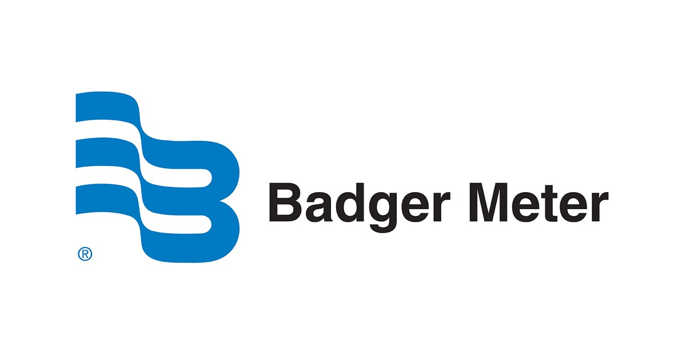
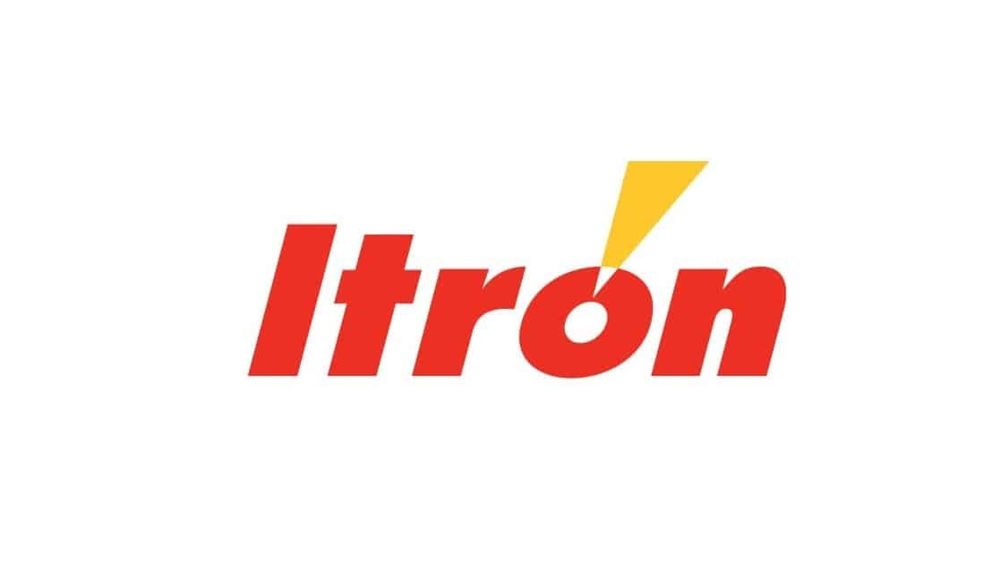
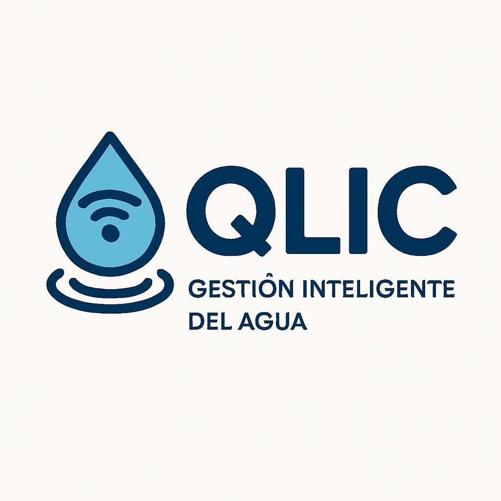
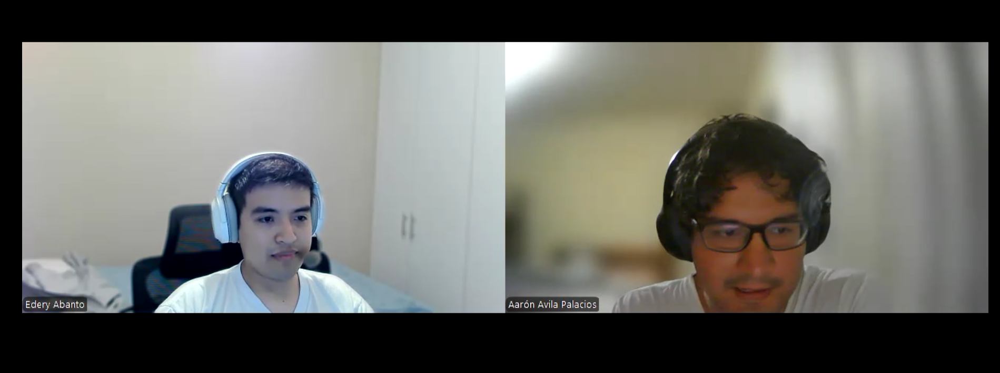
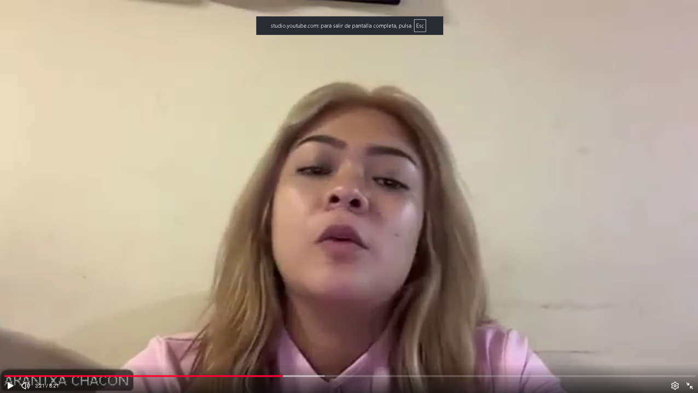
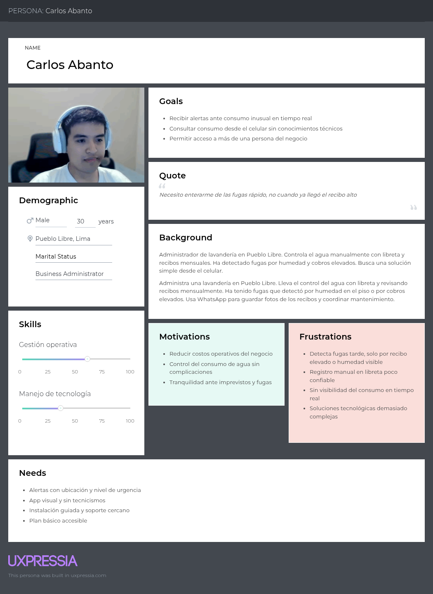
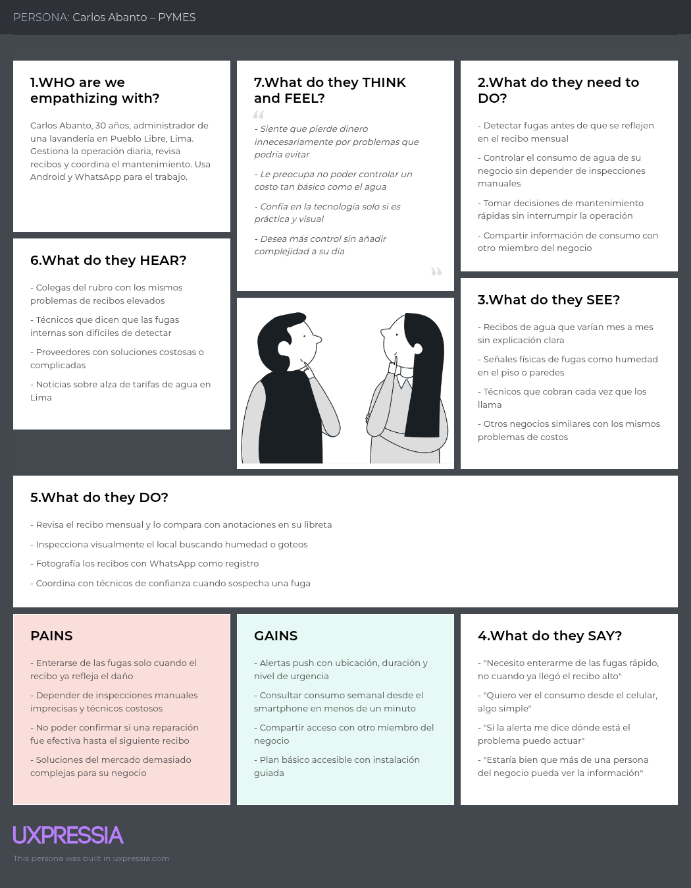

# Capítulo II: Requirements Development and Software Solution Design

## 2.1. Competidores

Qlic se ubica en el mercado de soluciones digitales para la gestión inteligente del agua. El análisis considera como competidores directos a Badger Meter e Itron, que ofrecen medición y analítica hídrica, y como competidor adyacente a OptiRTC, especializado en control de aguas pluviales. Wint se utiliza únicamente como referencia secundaria para la detección de fugas comerciales. La comparación permite identificar oportunidades de diferenciación para una solución móvil dirigida a PYMES y hogares (Badger Meter, s. f.; Itron, s. f.; Opti, s. f.; Wint, s. f.).

### 2.1.1. Análisis competitivo

La información de los perfiles, productos, canales y capacidades se obtuvo de la documentación pública de cada competidor. La tabla resume esos hallazgos y los contrasta con la propuesta preliminar de Qlic (Badger Meter, s. f.; Itron, s. f.; Opti, s. f.; Wint, s. f.).

#### Competitive Analysis Landscape

<table>
  <tr>
    <th colspan="22">Competitive Analysis Landscape</th>
  </tr>
  <tr>
    <td colspan="1">¿Por qué llevar a cabo el análisis?</td>
    <td colspan="17">¿Qué capacidades y enfoques debe adoptar o evitar Qlic para diferenciarse en PYMES y hogares?</td>
  </tr>
  <tr>
    <td colspan="2"></td>
    <td> <strong>Badger Meter</strong></td>
    <td> <strong>OptiRTC</strong></td>
    <td> <strong>Itron</strong></td>
    <td> <strong>Qlic</strong></td>
  </tr>
  <tr>
    <td rowspan="2">Perfil</td>
    <td>Overview</td>
    <td>Suite de medición, conectividad, software y soporte para gestionar agua en utilities y clientes comerciales.</td>
    <td>Soluciones de control adaptativo de aguas pluviales con IoT, sensores y pronósticos.</td>
    <td>Infraestructura inteligente que integra dispositivos, redes, datos y analítica para utilities y ciudades.</td>
    <td>Propuesta móvil para que PYMES y hogares interpreten consumo, alertas y oportunidades de ahorro.</td>
  </tr>
  <tr>
    <td>Ventaja competitiva ¿Qué valor ofrece a los clientes?</td>
    <td>Medición inteligente y análisis que ayudan a optimizar consumo y costos operativos.</td>
    <td>Control predictivo para prevenir inundaciones, reducir riesgos y reutilizar agua.</td>
    <td>Escala, conectividad e integración de servicios urbanos con enfoque de eficiencia y resiliencia.</td>
    <td>Lenguaje claro, experiencia móvil en español, accesibilidad y acompañamiento local por validar.</td>
  </tr>
  <tr>
    <td rowspan="2">Perfil de Marketing</td>
    <td>Mercado Objetivo</td>
    <td>Utilities, municipios y clientes comerciales e industriales.</td>
    <td>Ciudades, gobiernos locales y organizaciones que gestionan aguas pluviales.</td>
    <td>Utilities de agua, ciudades y operadores de infraestructura.</td>
    <td>PYMES con consumo operativo y hogares responsables del recibo y mantenimiento.</td>
  </tr>
  <tr>
    <td>Estrategias de Marketing</td>
    <td>Venta consultiva, demostraciones técnicas, casos de uso y cotización.</td>
    <td>Casos de proyectos, educación sobre resiliencia y conferencias ambientales.</td>
    <td>Comunicación de innovación, sostenibilidad, alianzas y eventos de smart cities.</td>
    <td>Canales digitales locales, mensajes de ahorro, continuidad operativa y sostenibilidad.</td>
  </tr>
  <tr>
    <td rowspan="3">Perfil de Producto</td>
    <td>Productos y Servicios</td>
    <td>Medidores, sensores, válvulas, conectividad y analítica BlueEdge.</td>
    <td>Monitoreo continuo, CMAC, gateways, dashboard, API y control de infraestructura.</td>
    <td>Medición inteligente, comunicación, gestión de datos y detección de fugas.</td>
    <td>Aplicación móvil futura, alertas, historial, recomendaciones y acompañamiento.</td>
  </tr>
  <tr>
    <td>Precios y Costos</td>
    <td>Costos de hardware, implementación, mantenimiento y servicio.</td>
    <td>Costos asociados al sistema, integración y operación del proyecto.</td>
    <td>Contratos de despliegue, infraestructura y soporte a escala empresarial.</td>
    <td>Modelo y precio por validar con usuarios y costos de operación.</td>
  </tr>
  <tr>
    <td>Canales de distribución (Web y/o Móvil)</td>
    <td>Venta consultiva, implementación y plataformas web o de campo.</td>
    <td>Portal web, APIs, proyectos de infraestructura y servicios de implementación.</td>
    <td>Partners, plataformas de gestión e infraestructura conectada.</td>
    <td>Aplicación móvil, aliados de instalación y canales digitales.</td>
  </tr>
  <tr>
    <td rowspan="4">Análisis SWOT</td>
    <td>Fortalezas</td>
    <td>Trayectoria, suite integrada y soporte especializado.</td>
    <td>Especialización en control adaptativo y resiliencia pluvial.</td>
    <td>Escala global, infraestructura y portafolio diversificado.</td>
    <td>Foco móvil, lenguaje claro y cercanía con usuarios locales.</td>
  </tr>
  <tr>
    <td>Debilidades</td>
    <td>Complejidad y costo de adopción para hogares y microempresas.</td>
    <td>Mercado especializado y distinto al monitoreo residencial de fugas.</td>
    <td>Integración compleja y enfoque de infraestructura.</td>
    <td>Propuesta, sensores, conectividad e instalación aún por validar.</td>
  </tr>
  <tr>
    <td>Oportunidades</td>
    <td>Paquetes pequeños y partners locales.</td>
    <td>Mayor inversión en infraestructura resiliente.</td>
    <td>Digitalización de utilities y smart cities.</td>
    <td>Alianzas locales, planes para PYMES y educación de ahorro.</td>
  </tr>
  <tr>
    <td>Amenazas</td>
    <td>Startups de menor costo y proveedores locales.</td>
    <td>Regulación cambiante y soluciones especializadas.</td>
    <td>Alternativas simples y competidores especializados.</td>
    <td>Suites globales, resistencia al hardware y sensibilidad al precio.</td>
  </tr>
</table>

### 2.1.2. Estrategias y tácticas frente a competidores

Las siguientes estrategias convierten la comparación en hipótesis accionables para Qlic. Deben validarse mediante el diseño de entrevistas antes de convertirse en requisitos. Se apoyan en la escala, interoperabilidad y automatización observadas en el mercado; la aplicación móvil, el soporte local y los indicadores propuestos siguen siendo decisiones de diseño por comprobar (Badger Meter, s. f.; Itron, s. f.; Opti, s. f.; Wint, s. f.).

| Estrategia | Tácticas iniciales | Competidor / hallazgo atendido | Indicador a validar |
|---|---|---|---|
| **Diferenciación móvil y local** | Diseñar alertas en español claro, niveles de urgencia y acciones concretas para cada segmento. | Las soluciones de mayor escala priorizan infraestructura; Qlic debe acercar el dato al usuario cotidiano. | El participante entiende una alerta y puede explicar qué acción tomaría. |
| **Escala progresiva para PYMES** | Proponer onboarding por etapas, sensor inicial y reportes que no requieran una plataforma empresarial completa. | Badger Meter e Itron ofrecen suites amplias; la barrera de complejidad debe comprobarse. | Tiempo aceptable de configuración, roles que usarían la solución y funciones mínimas. |
| **Interoperabilidad antes que encierro tecnológico** | Preguntar por medidores existentes, conectividad, APIs y necesidad de exportar datos. | Itron y Opti muestran valor en redes, integraciones y APIs. | Dispositivos actuales, restricciones de integración y formato de datos preferido. |
| **Respuesta ante fugas y anomalías** | Diseñar un flujo de alerta, confirmación, escalamiento y contacto de soporte; no prometer corte automático antes de validar riesgos. | Wint y las suites de medición convierten detección en acción. | Tipo de incidente, tiempo de respuesta y confianza para seguir una recomendación. |
| **Soporte y confianza local** | Validar instalación guiada, acompañamiento remoto, privacidad, continuidad sin conexión y derivación a técnicos. | La escala de los competidores no garantiza soporte cercano para PYMES y hogares locales. | Condiciones para autorizar sensores, canal de soporte y señales de confianza. |
| **Sostenibilidad con evidencia** | Mostrar ahorro, consumo y tendencias solo cuando el usuario pueda interpretarlos y relacionarlos con una decisión. | Los competidores comunican eficiencia y conservación; Qlic debe probar qué métrica es útil. | Métricas consultadas, frecuencia de revisión y decisión que cambia gracias al dato. |

## 2.2. Entrevistas

La investigación utilizará entrevistas semiestructuradas para conocer cómo los representantes de PYMES y hogares gestionan actualmente el agua. Las preguntas se formularán de manera abierta y neutral, solicitando ejemplos de experiencias reales antes de presentar cualquier propuesta. La información permitirá describir características demográficas, personalidad, habilidades, influencias, tecnología, canales de interacción, objetivos, frustraciones y antecedentes necesarios para construir los arquetipos de ambos segmentos.

### 2.2.1. Diseño de entrevistas

#### Participantes y muestra

| Segmento | Perfil de inclusión | Cantidad requerida | Exclusión | Modalidad sugerida |
|---|---|---:|---|---|
| **PYMES y comercios locales** | Propietario, administrador o responsable de operaciones/mantenimiento de una PYME que participa en decisiones sobre consumo o incidencias de agua. | 3 a 5 entrevistas | Personas que no conocen el consumo, mantenimiento ni decisiones asociadas al agua del negocio. | Presencial en el negocio o videollamada, con autorización de grabación. |
| **Hogares y familias** | Persona adulta que paga, revisa o participa en decisiones sobre el recibo, el mantenimiento o el uso de agua del hogar. | 3 a 5 entrevistas | Personas que no tienen experiencia ni responsabilidad sobre el consumo o mantenimiento del hogar. | Presencial o videollamada, con autorización de grabación. |

#### Segmento 1: PYMES y comercios locales

**Preguntas**

1. ¿Cómo controlan actualmente el consumo de agua en su negocio y quién se encarga de revisar esa información?
2. ¿Qué problemas han tenido relacionados con desperdicios, fugas, medidores o cobros inesperados?
3. ¿Con qué frecuencia revisan los medidores, recibos o registros de consumo y cómo guardan esa información?
4. ¿De qué manera el consumo de agua afecta sus costos operativos, la continuidad del negocio o las decisiones de mantenimiento?
5. ¿Qué tan útil sería consultar desde el celular reportes semanales o mensuales sobre el consumo? ¿Qué datos debería mostrar el reporte?
6. ¿Qué opinan de recibir alertas móviles en tiempo real sobre fugas o consumos inusuales? ¿Qué debería incluir una alerta para ayudarles a actuar?
7. ¿Qué características esperan de una aplicación móvil para gestionar el agua y qué tan fácil debería ser usarla desde sus dispositivos actuales?
8. ¿Qué condiciones de precio, suscripción, instalación y soporte considerarían razonables si la aplicación ayudara a reducir costos y mejorar la gestión del agua?

#### Segmento 2: Hogares y familias

**Preguntas**

1. ¿Cómo controlan actualmente el consumo de agua en su hogar y quién revisa o paga el recibo?
2. ¿Han tenido problemas con medidores defectuosos, fugas o cobros inesperados en sus recibos de agua?
3. ¿Cómo suelen identificar una fuga en casa y qué hacen después de detectarla?
4. ¿Qué medidas aplican en el día a día para ahorrar agua y cómo evalúan si están funcionando?
5. ¿Qué tan útil sería recibir en el celular alertas sobre consumos excesivos o fugas? ¿Qué información debería mostrar una alerta?
6. ¿Preferirían un plan móvil básico con funciones esenciales o uno avanzado con reportes detallados? ¿Qué tendría que incluir cada opción?
7. ¿Qué importancia tiene el ahorro de agua en la economía familiar y qué decisiones cambiarían con información más clara del consumo?
8. ¿Qué esperan de una aplicación móvil para gestionar el consumo del hogar y qué condiciones de privacidad, soporte y costo les generarían confianza?

### 2.2.2. Registro de entrevistas

Aquí registraremos las entrevistas de PYMES y hogares. Cada ficha debe incluir los datos del entrevistado, el inicio y fin dentro del video, el enlace, una captura y un resumen de sus respuestas. Si se realizan cuatro o cinco entrevistas, se copia la misma ficha para cada participante.

**Archivo del video consolidado:** `upc-pre-202620-1acc0238-13984-Qlic-needfinding-av1.mp4` 
**URL privada de OneDrive:** **[PEGAR URL DEL VIDEO]**

#### Primer segmento - PYMES y comercios locales

##### ENTREVISTA 1

| Campo | Registro |
|---|---|
| Nombre entrevistado | **Edery Abanto** |
| Edad | **30 años** |
| Profesión / rol | **Administrador de una lavandería** |
| Distrito / departamento | **Pueblo Libre, Lima** |
| Inicio del video | **00:00:02** |
| Fin del video | **00:05:07** |
| Link del video | [Ver entrevista en OneDrive](https://upcedupe-my.sharepoint.com/:v:/g/personal/u201823654_upc_edu_pe/IQA4Zz1zioHXQK1By4CB35tOASfVB3LYO5EBuZ1ratxBBhM?nav=eyJyZWZlcnJhbEluZm8iOnsicmVmZXJyYWxBcHAiOiJPbmVEcml2ZUZvckJ1c2luZXNzIiwicmVmZXJyYWxBcHBQbGF0Zm9ybSI6IldlYiIsInJlZmVycmFsTW9kZSI6InZpZXciLCJyZWZlcnJhbFZpZXciOiJNeUZpbGVzTGlua0NvcHkifX0&e=mJOeaq) |
| Foto entrevista |  |
| Resumen | **Principales respuestas:** Actualmente revisa el recibo una vez al mes, compara el monto con el periodo anterior y registra datos de las máquinas en una libreta. Ha detectado fugas en una manguera y en el baño; una se identificó por humedad en el piso y otra por un recibo elevado. Considera útil consultar desde el celular el consumo total y sus comparaciones semanales o mensuales. Solicita alertas claras únicamente ante variaciones importantes, indicando ubicación, duración y nivel de urgencia.  **Características objetivas:** Persona entrevistada de 30 años, administrador de una lavandería ubicada en Pueblo Libre, Lima; participa en el control operativo, la revisión de recibos y la coordinación del mantenimiento del negocio.  **Características subjetivas:** Busca reducir costos y enterarse rápido de las fugas. Prefiere una solución sencilla, visual y sin conocimientos técnicos; aceptaría comenzar con un plan básico, instalación guiada y soporte cercano.  **Tecnología y canales:** Usa dispositivos Android, el celular y WhatsApp para conservar fotografías de los recibos. Le interesa que más de una persona pueda revisar la información del negocio.  **Evidencia temporal:** La revisión de recibos y registros se explica entre 00:01:46 y 00:02:16; la necesidad de reportes y alertas entre 00:02:53 y 00:03:50; y las preferencias de uso, precio y soporte entre 00:03:56 y 00:04:59. |

##### ENTREVISTA 2

##### ENTREVISTA 2

| Campo | Registro |
|---|---|
| Nombre entrevistado | **Arantxa Chacón Ruiz** |
| Edad | **28 años** |
| Profesión / rol | **Nutricionista, propietaria de dos locales (consultorio nutricional y venta de suplementos)** |
| Distrito / departamento | **San Borja, Lima** |
| Inicio del video | **00:00:05** |
| Fin del video | **00:08:21** |
| Link del video | [Ver entrevista en OneDrive](https://upcedupe-my.sharepoint.com/:v:/g/personal/u20211a118_upc_edu_pe/IQCWuVodrizyQr9nL-JYmFKOAXRYdJQ4yafAgHy4TDKS24A?nav=eyJyZWZlcnJhbEluZm8iOnsicmVmZXJyYWxBcHAiOiJPbmVEcml2ZUZvckJ1c2luZXNzIiwicmVmZXJyYWxBcHBQbGF0Zm9ybSI6IldlYiIsInJlZmVycmFsTW9kZSI6InZpZXciLCJyZWZlcnJhbFZpZXciOiJNeUZpbGVzTGlua0NvcHkifX0&e=Fehyfa) |
| Foto entrevista |  |
| Resumen | **Principales respuestas:** No cuenta con un control formal del consumo de agua; solo revisa el recibo cuando llega y lo deriva a administración para el pago. En uno de sus locales el agua se cobra prorrateada por el edificio, lo que le impide conocer su consumo real. Sufrió una fuga interna en el inodoro del baño de pacientes que recién detectó tras dos recibos elevados, luego de haber reclamado por error de facturación. Guarda los recibos en físico y digitalizados en Google Drive, pero no lleva un registro comparativo entre periodos. Considera muy valiosas las alertas en tiempo real, siempre que no sean frecuentes e indiquen local, gravedad, tiempo transcurrido, costo estimado y una acción inmediata a seguir. Pide reportes expresados en soles y no solo en metros cúbicos, con comparación mensual, separación por local e identificación de consumo en horarios sin actividad.  **Características objetivas:** Mujer de 28 años, nutricionista con dos locales comerciales en Lima; administra directamente el negocio, autoriza los pagos y coordina el mantenimiento correctivo. Sus recibos oscilan entre S/ 100 y S/ 150 mensuales por local. Opera en locales alquilados, uno de ellos dentro de un edificio con administración de terceros, lo que condiciona cualquier instalación.  **Características subjetivas:** Prioriza la previsibilidad de sus gastos y evitar interrupciones en la atención de pacientes, tras haber perdido citas por un corte de agua. Reconoce que actúa de forma reactiva ante fallas por falta de información. Rechaza las soluciones complejas o con exceso de notificaciones; necesita interfaces visuales e inmediatas. Aceptaría un costo cercano a S/ 50–60 mensuales por ambos locales y desconfía de comprometerse sin un periodo de prueba previo.  **Tecnología y canales:** Usa iPhone; su administradora usa Android. Maneja Instagram para el negocio y una aplicación de agendamiento de citas. Digitaliza recibos en Google Drive y coordina con su contador por WhatsApp. Requiere acceso multiusuario con permisos diferenciados y exportación del resumen para compartirlo.  **Evidencia temporal:** El control actual y los antecedentes de fugas se abordan entre 00:00:40 y 00:03:10; el impacto en costos y continuidad del negocio entre 00:03:11 y 00:04:20; los requerimientos de reportes y alertas entre 00:04:21 y 00:06:35; y las condiciones de precio, instalación y soporte entre 00:06:36 y 00:08:15. |

##### ENTREVISTA 3

| Campo | Registro |
|---|---|
| Nombre entrevistado | **[COMPLETAR]** |
| Edad | **[COMPLETAR]** |
| Profesión / rol | **[COMPLETAR]** |
| Distrito / departamento | **[COMPLETAR]** |
| Inicio del video | **[hh:mm:ss]** |
| Fin del video | **[hh:mm:ss]** |
| Link del video | **[PEGAR URL DEL VIDEO CONSOLIDADO]** |
| Foto entrevista | **[INSERTAR captura en `images/interviews/`]** |
| Resumen | **Principales respuestas:** [COMPLETAR]  **Características objetivas:** [COMPLETAR]  **Características subjetivas:** [COMPLETAR]  **Tecnología y canales:** [COMPLETAR]  **Evidencia:** [minuto o cita breve] |

#### Segundo segmento - Hogares y familias

##### ENTREVISTA 1

| Campo | Registro |
|---|---|
| Nombre entrevistado | **[COMPLETAR]** |
| Edad | **[COMPLETAR]** |
| Profesión / rol | **[COMPLETAR]** |
| Distrito / departamento | **[COMPLETAR]** |
| Inicio del video | **[hh:mm:ss]** |
| Fin del video | **[hh:mm:ss]** |
| Link del video | **[PEGAR URL DEL VIDEO CONSOLIDADO]** |
| Foto entrevista | **[INSERTAR captura en `images/interviews/`]** |
| Resumen | **Principales respuestas:** [COMPLETAR]  **Características objetivas:** [edad, género, distrito, profesión y composición familiar]  **Características subjetivas:** [personalidad, habilidades, objetivos, frustraciones, marcas e influencias]  **Tecnología y canales:** [dispositivos, navegador, aplicaciones y canales de interacción]  **Evidencia:** [minuto o cita breve que sustenta el resumen] |

##### ENTREVISTA 2

| Campo | Registro |
|---|---|
| Nombre entrevistado | **[COMPLETAR]** |
| Edad | **[COMPLETAR]** |
| Profesión / rol | **[COMPLETAR]** |
| Distrito / departamento | **[COMPLETAR]** |
| Inicio del video | **[hh:mm:ss]** |
| Fin del video | **[hh:mm:ss]** |
| Link del video | **[PEGAR URL DEL VIDEO CONSOLIDADO]** |
| Foto entrevista | **[INSERTAR captura en `images/interviews/`]** |
| Resumen | **Principales respuestas:** [COMPLETAR]  **Características objetivas:** [COMPLETAR]  **Características subjetivas:** [COMPLETAR]  **Tecnología y canales:** [COMPLETAR]  **Evidencia:** [minuto o cita breve] |

##### ENTREVISTA 3

| Campo | Registro |
|---|---|
| Nombre entrevistado | **[COMPLETAR]** |
| Edad | **[COMPLETAR]** |
| Profesión / rol | **[COMPLETAR]** |
| Distrito / departamento | **[COMPLETAR]** |
| Inicio del video | **[hh:mm:ss]** |
| Fin del video | **[hh:mm:ss]** |
| Link del video | **[PEGAR URL DEL VIDEO CONSOLIDADO]** |
| Foto entrevista | **[INSERTAR captura en `images/interviews/`]** |
| Resumen | **Principales respuestas:** [COMPLETAR]  **Características objetivas:** [COMPLETAR]  **Características subjetivas:** [COMPLETAR]  **Tecnología y canales:** [COMPLETAR]  **Evidencia:** [minuto o cita breve] |

## 2.3. Needfinding

En esta sección se presenta el proceso de análisis de la información recolectada durante las entrevistas con representantes de los segmentos objetivo de Qlic. A partir de dicha información se construyen los artefactos que permiten comprender en profundidad las necesidades, motivaciones y frustraciones de los usuarios. Los artefactos elaborados incluyen los User Personas, el User Task Matrix, los User Journey Maps y los Empathy Maps. Cada uno fue elaborado en UXPressia, tomando como base los hallazgos identificados en el análisis de entrevistas de la sección 2.2.

Dado que Qlic es una **aplicación móvil nativa y multiplataforma** (desarrollada en Kotlin para Android y Flutter para compatibilidad multiplataforma), el needfinding incorpora el contexto de uso móvil: acceso desde el smartphone en cualquier momento y lugar, notificaciones push como canal de alerta prioritario, consulta rápida del estado del sistema sin necesidad de abrir un computador, y acceso a recursos del dispositivo como la cámara para registrar dispositivos IoT mediante código QR.

---

### 2.3.1. User Personas

En esta sección se incluyen las fichas de User Persona que representan arquetipos de los segmentos objetivo de Qlic. Estos arquetipos fueron construidos a partir del análisis estadístico de las entrevistas realizadas (ver sección 2.2.3), buscando capturar las características, necesidades y comportamientos más representativos de cada segmento. Se elaboró una ficha por cada segmento objetivo: PYMES y comercios locales, y hogares y familias. Las fichas fueron elaboradas en UXPressia.

#### User Persona #1 – Segmento PYMES y Comercios Locales

> **

| Campo | Detalle |
|---|---|
| **Nombre** | Carlos Abanto |
| **Edad** | 30 años |
| **Ocupación** | Administrador de negocio local (lavandería) |
| **Distrito** | Pueblo Libre, Lima |
| **Estado civil** | [Completar tras más entrevistas] |
| **Dispositivo principal** | Smartphone Android |
| **Nivel tecnológico** | Básico-intermedio – usa el celular para gestión operativa y WhatsApp para registros fotográficos |
| **Canales digitales** | WhatsApp, celular Android, correo básico |

**Biografía:**
Carlos administra una lavandería de tamaño pequeño en Pueblo Libre. Se encarga del control operativo diario, la revisión de recibos y la coordinación del mantenimiento del negocio. Su método actual de control del agua es manual: revisa el recibo una vez al mes, lo compara con el periodo anterior y registra datos de las máquinas en una libreta. Ha enfrentado fugas en una manguera y en el baño; una la detectó por humedad en el piso y otra al notar un recibo elevado. No cuenta con ningún sistema de monitoreo en tiempo real y depende de señales físicas o del recibo mensual para identificar problemas.

**Objetivos:**
- Enterarse rápidamente de cualquier fuga o consumo inusual sin tener que esperar el recibo mensual.
- Consultar desde el celular el consumo total y comparaciones semanales o mensuales de forma sencilla.
- Reducir los costos operativos del negocio relacionados con el agua.
- Permitir que más de una persona del negocio pueda revisar la información de consumo.

**Frustraciones:**
- Detectar fugas tarde, solo cuando ya generaron un recibo elevado o daño visible como humedad en el piso.
- El registro manual en libreta es poco confiable y difícil de comparar entre periodos.
- No tener visibilidad del consumo en tiempo real durante la jornada operativa.
- Soluciones tecnológicas que requieren conocimientos técnicos que él no tiene.
  
**Necesidades clave:**
- Alertas claras únicamente ante variaciones importantes, indicando ubicación, duración y nivel de urgencia.
- Interfaz visual y sencilla, sin tecnicismos.
- Instalación guiada y soporte cercano desde el inicio.
- Plan básico accesible para comenzar sin gran inversión.
  **Personalidad:** Práctico, orientado a reducir costos, cauteloso con la tecnología pero abierto si es simple y útil. Prefiere soluciones que no interrumpan la operación del negocio.

**Motivaciones:** Ahorro económico, control operativo sin complicaciones, tranquilidad ante imprevistos.
 
---

#### User Persona #2 – Segmento Hogares y Familias

> *Elaborado en UXPressia.*
> *[Insertar captura: images/user-persona-pyme.png]*

| Campo | Detalle |
|---|---|
| **Nombre** | [Nombre del User Persona – completar tras análisis de entrevistas] |
| **Edad** | [Edad representativa del segmento] |
| **Ocupación** | [Ocupación más frecuente entre los entrevistados] |
| **Distrito** | [Distrito más frecuente entre los entrevistados] |
| **Estado civil** | [Estado civil más frecuente] |
| **Dispositivo principal** | [Dispositivo más usado por el segmento] |
| **Nivel tecnológico** | [Nivel tecnológico representativo] |
| **Navegador preferido** | [Navegador más mencionado] |

**Biografía:**
[Redactar párrafo biográfico representativo del segmento tras el análisis de entrevistas.]

**Objetivos:**
- [Objetivo 1 – extraído del análisis de entrevistas]
- [Objetivo 2 – extraído del análisis de entrevistas]
- [Objetivo 3 – extraído del análisis de entrevistas]

**Frustraciones:**
- [Frustración 1 – extraída del análisis de entrevistas]
- [Frustración 2 – extraída del análisis de entrevistas]
- [Frustración 3 – extraída del análisis de entrevistas]

**Canales digitales:** [Completar con los canales más mencionados en entrevistas]

**Motivaciones:** [Completar con las motivaciones identificadas en entrevistas]

**Personalidad:** [Completar con rasgos de personalidad representativos del segmento]

---

### 2.3.2. User Task Matrix

En esta sección se presenta el User Task Matrix, que concentra las tareas que los User Personas realizan para cumplir sus objetivos en relación con la gestión del agua. Es importante destacar que estas tareas son realizadas por los usuarios **independientemente de la existencia de Qlic**, pues representan comportamientos y necesidades actuales de cada segmento.

Se consideran los dos User Personas identificados: el representante del segmento Hogares y Familias, y el representante del segmento PYMES. Para cada tarea se indica la frecuencia (Alta / Media / Baja) y la importancia (Alta / Media / Baja) con la que cada User Persona la realiza.

| Tarea | Hogares y Familias | | PYMES | |
|---|---|---|---|---|
| | **Frecuencia** | **Importancia** | **Frecuencia** | **Importancia** |
| Revisar el recibo mensual de agua | Alta | Alta | Alta | Alta |
| Detectar fugas o consumos anómalos en las instalaciones | Media | Alta | Media | Alta |
| Llamar a un técnico ante sospechas de fuga | Baja | Alta | Media | Alta |
| Controlar el consumo de agua por punto o área de uso | Baja | Media | Alta | Alta |
| Comparar el gasto de agua entre periodos distintos | Media | Media | Alta | Alta |
| Verificar el nivel de agua en tanques o cisternas | Media | Alta | Alta | Alta |
| Buscar formas de reducir el consumo de agua | Media | Alta | Media | Alta |
| Comunicar incidencias de agua a otros miembros o personal | Baja | Media | Media | Alta |
| Tomar decisiones de mantenimiento preventivo | Baja | Media | Media | Alta |
| Gestionar el pago del servicio de agua | Alta | Alta | Alta | Alta |

**Análisis:**

Las tareas con mayor frecuencia e importancia para ambos segmentos son la revisión del recibo de agua, la detección de fugas y la verificación del nivel de tanques. El segmento PYMES realiza con mayor frecuencia tareas de control granular por área y toma de decisiones de mantenimiento, dado que el impacto económico del desperdicio es más crítico para su operación. El segmento Hogares y Familias, en cambio, concentra su atención en el control del gasto mensual y en la detección temprana de fugas que afectan el presupuesto familiar.

La principal coincidencia entre ambos segmentos es la necesidad de **detectar anomalías en el consumo de forma anticipada** y de **acceder a información de consumo de manera sencilla y rápida**. La principal diferencia radica en el nivel de detalle requerido: las PYMES necesitan control por áreas y reportes comparativos avanzados, mientras que los hogares priorizan la simplicidad y las alertas inmediatas.

Estas necesidades justifican el enfoque móvil de Qlic: el acceso desde el smartphone permite a ambos segmentos consultar el estado de sus instalaciones en cualquier momento, y las notificaciones push garantizan que las alertas lleguen de forma inmediata sin que el usuario tenga que buscar la información activamente.

---

### 2.3.3. User Journey Mapping

En esta sección se presentan los User Journey Maps en su versión **As-Is**, es decir, el recorrido actual del usuario sin la existencia de Qlic. El objetivo es identificar los momentos de mayor fricción y frustración que la aplicación móvil puede transformar positivamente. Se elaboró un User Journey Map por cada User Persona, vinculado a su ficha correspondiente en UXPressia.

#### User Journey Map #1 – Segmento Hogares y Familias

> *Elaborado en UXPressia.*
> *[Insertar captura: images/journey-map-hogar.png]*

**Resumen del journey:** [Completar con el end-to-end journey del User Persona de hogares tras el análisis de entrevistas. Describir el recorrido desde que detecta un posible problema con el consumo de agua hasta que intenta resolverlo con los medios actuales disponibles.]

| Fase | Acción | Pensamiento | Emoción | Punto de dolor |
|---|---|---|---|---|
| [Fase 1] | [Completar] | [Completar] | [Completar] | [Completar] |
| [Fase 2] | [Completar] | [Completar] | [Completar] | [Completar] |
| [Fase 3] | [Completar] | [Completar] | [Completar] | [Completar] |
| [Fase 4] | [Completar] | [Completar] | [Completar] | [Completar] |
| [Fase 5] | [Completar] | [Completar] | [Completar] | [Completar] |

---

#### User Journey Map #2 – Segmento PYMES

> **

**Resumen del journey:** Carlos administra una lavandería en Pueblo Libre. Su recorrido actual comienza cuando recibe el recibo mensual de agua y nota que el monto subió respecto al mes anterior. Sin herramientas de monitoreo, inicia una inspección manual del local buscando señales visibles de fuga. Al no encontrar nada obvio, llama a un técnico que confirma una fuga en una manguera o en el baño. Tras la reparación, Carlos queda a la espera del siguiente recibo para saber si el problema se resolvió, sin ninguna forma de confirmarlo antes.

| Fase | Acción | Pensamiento | Emoción | Punto de dolor |
|---|---|---|---|---|
| **Recepción del recibo** | Recibe el recibo mensual de agua y lo compara con el del mes anterior anotado en su libreta | "Este mes subió bastante, algo debe estar pasando" | Preocupación | Solo se entera del problema a mes vencido, cuando el daño ya ocurrió |
| **Inspección manual** | Recorre el local revisando mangueras, baños y conexiones buscando humedad o goteos visibles | "No veo nada obvio, pero el recibo no miente" | Frustración | La inspección es visual e imprecisa; depende de señales físicas como humedad en el piso |
| **Llamada al técnico** | Contacta a un técnico de confianza por WhatsApp para que revise las instalaciones | "Espero que venga rápido y no cobre demasiado" | Ansiedad | Tiempo de espera incierto y costo adicional no planificado que afecta el presupuesto del negocio |
| **Diagnóstico y reparación** | El técnico detecta la fuga en una manguera o en el baño y realiza la reparación | "¿Por qué no me avisó nadie antes? Pude haberlo evitado" | Resignación | No existía ningún sistema que alertara sobre el consumo anómalo antes de que escale |
| **Espera de confirmación** | Espera el siguiente recibo mensual para saber si el consumo bajó tras la reparación | "Ojalá haya bajado, pero no lo sabré hasta el mes que viene" | Incertidumbre | Sin datos en tiempo real no puede confirmar si el problema se resolvió ni cuánto ahorró |

---
### 2.3.4. Empathy Mapping

En esta sección se presentan los Empathy Maps elaborados para cada User Persona. El proceso de elaboración incluyó una sesión colaborativa del equipo en la que cada miembro aportó observaciones en torno a las preguntas guía del artefacto: ¿Qué dice?, ¿Qué piensa y siente?, ¿Qué ve?, ¿Qué hace?, ¿Qué escucha?, y la identificación de Pains y Gains. Los mapas fueron elaborados en UXPressia a partir de los hallazgos del análisis de entrevistas.

#### Empathy Map #1 – Segmento Hogares y Familias

> *Elaborado en UXPressia.*
> *[Insertar captura: images/empathy-map-hogar.png]*

**¿Con quién estamos empatizando?**
[Completar con la descripción del User Persona de hogares: nombre, edad, ocupación, contexto general.]

**¿Qué necesita hacer?**
[Completar con las principales tareas y responsabilidades del User Persona relacionadas con la gestión del agua en el hogar.]

**¿Qué está diciendo?**
- [Frase representativa 1 – extraída de entrevistas]
- [Frase representativa 2 – extraída de entrevistas]
- [Frase representativa 3 – extraída de entrevistas]

**¿Qué está viendo?**
- [Completar con elementos del entorno que observa el User Persona]
- [Completar]
- [Completar]

**¿Qué está haciendo?**
- [Completar con comportamientos y acciones actuales del User Persona]
- [Completar]
- [Completar]

**¿Qué está escuchando?**
- [Completar con influencias externas: familia, medios, publicidad, vecinos]
- [Completar]
- [Completar]

**¿Qué piensa y siente?**
- [Completar con motivaciones profundas, preocupaciones y aspiraciones]
- [Completar]
- [Completar]

**Pains:**
- [Pain 1 – extraído del análisis de entrevistas]
- [Pain 2 – extraído del análisis de entrevistas]
- [Pain 3 – extraído del análisis de entrevistas]

**Gains:**
- [Gain 1 – qué valora y qué le ayudaría en la app móvil]
- [Gain 2 – completar]
- [Gain 3 – completar]

---

#### Empathy Map #2 – Segmento PYMES

> **

**¿Con quién estamos empatizando?**
Carlos Abanto, 30 años, administrador de una lavandería en Pueblo Libre, Lima. Gestiona la operación diaria del negocio, revisa recibos y coordina el mantenimiento. Usa Android y WhatsApp para el trabajo.

**¿Qué necesita hacer?**
Controlar el consumo de agua de su negocio, detectar fugas a tiempo sin depender del recibo mensual, y tomar decisiones de mantenimiento rápidas sin interrumpir la operación de la lavandería.

**¿Qué está diciendo?**
- "Necesito enterarme de las fugas rápido, no cuando ya llegó el recibo alto"
- "Quiero ver el consumo desde el celular, algo simple que cualquiera pueda usar"
- "Si la alerta me dice dónde está el problema y qué tan grave es, puedo actuar"
- "Estaría bien que más de una persona del negocio pueda ver la información"

**¿Qué está viendo?**
- Recibos de agua que varían mes a mes sin una explicación clara
- Señales físicas de fugas como humedad en el piso o paredes
- Técnicos que cobran cada vez que los llama para una revisión
- Otros negocios similares con los mismos problemas de costos operativos

**¿Qué está haciendo?**
- Revisando el recibo mensual y comparándolo con anotaciones en una libreta
- Inspeccionando visualmente el local en busca de goteos o humedad
- Fotografiando los recibos con WhatsApp para tener un registro
- Coordinando con técnicos de confianza cuando sospecha de una fuga

**¿Qué está escuchando?**
- Colegas del rubro que también se quejan de recibos de agua elevados
- Técnicos que le dicen que las fugas internas son difíciles de detectar a tiempo
- Proveedores que le ofrecen soluciones costosas o complicadas de instalar
- Noticias sobre el alza de tarifas de agua en Lima

**¿Qué piensa y siente?**
- Siente que pierde dinero innecesariamente cada mes por problemas que podría evitar
- Le preocupa no poder controlar un costo operativo tan básico como el agua
- Desea tener más control sin añadir complejidad a su día a día
- Confía en la tecnología solo si es práctica, visual y no requiere conocimientos técnicos

**Pains:**
- Enterarse de las fugas solo cuando el recibo ya refleja el daño económico
- Depender de inspecciones manuales imprecisas y de técnicos externos costosos
- No poder confirmar si una reparación fue efectiva hasta el siguiente ciclo de facturación
- Soluciones del mercado demasiado complejas o caras para el tamaño de su negocio

**Gains:**
- Recibir alertas push en el celular que indiquen ubicación, duración y nivel de urgencia del problema
- Consultar el consumo semanal o mensual desde el smartphone en menos de un minuto
- Compartir el acceso a la información con otro miembro del negocio
- Comenzar con un plan básico accesible con instalación guiada sin necesidad de técnico especializado

---

### 2.3.5. Big Picture EventStorming

El Big Picture EventStorming se realizó en una sesión colaborativa del equipo con una duración aproximada de 90 minutos, utilizando la herramienta indicada. La sesión permitió mapear los eventos de negocio más relevantes del dominio de gestión inteligente del agua, identificando los procesos clave, los actores involucrados y las oportunidades de mejora en el flujo de valor de Qlic.

> *[Insertar captura de la sesión de Big Picture EventStorming: images/big-picture-eventstorming.png]*

Los eventos de dominio más significativos identificados durante la sesión fueron los siguientes:

- Sensor IoT registró lectura de consumo
- Consumo anómalo detectado por el sistema
- Alerta de posible fuga generada
- Notificación push enviada al dispositivo móvil del usuario
- Usuario visualizó el estado de sus dispositivos en la app
- Usuario configuró umbral de alerta personalizado
- Reporte de consumo generado automáticamente
- Nivel de tanque bajo detectado
- Predicción de reabastecimiento calculada
- Técnico asignado para revisión en sitio
- Incidencia registrada y resuelta
- Dispositivo IoT registrado en el sistema
- Sesión de usuario iniciada en la app móvil
- Usuario suscribió plan de servicio
- Pago de suscripción procesado

A partir del análisis de estos eventos se identificaron los bounded contexts candidatos para la solución: **IAM** (gestión de identidad y acceso), **Device Monitoring** (monitoreo de dispositivos IoT), **Alerting** (generación y envío de alertas), **Consumption Analytics** (análisis de consumo y reportes) y **Subscriptions** (gestión de planes y pagos). Estos bounded contexts se detallan en la sección 2.5.

---

### 2.3.6. Ubiquitous Language

A continuación se presenta el glosario de términos y conceptos del dominio de negocio de Qlic. Este glosario fue construido a partir del proceso de Big Picture EventStorming y del análisis del dominio del problema. Los términos corresponden exclusivamente al dominio de negocio y no incluyen términos técnicos de ingeniería de software. Se presentan en inglés, con el equivalente en español entre paréntesis cuando aplica, y la definición en español.

| Término | Equivalente en español | Definición |
|---|---|---|
| **Water Point** | Punto de agua | Ubicación física específica dentro de un hogar o local donde se instala un sensor IoT para monitorear el flujo y consumo de agua. Puede corresponder a un grifo, tubería principal, entrada de tanque u otro punto de uso relevante. |
| **IoT Device** | Dispositivo IoT | Sensor físico conectado a internet instalado en un Water Point, encargado de registrar lecturas periódicas de consumo de agua y transmitirlas al sistema Qlic para su procesamiento y análisis. |
| **Consumption Reading** | Lectura de consumo | Dato registrado por un IoT Device en un momento determinado, que expresa la cantidad de agua que fluye por un Water Point en un periodo específico, medida en litros o metros cúbicos. |
| **Anomalous Consumption** | Consumo anómalo | Situación en la que una Consumption Reading supera el umbral definido por el usuario o calculado automáticamente por el sistema, lo que puede indicar la presencia de una fuga, un consumo inusual o una falla en el dispositivo. |
| **Leak Alert** | Alerta de fuga | Notificación generada automáticamente por el sistema cuando se detecta un Anomalous Consumption sostenido que sugiere la presencia de una fuga de agua. Se envía como notificación push al dispositivo móvil del Subscriber. |
| **Consumption Threshold** | Umbral de consumo | Valor máximo de consumo de agua por periodo (diario, semanal o mensual) establecido por el usuario o calculado por el sistema, a partir del cual se genera una Leak Alert. |
| **Water Tank** | Tanque de agua | Depósito de almacenamiento de agua en un hogar o local cuyo nivel es monitoreado por un IoT Device. El sistema puede predecir el momento en que será necesario el reabastecimiento. |
| **Replenishment Prediction** | Predicción de reabastecimiento | Estimación calculada por el sistema sobre el momento en que el nivel de un Water Tank alcanzará un punto crítico, basada en el patrón histórico de Consumption Readings del usuario. |
| **Consumption Report** | Reporte de consumo | Vista dentro de la aplicación móvil que resume el consumo de agua de un Subscriber en un periodo definido, mostrando tendencias, comparativas entre periodos anteriores y recomendaciones de ahorro. |
| **Subscriber** | Suscriptor | Persona natural o jurídica que ha contratado un Subscription Plan de Qlic y tiene acceso a las funcionalidades de monitoreo, alertas y reportes de la aplicación móvil. |
| **Subscription Plan** | Plan de suscripción | Modalidad de contratación del servicio Qlic. Actualmente existen dos planes: Plan Básico y Plan Gestión Pro, cada uno con un conjunto diferente de funcionalidades y dispositivos incluidos. |
| **Monitoring Dashboard** | Panel de monitoreo | Vista principal de la aplicación móvil que presenta el estado actual de todos los Water Points y dispositivos IoT registrados por el Subscriber, con indicadores visuales de consumo y alertas activas. |
| **Push Notification** | Notificación push | Mensaje enviado directamente al dispositivo móvil del Subscriber a través del sistema operativo, que informa sobre eventos relevantes como Leak Alerts, niveles bajos en Water Tanks o generación de nuevos Consumption Reports. |
| **Device Registration** | Registro de dispositivo | Proceso mediante el cual un nuevo IoT Device es vinculado al perfil del Subscriber en la aplicación móvil, asignándole un Water Point específico y configurando sus parámetros de monitoreo iniciales. |
| **Water Waste** | Desperdicio de agua | Volumen de agua consumido de manera innecesaria o involuntaria, ya sea por fugas, malos hábitos de uso o fallas en las instalaciones. La reducción del Water Waste es uno de los objetivos principales de Qlic. |
| **Consumption Baseline** | Línea base de consumo | Patrón de consumo histórico de un Subscriber o Water Point, calculado por el sistema a partir de las Consumption Readings registradas, que sirve como referencia para identificar Anomalous Consumptions. |
| **Incident** | Incidencia | Evento registrado en el sistema que documenta una situación problemática detectada, como una fuga confirmada o un dispositivo desconectado, junto con su estado de atención y resolución. |
| **Technical Visit** | Visita técnica | Servicio de soporte presencial en el que un técnico de WASD acude al domicilio o local del Subscriber para instalar, revisar o reparar dispositivos IoT o instalaciones relacionadas con el servicio Qlic. |
| **Water Cost** | Costo de agua | Gasto económico que representa el consumo de agua para un Subscriber en un periodo determinado, expresado en la factura del servicio. Qlic busca ayudar a reducir este indicador mediante el monitoreo y las recomendaciones de optimización. |
| **Sustainability Goal** | Objetivo de sostenibilidad | Meta establecida por el Subscriber orientada a reducir su huella hídrica y contribuir al uso responsable del agua, que puede ser configurada en la aplicación móvil para recibir seguimiento y recomendaciones personalizadas. |

## 2.4. Requirements specification

### 2.4.1. User Stories

#### Epics

#### User Stories

#### Technical Stories

#### Spike Stories

### 2.4.2. Impact Mapping

### 2.4.3. Product Backlog

## 2.5. Strategic-Level Domain-Driven Design

### 2.5.1. EventStorming

#### 2.5.1.1. Candidate Context Discovery

#### 2.5.1.2. Domain Message Flows Modeling

#### 2.5.1.3. Bounded Context Canvases

### 2.5.2. Context Mapping

### 2.5.3. Software Architecture

#### 2.5.3.1. Software Architecture Context Level Diagrams

#### 2.5.3.2. Software Architecture Container Level Diagrams

#### 2.5.3.3. Software Architecture Deployment Diagrams

## 2.6. Tactical-Level Domain-Driven Design

### 2.6.1. Bounded Context: **[COMPLETAR: nombre del BC]**

#### 2.6.1.1. Domain Layer

#### 2.6.1.2. Interface Layer

#### 2.6.1.3. Application Layer

#### 2.6.1.4. Infrastructure Layer

#### 2.6.1.5. Bounded Context Software Architecture Component Level Diagrams

#### 2.6.1.6. Bounded Context Software Architecture Code Level Diagrams

##### 2.6.1.6.1. Bounded Context Domain Layer Class Diagrams

##### 2.6.1.6.2. Bounded Context Database Design Diagram
