# Capítulo II: Requirements Development and Software Solution Design

## 2.1. Competidores

Qlic se ubica en el mercado de soluciones digitales para la gestión inteligente del agua. El análisis considera como competidores directos a Badger Meter e Itron, que ofrecen medición y analítica hídrica, y como competidor adyacente a OptiRTC, especializado en control de aguas pluviales. Wint se utiliza únicamente como referencia secundaria para la detección de fugas comerciales. La comparación permite identificar oportunidades de diferenciación para una solución móvil dirigida a PYMES y hogares (Badger Meter, s. f.; Itron, s. f.; Opti, s. f.; Wint, s. f.).

### 2.1.1. Análisis competitivo

La información de los perfiles, productos, canales y capacidades se obtuvo de la documentación pública de cada competidor. La tabla resume esos hallazgos y los contrasta con la propuesta preliminar de Qlic (Badger Meter, s. f.; Itron, s. f.; Opti, s. f.; Wint, s. f.).

#### Competitive Analysis Landscape

<table>
  <tr>
    <th colspan="22">Competitive Analysis Landscape</th>
  </tr>
  <tr>
    <td colspan="1">¿Por qué llevar a cabo el análisis?</td>
    <td colspan="17">¿Qué capacidades y enfoques debe adoptar o evitar Qlic para diferenciarse en PYMES y hogares?</td>
  </tr>
  <tr>
    <td colspan="2"></td>
    <td><br><strong>Badger Meter</strong></td>
    <td><br><strong>OptiRTC</strong></td>
    <td><br><strong>Itron</strong></td>
    <td><br><strong>Qlic</strong></td>
  </tr>
  <tr>
    <td rowspan="2">Perfil</td>
    <td>Overview</td>
    <td>Suite de medición, conectividad, software y soporte para gestionar agua en utilities y clientes comerciales.</td>
    <td>Soluciones de control adaptativo de aguas pluviales con IoT, sensores y pronósticos.</td>
    <td>Infraestructura inteligente que integra dispositivos, redes, datos y analítica para utilities y ciudades.</td>
    <td>Propuesta móvil para que PYMES y hogares interpreten consumo, alertas y oportunidades de ahorro.</td>
  </tr>
  <tr>
    <td>Ventaja competitiva<br>¿Qué valor ofrece a los clientes?</td>
    <td>Medición inteligente y análisis que ayudan a optimizar consumo y costos operativos.</td>
    <td>Control predictivo para prevenir inundaciones, reducir riesgos y reutilizar agua.</td>
    <td>Escala, conectividad e integración de servicios urbanos con enfoque de eficiencia y resiliencia.</td>
    <td>Lenguaje claro, experiencia móvil en español, accesibilidad y acompañamiento local por validar.</td>
  </tr>
  <tr>
    <td rowspan="2">Perfil de Marketing</td>
    <td>Mercado Objetivo</td>
    <td>Utilities, municipios y clientes comerciales e industriales.</td>
    <td>Ciudades, gobiernos locales y organizaciones que gestionan aguas pluviales.</td>
    <td>Utilities de agua, ciudades y operadores de infraestructura.</td>
    <td>PYMES con consumo operativo y hogares responsables del recibo y mantenimiento.</td>
  </tr>
  <tr>
    <td>Estrategias de Marketing</td>
    <td>Venta consultiva, demostraciones técnicas, casos de uso y cotización.</td>
    <td>Casos de proyectos, educación sobre resiliencia y conferencias ambientales.</td>
    <td>Comunicación de innovación, sostenibilidad, alianzas y eventos de smart cities.</td>
    <td>Canales digitales locales, mensajes de ahorro, continuidad operativa y sostenibilidad.</td>
  </tr>
  <tr>
    <td rowspan="3">Perfil de Producto</td>
    <td>Productos y Servicios</td>
    <td>Medidores, sensores, válvulas, conectividad y analítica BlueEdge.</td>
    <td>Monitoreo continuo, CMAC, gateways, dashboard, API y control de infraestructura.</td>
    <td>Medición inteligente, comunicación, gestión de datos y detección de fugas.</td>
    <td>Aplicación móvil futura, alertas, historial, recomendaciones y acompañamiento.</td>
  </tr>
  <tr>
    <td>Precios y Costos</td>
    <td>Costos de hardware, implementación, mantenimiento y servicio.</td>
    <td>Costos asociados al sistema, integración y operación del proyecto.</td>
    <td>Contratos de despliegue, infraestructura y soporte a escala empresarial.</td>
    <td>Modelo y precio por validar con usuarios y costos de operación.</td>
  </tr>
  <tr>
    <td>Canales de distribución (Web y/o Móvil)</td>
    <td>Venta consultiva, implementación y plataformas web o de campo.</td>
    <td>Portal web, APIs, proyectos de infraestructura y servicios de implementación.</td>
    <td>Partners, plataformas de gestión e infraestructura conectada.</td>
    <td>Aplicación móvil, aliados de instalación y canales digitales.</td>
  </tr>
  <tr>
    <td rowspan="4">Análisis SWOT</td>
    <td>Fortalezas</td>
    <td>Trayectoria, suite integrada y soporte especializado.</td>
    <td>Especialización en control adaptativo y resiliencia pluvial.</td>
    <td>Escala global, infraestructura y portafolio diversificado.</td>
    <td>Foco móvil, lenguaje claro y cercanía con usuarios locales.</td>
  </tr>
  <tr>
    <td>Debilidades</td>
    <td>Complejidad y costo de adopción para hogares y microempresas.</td>
    <td>Mercado especializado y distinto al monitoreo residencial de fugas.</td>
    <td>Integración compleja y enfoque de infraestructura.</td>
    <td>Propuesta, sensores, conectividad e instalación aún por validar.</td>
  </tr>
  <tr>
    <td>Oportunidades</td>
    <td>Paquetes pequeños y partners locales.</td>
    <td>Mayor inversión en infraestructura resiliente.</td>
    <td>Digitalización de utilities y smart cities.</td>
    <td>Alianzas locales, planes para PYMES y educación de ahorro.</td>
  </tr>
  <tr>
    <td>Amenazas</td>
    <td>Startups de menor costo y proveedores locales.</td>
    <td>Regulación cambiante y soluciones especializadas.</td>
    <td>Alternativas simples y competidores especializados.</td>
    <td>Suites globales, resistencia al hardware y sensibilidad al precio.</td>
  </tr>
</table>

### 2.1.2. Estrategias y tácticas frente a competidores

Las siguientes estrategias convierten la comparación en hipótesis accionables para Qlic. Deben validarse mediante el diseño de entrevistas antes de convertirse en requisitos. Se apoyan en la escala, interoperabilidad y automatización observadas en el mercado; la aplicación móvil, el soporte local y los indicadores propuestos siguen siendo decisiones de diseño por comprobar (Badger Meter, s. f.; Itron, s. f.; Opti, s. f.; Wint, s. f.).

| Estrategia | Tácticas iniciales | Competidor / hallazgo atendido | Indicador a validar |
|---|---|---|---|
| **Diferenciación móvil y local** | Diseñar alertas en español claro, niveles de urgencia y acciones concretas para cada segmento. | Las soluciones de mayor escala priorizan infraestructura; Qlic debe acercar el dato al usuario cotidiano. | El participante entiende una alerta y puede explicar qué acción tomaría. |
| **Escala progresiva para PYMES** | Proponer onboarding por etapas, sensor inicial y reportes que no requieran una plataforma empresarial completa. | Badger Meter e Itron ofrecen suites amplias; la barrera de complejidad debe comprobarse. | Tiempo aceptable de configuración, roles que usarían la solución y funciones mínimas. |
| **Interoperabilidad antes que encierro tecnológico** | Preguntar por medidores existentes, conectividad, APIs y necesidad de exportar datos. | Itron y Opti muestran valor en redes, integraciones y APIs. | Dispositivos actuales, restricciones de integración y formato de datos preferido. |
| **Respuesta ante fugas y anomalías** | Diseñar un flujo de alerta, confirmación, escalamiento y contacto de soporte; no prometer corte automático antes de validar riesgos. | Wint y las suites de medición convierten detección en acción. | Tipo de incidente, tiempo de respuesta y confianza para seguir una recomendación. |
| **Soporte y confianza local** | Validar instalación guiada, acompañamiento remoto, privacidad, continuidad sin conexión y derivación a técnicos. | La escala de los competidores no garantiza soporte cercano para PYMES y hogares locales. | Condiciones para autorizar sensores, canal de soporte y señales de confianza. |
| **Sostenibilidad con evidencia** | Mostrar ahorro, consumo y tendencias solo cuando el usuario pueda interpretarlos y relacionarlos con una decisión. | Los competidores comunican eficiencia y conservación; Qlic debe probar qué métrica es útil. | Métricas consultadas, frecuencia de revisión y decisión que cambia gracias al dato. |

## 2.2. Entrevistas

La investigación utilizará entrevistas semiestructuradas para conocer cómo los representantes de PYMES y hogares gestionan actualmente el agua. Las preguntas se formularán de manera abierta y neutral, solicitando ejemplos de experiencias reales antes de presentar cualquier propuesta. La información permitirá describir características demográficas, personalidad, habilidades, influencias, tecnología, canales de interacción, objetivos, frustraciones y antecedentes necesarios para construir los arquetipos de ambos segmentos.

### 2.2.1. Diseño de entrevistas

#### Participantes y muestra

| Segmento | Perfil de inclusión | Cantidad requerida | Exclusión | Modalidad sugerida |
|---|---|---:|---|---|
| **PYMES y comercios locales** | Propietario, administrador o responsable de operaciones/mantenimiento de una PYME que participa en decisiones sobre consumo o incidencias de agua. | **2 entrevistas registradas** | Personas que no conocen el consumo, mantenimiento ni decisiones asociadas al agua del negocio. | Presencial en el negocio o videollamada, con autorización de grabación. |
| **Hogares y familias** | Persona adulta que paga, revisa o participa en decisiones sobre el recibo, el mantenimiento o el uso de agua del hogar. | **1 entrevista registrada** | Personas que no tienen experiencia ni responsabilidad sobre el consumo o mantenimiento del hogar. | Presencial o videollamada, con autorización de grabación. |

#### Segmento 1: PYMES y comercios locales

**Preguntas**

1. ¿Cómo controlan actualmente el consumo de agua en su negocio y quién se encarga de revisar esa información?
2. ¿Qué problemas han tenido relacionados con desperdicios, fugas, medidores o cobros inesperados?
3. ¿Con qué frecuencia revisan los medidores, recibos o registros de consumo y cómo guardan esa información?
4. ¿De qué manera el consumo de agua afecta sus costos operativos, la continuidad del negocio o las decisiones de mantenimiento?
5. ¿Qué tan útil sería consultar desde el celular reportes semanales o mensuales sobre el consumo? ¿Qué datos debería mostrar el reporte?
6. ¿Qué opinan de recibir alertas móviles en tiempo real sobre fugas o consumos inusuales? ¿Qué debería incluir una alerta para ayudarles a actuar?
7. ¿Qué características esperan de una aplicación móvil para gestionar el agua y qué tan fácil debería ser usarla desde sus dispositivos actuales?
8. ¿Qué condiciones de precio, suscripción, instalación y soporte considerarían razonables si la aplicación ayudara a reducir costos y mejorar la gestión del agua?

#### Segmento 2: Hogares y familias

**Preguntas**

1. ¿Cómo controlan actualmente el consumo de agua en su hogar y quién revisa o paga el recibo?
2. ¿Han tenido problemas con medidores defectuosos, fugas o cobros inesperados en sus recibos de agua?
3. ¿Cómo suelen identificar una fuga en casa y qué hacen después de detectarla?
4. ¿Qué medidas aplican en el día a día para ahorrar agua y cómo evalúan si están funcionando?
5. ¿Qué tan útil sería recibir en el celular alertas sobre consumos excesivos o fugas? ¿Qué información debería mostrar una alerta?
6. ¿Preferirían un plan móvil básico con funciones esenciales o uno avanzado con reportes detallados? ¿Qué tendría que incluir cada opción?
7. ¿Qué importancia tiene el ahorro de agua en la economía familiar y qué decisiones cambiarían con información más clara del consumo?
8. ¿Qué esperan de una aplicación móvil para gestionar el consumo del hogar y qué condiciones de privacidad, soporte y costo les generarían confianza?

### 2.2.2. Registro de entrevistas

En este avance se registran tres entrevistas: dos de PYMES y comercios locales, y una de hogares y familias. Cada ficha contiene los datos disponibles del entrevistado, el tramo de video, el enlace, la captura y el resumen de sus respuestas.

#### Primer segmento - PYMES y comercios locales

##### ENTREVISTA 1

| Campo | Registro |
|---|---|
| Nombre entrevistado | **Edery Abanto** |
| Edad | **30 años** |
| Profesión / rol | **Administrador de una lavandería** |
| Distrito / departamento | **Pueblo Libre, Lima** |
| Inicio del video | **00:00:02** |
| Fin del video | **00:05:07** |
| Link del video | [Ver entrevista en OneDrive](https://upcedupe-my.sharepoint.com/:v:/g/personal/u201823654_upc_edu_pe/IQA4Zz1zioHXQK1By4CB35tOASfVB3LYO5EBuZ1ratxBBhM?nav=eyJyZWZlcnJhbEluZm8iOnsicmVmZXJyYWxBcHAiOiJPbmVEcml2ZUZvckJ1c2luZXNzIiwicmVmZXJyYWxBcHBQbGF0Zm9ybSI6IldlYiIsInJlZmVycmFsTW9kZSI6InZpZXciLCJyZWZlcnJhbFZpZXciOiJNeUZpbGVzTGlua0NvcHkifX0&e=mJOeaq) |
| Foto entrevista |  |
| Resumen | **Principales respuestas:** Actualmente revisa el recibo una vez al mes, compara el monto con el periodo anterior y registra datos de las máquinas en una libreta. Ha detectado fugas en una manguera y en el baño; una se identificó por humedad en el piso y otra por un recibo elevado. Considera útil consultar desde el celular el consumo total y sus comparaciones semanales o mensuales. Solicita alertas claras únicamente ante variaciones importantes, indicando ubicación, duración y nivel de urgencia.<br><br>**Características objetivas:** Persona entrevistada de 30 años, administrador de una lavandería ubicada en Pueblo Libre, Lima; participa en el control operativo, la revisión de recibos y la coordinación del mantenimiento del negocio.<br><br>**Características subjetivas:** Busca reducir costos y enterarse rápido de las fugas. Prefiere una solución sencilla, visual y sin conocimientos técnicos; aceptaría comenzar con un plan básico, instalación guiada y soporte cercano.<br><br>**Tecnología y canales:** Usa dispositivos Android, el celular y WhatsApp para conservar fotografías de los recibos. Le interesa que más de una persona pueda revisar la información del negocio.<br><br>**Evidencia temporal:** La revisión de recibos y registros se explica entre 00:01:46 y 00:02:16; la necesidad de reportes y alertas entre 00:02:53 y 00:03:50; y las preferencias de uso, precio y soporte entre 00:03:56 y 00:04:59. |


##### ENTREVISTA 2

| Campo | Registro |
|---|---|
| Nombre entrevistado | **Arantxa Chacón Ruiz** |
| Edad | **28 años** |
| Profesión / rol | **Nutricionista, propietaria de dos locales (consultorio nutricional y venta de suplementos)** |
| Distrito / departamento | **San Borja, Lima** |
| Inicio del video | **00:00:05** |
| Fin del video | **00:08:21** |
| Link del video | [Ver entrevista en OneDrive](https://upcedupe-my.sharepoint.com/:v:/g/personal/u20211a118_upc_edu_pe/IQCWuVodrizyQr9nL-JYmFKOAXRYdJQ4yafAgHy4TDKS24A?nav=eyJyZWZlcnJhbEluZm8iOnsicmVmZXJyYWxBcHAiOiJPbmVEcml2ZUZvckJ1c2luZXNzIiwicmVmZXJyYWxBcHBQbGF0Zm9ybSI6IldlYiIsInJlZmVycmFsTW9kZSI6InZpZXciLCJyZWZlcnJhbFZpZXciOiJNeUZpbGVzTGlua0NvcHkifX0&e=Fehyfa) |
| Foto entrevista |  |
| Resumen | **Principales respuestas:** No cuenta con un control formal del consumo de agua; solo revisa el recibo cuando llega y lo deriva a administración para el pago. En uno de sus locales el agua se cobra prorrateada por el edificio, lo que le impide conocer su consumo real. Sufrió una fuga interna en el inodoro del baño de pacientes que recién detectó tras dos recibos elevados, luego de haber reclamado por error de facturación. Guarda los recibos en físico y digitalizados en Google Drive, pero no lleva un registro comparativo entre periodos. Considera muy valiosas las alertas en tiempo real, siempre que no sean frecuentes e indiquen local, gravedad, tiempo transcurrido, costo estimado y una acción inmediata a seguir. Pide reportes expresados en soles y no solo en metros cúbicos, con comparación mensual, separación por local e identificación de consumo en horarios sin actividad.<br><br>**Características objetivas:** Mujer de 28 años, nutricionista con dos locales comerciales en Lima; administra directamente el negocio, autoriza los pagos y coordina el mantenimiento correctivo. Sus recibos oscilan entre S/ 100 y S/ 150 mensuales por local. Opera en locales alquilados, uno de ellos dentro de un edificio con administración de terceros, lo que condiciona cualquier instalación.<br><br>**Características subjetivas:** Prioriza la previsibilidad de sus gastos y evitar interrupciones en la atención de pacientes, tras haber perdido citas por un corte de agua. Reconoce que actúa de forma reactiva ante fallas por falta de información. Rechaza las soluciones complejas o con exceso de notificaciones; necesita interfaces visuales e inmediatas. Aceptaría un costo cercano a S/ 50–60 mensuales por ambos locales y desconfía de comprometerse sin un periodo de prueba previo.<br><br>**Tecnología y canales:** Usa iPhone; su administradora usa Android. Maneja Instagram para el negocio y una aplicación de agendamiento de citas. Digitaliza recibos en Google Drive y coordina con su contador por WhatsApp. Requiere acceso multiusuario con permisos diferenciados y exportación del resumen para compartirlo.<br><br>**Evidencia temporal:** El control actual y los antecedentes de fugas se abordan entre 00:00:40 y 00:03:10; el impacto en costos y continuidad del negocio entre 00:03:11 y 00:04:20; los requerimientos de reportes y alertas entre 00:04:21 y 00:06:35; y las condiciones de precio, instalación y soporte entre 00:06:36 y 00:08:15. |

#### Segundo segmento - Hogares y familias

##### ENTREVISTA 1

| Campo | Registro                                                                                                                                                                                                                                                                                                                                                                                                                                                                                                                      |
|---|-------------------------------------------------------------------------------------------------------------------------------------------------------------------------------------------------------------------------------------------------------------------------------------------------------------------------------------------------------------------------------------------------------------------------------------------------------------------------------------------------------------------------------|
| Nombre entrevistado | **Wendy Zuñiga**                                                                                                                                                                                                                                                                                                                                                                                                                                                                                                              |
| Edad | **33 años**                                                                                                                                                                                                                                                                                                                                                                                                                                                                                                                   |
| Profesión / rol | **Ingeniera Civil**                                                                                                                                                                                                                                                                                                                                                                                                                                                                                                           |
| Distrito / departamento | **El Agustrino**                                                                                                                                                                                                                                                                                                                                                                                                                                                                                                              |
| Inicio del video | **00:00:00**                                                                                                                                                                                                                                                                                                                                                                                                                                                                                                                  |
| Fin del video | **00:06:46**                                                                                                                                                                                                                                                                                                                                                                                                                                                                                                                  |
| Link del video | **https://acortar.link/gfEwHp**                                                                                                                                                                                                                                                                                                                                                                                                                                                                                               |
| Foto entrevista | **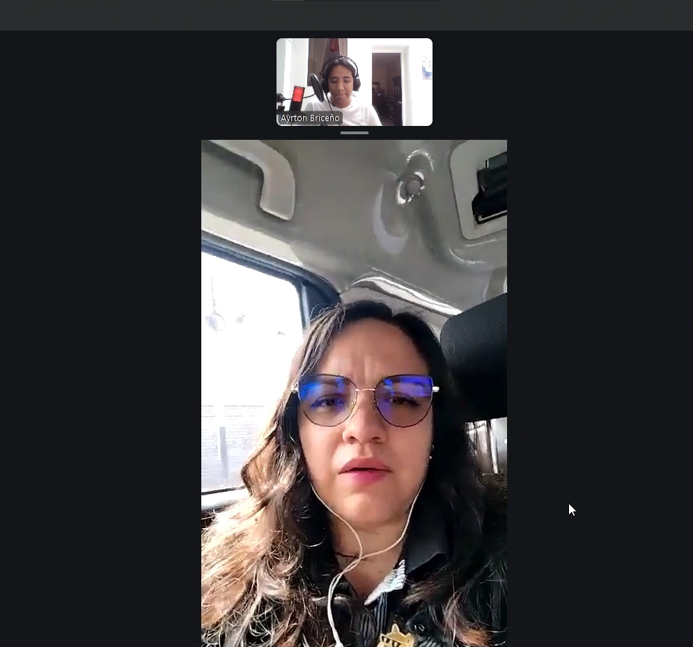**                                                                                                                                                                                                                                                                                                                                                                                                                                                  |
| Resumen | **Principales respuestas:** Expresa preocupación por cobros atípicos en el recibo de agua y el riesgo de filtraciones no detectadas en su vivienda de dos pisos; manifiesta interés en una herramienta móvil conectada a sensores que alerte sobre anomalías en tiempo real sin requerir revisiones manuales constantes, y señala disposición a pagar una suscripción mensual accesible siempre que el sistema demuestre ahorro preventivo confiable.<br><br>**Características objetivas:** Mujer de 33 años, ingeniera civil que reside en el distrito de El Agustino junto a su esposo y su hijo en vivienda propia de dos niveles. Administra el presupuesto familiar y supervisa los servicios básicos del hogar (recibos de S/ 80 a S/ 120 mensuales); conoce sobre instalaciones sanitarias pero carece de tiempo para revisiones manuales continuas por su jornada laboral.<br><br>**Características subjetivas:** Analítica, metódica y preventiva; orientada a la estabilidad económica y la sostenibilidad familiar. Su principal frustración son las incongruencias de facturación y el riesgo de daños estructurales por fugas ocultas. Busca automatización del control hídrico con datos precisos y sin saturación de notificaciones. Influenciada por marcas de tecnología doméstica (Xiaomi Smart Home, Sodimac) y foros de ingeniería sostenible.<br><br>**Tecnología y canales:** Utiliza smartphone Android de gama media/alta y laptop de trabajo; usa Chrome como navegador principal; interactúa cotidianamente con WhatsApp, banca móvil (BCP, Yape) y apps de servicios. Requiere notificaciones push directas y paneles visuales simples.<br><br>**Evidencia temporal:** La ficha registra el video completo de 00:00:00 a 00:06:46; las respuestas se resumen sin atribuir citas textuales no verificadas. |

### 2.2.3. Análisis de entrevistas

Este avance consolida tres entrevistas: dos del segmento PYMES y comercios locales y una del segmento hogares y familias. Los porcentajes se calculan dentro de cada segmento; el resultado de hogares es descriptivo porque corresponde a una sola entrevista y no representa estadísticamente a todas las familias.

#### Análisis del segmento PYMES y comercios locales

| Hallazgo | Frecuencia | Porcentaje | Evidencia |
|---|---|---|---|
| Control manual del recibo o registro de consumo | 2 de 2 | 100 % | Edery 00:01:46–00:02:16; Arantxa 00:00:40–00:01:30 |
| Fugas, desperdicios o cobros inesperados | 2 de 2 | 100 % | Edery 00:02:17–00:02:52; Arantxa 00:01:31–00:03:10 |
| Interés en reportes y alertas móviles | 2 de 2 | 100 % | Edery 00:02:53–00:03:50; Arantxa 00:04:21–00:06:35 |
| Uso de smartphone y canales digitales de apoyo | 2 de 2 | 100 % | Edery: Android y WhatsApp; Arantxa: iPhone, Android, Drive y WhatsApp |
| Preferencia por precio accesible, instalación guiada y soporte | 2 de 2 | 100 % | Edery 00:03:56–00:04:59; Arantxa 00:06:36–00:08:15 |

#### Análisis del segmento hogares y familias

| Hallazgo | Frecuencia | Porcentaje | Evidencia |
|---|---|---|---|
| Revisión del recibo y preocupación por cobros atípicos o filtraciones | 1 de 1 | 100 % | Wendy, 00:00:00–00:06:46 |
| Interés en alertas móviles ante anomalías | 1 de 1 | 100 % | Wendy, 00:00:00–00:06:46 |
| Uso de smartphone y aplicaciones digitales | 1 de 1 | 100 % | Wendy: Android, Chrome, WhatsApp, banca móvil y apps de servicios |
| Preferencia por una solución sencilla, preventiva y de costo accesible | 1 de 1 | 100 % | Wendy, 00:00:00–00:06:46 |

La entrevista de hogares se interpreta como evidencia exploratoria del caso de Wendy Zuñiga. Se requieren más participantes para generalizar estos patrones al segmento completo.

## 2.3. Needfinding

En esta sección se presenta el proceso de análisis de la información recolectada durante las entrevistas con representantes de los segmentos objetivo de Qlic. A partir de dicha información se construyen los artefactos que permiten comprender en profundidad las necesidades, motivaciones y frustraciones de los usuarios. Los artefactos elaborados incluyen los User Personas, el User Task Matrix, los User Journey Maps y los Empathy Maps. Cada uno fue elaborado en UXPressia, tomando como base los hallazgos identificados en el análisis de entrevistas de la sección 2.2.

Dado que Qlic es una **aplicación móvil nativa y multiplataforma** (desarrollada en Kotlin para Android y Flutter para compatibilidad multiplataforma), el needfinding incorpora el contexto de uso móvil: acceso desde el smartphone en cualquier momento y lugar, notificaciones push como canal de alerta prioritario, consulta rápida del estado del sistema sin necesidad de abrir un computador, y acceso a recursos del dispositivo como la cámara para registrar dispositivos IoT mediante código QR.

---

### 2.3.1. User Personas

En esta sección se incluyen las fichas de User Persona que representan arquetipos de los segmentos objetivo de Qlic. Estos arquetipos fueron construidos a partir del análisis estadístico de las entrevistas realizadas ([ver sección 2.2.3](#223-análisis-de-entrevistas)), buscando capturar las características, necesidades y comportamientos más representativos de cada segmento. Se elaboró una ficha por cada segmento objetivo: PYMES y comercios locales, y hogares y familias. Las fichas fueron elaboradas en UXPressia.

#### User Persona #1 – Segmento PYMES y Comercios Locales

> **

| Campo | Detalle |
|---|---|
| **Nombre** | Carlos Abanto |
| **Edad** | 30 años |
| **Ocupación** | Administrador de negocio local (lavandería) |
| **Distrito** | Pueblo Libre, Lima |
| **Estado civil** | No declarado en la entrevista |
| **Dispositivo principal** | Smartphone Android |
| **Nivel tecnológico** | Básico-intermedio – usa el celular para gestión operativa y WhatsApp para registros fotográficos |
| **Canales digitales** | WhatsApp, celular Android, correo básico |

**Biografía:**
Carlos administra una lavandería de tamaño pequeño en Pueblo Libre. Se encarga del control operativo diario, la revisión de recibos y la coordinación del mantenimiento del negocio. Su método actual de control del agua es manual: revisa el recibo una vez al mes, lo compara con el periodo anterior y registra datos de las máquinas en una libreta. Ha enfrentado fugas en una manguera y en el baño; una la detectó por humedad en el piso y otra al notar un recibo elevado. No cuenta con ningún sistema de monitoreo en tiempo real y depende de señales físicas o del recibo mensual para identificar problemas.

**Objetivos:**
- Enterarse rápidamente de cualquier fuga o consumo inusual sin tener que esperar el recibo mensual.
- Consultar desde el celular el consumo total y comparaciones semanales o mensuales de forma sencilla.
- Reducir los costos operativos del negocio relacionados con el agua.
- Permitir que más de una persona del negocio pueda revisar la información de consumo.

**Frustraciones:**
- Detectar fugas tarde, solo cuando ya generaron un recibo elevado o daño visible como humedad en el piso.
- El registro manual en libreta es poco confiable y difícil de comparar entre periodos.
- No tener visibilidad del consumo en tiempo real durante la jornada operativa.
- Soluciones tecnológicas que requieren conocimientos técnicos que él no tiene.
  
**Necesidades clave:**
- Alertas claras únicamente ante variaciones importantes, indicando ubicación, duración y nivel de urgencia.
- Interfaz visual y sencilla, sin tecnicismos.
- Instalación guiada y soporte cercano desde el inicio.
- Plan básico accesible para comenzar sin gran inversión.
  **Personalidad:** Práctico, orientado a reducir costos, cauteloso con la tecnología pero abierto si es simple y útil. Prefiere soluciones que no interrumpan la operación del negocio.

**Motivaciones:** Ahorro económico, control operativo sin complicaciones, tranquilidad ante imprevistos.
 
---

#### User Persona #2 – Segmento Hogares y Familias

| Campo | Detalle |
|---|---|
| **Nombre** | Wendy Zuñiga |
| **Edad** | 33 años |
| **Ocupación** | Ingeniera civil |
| **Distrito** | El Agustino, Lima |
| **Estado civil** | No declarado; vive con su esposo y su hijo |
| **Dispositivo principal** | Smartphone Android |
| **Nivel tecnológico** | Intermedio; usa aplicaciones móviles para comunicación, banca y servicios |
| **Navegador preferido** | Chrome |

**Biografía:**
Wendy vive en una vivienda propia de dos niveles y participa en la administración del presupuesto familiar y de los servicios básicos. Revisa los recibos de agua, conoce las instalaciones sanitarias por su formación y busca prevenir filtraciones que puedan generar cobros atípicos o daños estructurales. Su jornada laboral limita el tiempo disponible para inspecciones manuales.

**Objetivos:**
- Detectar filtraciones o consumos anómalos antes de recibir un cobro elevado.
- Consultar desde el celular información clara para decidir cuándo revisar o reparar una instalación.
- Reducir el gasto familiar de agua sin incorporar tareas manuales diarias.

**Frustraciones:**
- Recibir un cobro atípico sin conocer de inmediato su causa.
- No contar con una señal que permita ubicar una filtración oculta.
- Tener que revisar manualmente la vivienda y esperar el siguiente recibo para comprobar una corrección.

**Canales digitales:** WhatsApp, banca móvil, Yape, Chrome y aplicaciones de servicios.

**Motivaciones:** Prevenir daños en la vivienda, mantener estable el presupuesto familiar y recibir información oportuna que permita actuar.

**Personalidad:** Analítica, preventiva y orientada a soluciones prácticas; valora la precisión, la sencillez y las alertas que no saturen.

---

### 2.3.2. User Task Matrix

En esta sección se presenta el User Task Matrix, que concentra las tareas que los User Personas realizan para cumplir sus objetivos en relación con la gestión del agua. Es importante destacar que estas tareas son realizadas por los usuarios **independientemente de la existencia de Qlic**, pues representan comportamientos y necesidades actuales de cada segmento.

Se consideran los dos User Personas identificados: el representante del segmento Hogares y Familias, y el representante del segmento PYMES. Para cada tarea se indica la frecuencia (Alta / Media / Baja) y la importancia (Alta / Media / Baja) con la que cada User Persona la realiza.

| Tarea | Hogares y Familias | | PYMES | |
|---|---|---|---|---|
| | **Frecuencia** | **Importancia** | **Frecuencia** | **Importancia** |
| Revisar el recibo mensual de agua | Alta | Alta | Alta | Alta |
| Detectar fugas o consumos anómalos en las instalaciones | Media | Alta | Media | Alta |
| Llamar a un técnico ante sospechas de fuga | Baja | Alta | Media | Alta |
| Controlar el consumo de agua por punto o área de uso | Baja | Media | Alta | Alta |
| Comparar el gasto de agua entre periodos distintos | Media | Media | Alta | Alta |
| Verificar el nivel de agua en tanques o cisternas | Media | Alta | Alta | Alta |
| Buscar formas de reducir el consumo de agua | Media | Alta | Media | Alta |
| Comunicar incidencias de agua a otros miembros o personal | Baja | Media | Media | Alta |
| Tomar decisiones de mantenimiento preventivo | Baja | Media | Media | Alta |
| Gestionar el pago del servicio de agua | Alta | Alta | Alta | Alta |

**Análisis:**

Las tareas con mayor frecuencia e importancia para ambos segmentos son la revisión del recibo de agua, la detección de fugas y la verificación del nivel de tanques. El segmento PYMES realiza con mayor frecuencia tareas de control granular por área y toma de decisiones de mantenimiento, dado que el impacto económico del desperdicio es más crítico para su operación. El segmento Hogares y Familias, en cambio, concentra su atención en el control del gasto mensual y en la detección temprana de fugas que afectan el presupuesto familiar.

La principal coincidencia entre ambos segmentos es la necesidad de **detectar anomalías en el consumo de forma anticipada** y de **acceder a información de consumo de manera sencilla y rápida**. La principal diferencia radica en el nivel de detalle requerido: las PYMES necesitan control por áreas y reportes comparativos avanzados, mientras que los hogares priorizan la simplicidad y las alertas inmediatas.

Estas necesidades justifican el enfoque móvil de Qlic: el acceso desde el smartphone permite a ambos segmentos consultar el estado de sus instalaciones en cualquier momento, y las notificaciones push garantizan que las alertas lleguen de forma inmediata sin que el usuario tenga que buscar la información activamente.

---

### 2.3.3. User Journey Mapping

En esta sección se presentan los User Journey Maps en su versión **As-Is**, es decir, el recorrido actual del usuario sin la existencia de Qlic. El objetivo es identificar los momentos de mayor fricción y frustración que la aplicación móvil puede transformar positivamente. Se elaboró un User Journey Map por cada User Persona, vinculado a su ficha correspondiente en UXPressia.

#### User Journey Map #1 – Segmento PYMES y Comercios Locales

> **

**Resumen del journey:** Carlos administra una lavandería en Pueblo Libre. Su recorrido actual comienza cuando recibe el recibo mensual de agua y nota que el monto subió respecto al mes anterior. Sin herramientas de monitoreo, inicia una inspección manual del local buscando señales visibles de fuga. Al no encontrar nada obvio, llama a un técnico que confirma una fuga en una manguera o en el baño. Tras la reparación, Carlos queda a la espera del siguiente recibo para saber si el problema se resolvió, sin ninguna forma de confirmarlo antes.

| Fase | Acción | Pensamiento | Emoción | Punto de dolor |
|---|---|---|---|---|
| **Recepción del recibo** | Recibe el recibo mensual de agua y lo compara con el del mes anterior anotado en su libreta | "Este mes subió bastante, algo debe estar pasando" | Preocupación | Solo se entera del problema a mes vencido, cuando el daño ya ocurrió |
| **Inspección manual** | Recorre el local revisando mangueras, baños y conexiones buscando humedad o goteos visibles | "No veo nada obvio, pero el recibo no miente" | Frustración | La inspección es visual e imprecisa; depende de señales físicas como humedad en el piso |
| **Llamada al técnico** | Contacta a un técnico de confianza por WhatsApp para que revise las instalaciones | "Espero que venga rápido y no cobre demasiado" | Ansiedad | Tiempo de espera incierto y costo adicional no planificado que afecta el presupuesto del negocio |
| **Diagnóstico y reparación** | El técnico detecta la fuga en una manguera o en el baño y realiza la reparación | "¿Por qué no me avisó nadie antes? Pude haberlo evitado" | Resignación | No existía ningún sistema que alertara sobre el consumo anómalo antes de que escale |
| **Espera de confirmación** | Espera el siguiente recibo mensual para saber si el consumo bajó tras la reparación | "Ojalá haya bajado, pero no lo sabré hasta el mes que viene" | Incertidumbre | Sin datos en tiempo real no puede confirmar si el problema se resolvió ni cuánto ahorró |

---

#### User Journey Map #2 – Segmento Hogares y Familias

> *Recorrido As-Is del segmento hogares, construido a partir de la entrevista registrada de Wendy Zuñiga.*

**Resumen del journey:** La persona responsable del hogar recibe el recibo mensual y compara el monto con periodos anteriores. Cuando detecta un aumento o una señal física, revisa manualmente grifos, inodoros, tuberías y tanque. Si no identifica la causa, consulta a un familiar, contacta a un técnico o presenta un reclamo. Después de aplicar una corrección, espera el siguiente recibo para comprobar si el consumo volvió a la normalidad.

| Fase | Acción | Pensamiento | Emoción | Punto de dolor |
|---|---|---|---|---|
| **Recepción del recibo** | Recibe el recibo mensual y compara el monto con el periodo anterior | "El monto aumentó; necesito saber por qué" | Preocupación | La información llega con retraso y solo muestra el consumo acumulado |
| **Búsqueda de señales** | Revisa grifos, inodoros, tuberías y el tanque en busca de goteos o humedad | "Tal vez la fuga está en algún punto que no puedo ver" | Incertidumbre | La inspección doméstica depende de señales visibles y no permite localizar fugas ocultas |
| **Consulta y decisión** | Pregunta a un familiar, revisa recomendaciones o contacta a un técnico | "No sé si el problema es el medidor o una fuga interna" | Frustración | No cuenta con datos suficientes para decidir si debe reparar, reclamar o esperar |
| **Aplicación de una medida** | Ajusta una conexión, cambia un componente, modifica hábitos o solicita una revisión | "Espero que esta medida reduzca el consumo" | Esperanza | No puede comprobar de inmediato si la acción solucionó el problema |
| **Verificación posterior** | Espera el siguiente recibo y vuelve a comparar el monto | "Recién el próximo mes sabré si funcionó" | Incertidumbre | El ciclo mensual retrasa la confirmación y puede acumular nuevos costos |

---
### 2.3.4. Empathy Mapping

En esta sección se presentan los Empathy Maps elaborados para cada User Persona. El proceso de elaboración incluyó una sesión colaborativa del equipo en la que cada miembro aportó observaciones en torno a las preguntas guía del artefacto: ¿Qué dice?, ¿Qué piensa y siente?, ¿Qué ve?, ¿Qué hace?, ¿Qué escucha?, y la identificación de Pains y Gains. Los mapas fueron elaborados en UXPressia a partir de los hallazgos del análisis de entrevistas.

#### Empathy Map #1 – Segmento Hogares y Familias

**¿Con quién estamos empatizando?**
Wendy Zuñiga, 33 años, ingeniera civil de El Agustino. Vive con su esposo y su hijo en una vivienda de dos niveles y participa en la administración de los servicios básicos.

**¿Qué necesita hacer?**
Revisar el recibo, identificar variaciones de consumo, prevenir filtraciones y decidir cuándo solicitar una revisión o reparación.

**¿Qué está diciendo?**
- Le preocupa recibir cobros atípicos sin conocer la causa.
- Necesita una alerta que le permita reaccionar antes de que el problema genere daños.
- Prefiere una solución móvil clara y accesible.

**¿Qué está viendo?**
- Recibos mensuales cuyo monto puede variar sin explicación inmediata.
- Instalaciones domésticas que no puede inspeccionar de forma continua por falta de tiempo.
- Riesgo de humedad o daño estructural cuando una filtración permanece oculta.

**¿Qué está haciendo?**
- Revisa los recibos y compara el gasto del hogar.
- Supervisa las instalaciones cuando aparece una señal de anomalía.
- Usa el smartphone para comunicación, banca y servicios.

**¿Qué está escuchando?**
- Recomendaciones de familiares y técnicos sobre mantenimiento del hogar.
- Conversaciones sobre ahorro familiar y consumo responsable.
- Alertas y mensajes de las aplicaciones que usa a diario.

**¿Qué piensa y siente?**
- Quiere prevenir gastos imprevistos y daños en la vivienda.
- Valora la información precisa, oportuna y fácil de interpretar.
- Le preocupa recibir demasiadas notificaciones sin una acción clara.

**Pains:**
- Cobros elevados cuya causa solo se conoce después del cierre del periodo.
- Falta de visibilidad sobre filtraciones ocultas.
- Tiempo limitado para realizar verificaciones manuales.

**Gains:**
- Alertas móviles que indiquen la anomalía y su nivel de urgencia.
- Historial y comparación del consumo en soles y por periodos.
- Recomendaciones concretas para actuar y prevenir nuevos cobros.

---

#### Empathy Map #2 – Segmento PYMES

> **

**¿Con quién estamos empatizando?**
Carlos Abanto, 30 años, administrador de una lavandería en Pueblo Libre, Lima. Gestiona la operación diaria del negocio, revisa recibos y coordina el mantenimiento. Usa Android y WhatsApp para el trabajo.

**¿Qué necesita hacer?**
Controlar el consumo de agua de su negocio, detectar fugas a tiempo sin depender del recibo mensual, y tomar decisiones de mantenimiento rápidas sin interrumpir la operación de la lavandería.

**¿Qué está diciendo?**
- "Necesito enterarme de las fugas rápido, no cuando ya llegó el recibo alto"
- "Quiero ver el consumo desde el celular, algo simple que cualquiera pueda usar"
- "Si la alerta me dice dónde está el problema y qué tan grave es, puedo actuar"
- "Estaría bien que más de una persona del negocio pueda ver la información"

**¿Qué está viendo?**
- Recibos de agua que varían mes a mes sin una explicación clara
- Señales físicas de fugas como humedad en el piso o paredes
- Técnicos que cobran cada vez que los llama para una revisión
- Otros negocios similares con los mismos problemas de costos operativos

**¿Qué está haciendo?**
- Revisando el recibo mensual y comparándolo con anotaciones en una libreta
- Inspeccionando visualmente el local en busca de goteos o humedad
- Fotografiando los recibos con WhatsApp para tener un registro
- Coordinando con técnicos de confianza cuando sospecha de una fuga

**¿Qué está escuchando?**
- Colegas del rubro que también se quejan de recibos de agua elevados
- Técnicos que le dicen que las fugas internas son difíciles de detectar a tiempo
- Proveedores que le ofrecen soluciones costosas o complicadas de instalar
- Noticias sobre el alza de tarifas de agua en Lima

**¿Qué piensa y siente?**
- Siente que pierde dinero innecesariamente cada mes por problemas que podría evitar
- Le preocupa no poder controlar un costo operativo tan básico como el agua
- Desea tener más control sin añadir complejidad a su día a día
- Confía en la tecnología solo si es práctica, visual y no requiere conocimientos técnicos

**Pains:**
- Enterarse de las fugas solo cuando el recibo ya refleja el daño económico
- Depender de inspecciones manuales imprecisas y de técnicos externos costosos
- No poder confirmar si una reparación fue efectiva hasta el siguiente ciclo de facturación
- Soluciones del mercado demasiado complejas o caras para el tamaño de su negocio

**Gains:**
- Recibir alertas push en el celular que indiquen ubicación, duración y nivel de urgencia del problema
- Consultar el consumo semanal o mensual desde el smartphone en menos de un minuto
- Compartir el acceso a la información con otro miembro del negocio
- Comenzar con un plan básico accesible con instalación guiada sin necesidad de técnico especializado

---

### 2.3.5. Big Picture EventStorming

El Big Picture EventStorming se realizó en una sesión colaborativa del equipo con una duración aproximada de 90 minutos, utilizando la herramienta indicada. La sesión permitió mapear los eventos de negocio más relevantes del dominio de gestión inteligente del agua, identificando los procesos clave, los actores involucrados y las oportunidades de mejora en el flujo de valor de Qlic.

Los eventos de dominio más significativos identificados durante la sesión fueron los siguientes:

- Sensor IoT registró lectura de consumo
- Consumo anómalo detectado por el sistema
- Alerta de posible fuga generada
- Notificación push enviada al dispositivo móvil del usuario
- Usuario visualizó el estado de sus dispositivos en la app
- Usuario configuró umbral de alerta personalizado
- Reporte de consumo generado automáticamente
- Nivel de tanque bajo detectado
- Predicción de reabastecimiento calculada
- Técnico asignado para revisión en sitio
- Incidencia registrada y resuelta
- Dispositivo IoT registrado en el sistema
- Sesión de usuario iniciada en la app móvil
- Usuario suscribió plan de servicio
- Pago de suscripción procesado

A partir del análisis de estos eventos se identificaron los bounded contexts candidatos para la solución: **IAM** (gestión de identidad y acceso), **Device Monitoring** (monitoreo de dispositivos IoT), **Alerting** (generación y envío de alertas), **Consumption Analytics** (análisis de consumo y reportes) y **Subscriptions** (gestión de planes y pagos). Estos bounded contexts se detallan en la sección 2.5.

---

### 2.3.6. Ubiquitous Language

A continuación se presenta el glosario de términos y conceptos del dominio de negocio de Qlic. Este glosario fue construido a partir del proceso de Big Picture EventStorming y del análisis del dominio del problema. Los términos corresponden exclusivamente al dominio de negocio y no incluyen términos técnicos de ingeniería de software. Se presentan en inglés, con el equivalente en español entre paréntesis cuando aplica, y la definición en español.

| Término | Equivalente en español | Definición |
|---|---|---|
| **Water Point** | Punto de agua | Ubicación física específica dentro de un hogar o local donde se instala un sensor IoT para monitorear el flujo y consumo de agua. Puede corresponder a un grifo, tubería principal, entrada de tanque u otro punto de uso relevante. |
| **IoT Device** | Dispositivo IoT | Sensor físico conectado a internet instalado en un Water Point, encargado de registrar lecturas periódicas de consumo de agua y transmitirlas al sistema Qlic para su procesamiento y análisis. |
| **Consumption Reading** | Lectura de consumo | Dato registrado por un IoT Device en un momento determinado, que expresa la cantidad de agua que fluye por un Water Point en un periodo específico, medida en litros o metros cúbicos. |
| **Anomalous Consumption** | Consumo anómalo | Situación en la que una Consumption Reading supera el umbral definido por el usuario o calculado automáticamente por el sistema, lo que puede indicar la presencia de una fuga, un consumo inusual o una falla en el dispositivo. |
| **Leak Alert** | Alerta de fuga | Notificación generada automáticamente por el sistema cuando se detecta un Anomalous Consumption sostenido que sugiere la presencia de una fuga de agua. Se envía como notificación push al dispositivo móvil del Subscriber. |
| **Consumption Threshold** | Umbral de consumo | Valor máximo de consumo de agua por periodo (diario, semanal o mensual) establecido por el usuario o calculado por el sistema, a partir del cual se genera una Leak Alert. |
| **Water Tank** | Tanque de agua | Depósito de almacenamiento de agua en un hogar o local cuyo nivel es monitoreado por un IoT Device. El sistema puede predecir el momento en que será necesario el reabastecimiento. |
| **Replenishment Prediction** | Predicción de reabastecimiento | Estimación calculada por el sistema sobre el momento en que el nivel de un Water Tank alcanzará un punto crítico, basada en el patrón histórico de Consumption Readings del usuario. |
| **Consumption Report** | Reporte de consumo | Vista dentro de la aplicación móvil que resume el consumo de agua de un Subscriber en un periodo definido, mostrando tendencias, comparativas entre periodos anteriores y recomendaciones de ahorro. |
| **Subscriber** | Suscriptor | Persona natural o jurídica que ha contratado un Subscription Plan de Qlic y tiene acceso a las funcionalidades de monitoreo, alertas y reportes de la aplicación móvil. |
| **Subscription Plan** | Plan de suscripción | Modalidad de contratación del servicio Qlic. Actualmente existen dos planes: Plan Básico y Plan Gestión Pro, cada uno con un conjunto diferente de funcionalidades y dispositivos incluidos. |
| **Monitoring Dashboard** | Panel de monitoreo | Vista principal de la aplicación móvil que presenta el estado actual de todos los Water Points y dispositivos IoT registrados por el Subscriber, con indicadores visuales de consumo y alertas activas. |
| **Push Notification** | Notificación push | Mensaje enviado directamente al dispositivo móvil del Subscriber a través del sistema operativo, que informa sobre eventos relevantes como Leak Alerts, niveles bajos en Water Tanks o generación de nuevos Consumption Reports. |
| **Device Registration** | Registro de dispositivo | Proceso mediante el cual un nuevo IoT Device es vinculado al perfil del Subscriber en la aplicación móvil, asignándole un Water Point específico y configurando sus parámetros de monitoreo iniciales. |
| **Water Waste** | Desperdicio de agua | Volumen de agua consumido de manera innecesaria o involuntaria, ya sea por fugas, malos hábitos de uso o fallas en las instalaciones. La reducción del Water Waste es uno de los objetivos principales de Qlic. |
| **Consumption Baseline** | Línea base de consumo | Patrón de consumo histórico de un Subscriber o Water Point, calculado por el sistema a partir de las Consumption Readings registradas, que sirve como referencia para identificar Anomalous Consumptions. |
| **Incident** | Incidencia | Evento registrado en el sistema que documenta una situación problemática detectada, como una fuga confirmada o un dispositivo desconectado, junto con su estado de atención y resolución. |
| **Technical Visit** | Visita técnica | Servicio de soporte presencial en el que un técnico de WASD acude al domicilio o local del Subscriber para instalar, revisar o reparar dispositivos IoT o instalaciones relacionadas con el servicio Qlic. |
| **Water Cost** | Costo de agua | Gasto económico que representa el consumo de agua para un Subscriber en un periodo determinado, expresado en la factura del servicio. Qlic busca ayudar a reducir este indicador mediante el monitoreo y las recomendaciones de optimización. |
| **Sustainability Goal** | Objetivo de sostenibilidad | Meta establecida por el Subscriber orientada a reducir su huella hídrica y contribuir al uso responsable del agua, que puede ser configurada en la aplicación móvil para recibir seguimiento y recomendaciones personalizadas. |

## 2.4. Requirements specification

### 2.4.1. User Stories

A partir del análisis de entrevistas de la sección 2.2, los artefactos de Needfinding de la sección 2.3 y el Big Picture EventStorming, el equipo especificó los requisitos de la solución Qlic en forma de Epics, User Stories, Technical Stories y Spike Stories. Los Epics se organizaron tomando como referencia los bounded contexts candidatos identificados en la sección 2.3.5, de modo que exista trazabilidad entre la especificación de requisitos y el diseño estratégico de la solución. El sitio web estático (Landing Page) se considera desde el inicio de la especificación, conforme a lo establecido para el alcance del proyecto.

Los criterios de aceptación se redactan en tercera persona, en tiempo presente, sin referencias a detalles de interfaz de usuario, siguiendo la estructura Gherkin (Given-When-Then). Las reglas de negocio y restricciones que no dependen de una condición se expresan como criterios de tipo rules-oriented.

#### Epics

| Epic ID | Título | Descripción | Bounded Context relacionado |
|---|---|---|---|
| EP01 | Landing Page informativo | Presentación del modelo de negocio, propuesta de valor, planes y llamados a la acción dirigidos a visitantes de los segmentos objetivo. | — (sitio web estático) |
| EP02 | Gestión de identidad y acceso | Registro, autenticación, gestión del perfil y acceso multiusuario con permisos diferenciados sobre un mismo local u hogar. | IAM |
| EP03 | Registro y monitoreo de dispositivos IoT | Vinculación de dispositivos a Water Points, registro de lecturas de consumo y verificación del estado operativo de los sensores. | Device Monitoring |
| EP04 | Alertas de fugas y consumo anómalo | Detección de consumo anómalo, configuración de umbrales y envío de notificaciones push accionables. | Alerting |
| EP05 | Reportes y analítica de consumo | Historial de consumo, comparativas entre periodos, estimación de costos y recomendaciones de ahorro. | Consumption Analytics |
| EP06 | Gestión de tanques y reabastecimiento | Monitoreo del nivel de los Water Tanks y predicción del momento de reabastecimiento. | Device Monitoring |
| EP07 | Suscripciones y planes | Selección de plan, proceso de suscripción, pagos y gestión del ciclo de vida de la suscripción. | Subscriptions |
| EP08 | Soporte e incidencias | Registro y seguimiento de incidencias, solicitud de visitas técnicas y canales de soporte al suscriptor. | Support |

#### User Stories

##### EP01 – Landing Page informativo

| Story ID | User | Priority | Epic |
|---|---|---|---|
| US01 | visitante del Landing Page | Alta | EP01 |
| **Title** | Conocer la propuesta de valor de Qlic |  |  |
| **Description** | Como visitante del Landing Page, deseo conocer en qué consiste Qlic y qué problema resuelve, para evaluar si la solución se ajusta a mi situación. |  |  |
| **Acceptance Criteria** | **Escenario 1: Visualización de la propuesta de valor**<br>**Dado** que el visitante ingresa al Landing Page,<br>**Cuando** el sistema procesa la solicitud,<br>**Entonces** presenta el propósito de la solución, sus beneficios principales y una opción para solicitar información adicional.<br><br>**Escenario 2: Acceso a la explicación ampliada**<br>**Dado** que el visitante solicita información adicional sobre Qlic,<br>**Cuando** el sistema procesa la solicitud,<br>**Entonces** presenta la explicación del funcionamiento de la solución. |  |  |

| Story ID | User | Priority | Epic |
|---|---|---|---|
| US02 | visitante del Landing Page | Alta | EP01 |
| **Title** | Comparar los planes de suscripción disponibles |  |  |
| **Description** | Como visitante del Landing Page, deseo comparar los planes de suscripción disponibles, para identificar cuál corresponde al tamaño de mi negocio u hogar. |  |  |
| **Acceptance Criteria** | **Escenario 1: Comparación de planes**<br>**Dado** que el visitante solicita información sobre los planes,<br>**Cuando** el sistema procesa la solicitud,<br>**Entonces** presenta cada plan con sus funcionalidades incluidas, la cantidad de dispositivos soportados y su precio.<br><br>**Regla de negocio**<br>Los planes disponibles son Plan Básico y Plan Gestión Pro. |  |  |

| Story ID | User | Priority | Epic |
|---|---|---|---|
| US03 | visitante del Landing Page | Media | EP01 |
| **Title** | Contactar al equipo desde el Landing Page |  |  |
| **Description** | Como visitante del Landing Page, deseo comunicarme con el equipo de Qlic, para resolver dudas sobre instalación, cobertura o condiciones del servicio antes de suscribirme. |  |  |
| **Acceptance Criteria** | **Escenario 1: Envío de una consulta**<br>**Dado** que el visitante completa el formulario de contacto con datos válidos,<br>**Cuando** confirma el envío,<br>**Entonces** el sistema registra la consulta y presenta una confirmación de recepción.<br><br>**Escenario 2: Datos incompletos**<br>**Dado** que el visitante omite un dato obligatorio del formulario,<br>**Cuando** intenta confirmar el envío,<br>**Entonces** el sistema no registra la consulta e indica qué dato falta. |  |  |

| Story ID | User | Priority | Epic |
|---|---|---|---|
| US04 | visitante del Landing Page | Media | EP01 |
| **Title** | Consultar el Landing Page en el idioma de preferencia |  |  |
| **Description** | Como visitante del Landing Page, deseo consultar el contenido en inglés o español latinoamericano, para comprender la propuesta en el idioma que domino. |  |  |
| **Acceptance Criteria** | **Escenario 1: Cambio de idioma**<br>**Dado** que el visitante solicita un idioma soportado,<br>**Cuando** el sistema procesa la preferencia regional,<br>**Entonces** presenta el contenido en el idioma seleccionado.<br><br>**Regla de negocio**<br>Los idiomas soportados son English (en_US) y Latin American Spanish (es_419), siendo el inglés el idioma por defecto. |  |  |

##### EP02 – Gestión de identidad y acceso

| Story ID | User | Priority | Epic |
|---|---|---|---|
| US05 | visitante interesado en el servicio | Alta | EP02 |
| **Title** | Registrar una cuenta de suscriptor |  |  |
| **Description** | Como visitante interesado en el servicio, deseo registrar una cuenta en la aplicación móvil, para acceder a las funcionalidades de monitoreo de consumo. |  |  |
| **Acceptance Criteria** | **Escenario 1: Registro exitoso**<br>**Dado** que el visitante proporciona datos válidos y acepta los términos y condiciones del servicio,<br>**Cuando** confirma el registro,<br>**Entonces** el sistema crea la cuenta del suscriptor y habilita el acceso a la aplicación.<br><br>**Escenario 2: Correo ya registrado**<br>**Dado** que el visitante proporciona un correo asociado a una cuenta existente,<br>**Cuando** confirma el registro,<br>**Entonces** el sistema no crea una nueva cuenta e informa que el correo ya se encuentra registrado. |  |  |

| Story ID | User | Priority | Epic |
|---|---|---|---|
| US06 | suscriptor | Alta | EP02 |
| **Title** | Iniciar sesión en la aplicación móvil |  |  |
| **Description** | Como suscriptor, deseo iniciar sesión en la aplicación móvil, para consultar la información de mis dispositivos y mi consumo. |  |  |
| **Acceptance Criteria** | **Escenario 1: Credenciales válidas**<br>**Dado** que el suscriptor ingresa credenciales válidas,<br>**Cuando** confirma el inicio de sesión,<br>**Entonces** el sistema inicia la sesión y presenta el panel de monitoreo.<br><br>**Escenario 2: Credenciales inválidas**<br>**Dado** que el suscriptor ingresa credenciales incorrectas,<br>**Cuando** confirma el inicio de sesión,<br>**Entonces** el sistema no inicia la sesión e informa que las credenciales no son válidas. |  |  |

| Story ID | User | Priority | Epic |
|---|---|---|---|
| US07 | suscriptor que olvidó su contraseña | Media | EP02 |
| **Title** | Recuperar el acceso a la cuenta |  |  |
| **Description** | Como suscriptor que olvidó su contraseña, deseo restablecerla, para recuperar el acceso a la información de mi consumo. |  |  |
| **Acceptance Criteria** | **Escenario 1: Solicitud de restablecimiento**<br>**Dado** que el suscriptor indica un correo asociado a una cuenta existente,<br>**Cuando** solicita el restablecimiento,<br>**Entonces** el sistema envía un mensaje con un enlace de restablecimiento de vigencia limitada.<br><br>**Escenario 2: Enlace vencido**<br>**Dado** que el suscriptor utiliza un enlace de restablecimiento vencido,<br>**Cuando** intenta definir una nueva contraseña,<br>**Entonces** el sistema rechaza la operación e indica que debe solicitar un nuevo enlace. |  |  |

| Story ID | User | Priority | Epic |
|---|---|---|---|
| US08 | suscriptor responsable de un negocio | Alta | EP02 |
| **Title** | Compartir el acceso con otro usuario |  |  |
| **Description** | Como suscriptor responsable de un negocio, deseo otorgar acceso a otra persona de mi equipo, para que pueda revisar el consumo cuando yo no esté disponible. |  |  |
| **Acceptance Criteria** | **Escenario 1: Invitación a un usuario adicional**<br>**Dado** que el suscriptor titular indica el correo de la persona a invitar y un nivel de permiso,<br>**Cuando** confirma la invitación,<br>**Entonces** el sistema registra la invitación y notifica a la persona invitada.<br><br>**Escenario 2: Acceso de solo consulta**<br>**Dado** que un usuario invitado con permiso de consulta inicia sesión,<br>**Cuando** intenta modificar la configuración de un dispositivo,<br>**Entonces** el sistema rechaza la operación e informa que no cuenta con el permiso requerido.<br><br>**Regla de negocio**<br>La cantidad de usuarios adicionales permitidos está determinada por el plan de suscripción contratado. |  |  |

| Story ID | User | Priority | Epic |
|---|---|---|---|
| US09 | suscriptor | Baja | EP02 |
| **Title** | Actualizar los datos del perfil |  |  |
| **Description** | Como suscriptor, deseo actualizar los datos de mi perfil y de mis locales, para que la información del servicio corresponda a mi situación actual. |  |  |
| **Acceptance Criteria** | **Escenario 1: Actualización válida**<br>**Dado** que el suscriptor modifica uno o más datos de su perfil con valores válidos,<br>**Cuando** confirma la actualización,<br>**Entonces** el sistema registra los cambios y los refleja en las siguientes consultas.<br><br>**Escenario 2: Dato obligatorio vacío**<br>**Dado** que el suscriptor deja vacío un dato obligatorio,<br>**Cuando** confirma la actualización,<br>**Entonces** el sistema no registra los cambios e indica el dato pendiente. |  |  |

##### EP03 – Registro y monitoreo de dispositivos IoT

| Story ID | User | Priority | Epic |
|---|---|---|---|
| US10 | suscriptor | Alta | EP03 |
| **Title** | Registrar un dispositivo IoT mediante código QR |  |  |
| **Description** | Como suscriptor, deseo registrar un dispositivo IoT escaneando su código QR con la cámara del smartphone, para vincularlo a mi cuenta sin ingresar códigos manualmente. |  |  |
| **Acceptance Criteria** | **Escenario 1: Registro exitoso**<br>**Dado** que el suscriptor escanea el código QR de un dispositivo no vinculado,<br>**Cuando** confirma el registro,<br>**Entonces** el sistema vincula el dispositivo a la cuenta del suscriptor y solicita asignarle un Water Point.<br><br>**Escenario 2: Dispositivo ya vinculado**<br>**Dado** que el suscriptor escanea el código QR de un dispositivo vinculado a otra cuenta,<br>**Cuando** confirma el registro,<br>**Entonces** el sistema rechaza la operación e informa que el dispositivo ya se encuentra registrado. |  |  |

| Story ID | User | Priority | Epic |
|---|---|---|---|
| US11 | suscriptor | Alta | EP03 |
| **Title** | Asignar un dispositivo a un Water Point |  |  |
| **Description** | Como suscriptor, deseo asignar cada dispositivo a un punto de agua identificado, para saber a qué parte de mi local u hogar corresponde cada lectura. |  |  |
| **Acceptance Criteria** | **Escenario 1: Asignación de un Water Point**<br>**Dado** que el suscriptor cuenta con un dispositivo registrado sin Water Point asignado,<br>**Cuando** indica el nombre y la ubicación del punto de agua y confirma,<br>**Entonces** el sistema asocia el dispositivo al Water Point y comienza a registrar sus lecturas bajo esa ubicación.<br><br>**Regla de negocio**<br>Un dispositivo IoT se asocia a un único Water Point a la vez. |  |  |

| Story ID | User | Priority | Epic |
|---|---|---|---|
| US12 | suscriptor | Alta | EP03 |
| **Title** | Consultar el estado de los dispositivos registrados |  |  |
| **Description** | Como suscriptor, deseo consultar el estado de todos mis dispositivos desde el panel de monitoreo, para saber cuáles están operativos y cuáles requieren atención. |  |  |
| **Acceptance Criteria** | **Escenario 1: Panel con dispositivos operativos**<br>**Dado** que el suscriptor cuenta con dispositivos registrados,<br>**Cuando** accede al panel de monitoreo,<br>**Entonces** el sistema presenta cada dispositivo con su Water Point, su última lectura y su estado de conexión.<br><br>**Escenario 2: Dispositivo desconectado**<br>**Dado** que un dispositivo no reporta lecturas durante el periodo definido como límite,<br>**Cuando** el suscriptor accede al panel de monitoreo,<br>**Entonces** el sistema presenta ese dispositivo con estado de desconexión. |  |  |

| Story ID | User | Priority | Epic |
|---|---|---|---|
| US13 | suscriptor con más de un local | Media | EP03 |
| **Title** | Organizar los dispositivos por local |  |  |
| **Description** | Como suscriptor con más de un local, deseo agrupar mis dispositivos por local, para comparar el comportamiento de cada uno por separado. |  |  |
| **Acceptance Criteria** | **Escenario 1: Consulta por local**<br>**Dado** que el suscriptor cuenta con dispositivos asignados a más de un local,<br>**Cuando** solicita las lecturas de un local,<br>**Entonces** el sistema devuelve únicamente los dispositivos y las lecturas correspondientes a ese local. |  |  |

| Story ID | User | Priority | Epic |
|---|---|---|---|
| US14 | suscriptor | Baja | EP03 |
| **Title** | Consultar el panel de monitoreo sin conexión |  |  |
| **Description** | Como suscriptor, deseo consultar la última información sincronizada cuando no cuento con conexión a internet, para no quedarme sin referencia del estado de mis dispositivos. |  |  |
| **Acceptance Criteria** | **Escenario 1: Consulta sin conexión**<br>**Dado** que el dispositivo móvil del suscriptor no cuenta con conexión a internet,<br>**Cuando** el suscriptor accede al panel de monitoreo,<br>**Entonces** el sistema presenta la información almacenada localmente e indica la fecha y hora de la última sincronización. |  |  |

##### EP04 – Alertas de fugas y consumo anómalo

| Story ID | User | Priority | Epic |
|---|---|---|---|
| US15 | suscriptor | Alta | EP04 |
| **Title** | Recibir una alerta de posible fuga |  |  |
| **Description** | Como suscriptor, deseo recibir una notificación en el celular cuando se detecte un consumo anómalo sostenido, para actuar antes de que el problema se refleje en el recibo. |  |  |
| **Acceptance Criteria** | **Escenario 1: Consumo anómalo sostenido**<br>**Dado** que un Water Point registra un consumo superior a su umbral durante el periodo definido,<br>**Cuando** el sistema procesa las lecturas,<br>**Entonces** el sistema genera una alerta de fuga y envía una notificación push al suscriptor.<br><br>**Escenario 2: Variación puntual**<br>**Dado** que un Water Point registra un consumo superior a su umbral en una lectura aislada,<br>**Cuando** el sistema procesa las lecturas,<br>**Entonces** el sistema no genera una alerta de fuga. |  |  |

| Story ID | User | Priority | Epic |
|---|---|---|---|
| US16 | suscriptor sin conocimientos técnicos | Alta | EP04 |
| **Title** | Comprender el contenido de una alerta |  |  |
| **Description** | Como suscriptor sin conocimientos técnicos, deseo que la alerta indique dónde ocurre el problema y qué tan grave es, para decidir qué hacer sin depender de un especialista. |  |  |
| **Acceptance Criteria** | **Escenario 1: Detalle de la alerta**<br>**Dado** que el suscriptor consulta una alerta generada,<br>**Cuando** accede a su detalle,<br>**Entonces** el sistema presenta el local y el Water Point afectados, el tiempo transcurrido desde la detección, el nivel de urgencia, el consumo estimado acumulado y la acción recomendada.<br><br>**Regla de negocio**<br>Los niveles de urgencia son informativo, moderado y crítico, determinados por la magnitud de la desviación respecto de la línea base de consumo. |  |  |

| Story ID | User | Priority | Epic |
|---|---|---|---|
| US17 | suscriptor | Alta | EP04 |
| **Title** | Configurar el umbral de consumo |  |  |
| **Description** | Como suscriptor, deseo definir el umbral de consumo a partir del cual se me notifica, para recibir alertas acordes al comportamiento real de mi local u hogar. |  |  |
| **Acceptance Criteria** | **Escenario 1: Definición de un umbral propio**<br>**Dado** que el suscriptor indica un valor de umbral válido para un Water Point y un periodo,<br>**Cuando** confirma la configuración,<br>**Entonces** el sistema aplica ese umbral en la evaluación de las siguientes lecturas.<br><br>**Escenario 2: Umbral automático**<br>**Dado** que el suscriptor no ha definido un umbral propio para un Water Point,<br>**Cuando** el sistema evalúa sus lecturas,<br>**Entonces** el sistema aplica el umbral calculado a partir de la línea base de consumo de ese Water Point. |  |  |

| Story ID | User | Priority | Epic |
|---|---|---|---|
| US18 | suscriptor | Media | EP04 |
| **Title** | Limitar la frecuencia de las notificaciones |  |  |
| **Description** | Como suscriptor, deseo recibir notificaciones solo ante variaciones relevantes, para que las alertas conserven su valor y no terminen ignoradas. |  |  |
| **Acceptance Criteria** | **Escenario 1: Alerta activa sin resolver**<br>**Dado** que existe una alerta activa para un Water Point,<br>**Cuando** el sistema detecta una nueva anomalía en el mismo Water Point dentro del periodo de agrupación,<br>**Entonces** el sistema actualiza la alerta existente y no envía una nueva notificación.<br><br>**Escenario 2: Preferencias de notificación**<br>**Dado** que el suscriptor define un nivel mínimo de urgencia para ser notificado,<br>**Cuando** se genera una alerta de urgencia inferior a ese nivel,<br>**Entonces** el sistema registra la alerta en la aplicación sin enviar una notificación push. |  |  |

| Story ID | User | Priority | Epic |
|---|---|---|---|
| US19 | suscriptor titular | Media | EP04 |
| **Title** | Notificar la alerta a los usuarios autorizados |  |  |
| **Description** | Como suscriptor titular, deseo que las alertas también lleguen a los usuarios con acceso a mi cuenta, para que alguien pueda reaccionar cuando yo no esté disponible. |  |  |
| **Acceptance Criteria** | **Escenario 1: Notificación a usuarios autorizados**<br>**Dado** que una cuenta cuenta con usuarios adicionales habilitados para recibir alertas,<br>**Cuando** se genera una alerta de fuga,<br>**Entonces** el sistema envía la notificación push a cada uno de esos usuarios. |  |  |

| Story ID | User | Priority | Epic |
|---|---|---|---|
| US20 | suscriptor | Media | EP04 |
| **Title** | Confirmar la atención de una alerta |  |  |
| **Description** | Como suscriptor, deseo marcar una alerta como atendida, para llevar control de qué problemas ya fueron resueltos. |  |  |
| **Acceptance Criteria** | **Escenario 1: Cierre de una alerta**<br>**Dado** que el suscriptor consulta una alerta activa,<br>**Cuando** la marca como atendida e indica la acción realizada,<br>**Entonces** el sistema cambia el estado de la alerta a atendida y registra la acción en el historial.<br><br>**Escenario 2: Reaparición de la anomalía**<br>**Dado** que una alerta fue marcada como atendida,<br>**Cuando** el sistema detecta nuevamente consumo anómalo en el mismo Water Point,<br>**Entonces** el sistema genera una nueva alerta referenciando la anterior. |  |  |

##### EP05 – Reportes y analítica de consumo

| Story ID | User | Priority | Epic |
|---|---|---|---|
| US21 | suscriptor | Alta | EP05 |
| **Title** | Consultar el reporte de consumo del periodo |  |  |
| **Description** | Como suscriptor, deseo consultar desde el celular cuánto he consumido en el periodo actual, para conocer mi situación sin esperar el recibo mensual. |  |  |
| **Acceptance Criteria** | **Escenario 1: Reporte del periodo actual**<br>**Dado** que el suscriptor cuenta con lecturas registradas en el periodo,<br>**Cuando** accede al reporte de consumo,<br>**Entonces** el sistema presenta el consumo acumulado del periodo y su distribución por Water Point.<br><br>**Escenario 2: Sin lecturas registradas**<br>**Dado** que el suscriptor no cuenta con lecturas en el periodo,<br>**Cuando** accede al reporte de consumo,<br>**Entonces** el sistema informa que aún no hay información disponible para ese periodo. |  |  |

| Story ID | User | Priority | Epic |
|---|---|---|---|
| US22 | suscriptor | Alta | EP05 |
| **Title** | Comparar el consumo entre periodos |  |  |
| **Description** | Como suscriptor, deseo comparar mi consumo actual con el de periodos anteriores, para identificar si mi gasto está aumentando. |  |  |
| **Acceptance Criteria** | **Escenario 1: Comparación disponible**<br>**Dado** que el suscriptor cuenta con lecturas de al menos dos periodos,<br>**Cuando** accede a la comparación de consumo,<br>**Entonces** el sistema presenta la variación entre el periodo actual y el anterior, expresada en volumen y en porcentaje.<br><br>**Escenario 2: Histórico insuficiente**<br>**Dado** que el suscriptor cuenta con lecturas de un solo periodo,<br>**Cuando** accede a la comparación de consumo,<br>**Entonces** el sistema informa que aún no existe histórico suficiente para comparar. |  |  |

| Story ID | User | Priority | Epic |
|---|---|---|---|
| US23 | suscriptor | Alta | EP05 |
| **Title** | Conocer el costo estimado del consumo |  |  |
| **Description** | Como suscriptor, deseo ver mi consumo expresado también en dinero, para relacionarlo con el presupuesto de mi negocio u hogar. |  |  |
| **Acceptance Criteria** | **Escenario 1: Costo estimado del periodo**<br>**Dado** que el suscriptor consulta el reporte de consumo de un periodo,<br>**Cuando** el reporte se presenta,<br>**Entonces** el sistema incluye el costo estimado correspondiente a ese consumo e indica que se trata de una estimación referencial.<br><br>**Regla de negocio**<br>El costo estimado se calcula aplicando la tarifa vigente configurada para la categoría de servicio del suscriptor. |  |  |

| Story ID | User | Priority | Epic |
|---|---|---|---|
| US24 | suscriptor responsable de un local | Media | EP05 |
| **Title** | Identificar consumo en horarios sin actividad |  |  |
| **Description** | Como suscriptor responsable de un local, deseo identificar consumo registrado en horarios en los que el local está cerrado, para detectar desperdicios que pasan desapercibidos. |  |  |
| **Acceptance Criteria** | **Escenario 1: Consumo fuera del horario de actividad**<br>**Dado** que el suscriptor definió el horario de actividad de un local,<br>**Cuando** consulta el reporte de consumo de ese local,<br>**Entonces** el sistema diferencia el consumo registrado dentro y fuera del horario de actividad. |  |  |

| Story ID | User | Priority | Epic |
|---|---|---|---|
| US25 | suscriptor | Media | EP05 |
| **Title** | Recibir recomendaciones de ahorro |  |  |
| **Description** | Como suscriptor, deseo recibir recomendaciones basadas en mi propio consumo, para tomar decisiones concretas orientadas a reducirlo. |  |  |
| **Acceptance Criteria** | **Escenario 1: Recomendaciones basadas en el histórico**<br>**Dado** que el suscriptor cuenta con lecturas suficientes para establecer una línea base,<br>**Cuando** accede al reporte de consumo,<br>**Entonces** el sistema presenta recomendaciones relacionadas con los Water Points de mayor consumo del periodo. |  |  |

| Story ID | User | Priority | Epic |
|---|---|---|---|
| US26 | suscriptor | Media | EP05 |
| **Title** | Compartir el reporte de consumo |  |  |
| **Description** | Como suscriptor, deseo exportar o compartir el reporte de consumo, para remitirlo a mi contador o a otra persona del negocio. |  |  |
| **Acceptance Criteria** | **Escenario 1: Exportación del reporte**<br>**Dado** que el suscriptor consulta un reporte de consumo,<br>**Cuando** solicita compartirlo,<br>**Entonces** el sistema genera un resumen del periodo y lo pone a disposición a través de las opciones de compartición del dispositivo. |  |  |

| Story ID | User | Priority | Epic |
|---|---|---|---|
| US27 | suscriptor interesado en el uso responsable del agua | Baja | EP05 |
| **Title** | Establecer un objetivo de sostenibilidad |  |  |
| **Description** | Como suscriptor interesado en el uso responsable del agua, deseo definir una meta de reducción de consumo, para hacer seguimiento a mi avance. |  |  |
| **Acceptance Criteria** | **Escenario 1: Definición de la meta**<br>**Dado** que el suscriptor indica una meta de reducción válida para un periodo,<br>**Cuando** confirma la configuración,<br>**Entonces** el sistema registra la meta y presenta el avance respecto de ella en el reporte de consumo.<br><br>**Escenario 2: Meta alcanzada**<br>**Dado** que el consumo del periodo se mantiene por debajo de la meta establecida,<br>**Cuando** concluye el periodo,<br>**Entonces** el sistema informa al suscriptor que la meta fue alcanzada. |  |  |

##### EP06 – Gestión de tanques y reabastecimiento

| Story ID | User | Priority | Epic |
|---|---|---|---|
| US28 | suscriptor que depende de un tanque | Alta | EP06 |
| **Title** | Consultar el nivel del tanque de agua |  |  |
| **Description** | Como suscriptor que depende de un tanque, deseo consultar su nivel actual desde el celular, para anticipar problemas de abastecimiento. |  |  |
| **Acceptance Criteria** | **Escenario 1: Nivel disponible**<br>**Dado** que el suscriptor cuenta con un tanque monitoreado por un dispositivo IoT,<br>**Cuando** accede al panel de monitoreo,<br>**Entonces** el sistema presenta el nivel actual del tanque y la fecha y hora de la última lectura. |  |  |

| Story ID | User | Priority | Epic |
|---|---|---|---|
| US29 | suscriptor | Alta | EP06 |
| **Title** | Recibir aviso de nivel bajo en el tanque |  |  |
| **Description** | Como suscriptor, deseo ser notificado cuando el nivel del tanque llegue a un punto crítico, para gestionar el reabastecimiento antes de quedarme sin agua. |  |  |
| **Acceptance Criteria** | **Escenario 1: Nivel crítico alcanzado**<br>**Dado** que el nivel de un tanque desciende por debajo del valor crítico configurado,<br>**Cuando** el sistema procesa la lectura,<br>**Entonces** el sistema envía una notificación push al suscriptor indicando el tanque afectado y su nivel actual. |  |  |

| Story ID | User | Priority | Epic |
|---|---|---|---|
| US30 | suscriptor | Media | EP06 |
| **Title** | Conocer la predicción de reabastecimiento |  |  |
| **Description** | Como suscriptor, deseo conocer en cuánto tiempo estimado se agotará el tanque, para planificar el reabastecimiento con anticipación. |  |  |
| **Acceptance Criteria** | **Escenario 1: Predicción disponible**<br>**Dado** que el sistema cuenta con histórico suficiente de consumo del tanque,<br>**Cuando** el suscriptor consulta el detalle del tanque,<br>**Entonces** el sistema presenta la fecha estimada en que se alcanzará el nivel crítico.<br><br>**Escenario 2: Histórico insuficiente**<br>**Dado** que el sistema no cuenta con histórico suficiente,<br>**Cuando** el suscriptor consulta el detalle del tanque,<br>**Entonces** el sistema informa que la predicción aún no se encuentra disponible. |  |  |

##### EP07 – Suscripciones y planes

| Story ID | User | Priority | Epic |
|---|---|---|---|
| US31 | suscriptor registrado | Alta | EP07 |
| **Title** | Contratar un plan de suscripción |  |  |
| **Description** | Como suscriptor registrado, deseo contratar un plan, para habilitar las funcionalidades de monitoreo correspondientes a mi necesidad. |  |  |
| **Acceptance Criteria** | **Escenario 1: Contratación exitosa**<br>**Dado** que el suscriptor selecciona un plan y finaliza el pago correctamente,<br>**Cuando** el pago es confirmado,<br>**Entonces** el sistema activa la suscripción y habilita las funcionalidades del plan contratado.<br><br>**Escenario 2: Pago rechazado**<br>**Dado** que el medio de pago del suscriptor es rechazado,<br>**Cuando** intenta contratar el plan,<br>**Entonces** el sistema no activa la suscripción e informa que el pago no pudo procesarse. |  |  |

| Story ID | User | Priority | Epic |
|---|---|---|---|
| US32 | suscriptor nuevo | Media | EP07 |
| **Title** | Acceder a un periodo de prueba |  |  |
| **Description** | Como suscriptor nuevo, deseo probar el servicio durante un periodo inicial, para verificar su utilidad antes de comprometerme con un plan pagado. |  |  |
| **Acceptance Criteria** | **Escenario 1: Activación del periodo de prueba**<br>**Dado** que el suscriptor no ha utilizado previamente un periodo de prueba,<br>**Cuando** lo solicita,<br>**Entonces** el sistema activa el periodo de prueba e indica su fecha de término.<br><br>**Escenario 2: Término del periodo de prueba**<br>**Dado** que el periodo de prueba de un suscriptor concluye sin contratación de un plan,<br>**Cuando** el suscriptor accede a la aplicación,<br>**Entonces** el sistema restringe las funcionalidades pagadas e informa las opciones de contratación.<br><br>**Regla de negocio**<br>El periodo de prueba se otorga una única vez por suscriptor. |  |  |

| Story ID | User | Priority | Epic |
|---|---|---|---|
| US33 | suscriptor | Media | EP07 |
| **Title** | Cambiar o cancelar el plan contratado |  |  |
| **Description** | Como suscriptor, deseo cambiar o cancelar mi plan, para ajustar el servicio a la evolución de mi negocio u hogar. |  |  |
| **Acceptance Criteria** | **Escenario 1: Cambio de plan**<br>**Dado** que el suscriptor cuenta con una suscripción activa,<br>**Cuando** selecciona otro plan y confirma el cambio,<br>**Entonces** el sistema aplica el nuevo plan a partir del siguiente periodo de facturación.<br><br>**Escenario 2: Cancelación**<br>**Dado** que el suscriptor solicita la cancelación de su suscripción,<br>**Cuando** confirma la solicitud,<br>**Entonces** el sistema mantiene el acceso hasta el término del periodo pagado y no genera nuevos cobros. |  |  |

| Story ID | User | Priority | Epic |
|---|---|---|---|
| US34 | suscriptor | Baja | EP07 |
| **Title** | Consultar el historial de pagos |  |  |
| **Description** | Como suscriptor, deseo consultar mis pagos anteriores, para llevar control de lo que he abonado por el servicio. |  |  |
| **Acceptance Criteria** | **Escenario 1: Historial disponible**<br>**Dado** que el suscriptor registra pagos anteriores,<br>**Cuando** accede al historial de pagos,<br>**Entonces** el sistema presenta cada pago con su fecha, monto, plan asociado y estado. |  |  |

##### EP08 – Soporte e incidencias

| Story ID | User | Priority | Epic |
|---|---|---|---|
| US35 | suscriptor | Alta | EP08 |
| **Title** | Registrar una incidencia |  |  |
| **Description** | Como suscriptor, deseo registrar una incidencia cuando detecto un problema con un dispositivo o una fuga confirmada, para dejar constancia y recibir atención. |  |  |
| **Acceptance Criteria** | **Escenario 1: Registro de la incidencia**<br>**Dado** que el suscriptor describe el problema y selecciona el dispositivo o Water Point afectado,<br>**Cuando** confirma el registro,<br>**Entonces** el sistema crea la incidencia en estado pendiente y confirma su recepción.<br><br>**Escenario 2: Incidencia originada en una alerta**<br>**Dado** que el suscriptor consulta una alerta activa,<br>**Cuando** solicita registrar una incidencia desde esa alerta,<br>**Entonces** el sistema crea la incidencia asociada a la alerta correspondiente. |  |  |

| Story ID | User | Priority | Epic |
|---|---|---|---|
| US36 | suscriptor | Media | EP08 |
| **Title** | Solicitar una visita técnica |  |  |
| **Description** | Como suscriptor, deseo solicitar la visita de un técnico, para resolver problemas de instalación o reparación que no puedo atender por mi cuenta. |  |  |
| **Acceptance Criteria** | **Escenario 1: Solicitud registrada**<br>**Dado** que el suscriptor cuenta con una incidencia pendiente,<br>**Cuando** solicita una visita técnica indicando su disponibilidad,<br>**Entonces** el sistema registra la solicitud y actualiza el estado de la incidencia a visita solicitada.<br><br>**Escenario 2: Técnico asignado**<br>**Dado** que una solicitud de visita técnica es atendida,<br>**Cuando** se asigna un técnico,<br>**Entonces** el sistema notifica al suscriptor la asignación y la fecha programada. |  |  |

| Story ID | User | Priority | Epic |
|---|---|---|---|
| US37 | suscriptor | Media | EP08 |
| **Title** | Hacer seguimiento a una incidencia |  |  |
| **Description** | Como suscriptor, deseo consultar el estado de mis incidencias, para saber si ya fueron atendidas o siguen pendientes. |  |  |
| **Acceptance Criteria** | **Escenario 1: Consulta del historial**<br>**Dado** que el suscriptor registra incidencias previas,<br>**Cuando** accede al listado de incidencias,<br>**Entonces** el sistema presenta cada incidencia con su fecha de registro, dispositivo asociado y estado actual.<br><br>**Regla de negocio**<br>Los estados de una incidencia son pendiente, visita solicitada, en atención y resuelta. |  |  |

| Story ID | User | Priority | Epic |
|---|---|---|---|
| US38 | suscriptor | Baja | EP08 |
| **Title** | Consultar los términos y condiciones del servicio |  |  |
| **Description** | Como suscriptor, deseo consultar los términos y condiciones y la política de tratamiento de datos, para conocer las condiciones bajo las que se maneja la información de mi consumo. |  |  |
| **Acceptance Criteria** | **Escenario 1: Acceso desde la aplicación**<br>**Dado** que el suscriptor solicita los términos y condiciones,<br>**Cuando** el sistema procesa la consulta,<br>**Entonces** devuelve el documento vigente indicando su fecha de actualización.<br><br>**Regla de negocio**<br>Los términos y condiciones se encuentran accesibles tanto desde el Landing Page como desde la aplicación móvil al momento del registro. |  |  |

#### Technical Stories

| Story ID | User | Priority | Epic |
|---|---|---|---|
| TS01 | Developer | Alta | EP02 |
| **Title** | Endpoints de autenticación y emisión de token |  |  |
| **Description** | Como Developer, deseo disponer de endpoints RESTful para el registro y la autenticación de suscriptores con emisión de token, para que las aplicaciones móviles puedan acceder de forma segura a los recursos protegidos del API. |  |  |
| **Acceptance Criteria** | **Escenario 1: Autenticación válida**<br>**Dado** que se envía una solicitud POST al endpoint de autenticación con credenciales válidas,<br>**Cuando** el servicio procesa la solicitud,<br>**Entonces** el servicio responde con código 200 y un token de acceso con su tiempo de expiración.<br><br>**Escenario 2: Autenticación inválida**<br>**Dado** que se envía una solicitud POST al endpoint de autenticación con credenciales inválidas,<br>**Cuando** el servicio procesa la solicitud,<br>**Entonces** el servicio responde con código 401 y un mensaje de error.<br><br>**Escenario 3: Recurso protegido sin token**<br>**Dado** que se envía una solicitud a un recurso protegido sin token,<br>**Cuando** el servicio procesa la solicitud,<br>**Entonces** el servicio responde con código 401. |  |  |

| Story ID | User | Priority | Epic |
|---|---|---|---|
| TS02 | Developer | Alta | EP03 |
| **Title** | Endpoints de gestión de dispositivos y Water Points |  |  |
| **Description** | Como Developer, deseo disponer de endpoints RESTful para registrar, consultar, actualizar y dar de baja dispositivos IoT y sus Water Points, para que las aplicaciones móviles gestionen los dispositivos del suscriptor. |  |  |
| **Acceptance Criteria** | **Escenario 1: Registro de dispositivo**<br>**Dado** que se envía una solicitud POST al endpoint de dispositivos con un identificador no registrado,<br>**Cuando** el servicio procesa la solicitud,<br>**Entonces** el servicio responde con código 201 y el recurso creado.<br><br>**Escenario 2: Dispositivo duplicado**<br>**Dado** que se envía una solicitud POST con un identificador ya registrado,<br>**Cuando** el servicio procesa la solicitud,<br>**Entonces** el servicio responde con código 409.<br><br>**Escenario 3: Consulta de dispositivo inexistente**<br>**Dado** que se envía una solicitud GET al endpoint de un dispositivo que no existe,<br>**Cuando** el servicio procesa la solicitud,<br>**Entonces** el servicio responde con código 404. |  |  |

| Story ID | User | Priority | Epic |
|---|---|---|---|
| TS03 | Developer | Alta | EP03 |
| **Title** | Endpoint de ingesta de lecturas de consumo |  |  |
| **Description** | Como Developer, deseo disponer de un endpoint RESTful que reciba las lecturas enviadas por los dispositivos IoT, para que el sistema disponga de la información necesaria para el análisis de consumo y la detección de anomalías. |  |  |
| **Acceptance Criteria** | **Escenario 1: Lectura válida**<br>**Dado** que se envía una solicitud POST al endpoint de lecturas con un payload válido y un dispositivo registrado,<br>**Cuando** el servicio procesa la solicitud,<br>**Entonces** el servicio responde con código 201 y registra la lectura.<br><br>**Escenario 2: Payload inválido**<br>**Dado** que se envía una solicitud POST con un payload que no cumple el contrato definido,<br>**Cuando** el servicio procesa la solicitud,<br>**Entonces** el servicio responde con código 400 e indica los campos inválidos. |  |  |

| Story ID | User | Priority | Epic |
|---|---|---|---|
| TS04 | Developer | Alta | EP04 |
| **Title** | Endpoints de alertas y umbrales de consumo |  |  |
| **Description** | Como Developer, deseo disponer de endpoints RESTful para consultar alertas, actualizar su estado y administrar los umbrales de consumo, para que las aplicaciones móviles presenten y gestionen las alertas del suscriptor. |  |  |
| **Acceptance Criteria** | **Escenario 1: Consulta de alertas**<br>**Dado** que se envía una solicitud GET al endpoint de alertas con un token válido,<br>**Cuando** el servicio procesa la solicitud,<br>**Entonces** el servicio responde con código 200 y la relación de alertas del suscriptor autenticado.<br><br>**Escenario 2: Actualización de estado**<br>**Dado** que se envía una solicitud PATCH al endpoint de una alerta existente con un estado válido,<br>**Cuando** el servicio procesa la solicitud,<br>**Entonces** el servicio responde con código 200 y el recurso actualizado.<br><br>**Escenario 3: Alerta de otro suscriptor**<br>**Dado** que se envía una solicitud sobre una alerta que no pertenece al suscriptor autenticado,<br>**Cuando** el servicio procesa la solicitud,<br>**Entonces** el servicio responde con código 403. |  |  |

| Story ID | User | Priority | Epic |
|---|---|---|---|
| TS05 | Developer | Alta | EP05 |
| **Title** | Endpoints de reportes de consumo |  |  |
| **Description** | Como Developer, deseo disponer de endpoints RESTful que expongan el consumo agregado por periodo, local y Water Point, para que las aplicaciones móviles construyan los reportes y comparativas de consumo. |  |  |
| **Acceptance Criteria** | **Escenario 1: Reporte de un periodo con datos**<br>**Dado** que se envía una solicitud GET al endpoint de reportes indicando un periodo con lecturas registradas,<br>**Cuando** el servicio procesa la solicitud,<br>**Entonces** el servicio responde con código 200 y el consumo agregado del periodo.<br><br>**Escenario 2: Periodo sin datos**<br>**Dado** que se envía una solicitud GET indicando un periodo sin lecturas registradas,<br>**Cuando** el servicio procesa la solicitud,<br>**Entonces** el servicio responde con código 200 y una colección vacía.<br><br>**Escenario 3: Parámetro de periodo inválido**<br>**Dado** que se envía una solicitud GET con un formato de periodo inválido,<br>**Cuando** el servicio procesa la solicitud,<br>**Entonces** el servicio responde con código 400. |  |  |

| Story ID | User | Priority | Epic |
|---|---|---|---|
| TS06 | Developer | Media | EP04 |
| **Title** | Integración con el servicio externo de notificaciones push |  |  |
| **Description** | Como Developer, deseo integrar el envío de notificaciones push con un servicio externo de terceros, para que las alertas lleguen al dispositivo móvil del suscriptor en tiempo real. |  |  |
| **Acceptance Criteria** | **Escenario 1: Envío exitoso**<br>**Dado** que se genera una alerta para un suscriptor con un token de dispositivo registrado,<br>**Cuando** el servicio solicita el envío de la notificación,<br>**Entonces** el proveedor externo acepta la solicitud y el sistema registra el envío.<br><br>**Escenario 2: Token de dispositivo inválido**<br>**Dado** que el token de dispositivo registrado no es válido,<br>**Cuando** el servicio solicita el envío de la notificación,<br>**Entonces** el sistema registra el fallo y marca el token como no vigente. |  |  |

| Story ID | User | Priority | Epic |
|---|---|---|---|
| TS07 | Developer | Media | EP07 |
| **Title** | Endpoints de suscripciones y planes |  |  |
| **Description** | Como Developer, deseo disponer de endpoints RESTful para consultar planes, contratar, cambiar y cancelar suscripciones, para que la aplicación móvil gestione el ciclo de vida de la suscripción del usuario. |  |  |
| **Acceptance Criteria** | **Escenario 1: Consulta de planes**<br>**Dado** que se envía una solicitud GET al endpoint de planes,<br>**Cuando** el servicio procesa la solicitud,<br>**Entonces** el servicio responde con código 200 y la relación de planes vigentes.<br><br>**Escenario 2: Contratación válida**<br>**Dado** que se envía una solicitud POST al endpoint de suscripciones con un plan vigente,<br>**Cuando** el servicio procesa la solicitud,<br>**Entonces** el servicio responde con código 201 y la suscripción creada.<br><br>**Escenario 3: Plan inexistente**<br>**Dado** que se envía una solicitud POST referenciando un plan que no existe,<br>**Cuando** el servicio procesa la solicitud,<br>**Entonces** el servicio responde con código 404. |  |  |

| Story ID | User | Priority | Epic |
|---|---|---|---|
| TS08 | Developer | Media | EP01 |
| **Title** | Soporte de internacionalización y accesibilidad |  |  |
| **Description** | Como Developer, deseo implementar el soporte de i18n y a11y en el Landing Page y la aplicación móvil, para que la solución sea utilizable por usuarios con distintos idiomas y capacidades. |  |  |
| **Acceptance Criteria** | **Escenario 1: Resolución del idioma**<br>**Dado** que el usuario accede a la solución con una configuración regional soportada,<br>**Cuando** el sistema determina la configuración regional,<br>**Entonces** entrega los mensajes en el idioma correspondiente.<br><br>**Escenario 2: Configuración regional no soportada**<br>**Dado** que el usuario accede con una configuración regional no soportada,<br>**Cuando** el sistema determina la configuración regional,<br>**Entonces** entrega los mensajes en el idioma por defecto.<br><br>**Regla de negocio**<br>Los idiomas soportados son en_US y es_419, siendo en_US el idioma por defecto. El Landing Page incorpora atributos ARIA en sus elementos interactivos. |  |  |

#### Spike Stories

| Story ID | User | Priority | Epic |
|---|---|---|---|
| SP01 | equipo de desarrollo | Alta | EP03 |
| **Title** | Investigar la lectura de códigos QR y el acceso a la cámara en Kotlin y Flutter |  |  |
| **Description** | Como equipo de desarrollo, deseo investigar y prototipar la lectura de códigos QR mediante el acceso a la cámara del dispositivo en la aplicación nativa Kotlin y en la versión multiplataforma Flutter, para determinar la biblioteca más adecuada, los permisos requeridos y el esfuerzo de implementación del registro de dispositivos IoT. |  |  |
| **Acceptance Criteria** | **Objetivo de investigación**<br>Determinar qué biblioteca de lectura de códigos QR utilizar en cada plataforma, cómo se gestionan los permisos de cámara y qué comportamiento adoptar cuando el permiso es denegado.<br><br>**Escenario 1: Comparación de bibliotecas**<br>**Dado** que el equipo requiere seleccionar una biblioteca de lectura de códigos QR,<br>**Cuando** el desarrollador evalúa al menos dos alternativas por plataforma,<br>**Entonces** documenta para cada una su licencia, versión, compatibilidad y limitaciones en un informe compartido.<br><br>**Escenario 2: Prototipo funcional**<br>**Dado** que el equipo requiere validar la viabilidad técnica,<br>**Cuando** el desarrollador construye un prototipo que lee un código QR y devuelve su contenido,<br>**Entonces** el prototipo queda registrado en una rama del repositorio y referenciado en el informe.<br><br>**Escenario 3: Estimación**<br>**Dado** que el Spike concluye,<br>**Cuando** el desarrollador descompone la implementación en tareas,<br>**Entonces** entrega una estimación en Story Points para las historias de registro de dispositivo.<br><br>**Definition of Done**<br>El informe es revisado en una sesión de refinamiento del backlog, el prototipo está registrado en el repositorio y el Spike se completa dentro del Sprint sin exceder las 16 horas. |  |  |

| Story ID | User | Priority | Epic |
|---|---|---|---|
| SP02 | equipo de desarrollo | Alta | EP04 |
| **Title** | Investigar la integración de un servicio externo de notificaciones push |  |  |
| **Description** | Como equipo de desarrollo, deseo investigar y prototipar la integración de un servicio externo de notificaciones push con la aplicación móvil y el backend, para determinar su viabilidad, sus implicancias de seguridad y el esfuerzo requerido para el envío de alertas en tiempo real. Este Spike corresponde al feature de aprendizaje autónomo del proyecto, al incorporar una tecnología no abordada en clase. |  |  |
| **Acceptance Criteria** | **Objetivo de investigación**<br>Determinar el proveedor de notificaciones push a utilizar, el flujo de registro y renovación de tokens de dispositivo, y el manejo de fallos de entrega.<br><br>**Escenario 1: Evaluación del proveedor**<br>**Dado** que el equipo requiere seleccionar un proveedor de notificaciones push,<br>**Cuando** el desarrollador evalúa las alternativas disponibles,<br>**Entonces** documenta para cada una su modelo de costos, límites de envío, soporte para Android y compatibilidad con el backend en un informe compartido.<br><br>**Escenario 2: Implicancias de seguridad**<br>**Dado** que las notificaciones transportan información del consumo del suscriptor,<br>**Cuando** el desarrollador analiza el flujo de envío,<br>**Entonces** documenta el tratamiento de credenciales del proveedor, el almacenamiento de los tokens de dispositivo y la información que no debe incluirse en el cuerpo de la notificación.<br><br>**Escenario 3: Prototipo funcional**<br>**Dado** que el equipo requiere validar la viabilidad técnica,<br>**Cuando** el desarrollador construye un prototipo que envía una notificación desde el backend y la recibe en un dispositivo físico,<br>**Entonces** el prototipo queda registrado en una rama del repositorio y referenciado en el informe.<br><br>**Escenario 4: Estimación y documentación del aprendizaje**<br>**Dado** que el Spike concluye,<br>**Cuando** el desarrollador consolida los hallazgos,<br>**Entonces** entrega la justificación de la selección, el registro del proceso de aprendizaje y una estimación en Story Points para las historias de alertas.<br><br>**Definition of Done**<br>El informe es revisado en una sesión de refinamiento del backlog, el prototipo está registrado en el repositorio y el Spike se completa dentro del Sprint sin exceder las 16 horas. |  |  |

### 2.4.2. Impact Mapping

En esta sección el equipo presenta el Impact Mapping elaborado para el modelo de negocio digital de Qlic. El artefacto parte de la definición de los Business Goals, formulados bajo criterios SMART, e identifica para cada uno a los actores que contribuyen a alcanzarlos, los cambios de comportamiento esperados en dichos actores, los entregables que el negocio digital puede construir para provocar esos cambios y las User Stories asociadas. Los actores corresponden a las User Personas elaboradas en la sección 2.3.1, complementados con el actor de soporte que interviene en la atención de incidencias.

El artefacto fue elaborado en UXPressia, tomando como base las fichas de User Persona previamente construidas en la misma herramienta.


#### Business Goals

| ID | Business Goal (SMART) |
|---|---|
| **BG01** | Alcanzar 300 suscriptores activos con plan pagado en Lima Metropolitana en un plazo de 12 meses desde el lanzamiento. |
| **BG02** | Lograr que el 60% de los suscriptores que inician el periodo de prueba contraten un plan pagado, en un plazo de 6 meses desde el lanzamiento. |
| **BG03** | Mantener una tasa de retención mensual de suscriptores no menor al 85% al cierre del primer año de operación. |
| **BG04** | Lograr que el 70% de las alertas de urgencia crítica sean atendidas por el suscriptor dentro de las 24 horas siguientes a su emisión, durante los primeros 9 meses de operación. |

#### Impact Map

| Business Goal | Actor / Persona | Impact (¿qué debe hacer o cambiar?) | Deliverable (¿qué construimos?) | User Stories |
|---|---|---|---|---|
| **BG01** | Visitante del Landing Page | Comprende la propuesta de valor y decide iniciar el proceso de suscripción. | Landing Page con explicación del propósito, beneficios y llamado a la acción visible. | US01: Como visitante del Landing Page, deseo conocer en qué consiste Qlic y qué problema resuelve, para evaluar si la solución se ajusta a mi situación. |
| **BG01** | Visitante del Landing Page | Identifica el plan que corresponde al tamaño de su negocio u hogar sin necesidad de contactar al equipo. | Sección comparativa de planes de suscripción con funcionalidades y precios. | US02: Como visitante del Landing Page, deseo comparar los planes de suscripción disponibles, para identificar cuál corresponde al tamaño de mi negocio u hogar. |
| **BG01** | Visitante del Landing Page | Resuelve sus dudas sobre instalación y cobertura antes de desistir de la contratación. | Formulario de contacto e información de canales de atención. | US03: Como visitante del Landing Page, deseo comunicarme con el equipo de Qlic, para resolver dudas sobre instalación, cobertura o condiciones del servicio antes de suscribirme. |
| **BG01** | Carlos Abanto (PYMES) | Completa el registro de su cuenta y de su primer dispositivo sin requerir asistencia técnica presencial. | Registro de cuenta y vinculación de dispositivos IoT mediante código QR con la cámara del smartphone. | US05: Como visitante interesado en el servicio, deseo registrar una cuenta en la aplicación móvil, para acceder a las funcionalidades de monitoreo de consumo.<br>US10: Como suscriptor, deseo registrar un dispositivo IoT escaneando su código QR con la cámara del smartphone, para vincularlo a mi cuenta sin ingresar códigos manualmente. |
| **BG02** | Carlos Abanto (PYMES) | Prueba el servicio y comprueba su utilidad antes de comprometerse con un plan pagado. | Periodo de prueba con acceso a las funcionalidades esenciales de monitoreo. | US32: Como suscriptor nuevo, deseo probar el servicio durante un periodo inicial, para verificar su utilidad antes de comprometerme con un plan pagado. |
| **BG02** | Carlos Abanto (PYMES) | Percibe durante el periodo de prueba un ahorro concreto que justifica la contratación. | Reportes de consumo con costo estimado y comparativas entre periodos. | US21: Como suscriptor, deseo consultar desde el celular cuánto he consumido en el periodo actual, para conocer mi situación sin esperar el recibo mensual.<br>US22: Como suscriptor, deseo comparar mi consumo actual con el de periodos anteriores, para identificar si mi gasto está aumentando.<br>US23: Como suscriptor, deseo ver mi consumo expresado también en dinero, para relacionarlo con el presupuesto de mi negocio u hogar. |
| **BG02** | Carlos Abanto (PYMES) | Contrata el plan que corresponde a su operación al concluir el periodo de prueba. | Proceso de contratación de plan con pago integrado en la aplicación móvil. | US31: Como suscriptor registrado, deseo contratar un plan, para habilitar las funcionalidades de monitoreo correspondientes a mi necesidad. |
| **BG03** | User Persona #2 (Hogares) | Consulta la aplicación de forma recurrente y la incorpora a su rutina de control del gasto del hogar. | Panel de monitoreo con estado de dispositivos y consumo del periodo accesible desde el smartphone. | US12: Como suscriptor, deseo consultar el estado de todos mis dispositivos desde el panel de monitoreo, para saber cuáles están operativos y cuáles requieren atención.<br>US21: Como suscriptor, deseo consultar desde el celular cuánto he consumido en el periodo actual, para conocer mi situación sin esperar el recibo mensual. |
| **BG03** | User Persona #2 (Hogares) | Mantiene la suscripción porque identifica decisiones concretas derivadas de la información recibida. | Recomendaciones de ahorro basadas en el consumo histórico y objetivos de sostenibilidad con seguimiento. | US25: Como suscriptor, deseo recibir recomendaciones basadas en mi propio consumo, para tomar decisiones concretas orientadas a reducirlo.<br>US27: Como suscriptor interesado en el uso responsable del agua, deseo definir una meta de reducción de consumo, para hacer seguimiento a mi avance. |
| **BG03** | Carlos Abanto (PYMES) | Incorpora a otra persona de su negocio al uso de la solución, aumentando la dependencia organizacional del servicio. | Acceso multiusuario con permisos diferenciados sobre una misma cuenta. | US08: Como suscriptor responsable de un negocio, deseo otorgar acceso a otra persona de mi equipo, para que pueda revisar el consumo cuando yo no esté disponible. |
| **BG04** | Carlos Abanto (PYMES) | Reacciona ante una alerta sin necesidad de interpretar información técnica ni consultar a un especialista. | Alertas con local afectado, nivel de urgencia, tiempo transcurrido, costo estimado y acción recomendada. | US15: Como suscriptor, deseo recibir una notificación en el celular cuando se detecte un consumo anómalo sostenido, para actuar antes de que el problema se refleje en el recibo.<br>US16: Como suscriptor sin conocimientos técnicos, deseo que la alerta indique dónde ocurre el problema y qué tan grave es, para decidir qué hacer sin depender de un especialista. |
| **BG04** | Carlos Abanto (PYMES) | Deja de ignorar las notificaciones porque estas conservan su carácter excepcional. | Configuración de umbrales de consumo y control de la frecuencia de notificaciones. | US17: Como suscriptor, deseo definir el umbral de consumo a partir del cual se me notifica, para recibir alertas acordes al comportamiento real de mi local u hogar.<br>US18: Como suscriptor, deseo recibir notificaciones solo ante variaciones relevantes, para que las alertas conserven su valor y no terminen ignoradas. |
| **BG04** | Usuario autorizado de la cuenta | Atiende la alerta cuando el titular no se encuentra disponible. | Envío de notificaciones a todos los usuarios habilitados de una cuenta. | US19: Como suscriptor titular, deseo que las alertas también lleguen a los usuarios con acceso a mi cuenta, para que alguien pueda reaccionar cuando yo no esté disponible. |
| **BG04** | Técnico de soporte de WASD | Atiende la incidencia derivada de una alerta dentro del plazo comprometido. | Registro y seguimiento de incidencias con solicitud de visita técnica desde la aplicación. | US35: Como suscriptor, deseo registrar una incidencia cuando detecto un problema con un dispositivo o una fuga confirmada, para dejar constancia y recibir atención.<br>US36: Como suscriptor, deseo solicitar la visita de un técnico, para resolver problemas de instalación o reparación que no puedo atender por mi cuenta. |

---

### 2.4.3. Product Backlog

El Product Backlog reúne la totalidad de los requisitos especificados en la sección 2.4.1, estimados en Story Points según la escala de Fibonacci (1, 2, 3, 5, 8) y ordenados según el valor que aportan al negocio. El orden responde a la necesidad de validar tempranamente la propuesta de valor de Qlic: la detección de fugas y la visibilidad del consumo, que constituyen el núcleo de los hallazgos del Needfinding, se ubican en las primeras posiciones, junto con el sitio web estático que presenta el modelo de negocio. Las funcionalidades de autenticación se incorporan en la medida en que habilitan el acceso a las funcionalidades core, sin encabezar el ordenamiento. Las Spike Stories se ubican en las primeras posiciones porque su resultado condiciona la estimación y la implementación de las historias de registro de dispositivos y de alertas.


| # Orden | User Story Id | Título | Story Points | Sprint |
|---:|---|---|---:|---:|
| 1 | US01 | Conocer la propuesta de valor de Qlic | 3 | 1 |
| 2 | US02 | Comparar los planes de suscripción disponibles | 2 | 1 |
| 3 | US03 | Contactar al equipo desde el Landing Page | 2 | 1 |
| 4 | SP01 | Investigar la lectura de códigos QR y el acceso a la cámara en Kotlin y Flutter | 3 | 1 |
| 5 | SP02 | Investigar la integración de un servicio externo de notificaciones push | 3 | 1 |
| 6 | US05 | Registrar una cuenta de suscriptor | 3 | 1 |
| 7 | US06 | Iniciar sesión en la aplicación móvil | 2 | 1 |
| 8 | TS01 | Endpoints de autenticación y emisión de token | 5 | 1 |
| 9 | US10 | Registrar un dispositivo IoT mediante código QR | 5 | 1 |
| 10 | TS02 | Endpoints de gestión de dispositivos y Water Points | 5 | 1 |
| 11 | US11 | Asignar un dispositivo a un Water Point | 3 | 1 |
| 12 | TS03 | Endpoint de ingesta de lecturas de consumo | 5 | 1 |
| 13 | US12 | Consultar el estado de los dispositivos registrados | 5 | 1 |
| 14 | US15 | Recibir una alerta de posible fuga | 8 | 1 |
| 15 | TS04 | Endpoints de alertas y umbrales de consumo | 5 | 1 |
| 16 | US16 | Comprender el contenido de una alerta | 5 | 1 |
| 17 | US21 | Consultar el reporte de consumo del periodo | 5 | 2 |
| 18 | TS05 | Endpoints de reportes de consumo | 5 | 2 |
| 19 | US22 | Comparar el consumo entre periodos | 5 | 2 |
| 20 | US23 | Conocer el costo estimado del consumo | 3 | 2 |
| 21 | US17 | Configurar el umbral de consumo | 5 | 2 |
| 22 | US18 | Limitar la frecuencia de las notificaciones | 3 | 2 |
| 23 | US20 | Confirmar la atención de una alerta | 3 | 2 |
| 24 | TS06 | Integración con el servicio externo de notificaciones push | 5 | 2 |
| 25 | US19 | Notificar la alerta a los usuarios autorizados | 3 | 2 |
| 26 | US08 | Compartir el acceso con otro usuario | 5 | 2 |
| 27 | US28 | Consultar el nivel del tanque de agua | 3 | 2 |
| 28 | US29 | Recibir aviso de nivel bajo en el tanque | 5 | 2 |
| 29 | US13 | Organizar los dispositivos por local | 3 | 2 |
| 30 | US35 | Registrar una incidencia | 3 | 2 |
| 31 | US24 | Identificar consumo en horarios sin actividad | 5 | 2 |
| 32 | US04 | Consultar el Landing Page en el idioma de preferencia | 2 | 2 |
| 33 | US31 | Contratar un plan de suscripción | 5 | 3 |
| 34 | TS07 | Endpoints de suscripciones y planes | 3 | 3 |
| 35 | US32 | Acceder a un periodo de prueba | 3 | 3 |
| 36 | US33 | Cambiar o cancelar el plan contratado | 5 | 3 |
| 37 | US34 | Consultar el historial de pagos | 2 | 3 |
| 38 | US30 | Conocer la predicción de reabastecimiento | 8 | 3 |
| 39 | US25 | Recibir recomendaciones de ahorro | 5 | 3 |
| 40 | US26 | Compartir el reporte de consumo | 3 | 3 |
| 41 | US36 | Solicitar una visita técnica | 5 | 3 |
| 42 | US37 | Hacer seguimiento a una incidencia | 3 | 3 |
| 43 | US38 | Consultar los términos y condiciones del servicio | 2 | 3 |
| 44 | TS08 | Soporte de internacionalización y accesibilidad | 5 | 3 |
| 45 | US14 | Consultar el panel de monitoreo sin conexión | 5 | 3 |
| 46 | US07 | Recuperar el acceso a la cuenta | 3 | 3 |
| 47 | US27 | Establecer un objetivo de sostenibilidad | 3 | 3 |
| 48 | US09 | Actualizar los datos del perfil | 2 | 3 |

**Resumen de la distribución**

| Sprint | Cantidad de ítems | Story Points |
|---|---:|---:|
| Sprint 1 | 16 | 64 |
| Sprint 2 | 16 | 63 |
| Sprint 3 | 16 | 62 |
| **Total** | **48** | **189** |

## 2.5. Strategic-Level Domain-Driven Design

En esta sección el equipo presenta las decisiones de nivel estratégico adoptadas para el diseño de la solución Qlic aplicando Domain-Driven Design. El objetivo de esta etapa es descomponer el sistema en subconjuntos con límites naturales, denominados bounded contexts, de modo que cada uno mantenga un modelo y un Ubiquitous Language consistentes en su interior. Para ello el equipo aplicó las técnicas de EventStorming, Candidate Context Discovery, Domain Message Flows Modeling y Bounded Context Canvas, cerrando el proceso con la elaboración del Context Mapping y de los diagramas de arquitectura de software bajo C4 Model.

### 2.5.1. EventStorming

El equipo desarrolló la sesión de EventStorming en una reunión colaborativa de aproximadamente 90 minutos, con la participación de los cinco integrantes de WASD. La sesión se organizó en cuatro momentos: la exploración inicial del dominio mediante la colocación libre de domain events, la ordenación de dichos eventos sobre una línea de tiempo, la identificación de los actores y comandos que los originan, y finalmente la marcación de los pivotal events que señalan cambios de responsabilidad dentro del proceso de negocio.

Como insumo se utilizaron los hallazgos del Needfinding de la sección 2.3, en particular las frustraciones asociadas a la detección tardía de fugas, la falta de visibilidad del consumo y la dependencia de terceros para el diagnóstico de incidencias. La sesión permitió visualizar el recorrido completo del dominio, desde la incorporación de un dispositivo IoT hasta la resolución de una incidencia derivada de una alerta.


Los domain events identificados, ordenados temporalmente, se agruparon en cinco tramos del proceso de negocio:

**Tramo de incorporación**
- Visitante registró una cuenta
- Suscriptor inició sesión en la aplicación móvil
- Suscriptor suscribió un plan de servicio
- Pago de suscripción procesado
- Dispositivo IoT registrado en el sistema
- Water Point asignado a un dispositivo
- Acceso compartido con un usuario adicional

**Tramo de captación de datos**
- Sensor IoT registró lectura de consumo
- Lectura asociada a un Water Point
- Línea base de consumo actualizada
- Dispositivo dejó de reportar lecturas

**Tramo de detección**
- Umbral de consumo configurado por el suscriptor
- Consumo anómalo detectado por el sistema
- Alerta de posible fuga generada
- Notificación push enviada al dispositivo móvil del usuario
- Nivel de tanque bajo detectado
- Predicción de reabastecimiento calculada

**Tramo de reacción**
- Suscriptor visualizó el estado de sus dispositivos
- Alerta marcada como atendida
- Incidencia registrada
- Visita técnica solicitada
- Técnico asignado para revisión en sitio
- Incidencia resuelta

**Tramo de análisis y permanencia**
- Reporte de consumo generado automáticamente
- Consumo comparado entre periodos
- Costo estimado calculado para el periodo
- Recomendación de ahorro generada
- Objetivo de sostenibilidad definido
- Plan de suscripción modificado o cancelado

#### 2.5.1.1. Candidate Context Discovery

A partir del EventStorm ordenado, el equipo ejecutó una sesión de Candidate Context Discovery de aproximadamente 90 minutos. Se aplicaron de forma combinada las técnicas de *start-with-value*, para identificar las partes core del dominio con mayor valor para el negocio, y *look-for-pivotal-events*, para reconocer los eventos que marcan un cambio de estado entre distintas partes del proceso.

El análisis de valor confirmó que el core del dominio se concentra en la detección de consumo anómalo y en la comunicación accionable de esa detección al suscriptor, dado que constituye la razón de contratación manifestada por los entrevistados. Los procesos de identidad, suscripciones y soporte se identificaron como capacidades de soporte necesarias pero no diferenciadoras.


Los pivotal events identificados fueron los siguientes:

| Pivotal Event | Cambio de responsabilidad que evidencia |
|---|---|
| Dispositivo IoT registrado en el sistema | La cuenta deja de ser un asunto de identidad y pasa a ser un conjunto de dispositivos monitoreables. |
| Consumo anómalo detectado por el sistema | La lectura deja de ser un dato de monitoreo y se convierte en una situación que requiere evaluación y comunicación. |
| Notificación push enviada al dispositivo móvil del usuario | La responsabilidad se traslada del sistema al suscriptor, que debe decidir una acción. |
| Incidencia registrada | El problema deja de ser una alerta y pasa a ser un caso con ciclo de atención propio. |
| Pago de suscripción procesado | El acceso a las funcionalidades deja de depender de la cuenta y pasa a depender del plan vigente. |

Como resultado del proceso se identificaron seis bounded contexts candidatos:

| Bounded Context | Tipo | Responsabilidad |
|---|---|---|
| **IAM** | Genérico | Identidad de los suscriptores, autenticación, autorización y acceso compartido con permisos diferenciados. |
| **Device Monitoring** | De soporte | Ciclo de vida de los dispositivos IoT, Water Points, Water Tanks e ingesta de las lecturas de consumo. |
| **Alerting** | Core | Evaluación de las lecturas frente a umbrales, generación de alertas y envío de notificaciones accionables. |
| **Consumption Analytics** | Core | Agregación del consumo por periodo, línea base, comparativas, costo estimado, predicciones y recomendaciones. |
| **Subscriptions** | De soporte | Planes, contratación, pagos, periodo de prueba y determinación de las funcionalidades habilitadas. |
| **Support** | De soporte | Registro y seguimiento de incidencias, solicitud y asignación de visitas técnicas. |

La separación entre **Alerting** y **Consumption Analytics** se sustenta en que responden a preguntas distintas del negocio con horizontes temporales distintos: el primero opera sobre la lectura reciente para decidir si existe una situación que comunicar de inmediato, mientras que el segundo opera sobre el histórico acumulado para explicar el comportamiento del consumo. Mantenerlos unidos obligaría a un mismo modelo a servir a una detección de baja latencia y a una agregación histórica, con reglas y ritmos incompatibles.

La separación entre **Alerting** y **Support** responde al pivotal event *Incidencia registrada*: detectar y comunicar una anomalía es una responsabilidad distinta de gestionar el ciclo de atención de un caso, que involucra a un actor externo al suscriptor —el técnico— y estados propios que no tienen correspondencia con el ciclo de vida de una alerta.

#### 2.5.1.2. Domain Message Flows Modeling

Para visualizar la colaboración entre los bounded contexts identificados, el equipo aplicó la técnica de Domain Storytelling sobre los escenarios de negocio más representativos. Cada flujo describe a los actores participantes, los mensajes intercambiados y el orden en que ocurren, permitiendo verificar que los límites definidos en la sección anterior soportan los casos reales del negocio.


**Flujo 1: Incorporación de un dispositivo IoT**

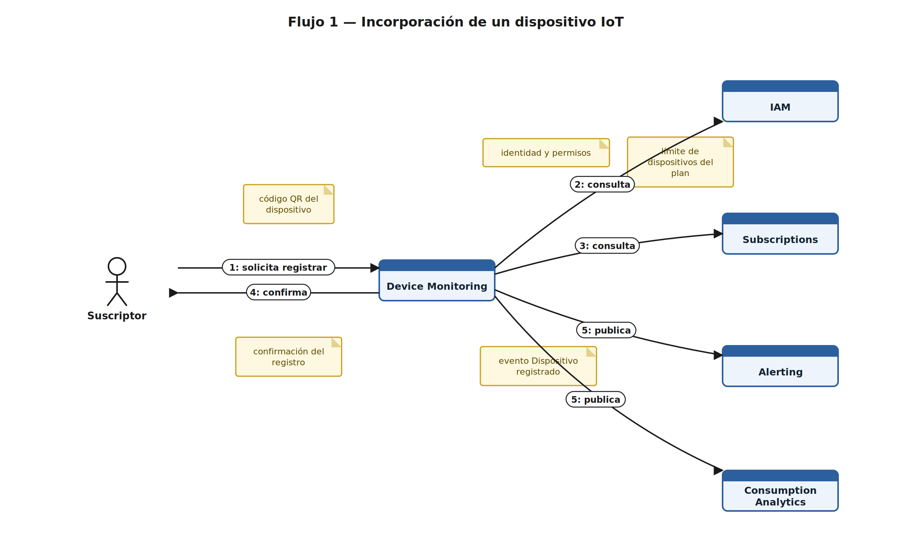

*Escenario:* un suscriptor con plan activo incorpora un nuevo sensor en su local.

| # | Emisor | Mensaje | Receptor |
|---:|---|---|---|
| 1 | Suscriptor | Solicita registrar un dispositivo escaneando su código QR | Device Monitoring |
| 2 | Device Monitoring | Consulta la identidad y los permisos del solicitante | IAM |
| 3 | Device Monitoring | Consulta el límite de dispositivos del plan vigente | Subscriptions |
| 4 | Device Monitoring | Confirma el registro del dispositivo y su Water Point | Suscriptor |
| 5 | Device Monitoring | Publica el evento *Dispositivo registrado* | Alerting / Consumption Analytics |

**Flujo 2: Detección de una fuga y notificación al suscriptor**

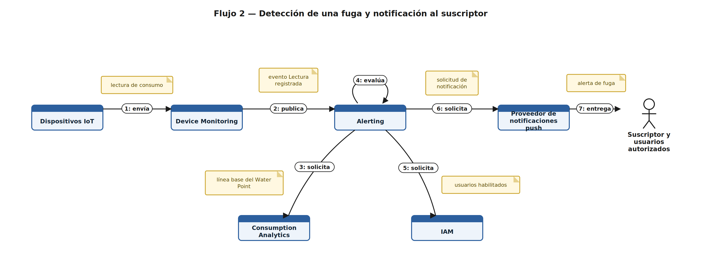

*Escenario:* un dispositivo reporta consumo sostenido por encima de lo habitual.

| # | Emisor | Mensaje | Receptor |
|---:|---|---|---|
| 1 | Dispositivo IoT | Envía una lectura de consumo | Device Monitoring |
| 2 | Device Monitoring | Publica el evento *Lectura registrada* | Alerting |
| 3 | Alerting | Solicita la línea base del Water Point | Consumption Analytics |
| 4 | Alerting | Evalúa la lectura contra el umbral vigente | Alerting |
| 5 | Alerting | Solicita los usuarios habilitados de la cuenta | IAM |
| 6 | Alerting | Solicita el envío de la notificación | Proveedor externo de notificaciones push |
| 7 | Proveedor externo | Entrega la notificación | Suscriptor y usuarios autorizados |

**Flujo 3: Atención de una incidencia derivada de una alerta**

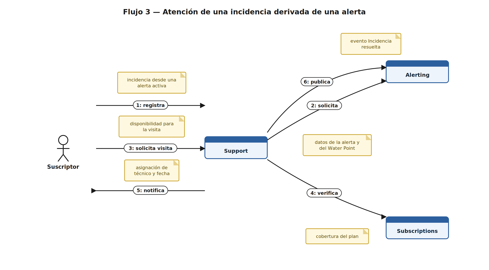

*Escenario:* el suscriptor confirma la fuga y solicita apoyo técnico.

| # | Emisor | Mensaje | Receptor |
|---:|---|---|---|
| 1 | Suscriptor | Registra una incidencia a partir de una alerta activa | Support |
| 2 | Support | Solicita los datos de la alerta y del Water Point afectado | Alerting |
| 3 | Suscriptor | Solicita una visita técnica indicando su disponibilidad | Support |
| 4 | Support | Verifica que el plan vigente contemple el servicio de visita | Subscriptions |
| 5 | Support | Notifica la asignación del técnico y la fecha programada | Suscriptor |
| 6 | Support | Publica el evento *Incidencia resuelta* | Alerting |

**Flujo 4: Consulta del reporte de consumo del periodo**

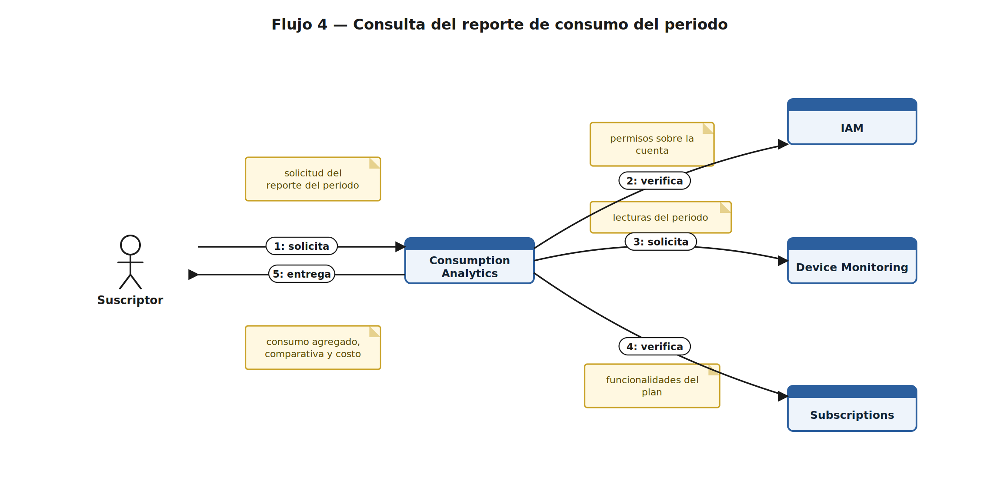

*Escenario:* el suscriptor revisa cuánto ha consumido y cuánto le costará.

| # | Emisor | Mensaje | Receptor |
|---:|---|---|---|
| 1 | Suscriptor | Solicita el reporte del periodo actual | Consumption Analytics |
| 2 | Consumption Analytics | Verifica los permisos del solicitante sobre la cuenta | IAM |
| 3 | Consumption Analytics | Solicita las lecturas del periodo por Water Point | Device Monitoring |
| 4 | Consumption Analytics | Verifica las funcionalidades habilitadas por el plan | Subscriptions |
| 5 | Consumption Analytics | Entrega el consumo agregado, la comparativa y el costo estimado | Suscriptor |

#### 2.5.1.3. Bounded Context Canvases

Para cada bounded context identificado el equipo elaboró su Bounded Context Canvas siguiendo un proceso iterativo con los pasos de Context Overview Definition, Business Rules Distillation & Ubiquitous Language Capture, Capability Analysis, Dependencies Capture y Design Critique. Los canvases se presentan en orden de importancia para el negocio.


**Canvas 1: Alerting**

| Elemento | Contenido |
|---|---|
| **Name** | Alerting |
| **Purpose** | Detectar situaciones de consumo que requieren la atención del suscriptor y comunicárselas de forma accionable y oportuna. |
| **Strategic Classification** | Core Domain · Modelo de negocio: diferenciador · Evolución: custom built |
| **Domain Roles** | Analysis context · Gateway context (hacia el proveedor de notificaciones) |
| **Ubiquitous Language** | Leak Alert · Anomalous Consumption · Consumption Threshold · Urgency Level · Push Notification · Alert State |
| **Business Rules** | Una alerta se genera solo ante consumo anómalo sostenido durante el periodo definido, no ante lecturas aisladas. · Si el suscriptor no definió un umbral propio, se aplica el umbral derivado de la Consumption Baseline. · Una anomalía nueva sobre un Water Point con alerta activa actualiza la alerta existente en lugar de generar una nueva. · Los niveles de urgencia son informativo, moderado y crítico. · Una alerta atendida que reaparece genera una nueva alerta referenciando la anterior. |
| **Inbound Communication** | Device Monitoring (evento *Lectura registrada*) · Suscriptor vía Mobile App (configuración de umbrales, cierre de alertas) · Support (evento *Incidencia resuelta*) |
| **Outbound Communication** | Proveedor externo de notificaciones push · Support (datos de la alerta al registrar una incidencia) · Consumption Analytics (consulta de línea base) |
| **Assumptions** | La frecuencia de lecturas de los dispositivos permite distinguir una fuga de una variación puntual de uso. · Los tokens de dispositivo se mantienen vigentes salvo notificación de fallo del proveedor. |
| **Open Questions** | ¿Qué periodo de sostenimiento distingue una fuga real de un uso intensivo legítimo en cada segmento? ¿Debe el sistema proponer el corte automático del suministro o limitarse a recomendar la acción? |

**Canvas 2: Consumption Analytics**

| Elemento | Contenido |
|---|---|
| **Name** | Consumption Analytics |
| **Purpose** | Convertir el histórico de lecturas en información que el suscriptor pueda interpretar y relacionar con una decisión de gasto o de mantenimiento. |
| **Strategic Classification** | Core Domain · Modelo de negocio: diferenciador · Evolución: custom built |
| **Domain Roles** | Analysis context |
| **Ubiquitous Language** | Consumption Report · Consumption Baseline · Water Cost · Replenishment Prediction · Sustainability Goal · Water Waste |
| **Business Rules** | El costo estimado se calcula con la tarifa vigente de la categoría de servicio del suscriptor y se presenta siempre como referencial. · La comparación entre periodos requiere al menos dos periodos con lecturas registradas. · La predicción de reabastecimiento requiere histórico suficiente; en caso contrario no se presenta. · El consumo se diferencia entre dentro y fuera del horario de actividad cuando el local tiene horario definido. |
| **Inbound Communication** | Device Monitoring (lecturas por Water Point) · Suscriptor vía Mobile App (consulta de reportes, definición de metas) · Alerting (consulta de línea base) |
| **Outbound Communication** | Mobile App (reportes y recomendaciones) · Alerting (línea base de consumo) |
| **Assumptions** | El suscriptor comprende mejor su consumo expresado en soles que en metros cúbicos. · Las tarifas del prestador de servicio se mantienen estables dentro de un periodo. |
| **Open Questions** | ¿Con cuántos periodos de histórico la línea base resulta confiable? ¿Cómo se maneja el cambio de tarifa a mitad de un periodo? |

**Canvas 3: Device Monitoring**

| Elemento | Contenido |
|---|---|
| **Name** | Device Monitoring |
| **Purpose** | Administrar el ciclo de vida de los dispositivos IoT y de los puntos de agua, y garantizar la captación confiable de las lecturas de consumo. |
| **Strategic Classification** | Supporting Domain · Evolución: custom built sobre componentes estándar |
| **Domain Roles** | Execution context · Gateway context (hacia los dispositivos IoT) |
| **Ubiquitous Language** | IoT Device · Water Point · Water Tank · Consumption Reading · Device Registration · Device Status |
| **Business Rules** | Un dispositivo IoT se asocia a un único Water Point a la vez. · Un dispositivo no puede vincularse a más de una cuenta. · Un dispositivo que no reporta lecturas durante el periodo límite se marca como desconectado. · La cantidad de dispositivos registrables está determinada por el plan vigente. |
| **Inbound Communication** | Dispositivos IoT (lecturas) · Suscriptor vía Mobile App (registro y asignación) · Subscriptions (límite de dispositivos del plan) |
| **Outbound Communication** | Alerting (evento *Lectura registrada*) · Consumption Analytics (lecturas del periodo) · IAM (verificación de permisos) |
| **Assumptions** | Los dispositivos cuentan con conectividad estable en los locales de los suscriptores. · Cada dispositivo porta un identificador único legible por código QR. |
| **Open Questions** | ¿Cuál es el periodo límite de silencio para declarar desconectado un dispositivo? ¿Cómo se tratan las lecturas que llegan fuera de orden temporal? |

**Canvas 4: Subscriptions**

| Elemento | Contenido |
|---|---|
| **Name** | Subscriptions |
| **Purpose** | Administrar los planes, la contratación y el ciclo de vida de la suscripción, determinando las funcionalidades habilitadas para cada suscriptor. |
| **Strategic Classification** | Supporting Domain · Evolución: custom built con integración a proveedor de pagos |
| **Domain Roles** | Execution context · Gateway context (hacia la pasarela de pagos) |
| **Ubiquitous Language** | Subscription Plan · Subscriber · Trial Period · Payment · Plan Entitlement |
| **Business Rules** | Los planes disponibles son Plan Básico y Plan Gestión Pro. · El periodo de prueba se otorga una única vez por suscriptor. · Un cambio de plan se aplica a partir del siguiente periodo de facturación. · Una cancelación mantiene el acceso hasta el término del periodo pagado y no genera nuevos cobros. · Concluido el periodo de prueba sin contratación, las funcionalidades pagadas quedan restringidas. |
| **Inbound Communication** | Suscriptor vía Mobile App (contratación, cambio, cancelación) · Pasarela de pagos (confirmación de transacciones) |
| **Outbound Communication** | Device Monitoring, Alerting, Consumption Analytics y Support (funcionalidades y límites habilitados) |
| **Assumptions** | La pasarela de pagos seleccionada opera con los medios de pago habituales en el mercado peruano. |
| **Open Questions** | ¿El plan se contrata por cuenta o por local? ¿Qué ocurre con los dispositivos excedentes cuando un suscriptor cambia a un plan menor? |

**Canvas 5: IAM**

| Elemento | Contenido |
|---|---|
| **Name** | IAM (Identity and Access Management) |
| **Purpose** | Gestionar la identidad de los suscriptores y el acceso compartido a una misma cuenta con permisos diferenciados. |
| **Strategic Classification** | Generic Subdomain · Evolución: producto estándar adaptado |
| **Domain Roles** | Execution context |
| **Ubiquitous Language** | Subscriber · Account · Authorized User · Permission Level · Access Token |
| **Business Rules** | El correo de un suscriptor es único en el sistema. · Un usuario invitado con permiso de consulta no modifica la configuración de dispositivos. · El enlace de restablecimiento de contraseña tiene vigencia limitada y un solo uso. · La cantidad de usuarios adicionales permitidos está determinada por el plan vigente. |
| **Inbound Communication** | Suscriptor y usuarios autorizados vía Mobile App · Subscriptions (límite de usuarios del plan) |
| **Outbound Communication** | Device Monitoring, Consumption Analytics, Alerting y Support (identidad y permisos del solicitante) |
| **Assumptions** | La autenticación basada en token resulta suficiente para el nivel de sensibilidad de la información gestionada. |
| **Open Questions** | ¿Se requerirán niveles de permiso adicionales entre consulta y administración total? |

**Canvas 6: Support**

| Elemento | Contenido |
|---|---|
| **Name** | Support |
| **Purpose** | Gestionar el ciclo de atención de las incidencias reportadas por el suscriptor y la coordinación de las visitas técnicas. |
| **Strategic Classification** | Supporting Domain · Evolución: custom built |
| **Domain Roles** | Execution context |
| **Ubiquitous Language** | Incident · Technical Visit · Incident State · Technician · Resolution |
| **Business Rules** | Los estados de una incidencia son pendiente, visita solicitada, en atención y resuelta. · Una incidencia puede originarse de forma autónoma o a partir de una alerta activa. · La solicitud de visita técnica requiere una incidencia en estado pendiente. · La cobertura del servicio de visita técnica está determinada por el plan vigente. |
| **Inbound Communication** | Suscriptor vía Mobile App (registro y seguimiento) · Alerting (datos de la alerta de origen) · Subscriptions (cobertura del plan) |
| **Outbound Communication** | Alerting (evento *Incidencia resuelta*) · Suscriptor (notificación de asignación de técnico) |
| **Assumptions** | El equipo de soporte dispone de técnicos asignables en las zonas donde opera el servicio. |
| **Open Questions** | ¿La asignación del técnico se realiza dentro del sistema o mediante un proceso externo en esta etapa del proyecto? |

---

### 2.5.2. Context Mapping

Con los bounded contexts diseñados, el equipo elaboró el Context Map que visualiza las relaciones estructurales entre ellos. El proceso consistió en revisar cada dependencia identificada en los Domain Message Flows y discutir alternativas de diseño mediante preguntas del tipo "¿qué ocurriría si movemos esta capability a otro bounded context?" o "¿qué ocurriría si duplicamos esta funcionalidad para romper la dependencia?".

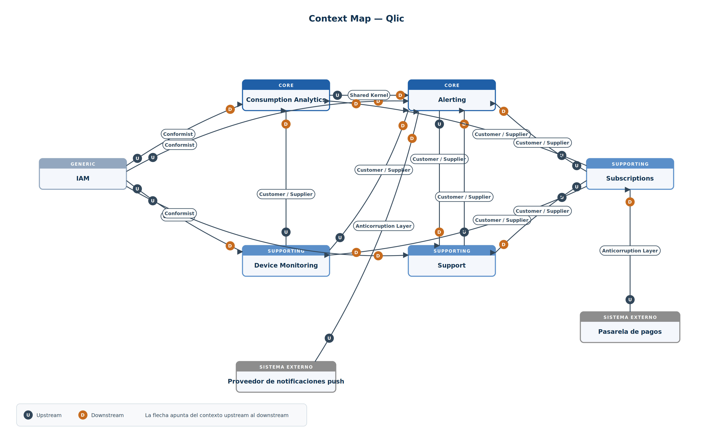

**Alternativas evaluadas y decisiones**

| Pregunta de diseño | Alternativa evaluada | Decisión adoptada |
|---|---|---|
| ¿Qué ocurriría si el cálculo de la línea base se traslada a Alerting? | Alerting dejaría de depender de Consumption Analytics y ganaría autonomía en la evaluación. | Se descartó: duplicaría la lógica de agregación histórica en dos contextos y generaría dos versiones de la misma verdad sobre el consumo del suscriptor. |
| ¿Qué ocurriría si Support se integra dentro de Alerting? | Se reduciría el número de contextos y la coordinación entre ambos. | Se descartó: el ciclo de atención de una incidencia involucra un actor y estados ajenos al modelo de alertas, y forzaría a un mismo agregado a servir dos ciclos de vida distintos. |
| ¿Qué ocurriría si creamos un shared service de permisos consumido directamente por todos los contextos? | Se evitaría replicar la verificación de acceso en cada contexto. | Se adoptó parcialmente: IAM actúa como upstream único de identidad y permisos, y los contextos downstream se conforman a su modelo sin traducirlo. |
| ¿Qué ocurriría si cada contexto consulta directamente a la pasarela de pagos y al proveedor de notificaciones? | Se eliminarían intermediarios en la comunicación con terceros. | Se descartó: expondría el modelo interno a cambios de proveedores externos; se mantiene una Anticorruption Layer en Subscriptions y en Alerting respectivamente. |

**Relaciones del Context Map**

| Upstream | Downstream | Patrón DDD | Sustento |
|---|---|---|---|
| IAM | Device Monitoring, Alerting, Consumption Analytics, Support | Conformist | El modelo de identidad y permisos es genérico y estable; los contextos downstream lo consumen tal como está, sin traducción, porque no obtienen valor de un modelo propio de identidad. |
| Device Monitoring | Alerting | Customer/Supplier | Alerting depende de las lecturas para cumplir su propósito y participa en la definición del contrato del evento *Lectura registrada*, que Device Monitoring se compromete a mantener. |
| Device Monitoring | Consumption Analytics | Customer/Supplier | Consumption Analytics consume las lecturas para la agregación histórica y negocia con Device Monitoring el nivel de detalle requerido. |
| Consumption Analytics | Alerting | Shared Kernel | Ambos contextos comparten el concepto de Consumption Baseline y su definición. Al ser dos contextos core con evolución acoplada, el equipo mantiene ese subconjunto del modelo de forma compartida y con cambios coordinados. |
| Subscriptions | Device Monitoring, Alerting, Consumption Analytics, Support | Customer/Supplier | Los contextos downstream consultan las funcionalidades y límites habilitados por el plan; Subscriptions publica un contrato explícito de entitlements. |
| Alerting | Support | Customer/Supplier | Support requiere los datos de la alerta que origina una incidencia y acuerda con Alerting el contrato de esa consulta. |
| Support | Alerting | Customer/Supplier | Alerting consume el evento *Incidencia resuelta* para cerrar el seguimiento de la alerta asociada. |
| Proveedor externo de notificaciones push | Alerting | Anticorruption Layer | El modelo del proveedor externo no debe filtrarse al dominio; Alerting traduce sus conceptos de envío y de token de dispositivo a su propio lenguaje, permitiendo sustituir al proveedor sin afectar el dominio. |
| Pasarela de pagos | Subscriptions | Anticorruption Layer | Subscriptions traduce el modelo de transacciones del proveedor a sus propios conceptos de Payment y Subscription, aislando el dominio de cambios en el servicio de terceros. |

---

### 2.5.3. Software Architecture

En esta sección el equipo presenta la representación de la arquitectura de software de la solución Qlic aplicando C4 Model. Se incluyen los diagramas de nivel Context, Container y Deployment, elaborados en Structurizr mediante Structurizr DSL. Los diagramas abarcan la totalidad de los productos que forman parte del alcance: el sitio web estático que presenta el modelo de negocio, las aplicaciones móviles nativa y multiplataforma, y los servicios RESTful de desarrollo interno.

#### 2.5.3.1. Software Architecture Context Level Diagrams

El Context Diagram presenta al sistema Qlic como una unidad, rodeado por los actores que interactúan con él y por los sistemas externos de los que depende. Su propósito es delimitar el alcance de la solución y hacer explícitas sus fronteras, sin entrar en decisiones de tecnología.

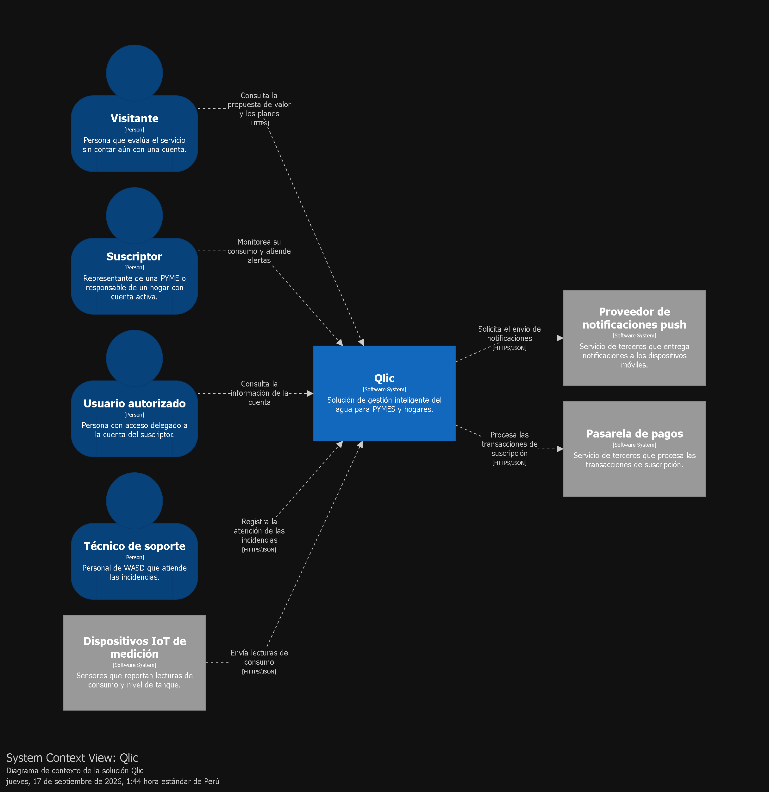

**Actores**

| Actor | Descripción | Interacción con Qlic |
|---|---|---|
| Visitante | Persona que evalúa el servicio sin contar aún con una cuenta. | Consulta el Landing Page para conocer la propuesta de valor y los planes. |
| Suscriptor | Representante de una PYME o responsable de un hogar con una cuenta activa. | Registra dispositivos, consulta su consumo, recibe alertas y gestiona su suscripción desde la aplicación móvil. |
| Usuario autorizado | Persona a la que el suscriptor titular otorgó acceso a su cuenta. | Consulta la información de consumo y recibe alertas según el permiso asignado. |
| Técnico de soporte | Personal de WASD que atiende las incidencias reportadas. | Recibe la asignación de visitas técnicas y registra su resolución. |

**Sistemas externos**

| Sistema externo | Propósito |
|---|---|
| Dispositivos IoT de medición | Sensores instalados en los Water Points que reportan periódicamente las lecturas de consumo y el nivel de los tanques. |
| Proveedor de notificaciones push | Servicio de terceros encargado de entregar las notificaciones en los dispositivos móviles de los suscriptores. |
| Pasarela de pagos | Servicio de terceros que procesa las transacciones asociadas a la contratación y renovación de los planes. |

**Explicación del diagrama.** El sistema Qlic se ubica al centro como única unidad de software desde la perspectiva de sus usuarios. Los dispositivos IoT actúan como fuente de información hacia el sistema, mientras que el proveedor de notificaciones y la pasarela de pagos actúan como servicios consumidos por este. La relación con el proveedor de notificaciones es la que materializa el valor central de la propuesta: sin ella, la detección de una anomalía no llegaría a convertirse en una acción del suscriptor. Las relaciones con ambos servicios externos se implementan mediante una Anticorruption Layer, conforme a lo establecido en el Context Mapping de la sección 2.5.2.

#### 2.5.3.2. Software Architecture Container Level Diagrams

El Container Diagram descompone el sistema Qlic en sus unidades desplegables, identificando las responsabilidades de cada una, las decisiones de tecnología adoptadas y los protocolos mediante los que se comunican entre sí.

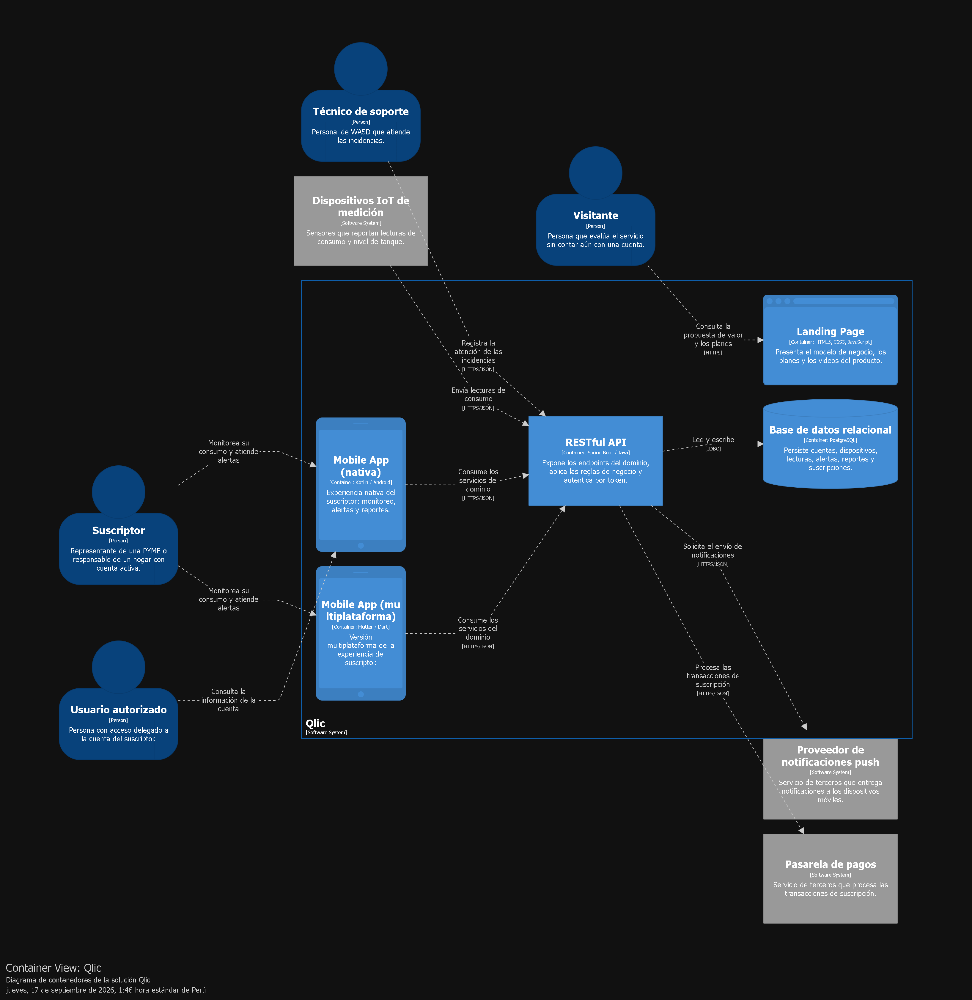

| Container | Tecnología | Responsabilidad |
|---|---|---|
| Landing Page | HTML5, CSS3 y JavaScript (sitio estático) | Presenta el modelo de negocio, la propuesta de valor, los planes y los videos About-the-Product y About-the-Team; incluye el llamado a la acción hacia la descarga de la aplicación. |
| Mobile App (nativa) | Kotlin sobre Android | Experiencia nativa del suscriptor: panel de monitoreo, registro de dispositivos por QR, alertas, reportes y gestión de la suscripción. |
| Mobile App (multiplataforma) | Flutter con Dart | Versión multiplataforma de la experiencia del suscriptor, que consume los mismos servicios RESTful. |
| RESTful API | Spring Boot con Java | Expone los endpoints de todos los bounded contexts, aplica las reglas de negocio, autentica mediante token y coordina la integración con los servicios externos. |
| Base de datos relacional | PostgreSQL | Persiste cuentas, dispositivos, Water Points, lecturas, alertas, reportes, suscripciones e incidencias. |
| Almacenamiento local del dispositivo | Almacenamiento nativo de la plataforma móvil | Conserva la última información sincronizada para permitir la consulta del panel de monitoreo sin conexión. |

**Comunicaciones entre containers**

| Origen | Destino | Protocolo / Descripción |
|---|---|---|
| Mobile App (nativa) | RESTful API | HTTPS/JSON con token de acceso en el encabezado de autorización. |
| Mobile App (multiplataforma) | RESTful API | HTTPS/JSON con token de acceso en el encabezado de autorización. |
| Dispositivos IoT | RESTful API | HTTPS/JSON hacia el endpoint de ingesta de lecturas. |
| RESTful API | Base de datos relacional | JDBC sobre conexión cifrada. |
| RESTful API | Proveedor de notificaciones push | HTTPS/JSON a través de la Anticorruption Layer del contexto Alerting. |
| RESTful API | Pasarela de pagos | HTTPS/JSON a través de la Anticorruption Layer del contexto Subscriptions. |
| Mobile App | Almacenamiento local | API de almacenamiento de la plataforma. |
| Landing Page | Visitante | HTTPS, contenido estático servido desde el proveedor de hosting. |

**Explicación del diagrama.** La arquitectura concentra las reglas de negocio en el RESTful API, de modo que las dos aplicaciones móviles comparten exactamente el mismo comportamiento de dominio y difieren únicamente en su capa de presentación. Esta decisión responde a la exigencia de construir una experiencia nativa y una multiplataforma sin duplicar la lógica del dominio. El Landing Page se mantiene como un container independiente y sin dependencia del API, dado que su función es informativa y no requiere autenticación. El almacenamiento local en el dispositivo se representa explícitamente porque sostiene el requisito de consulta sin conexión establecido en US14.

#### 2.5.3.3. Software Architecture Deployment Diagrams

El Deployment Diagram muestra cómo los containers descritos se distribuyen sobre la infraestructura que los ejecuta, identificando los nodos, los entornos y las relaciones entre ellos.

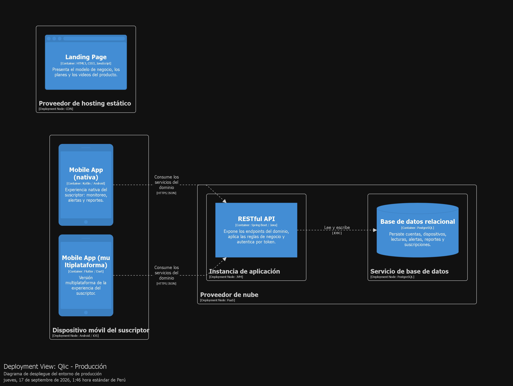

| Nodo de despliegue | Entorno | Containers alojados |
|---|---|---|
| Dispositivo móvil del suscriptor | Android | Mobile App (nativa) y almacenamiento local |
| Dispositivo móvil del suscriptor | Android / iOS | Mobile App (multiplataforma) y almacenamiento local |
| Proveedor de hosting estático | Producción | Landing Page |
| Proveedor de nube (instancia de aplicación) | Producción | RESTful API |
| Proveedor de nube (servicio de base de datos) | Producción | Base de datos relacional |
| Infraestructura del suscriptor | Local u hogar | Dispositivos IoT instalados en los Water Points |
| Infraestructura de terceros | Producción | Proveedor de notificaciones push y pasarela de pagos |

**Explicación del diagrama.** El despliegue distingue tres ámbitos de responsabilidad: la infraestructura del suscriptor, donde residen los sensores; la infraestructura gestionada por WASD en el proveedor de nube, donde se ejecutan el API y la base de datos; y la infraestructura de terceros, sobre la que el equipo no tiene control y cuya sustitución se previó mediante las Anticorruption Layers definidas en el diseño estratégico. Las aplicaciones móviles se distribuyen mediante Firebase App Distribution durante la etapa de validación, conforme a lo establecido para el alcance del proyecto.

**Structurizr DSL de referencia**

El siguiente workspace genera los tres diagramas presentados en esta sección:

```
workspace "Qlic" "Gestión inteligente del agua con IoT" {

    model {
        visitante = person "Visitante" "Persona que evalúa el servicio sin contar aún con una cuenta."
        suscriptor = person "Suscriptor" "Representante de una PYME o responsable de un hogar con cuenta activa."
        usuarioAutorizado = person "Usuario autorizado" "Persona con acceso delegado a la cuenta del suscriptor."
        tecnico = person "Técnico de soporte" "Personal de WASD que atiende las incidencias."

        dispositivosIoT = softwareSystem "Dispositivos IoT de medición" "Sensores que reportan lecturas de consumo y nivel de tanque." "External"
        proveedorPush = softwareSystem "Proveedor de notificaciones push" "Servicio de terceros que entrega notificaciones a los dispositivos móviles." "External"
        pasarelaPagos = softwareSystem "Pasarela de pagos" "Servicio de terceros que procesa las transacciones de suscripción." "External"

        qlic = softwareSystem "Qlic" "Solución de gestión inteligente del agua para PYMES y hogares." {
            landing = container "Landing Page" "Presenta el modelo de negocio y los planes." "HTML5, CSS3, JavaScript"
            appNativa = container "Mobile App (nativa)" "Experiencia nativa del suscriptor." "Kotlin / Android"
            appMultiplataforma = container "Mobile App (multiplataforma)" "Versión multiplataforma de la experiencia del suscriptor." "Flutter / Dart"
            api = container "RESTful API" "Expone los endpoints del dominio y aplica las reglas de negocio." "Spring Boot / Java"
            db = container "Base de datos relacional" "Persiste cuentas, dispositivos, lecturas, alertas y suscripciones." "PostgreSQL" "Database"
        }

        visitante -> landing "Consulta la propuesta de valor y los planes" "HTTPS"
        suscriptor -> appNativa "Monitorea su consumo y atiende alertas"
        suscriptor -> appMultiplataforma "Monitorea su consumo y atiende alertas"
        usuarioAutorizado -> appNativa "Consulta la información de la cuenta"
        tecnico -> api "Registra la atención de las incidencias" "HTTPS/JSON"

        appNativa -> api "Consume los servicios del dominio" "HTTPS/JSON"
        appMultiplataforma -> api "Consume los servicios del dominio" "HTTPS/JSON"
        dispositivosIoT -> api "Envía lecturas de consumo" "HTTPS/JSON"
        api -> db "Lee y escribe" "JDBC"
        api -> proveedorPush "Solicita el envío de notificaciones" "HTTPS/JSON"
        api -> pasarelaPagos "Procesa las transacciones de suscripción" "HTTPS/JSON"

        produccion = deploymentEnvironment "Producción" {
            deploymentNode "Dispositivo móvil del suscriptor" "" "Android / iOS" {
                containerInstance appNativa
                containerInstance appMultiplataforma
            }
            deploymentNode "Proveedor de hosting estático" "" "CDN" {
                containerInstance landing
            }
            deploymentNode "Proveedor de nube" "" "PaaS" {
                deploymentNode "Instancia de aplicación" "" "JVM" {
                    containerInstance api
                }
                deploymentNode "Servicio de base de datos" "" "PostgreSQL" {
                    containerInstance db
                }
            }
        }
    }

    views {
        systemContext qlic "Context" {
            include *
            autolayout lr
        }
        container qlic "Container" {
            include *
            autolayout lr
        }
        deployment qlic produccion "Deployment" {
            include *
            autolayout lr
        }
        theme default
    }
}
```

## 2.6. Tactical-Level Domain-Driven Design

En esta sección el equipo presenta la perspectiva táctica del diseño de la solución Qlic. Para cada uno de los seis bounded contexts identificados en la sección 2.5 se detallan las clases que conforman sus cuatro capas, a manera de diccionario, explicando el propósito de cada una junto con sus atributos, métodos y relaciones. Se incluye además, por cada bounded context, el Component Diagram de C4 Model correspondiente a su container, el Class Diagram de UML del Domain Layer y el Database Diagram con los objetos de persistencia asociados.

Los bounded contexts se presentan en el mismo orden de importancia adoptado en la sección 2.5.1.3, iniciando por los dos contextos core de la solución.

Todos los contextos comparten la organización en cuatro capas y las siguientes convenciones de nomenclatura, aplicadas en inglés conforme a lo establecido para el proyecto:

| Capa | Sufijos y convenciones |
|---|---|
| Domain Layer | Entidades y Aggregates sin sufijo · Value Objects sin sufijo · Servicios de dominio con sufijo `Service` · Repositorios como interfaces con sufijo `Repository` · Eventos de dominio en pasado con sufijo `Event` |
| Interface Layer | Controladores con sufijo `Controller` · Recursos de entrada y salida con sufijo `Resource` · Consumidores de eventos con sufijo `Consumer` |
| Application Layer | Comandos con sufijo `Command` · Consultas con sufijo `Query` · Manejadores con sufijo `CommandHandler`, `QueryHandler` o `EventHandler` |
| Infrastructure Layer | Implementaciones de repositorio con sufijo `RepositoryImpl` · Adaptadores a servicios externos con sufijo `Adapter` · Entidades de persistencia con sufijo `Entity` cuando difieren del modelo de dominio |

---

### 2.6.1. Bounded Context: Alerting

Alerting constituye el núcleo diferenciador de la solución. Su responsabilidad es evaluar las lecturas de consumo frente a los umbrales vigentes, determinar cuándo una desviación configura una situación que requiere la atención del suscriptor, y comunicarla de forma accionable. El modelo gira en torno al agregado `LeakAlert`, que concentra el ciclo de vida de una alerta desde su generación hasta su atención.

#### 2.6.1.1. Domain Layer

| Clase | Categoría | Propósito |
|---|---|---|
| `LeakAlert` | Aggregate Root | Representa una situación de consumo anómalo detectada sobre un Water Point, con su ciclo de vida completo desde la generación hasta la atención. |
| `AlertState` | Value Object (enum) | Expresa el estado de una alerta: `ACTIVE`, `ACKNOWLEDGED`, `RESOLVED`. |
| `UrgencyLevel` | Value Object (enum) | Expresa la gravedad de la desviación detectada: `INFORMATIONAL`, `MODERATE`, `CRITICAL`. |
| `ConsumptionThreshold` | Entity | Umbral de consumo aplicable a un Water Point para un periodo, definido por el suscriptor o derivado de la línea base. |
| `ThresholdSource` | Value Object (enum) | Indica el origen del umbral vigente: `USER_DEFINED`, `SYSTEM_CALCULATED`. |
| `AnomalyEvaluation` | Value Object | Resultado de evaluar una lectura contra el umbral: incluye la desviación, su duración acumulada y el nivel de urgencia resultante. |
| `EstimatedImpact` | Value Object | Volumen y costo estimado acumulado por la anomalía desde su detección. |
| `AlertRecipient` | Value Object | Destinatario de una notificación, compuesto por el identificador del usuario y su token de dispositivo. |
| `NotificationPreference` | Entity | Preferencia del suscriptor sobre el nivel mínimo de urgencia a notificar y la ventana de agrupación de alertas. |
| `AnomalyDetectionService` | Domain Service | Determina si una lectura configura consumo anómalo sostenido, aplicando las reglas de duración mínima y de desviación respecto del umbral. |
| `UrgencyClassificationService` | Domain Service | Asigna el nivel de urgencia a partir de la magnitud de la desviación respecto de la línea base. |
| `AlertDeduplicationService` | Domain Service | Determina si una nueva anomalía actualiza una alerta activa existente o genera una nueva. |
| `LeakAlertRepository` | Repository (interfaz) | Abstracción de persistencia y recuperación de alertas. |
| `ConsumptionThresholdRepository` | Repository (interfaz) | Abstracción de persistencia y recuperación de umbrales. |
| `NotificationGateway` | Interface | Abstracción del envío de notificaciones push, implementada en la capa de infraestructura. |
| `ConsumptionBaselineProvider` | Interface | Abstracción de la consulta de la línea base de consumo, provista por Consumption Analytics mediante el Shared Kernel. |
| `LeakAlertGeneratedEvent` | Domain Event | Se publica al generarse una nueva alerta de fuga. |
| `AlertAcknowledgedEvent` | Domain Event | Se publica cuando el suscriptor marca una alerta como atendida. |

**Detalle del agregado `LeakAlert`**

| Miembro | Tipo | Scope | Descripción |
|---|---|---|---|
| `id` | `AlertId` | private | Identificador único de la alerta. |
| `accountId` | `AccountId` | private | Cuenta a la que pertenece la alerta. |
| `waterPointId` | `WaterPointId` | private | Water Point sobre el que se detectó la anomalía. |
| `state` | `AlertState` | private | Estado actual de la alerta. |
| `urgency` | `UrgencyLevel` | private | Nivel de urgencia asignado. |
| `detectedAt` | `DateTime` | private | Momento de la detección inicial. |
| `estimatedImpact` | `EstimatedImpact` | private | Volumen y costo estimado acumulado. |
| `previousAlertId` | `AlertId` | private | Alerta anterior referenciada cuando la anomalía reaparece. |
| `acknowledge(action)` | `void` | public | Marca la alerta como atendida y registra la acción realizada. |
| `escalate(evaluation)` | `void` | public | Actualiza la urgencia y el impacto estimado ante el sostenimiento de la anomalía. |
| `isActive()` | `boolean` | public | Indica si la alerta se encuentra en estado activo. |
| `linkTo(previousAlert)` | `void` | public | Asocia la alerta a una alerta previa atendida cuya anomalía reapareció. |

**Reglas de negocio implementadas en el dominio**

- Una alerta se genera únicamente cuando la desviación se sostiene durante el periodo mínimo definido; las lecturas aisladas no la producen.
- Ante ausencia de umbral definido por el suscriptor, `ConsumptionThreshold` se construye a partir de la línea base provista por `ConsumptionBaselineProvider`.
- Una anomalía sobre un Water Point con alerta activa invoca `escalate` en lugar de crear una nueva instancia.
- Una alerta en estado `ACKNOWLEDGED` cuya anomalía reaparece genera una nueva instancia enlazada mediante `linkTo`.

#### 2.6.1.2. Interface Layer

| Clase | Categoría | Propósito |
|---|---|---|
| `LeakAlertController` | Controller | Expone los endpoints de consulta de alertas y actualización de su estado. |
| `ConsumptionThresholdController` | Controller | Expone los endpoints de administración de umbrales de consumo. |
| `NotificationPreferenceController` | Controller | Expone los endpoints de configuración de preferencias de notificación. |
| `ConsumptionReadingConsumer` | Consumer | Recibe el evento `ConsumptionReadingRegisteredEvent` publicado por Device Monitoring y dispara la evaluación de la lectura. |
| `IncidentResolvedConsumer` | Consumer | Recibe el evento `IncidentResolvedEvent` publicado por Support y cierra el seguimiento de la alerta asociada. |
| `LeakAlertResource` | Resource | Representación de salida de una alerta para las aplicaciones móviles. |
| `AcknowledgeAlertResource` | Resource | Representación de entrada para el cierre de una alerta. |
| `ThresholdResource` | Resource | Representación de entrada y salida de un umbral de consumo. |

#### 2.6.1.3. Application Layer

| Clase | Categoría | Propósito |
|---|---|---|
| `EvaluateConsumptionReadingCommand` | Command | Solicita la evaluación de una lectura recién registrada. |
| `EvaluateConsumptionReadingCommandHandler` | Command Handler | Coordina la evaluación: recupera el umbral vigente, invoca `AnomalyDetectionService` y `AlertDeduplicationService`, y persiste o actualiza la alerta resultante. |
| `AcknowledgeAlertCommand` | Command | Solicita marcar una alerta como atendida. |
| `AcknowledgeAlertCommandHandler` | Command Handler | Valida los permisos del solicitante, invoca `acknowledge` sobre el agregado y persiste el cambio. |
| `ConfigureThresholdCommand` | Command | Solicita definir o actualizar el umbral de un Water Point. |
| `ConfigureThresholdCommandHandler` | Command Handler | Valida el valor recibido, registra el umbral con origen `USER_DEFINED` y lo persiste. |
| `GetAlertsByAccountQuery` | Query | Solicita las alertas de una cuenta, con filtros de estado y periodo. |
| `GetAlertsByAccountQueryHandler` | Query Handler | Recupera las alertas verificando que pertenezcan a la cuenta del solicitante. |
| `LeakAlertGeneratedEventHandler` | Event Handler | Reacciona a la generación de una alerta: determina los destinatarios habilitados y solicita el envío de la notificación a través de `NotificationGateway`. |
| `IncidentResolvedEventHandler` | Event Handler | Reacciona a la resolución de una incidencia cerrando la alerta que la originó. |

#### 2.6.1.4. Infrastructure Layer

| Clase | Categoría | Propósito |
|---|---|---|
| `JpaLeakAlertRepositoryImpl` | Repository Impl | Implementa `LeakAlertRepository` mediante Spring Data JPA sobre PostgreSQL. |
| `JpaConsumptionThresholdRepositoryImpl` | Repository Impl | Implementa `ConsumptionThresholdRepository` mediante Spring Data JPA. |
| `PushNotificationAdapter` | Adapter | Implementa `NotificationGateway` traduciendo el modelo de dominio al contrato del proveedor externo de notificaciones push. Constituye la Anticorruption Layer definida en el Context Mapping. |
| `ConsumptionBaselineAdapter` | Adapter | Implementa `ConsumptionBaselineProvider` consultando al contexto Consumption Analytics. |
| `DeviceTokenRegistry` | Infrastructure Service | Administra el registro y la vigencia de los tokens de dispositivo utilizados para las notificaciones. |
| `LeakAlertEntity` | Persistence Entity | Representación de persistencia del agregado `LeakAlert`. |
| `ConsumptionThresholdEntity` | Persistence Entity | Representación de persistencia de un umbral de consumo. |

#### 2.6.1.5. Bounded Context Software Architecture Component Level Diagrams

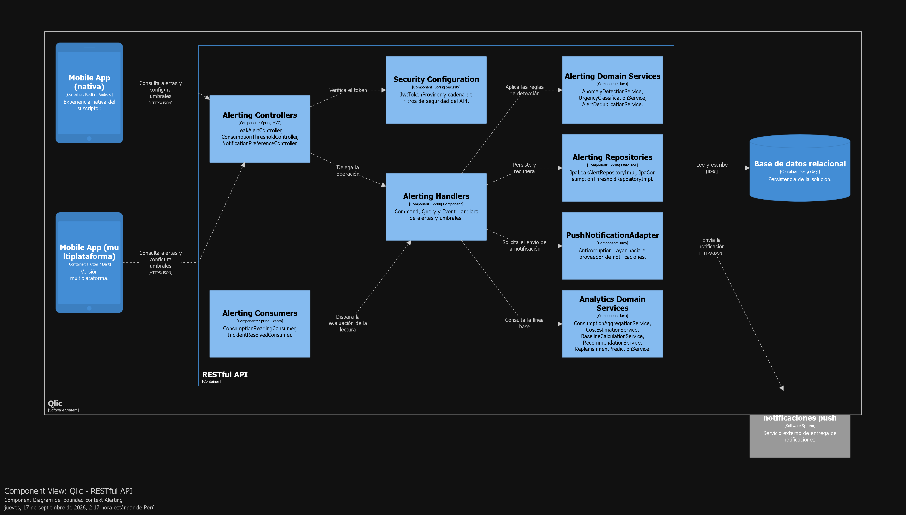

El Component Diagram descompone el container RESTful API en los componentes correspondientes a este bounded context. Los controladores y consumidores de la capa de interfaz reciben las solicitudes y los eventos; los manejadores de la capa de aplicación coordinan el flujo; los servicios de dominio aplican las reglas de detección y clasificación; y los adaptadores de infraestructura resuelven la persistencia y la comunicación con el proveedor externo de notificaciones.

#### 2.6.1.6. Bounded Context Software Architecture Code Level Diagrams

##### 2.6.1.6.1. Bounded Context Domain Layer Class Diagrams

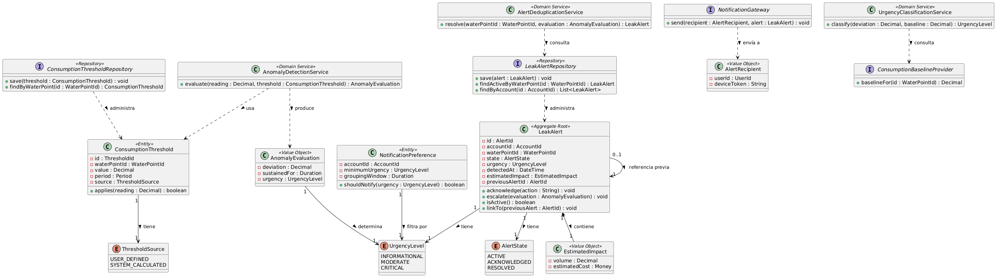

```plantuml
@startuml Alerting Domain Layer

enum AlertState { ACTIVE \n ACKNOWLEDGED \n RESOLVED }
enum UrgencyLevel { INFORMATIONAL \n MODERATE \n CRITICAL }
enum ThresholdSource { USER_DEFINED \n SYSTEM_CALCULATED }

class LeakAlert <<Aggregate Root>> {
  - id : AlertId
  - accountId : AccountId
  - waterPointId : WaterPointId
  - state : AlertState
  - urgency : UrgencyLevel
  - detectedAt : DateTime
  - estimatedImpact : EstimatedImpact
  - previousAlertId : AlertId
  + acknowledge(action : String) : void
  + escalate(evaluation : AnomalyEvaluation) : void
  + isActive() : boolean
  + linkTo(previousAlert : AlertId) : void
}

class ConsumptionThreshold <<Entity>> {
  - id : ThresholdId
  - waterPointId : WaterPointId
  - value : Decimal
  - period : Period
  - source : ThresholdSource
  + applies(reading : Decimal) : boolean
}

class AnomalyEvaluation <<Value Object>> {
  - deviation : Decimal
  - sustainedFor : Duration
  - urgency : UrgencyLevel
}

class EstimatedImpact <<Value Object>> {
  - volume : Decimal
  - estimatedCost : Money
}

class AlertRecipient <<Value Object>> {
  - userId : UserId
  - deviceToken : String
}

class NotificationPreference <<Entity>> {
  - accountId : AccountId
  - minimumUrgency : UrgencyLevel
  - groupingWindow : Duration
  + shouldNotify(urgency : UrgencyLevel) : boolean
}

class AnomalyDetectionService <<Domain Service>> {
  + evaluate(reading : Decimal, threshold : ConsumptionThreshold) : AnomalyEvaluation
}

class UrgencyClassificationService <<Domain Service>> {
  + classify(deviation : Decimal, baseline : Decimal) : UrgencyLevel
}

class AlertDeduplicationService <<Domain Service>> {
  + resolve(waterPointId : WaterPointId, evaluation : AnomalyEvaluation) : LeakAlert
}

interface LeakAlertRepository <<Repository>> {
  + save(alert : LeakAlert) : void
  + findActiveByWaterPoint(id : WaterPointId) : LeakAlert
  + findByAccount(id : AccountId) : List<LeakAlert>
}

interface ConsumptionThresholdRepository <<Repository>> {
  + save(threshold : ConsumptionThreshold) : void
  + findByWaterPoint(id : WaterPointId) : ConsumptionThreshold
}

interface NotificationGateway {
  + send(recipient : AlertRecipient, alert : LeakAlert) : void
}

interface ConsumptionBaselineProvider {
  + baselineFor(id : WaterPointId) : Decimal
}

LeakAlert "1" *-- "1" EstimatedImpact : contiene >
LeakAlert "0..1" --> "1" LeakAlert : referencia previa >
LeakAlert "1" --> "1" AlertState : tiene >
LeakAlert "1" --> "1" UrgencyLevel : tiene >
ConsumptionThreshold "1" --> "1" ThresholdSource : tiene >
AnomalyEvaluation "1" --> "1" UrgencyLevel : determina >
NotificationPreference "1" --> "1" UrgencyLevel : filtra por >
AnomalyDetectionService ..> ConsumptionThreshold : usa >
AnomalyDetectionService ..> AnomalyEvaluation : produce >
UrgencyClassificationService ..> ConsumptionBaselineProvider : consulta >
AlertDeduplicationService ..> LeakAlertRepository : consulta >
LeakAlertRepository ..> LeakAlert : administra >
ConsumptionThresholdRepository ..> ConsumptionThreshold : administra >
NotificationGateway ..> AlertRecipient : envía a >

@enduml
```

##### 2.6.1.6.2. Bounded Context Database Design Diagram

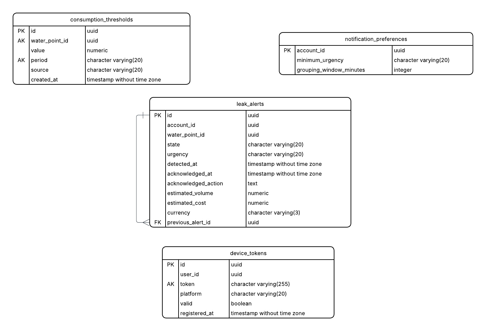

| Tabla | Columnas principales | Constraints |
|---|---|---|
| `leak_alerts` | `id` (PK), `account_id`, `water_point_id`, `state`, `urgency`, `detected_at`, `acknowledged_at`, `acknowledged_action`, `estimated_volume`, `estimated_cost`, `previous_alert_id` | PK sobre `id` · FK `previous_alert_id` referencia `leak_alerts(id)` · índice sobre (`water_point_id`, `state`) para la recuperación de la alerta activa |
| `consumption_thresholds` | `id` (PK), `water_point_id`, `value`, `period`, `source`, `created_at` | PK sobre `id` · restricción de unicidad sobre (`water_point_id`, `period`) |
| `notification_preferences` | `account_id` (PK), `minimum_urgency`, `grouping_window_minutes` | PK sobre `account_id` |
| `device_tokens` | `id` (PK), `user_id`, `token`, `platform`, `valid`, `registered_at` | PK sobre `id` · restricción de unicidad sobre `token` |

---

### 2.6.2. Bounded Context: Consumption Analytics

Consumption Analytics convierte el histórico de lecturas en información interpretable por el suscriptor. Su modelo se organiza alrededor del agregado `ConsumptionReport`, que representa el consumo de una cuenta en un periodo, y de `ConsumptionBaseline`, concepto compartido con Alerting mediante el Shared Kernel definido en el Context Mapping.

#### 2.6.2.1. Domain Layer

| Clase | Categoría | Propósito |
|---|---|---|
| `ConsumptionReport` | Aggregate Root | Consumo de una cuenta en un periodo, con su distribución por Water Point, comparativa y costo estimado. |
| `ConsumptionBaseline` | Entity | Patrón de consumo histórico de un Water Point, empleado como referencia para identificar desviaciones. Forma parte del Shared Kernel con Alerting. |
| `Period` | Value Object | Intervalo temporal sobre el que se agrega el consumo, con su fecha de inicio y de término. |
| `ConsumptionSummary` | Value Object | Volumen consumido en un periodo, desagregado por Water Point. |
| `PeriodComparison` | Value Object | Variación entre dos periodos, expresada en volumen y en porcentaje. |
| `Money` | Value Object | Importe monetario con su moneda, utilizado para el costo estimado. |
| `WaterTariff` | Entity | Tarifa vigente aplicable a una categoría de servicio, empleada para el cálculo del costo estimado. |
| `ActivitySchedule` | Value Object | Horario de actividad declarado para un local, utilizado para diferenciar consumo dentro y fuera de operación. |
| `SavingRecommendation` | Entity | Recomendación generada a partir de los Water Points de mayor consumo del periodo. |
| `SustainabilityGoal` | Entity | Meta de reducción de consumo definida por el suscriptor para un periodo, con su seguimiento. |
| `ReplenishmentPrediction` | Value Object | Fecha estimada en que un Water Tank alcanzará su nivel crítico. |
| `ConsumptionAggregationService` | Domain Service | Agrega las lecturas del periodo por Water Point y por local. |
| `CostEstimationService` | Domain Service | Calcula el costo estimado aplicando la tarifa vigente al volumen consumido. |
| `BaselineCalculationService` | Domain Service | Calcula y actualiza la línea base de consumo de un Water Point a partir del histórico disponible. |
| `RecommendationService` | Domain Service | Genera las recomendaciones de ahorro según el perfil de consumo del periodo. |
| `ReplenishmentPredictionService` | Domain Service | Estima el momento de agotamiento de un tanque a partir de su patrón de consumo. |
| `ConsumptionReportRepository` | Repository (interfaz) | Abstracción de persistencia y recuperación de reportes. |
| `ConsumptionBaselineRepository` | Repository (interfaz) | Abstracción de persistencia y recuperación de líneas base. |
| `SustainabilityGoalRepository` | Repository (interfaz) | Abstracción de persistencia y recuperación de metas de sostenibilidad. |
| `ConsumptionReadingProvider` | Interface | Abstracción de la consulta de lecturas, provista por Device Monitoring. |
| `ReportGeneratedEvent` | Domain Event | Se publica al generarse un nuevo reporte de consumo del periodo. |
| `SustainabilityGoalAchievedEvent` | Domain Event | Se publica cuando el consumo del periodo se mantiene por debajo de la meta definida. |

**Reglas de negocio implementadas en el dominio**

- `PeriodComparison` se construye solo cuando existen al menos dos periodos con lecturas registradas; en caso contrario la comparativa no se incluye en el reporte.
- `CostEstimationService` aplica la tarifa vigente de la categoría del suscriptor y el resultado se marca siempre como referencial.
- `ReplenishmentPrediction` no se genera cuando el histórico del tanque resulta insuficiente.
- La diferenciación entre consumo dentro y fuera del horario de actividad se aplica únicamente si el local declaró su `ActivitySchedule`.

#### 2.6.2.2. Interface Layer

| Clase | Categoría | Propósito |
|---|---|---|
| `ConsumptionReportController` | Controller | Expone los endpoints de consulta del reporte del periodo y de la comparativa entre periodos. |
| `SustainabilityGoalController` | Controller | Expone los endpoints de definición y seguimiento de metas de sostenibilidad. |
| `ReplenishmentController` | Controller | Expone el endpoint de consulta de la predicción de reabastecimiento de un tanque. |
| `ConsumptionBaselineController` | Controller | Expone la consulta de la línea base, consumida por Alerting. |
| `ConsumptionReadingConsumer` | Consumer | Recibe el evento de registro de lecturas y dispara la actualización de la línea base. |
| `ConsumptionReportResource` | Resource | Representación de salida del reporte de consumo. |
| `PeriodComparisonResource` | Resource | Representación de salida de la comparativa entre periodos. |
| `SustainabilityGoalResource` | Resource | Representación de entrada y salida de una meta de sostenibilidad. |

#### 2.6.2.3. Application Layer

| Clase | Categoría | Propósito |
|---|---|---|
| `GenerateConsumptionReportCommand` | Command | Solicita la generación del reporte de un periodo para una cuenta. |
| `GenerateConsumptionReportCommandHandler` | Command Handler | Recupera las lecturas del periodo, invoca la agregación y la estimación de costo, y persiste el reporte resultante. |
| `DefineSustainabilityGoalCommand` | Command | Solicita registrar una meta de reducción de consumo. |
| `DefineSustainabilityGoalCommandHandler` | Command Handler | Valida la meta recibida, la registra y habilita su seguimiento en los reportes del periodo. |
| `GetConsumptionReportQuery` | Query | Solicita el reporte de un periodo. |
| `GetConsumptionReportQueryHandler` | Query Handler | Verifica los permisos del solicitante y recupera el reporte, generándolo si no existe. |
| `ComparePeriodsQuery` | Query | Solicita la comparación entre el periodo actual y el anterior. |
| `ComparePeriodsQueryHandler` | Query Handler | Construye la comparativa cuando existe histórico suficiente. |
| `GetReplenishmentPredictionQuery` | Query | Solicita la predicción de reabastecimiento de un tanque. |
| `GetReplenishmentPredictionQueryHandler` | Query Handler | Invoca el servicio de predicción y responde con la estimación o con su indisponibilidad. |
| `ConsumptionReadingRegisteredEventHandler` | Event Handler | Reacciona al registro de lecturas invocando `BaselineCalculationService`. |
| `PeriodClosedEventHandler` | Event Handler | Al cierre de un periodo evalúa el cumplimiento de las metas de sostenibilidad vigentes. |

#### 2.6.2.4. Infrastructure Layer

| Clase | Categoría | Propósito |
|---|---|---|
| `JpaConsumptionReportRepositoryImpl` | Repository Impl | Implementa `ConsumptionReportRepository` mediante Spring Data JPA. |
| `JpaConsumptionBaselineRepositoryImpl` | Repository Impl | Implementa `ConsumptionBaselineRepository` mediante Spring Data JPA. |
| `JpaSustainabilityGoalRepositoryImpl` | Repository Impl | Implementa `SustainabilityGoalRepository` mediante Spring Data JPA. |
| `ConsumptionReadingAdapter` | Adapter | Implementa `ConsumptionReadingProvider` consultando al contexto Device Monitoring. |
| `TariffConfigurationAdapter` | Adapter | Recupera las tarifas vigentes desde la configuración del sistema. |
| `ReportSharingAdapter` | Adapter | Genera el resumen exportable del reporte para su compartición desde la aplicación móvil. |
| `ConsumptionReportEntity` | Persistence Entity | Representación de persistencia del agregado `ConsumptionReport`. |
| `ConsumptionBaselineEntity` | Persistence Entity | Representación de persistencia de la línea base de consumo. |

#### 2.6.2.5. Bounded Context Software Architecture Component Level Diagrams

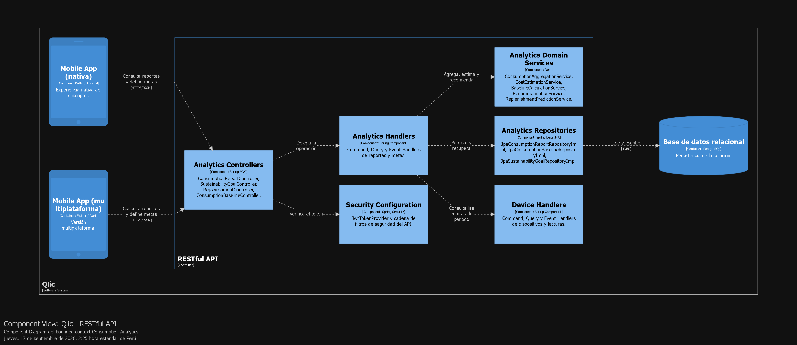

El diagrama refleja la separación entre los componentes de consulta, que atienden las solicitudes de las aplicaciones móviles, y los componentes de cálculo, que mantienen actualizada la línea base a partir de los eventos de registro de lecturas. Esta separación responde a que ambos flujos operan con frecuencias y volúmenes distintos.

#### 2.6.2.6. Bounded Context Software Architecture Code Level Diagrams

##### 2.6.2.6.1. Bounded Context Domain Layer Class Diagrams

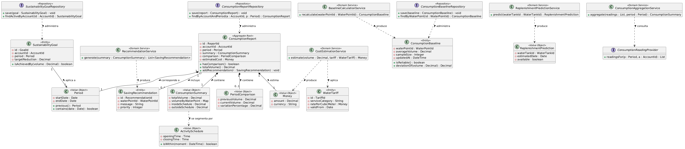


```plantuml
@startuml Consumption Analytics Domain Layer

class ConsumptionReport <<Aggregate Root>> {
  - id : ReportId
  - accountId : AccountId
  - period : Period
  - summary : ConsumptionSummary
  - comparison : PeriodComparison
  - estimatedCost : Money
  + hasComparison() : boolean
  + totalVolume() : Decimal
  + addRecommendation(r : SavingRecommendation) : void
}

class ConsumptionBaseline <<Entity>> {
  - waterPointId : WaterPointId
  - averageVolume : Decimal
  - sampleSize : Integer
  - updatedAt : DateTime
  + isReliable() : boolean
  + deviationOf(volume : Decimal) : Decimal
}

class Period <<Value Object>> {
  - startDate : Date
  - endDate : Date
  + previous() : Period
  + contains(date : Date) : boolean
}

class ConsumptionSummary <<Value Object>> {
  - totalVolume : Decimal
  - volumeByWaterPoint : Map
  - insideSchedule : Decimal
  - outsideSchedule : Decimal
}

class PeriodComparison <<Value Object>> {
  - previousVolume : Decimal
  - currentVolume : Decimal
  - variationPercentage : Decimal
}

class Money <<Value Object>> {
  - amount : Decimal
  - currency : String
}

class WaterTariff <<Entity>> {
  - id : TariffId
  - serviceCategory : String
  - ratePerCubicMeter : Money
  - validFrom : Date
}

class ActivitySchedule <<Value Object>> {
  - openingTime : Time
  - closingTime : Time
  + isWithin(moment : DateTime) : boolean
}

class SavingRecommendation <<Entity>> {
  - id : RecommendationId
  - waterPointId : WaterPointId
  - message : String
  - priority : Integer
}

class SustainabilityGoal <<Entity>> {
  - id : GoalId
  - accountId : AccountId
  - period : Period
  - targetReduction : Decimal
  + isAchievedBy(volume : Decimal) : boolean
}

class ReplenishmentPrediction <<Value Object>> {
  - waterTankId : WaterTankId
  - estimatedDate : Date
  - available : boolean
}

class ConsumptionAggregationService <<Domain Service>> {
  + aggregate(readings : List, period : Period) : ConsumptionSummary
}

class CostEstimationService <<Domain Service>> {
  + estimate(volume : Decimal, tariff : WaterTariff) : Money
}

class BaselineCalculationService <<Domain Service>> {
  + recalculate(waterPointId : WaterPointId) : ConsumptionBaseline
}

class RecommendationService <<Domain Service>> {
  + generate(summary : ConsumptionSummary) : List<SavingRecommendation>
}

class ReplenishmentPredictionService <<Domain Service>> {
  + predict(waterTankId : WaterTankId) : ReplenishmentPrediction
}

interface ConsumptionReportRepository <<Repository>> {
  + save(report : ConsumptionReport) : void
  + findByAccountAndPeriod(a : AccountId, p : Period) : ConsumptionReport
}

interface ConsumptionBaselineRepository <<Repository>> {
  + save(baseline : ConsumptionBaseline) : void
  + findByWaterPoint(id : WaterPointId) : ConsumptionBaseline
}

interface SustainabilityGoalRepository <<Repository>> {
  + save(goal : SustainabilityGoal) : void
  + findActiveByAccount(id : AccountId) : SustainabilityGoal
}

interface ConsumptionReadingProvider {
  + readingsFor(p : Period, a : AccountId) : List
}

ConsumptionReport "1" *-- "1" ConsumptionSummary : contiene >
ConsumptionReport "1" *-- "0..1" PeriodComparison : contiene >
ConsumptionReport "1" *-- "1" Period : corresponde a >
ConsumptionReport "1" *-- "1" Money : estima >
ConsumptionReport "1" o-- "0..*" SavingRecommendation : incluye >
SustainabilityGoal "1" --> "1" Period : aplica a >
ConsumptionSummary ..> ActivitySchedule : se segmenta por >
CostEstimationService ..> WaterTariff : aplica >
CostEstimationService ..> Money : produce >
ConsumptionAggregationService ..> ConsumptionReadingProvider : consulta >
BaselineCalculationService ..> ConsumptionBaseline : produce >
RecommendationService ..> SavingRecommendation : produce >
ReplenishmentPredictionService ..> ReplenishmentPrediction : produce >
ConsumptionReportRepository ..> ConsumptionReport : administra >
ConsumptionBaselineRepository ..> ConsumptionBaseline : administra >
SustainabilityGoalRepository ..> SustainabilityGoal : administra >

@enduml
```

##### 2.6.2.6.2. Bounded Context Database Design Diagram

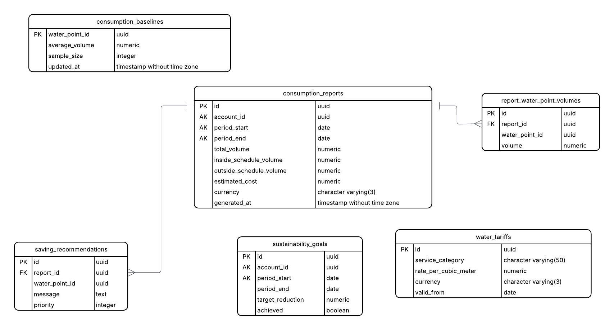

| Tabla | Columnas principales | Constraints |
|---|---|---|
| `consumption_reports` | `id` (PK), `account_id`, `period_start`, `period_end`, `total_volume`, `inside_schedule_volume`, `outside_schedule_volume`, `estimated_cost`, `currency`, `generated_at` | PK sobre `id` · restricción de unicidad sobre (`account_id`, `period_start`, `period_end`) |
| `report_water_point_volumes` | `id` (PK), `report_id` (FK), `water_point_id`, `volume` | FK `report_id` referencia `consumption_reports(id)` con borrado en cascada |
| `consumption_baselines` | `water_point_id` (PK), `average_volume`, `sample_size`, `updated_at` | PK sobre `water_point_id` |
| `water_tariffs` | `id` (PK), `service_category`, `rate_per_cubic_meter`, `currency`, `valid_from` | PK sobre `id` · índice sobre (`service_category`, `valid_from`) |
| `saving_recommendations` | `id` (PK), `report_id` (FK), `water_point_id`, `message`, `priority` | FK `report_id` referencia `consumption_reports(id)` |
| `sustainability_goals` | `id` (PK), `account_id`, `period_start`, `period_end`, `target_reduction`, `achieved` | PK sobre `id` · restricción de unicidad sobre (`account_id`, `period_start`) |

---

### 2.6.3. Bounded Context: Device Monitoring

Device Monitoring administra el ciclo de vida de los dispositivos IoT y garantiza la captación confiable de las lecturas. Es el contexto que actúa como gateway hacia los sensores instalados en los locales y hogares de los suscriptores, y del que dependen tanto Alerting como Consumption Analytics.

#### 2.6.3.1. Domain Layer

| Clase | Categoría | Propósito |
|---|---|---|
| `IoTDevice` | Aggregate Root | Sensor físico vinculado a una cuenta, con su estado operativo y su Water Point asignado. |
| `WaterPoint` | Entity | Ubicación física monitoreada dentro de un local u hogar. |
| `WaterTank` | Entity | Depósito de almacenamiento cuyo nivel es monitoreado por un dispositivo. |
| `ConsumptionReading` | Entity | Lectura registrada por un dispositivo en un momento determinado. |
| `Location` | Aggregate Root | Local u hogar del suscriptor que agrupa Water Points y declara su horario de actividad. |
| `DeviceStatus` | Value Object (enum) | Estado operativo del dispositivo: `ACTIVE`, `DISCONNECTED`, `UNASSIGNED`. |
| `DeviceSerial` | Value Object | Identificador único del dispositivo, codificado en su código QR. |
| `Volume` | Value Object | Cantidad de agua con su unidad de medida. |
| `TankLevel` | Value Object | Nivel de un tanque expresado en porcentaje de su capacidad. |
| `ReadingTimestamp` | Value Object | Momento de la lectura, con validación de coherencia temporal. |
| `DeviceRegistrationService` | Domain Service | Valida que el dispositivo no se encuentre vinculado a otra cuenta y que el plan permita el registro. |
| `DeviceHealthService` | Domain Service | Determina el estado de conexión de un dispositivo según el tiempo transcurrido desde su última lectura. |
| `ReadingValidationService` | Domain Service | Valida la coherencia de una lectura recibida, incluyendo el orden temporal y el rango admisible. |
| `IoTDeviceRepository` | Repository (interfaz) | Abstracción de persistencia y recuperación de dispositivos. |
| `WaterPointRepository` | Repository (interfaz) | Abstracción de persistencia y recuperación de Water Points. |
| `ConsumptionReadingRepository` | Repository (interfaz) | Abstracción de persistencia y recuperación de lecturas. |
| `LocationRepository` | Repository (interfaz) | Abstracción de persistencia y recuperación de locales. |
| `PlanEntitlementProvider` | Interface | Abstracción de la consulta de límites del plan, provista por Subscriptions. |
| `DeviceRegisteredEvent` | Domain Event | Se publica al vincularse un dispositivo a una cuenta. |
| `ConsumptionReadingRegisteredEvent` | Domain Event | Se publica al registrarse una lectura válida. Consumido por Alerting y Consumption Analytics. |
| `DeviceDisconnectedEvent` | Domain Event | Se publica cuando un dispositivo deja de reportar lecturas durante el periodo límite. |
| `TankLevelLowEvent` | Domain Event | Se publica cuando el nivel de un tanque desciende por debajo de su valor crítico. |

**Reglas de negocio implementadas en el dominio**

- Un `IoTDevice` se asocia a un único `WaterPoint` a la vez; la reasignación libera la anterior.
- Un dispositivo no puede vincularse a más de una cuenta, condición validada por `DeviceRegistrationService`.
- Un dispositivo que no reporta lecturas durante el periodo límite transiciona a `DISCONNECTED` y publica `DeviceDisconnectedEvent`.
- La cantidad de dispositivos registrables está determinada por el plan vigente, consultado mediante `PlanEntitlementProvider`.

#### 2.6.3.2. Interface Layer

| Clase | Categoría | Propósito |
|---|---|---|
| `IoTDeviceController` | Controller | Expone los endpoints de registro, consulta, actualización y baja de dispositivos. |
| `WaterPointController` | Controller | Expone los endpoints de administración de Water Points y su asignación. |
| `ConsumptionReadingController` | Controller | Expone el endpoint de ingesta de lecturas utilizado por los dispositivos IoT. |
| `WaterTankController` | Controller | Expone los endpoints de consulta del nivel de los tanques. |
| `LocationController` | Controller | Expone los endpoints de administración de locales y de su horario de actividad. |
| `MonitoringDashboardController` | Controller | Expone la vista consolidada del panel de monitoreo para las aplicaciones móviles. |
| `DeviceResource` | Resource | Representación de entrada y salida de un dispositivo. |
| `ReadingResource` | Resource | Representación de entrada de una lectura de consumo. |
| `DashboardResource` | Resource | Representación de salida del panel de monitoreo. |

#### 2.6.3.3. Application Layer

| Clase | Categoría | Propósito |
|---|---|---|
| `RegisterDeviceCommand` | Command | Solicita vincular un dispositivo a una cuenta a partir de su número de serie. |
| `RegisterDeviceCommandHandler` | Command Handler | Verifica permisos, consulta el límite del plan, invoca `DeviceRegistrationService` y publica `DeviceRegisteredEvent`. |
| `AssignWaterPointCommand` | Command | Solicita asignar un dispositivo a un Water Point. |
| `AssignWaterPointCommandHandler` | Command Handler | Valida que el dispositivo no tenga asignación vigente y registra la nueva asociación. |
| `RegisterReadingCommand` | Command | Solicita registrar una lectura recibida de un dispositivo. |
| `RegisterReadingCommandHandler` | Command Handler | Invoca `ReadingValidationService`, persiste la lectura y publica `ConsumptionReadingRegisteredEvent`. |
| `DefineActivityScheduleCommand` | Command | Solicita declarar el horario de actividad de un local. |
| `DefineActivityScheduleCommandHandler` | Command Handler | Registra el horario y lo hace disponible para la segmentación del consumo. |
| `GetDashboardQuery` | Query | Solicita el estado consolidado de los dispositivos de una cuenta. |
| `GetDashboardQueryHandler` | Query Handler | Recupera dispositivos, últimas lecturas y estados, filtrando por local cuando se indica. |
| `GetReadingsByPeriodQuery` | Query | Solicita las lecturas de un periodo, consumida por Consumption Analytics. |
| `GetReadingsByPeriodQueryHandler` | Query Handler | Recupera las lecturas agregadas por Water Point para el periodo solicitado. |
| `DeviceHealthCheckEventHandler` | Event Handler | Evalúa periódicamente el estado de conexión de los dispositivos y publica `DeviceDisconnectedEvent` cuando corresponde. |
| `TankLevelEvaluationEventHandler` | Event Handler | Evalúa el nivel reportado por los tanques y publica `TankLevelLowEvent` al alcanzarse el valor crítico. |

#### 2.6.3.4. Infrastructure Layer

| Clase | Categoría | Propósito |
|---|---|---|
| `JpaIoTDeviceRepositoryImpl` | Repository Impl | Implementa `IoTDeviceRepository` mediante Spring Data JPA. |
| `JpaWaterPointRepositoryImpl` | Repository Impl | Implementa `WaterPointRepository` mediante Spring Data JPA. |
| `JpaConsumptionReadingRepositoryImpl` | Repository Impl | Implementa `ConsumptionReadingRepository` mediante Spring Data JPA, con particionamiento por periodo. |
| `JpaLocationRepositoryImpl` | Repository Impl | Implementa `LocationRepository` mediante Spring Data JPA. |
| `PlanEntitlementAdapter` | Adapter | Implementa `PlanEntitlementProvider` consultando al contexto Subscriptions. |
| `DeviceIngestionRateLimiter` | Infrastructure Service | Controla la frecuencia admisible de ingesta por dispositivo para proteger el servicio. |
| `IoTDeviceEntity` | Persistence Entity | Representación de persistencia del agregado `IoTDevice`. |
| `ConsumptionReadingEntity` | Persistence Entity | Representación de persistencia de una lectura de consumo. |

#### 2.6.3.5. Bounded Context Software Architecture Component Level Diagrams

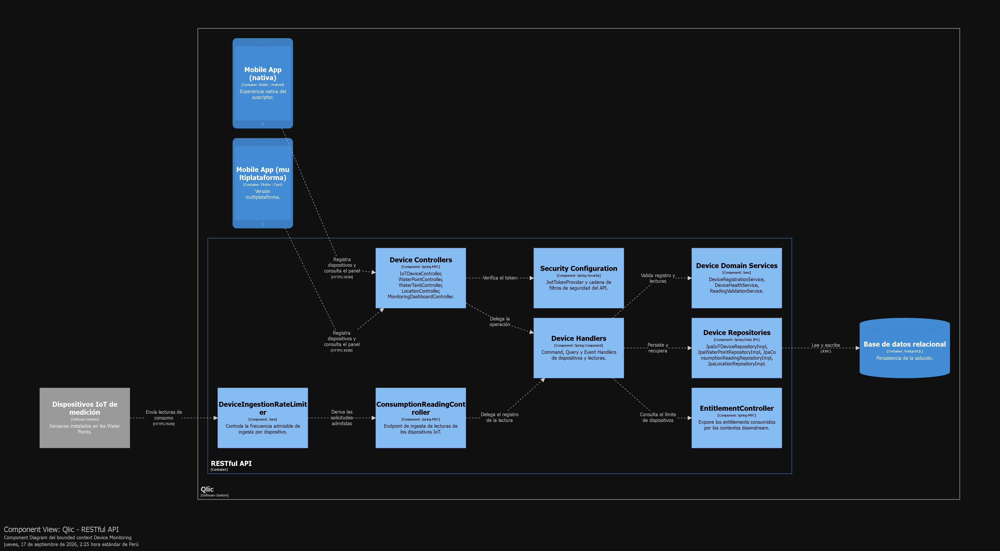

El diagrama distingue dos rutas de entrada al container: la de las aplicaciones móviles, que administran dispositivos y consultan el panel, y la de los dispositivos IoT, que únicamente alimentan el endpoint de ingesta. Esta última cuenta con el componente de control de frecuencia, dado que su volumen de solicitudes es sustancialmente mayor.

#### 2.6.3.6. Bounded Context Software Architecture Code Level Diagrams

##### 2.6.3.6.1. Bounded Context Domain Layer Class Diagrams

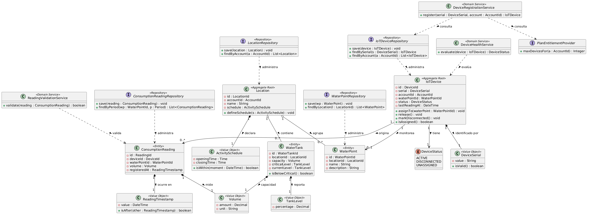

```plantuml
@startuml Device Monitoring Domain Layer

enum DeviceStatus { ACTIVE \n DISCONNECTED \n UNASSIGNED }

class IoTDevice <<Aggregate Root>> {
  - id : DeviceId
  - serial : DeviceSerial
  - accountId : AccountId
  - waterPointId : WaterPointId
  - status : DeviceStatus
  - lastReadingAt : DateTime
  + assignTo(waterPoint : WaterPointId) : void
  + release() : void
  + markDisconnected() : void
  + isAssigned() : boolean
}

class Location <<Aggregate Root>> {
  - id : LocationId
  - accountId : AccountId
  - name : String
  - schedule : ActivitySchedule
  + defineSchedule(s : ActivitySchedule) : void
}

class WaterPoint <<Entity>> {
  - id : WaterPointId
  - locationId : LocationId
  - name : String
  - description : String
}

class WaterTank <<Entity>> {
  - id : WaterTankId
  - locationId : LocationId
  - capacity : Volume
  - criticalLevel : TankLevel
  - currentLevel : TankLevel
  + isBelowCritical() : boolean
}

class ConsumptionReading <<Entity>> {
  - id : ReadingId
  - deviceId : DeviceId
  - waterPointId : WaterPointId
  - volume : Volume
  - registeredAt : ReadingTimestamp
}

class DeviceSerial <<Value Object>> {
  - value : String
  + isValid() : boolean
}

class Volume <<Value Object>> {
  - amount : Decimal
  - unit : String
}

class TankLevel <<Value Object>> {
  - percentage : Decimal
}

class ReadingTimestamp <<Value Object>> {
  - value : DateTime
  + isAfter(other : ReadingTimestamp) : boolean
}

class DeviceRegistrationService <<Domain Service>> {
  + register(serial : DeviceSerial, account : AccountId) : IoTDevice
}

class DeviceHealthService <<Domain Service>> {
  + evaluate(device : IoTDevice) : DeviceStatus
}

class ReadingValidationService <<Domain Service>> {
  + validate(reading : ConsumptionReading) : boolean
}

interface IoTDeviceRepository <<Repository>> {
  + save(device : IoTDevice) : void
  + findBySerial(s : DeviceSerial) : IoTDevice
  + findByAccount(a : AccountId) : List<IoTDevice>
}

interface WaterPointRepository <<Repository>> {
  + save(wp : WaterPoint) : void
  + findByLocation(l : LocationId) : List<WaterPoint>
}

interface ConsumptionReadingRepository <<Repository>> {
  + save(reading : ConsumptionReading) : void
  + findByPeriod(wp : WaterPointId, p : Period) : List<ConsumptionReading>
}

interface LocationRepository <<Repository>> {
  + save(location : Location) : void
  + findByAccount(a : AccountId) : List<Location>
}

interface PlanEntitlementProvider {
  + maxDevicesFor(a : AccountId) : Integer
}

Location "1" o-- "0..*" WaterPoint : agrupa >
Location "1" o-- "0..*" WaterTank : contiene >
IoTDevice "1" --> "0..1" WaterPoint : monitorea >
IoTDevice "1" --> "1" DeviceStatus : tiene >
IoTDevice "1" *-- "1" DeviceSerial : identificado por >
IoTDevice "1" --> "0..*" ConsumptionReading : origina >
ConsumptionReading "1" *-- "1" Volume : mide >
ConsumptionReading "1" *-- "1" ReadingTimestamp : ocurre en >
WaterTank "1" *-- "1" TankLevel : reporta >
WaterTank "1" *-- "1" Volume : capacidad >
DeviceRegistrationService ..> PlanEntitlementProvider : consulta >
DeviceRegistrationService ..> IoTDeviceRepository : consulta >
DeviceHealthService ..> IoTDevice : evalúa >
ReadingValidationService ..> ConsumptionReading : valida >
IoTDeviceRepository ..> IoTDevice : administra >
WaterPointRepository ..> WaterPoint : administra >
ConsumptionReadingRepository ..> ConsumptionReading : administra >
LocationRepository ..> Location : administra >

@enduml
```

##### 2.6.3.6.2. Bounded Context Database Design Diagram

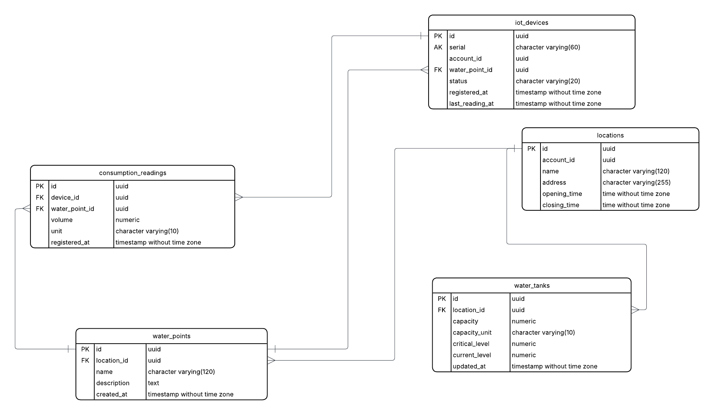

| Tabla | Columnas principales | Constraints |
|---|---|---|
| `locations` | `id` (PK), `account_id`, `name`, `address`, `opening_time`, `closing_time` | PK sobre `id` · índice sobre `account_id` |
| `water_points` | `id` (PK), `location_id` (FK), `name`, `description`, `created_at` | FK `location_id` referencia `locations(id)` |
| `water_tanks` | `id` (PK), `location_id` (FK), `capacity`, `capacity_unit`, `critical_level`, `current_level`, `updated_at` | FK `location_id` referencia `locations(id)` |
| `iot_devices` | `id` (PK), `serial`, `account_id`, `water_point_id` (FK), `status`, `registered_at`, `last_reading_at` | PK sobre `id` · restricción de unicidad sobre `serial` · FK `water_point_id` referencia `water_points(id)` |
| `consumption_readings` | `id` (PK), `device_id` (FK), `water_point_id` (FK), `volume`, `unit`, `registered_at` | FK `device_id` referencia `iot_devices(id)` · índice compuesto sobre (`water_point_id`, `registered_at`) para las consultas por periodo |

### 2.6.4. Bounded Context: Subscriptions

Subscriptions administra los planes, la contratación y el ciclo de vida de la suscripción, y determina las funcionalidades y límites habilitados para cada suscriptor. Actúa como upstream de los cuatro contextos restantes mediante el contrato de entitlements, y como gateway hacia la pasarela de pagos.

#### 2.6.4.1. Domain Layer

| Clase | Categoría | Propósito |
|---|---|---|
| `Subscription` | Aggregate Root | Contratación vigente de un suscriptor, con su plan, su periodo de vigencia y su estado. |
| `SubscriptionPlan` | Aggregate Root | Plan comercial ofrecido, con sus funcionalidades, límites y precio. |
| `SubscriptionState` | Value Object (enum) | Estado de la suscripción: `TRIAL`, `ACTIVE`, `PENDING_PAYMENT`, `CANCELLED`, `EXPIRED`. |
| `PlanEntitlement` | Value Object | Conjunto de límites y funcionalidades que otorga un plan: dispositivos permitidos, usuarios adicionales, cobertura de visita técnica y acceso a reportes avanzados. |
| `BillingPeriod` | Value Object | Periodo de facturación con su fecha de inicio y de término. |
| `Payment` | Entity | Transacción asociada a la contratación o renovación de una suscripción. |
| `PaymentState` | Value Object (enum) | Estado del pago: `PENDING`, `CONFIRMED`, `REJECTED`. |
| `Money` | Value Object | Importe con su moneda. Concepto compartido en su definición con Consumption Analytics. |
| `TrialPeriod` | Value Object | Periodo de prueba con su fecha de término y la marca de utilización. |
| `PlanChangeRequest` | Entity | Solicitud de cambio de plan pendiente de aplicarse en el siguiente periodo de facturación. |
| `SubscriptionLifecycleService` | Domain Service | Aplica las transiciones de estado válidas de una suscripción según los eventos de pago, cancelación y término de periodo. |
| `TrialEligibilityService` | Domain Service | Determina si un suscriptor puede acceder al periodo de prueba. |
| `EntitlementResolutionService` | Domain Service | Resuelve los entitlements vigentes de una cuenta a partir de su suscripción y su estado. |
| `SubscriptionRepository` | Repository (interfaz) | Abstracción de persistencia y recuperación de suscripciones. |
| `SubscriptionPlanRepository` | Repository (interfaz) | Abstracción de persistencia y recuperación de planes. |
| `PaymentRepository` | Repository (interfaz) | Abstracción de persistencia y recuperación de pagos. |
| `PaymentGateway` | Interface | Abstracción del procesamiento de pagos, implementada en la capa de infraestructura. |
| `SubscriptionActivatedEvent` | Domain Event | Se publica al activarse una suscripción tras la confirmación del pago. |
| `SubscriptionCancelledEvent` | Domain Event | Se publica al registrarse la cancelación de una suscripción. |
| `TrialExpiredEvent` | Domain Event | Se publica al concluir un periodo de prueba sin contratación. |

**Reglas de negocio implementadas en el dominio**

- Los planes disponibles son Plan Básico y Plan Gestión Pro, definidos como instancias de `SubscriptionPlan`.
- `TrialEligibilityService` otorga el periodo de prueba una única vez por suscriptor.
- Un `PlanChangeRequest` se materializa únicamente al inicio del siguiente `BillingPeriod`.
- Una cancelación transiciona la suscripción a `CANCELLED` manteniendo el acceso hasta el término del periodo pagado, sin generar nuevos cobros.
- Concluido el periodo de prueba sin contratación, `EntitlementResolutionService` restringe los entitlements a los de consulta básica.

#### 2.6.4.2. Interface Layer

| Clase | Categoría | Propósito |
|---|---|---|
| `SubscriptionPlanController` | Controller | Expone la consulta de los planes vigentes. |
| `SubscriptionController` | Controller | Expone los endpoints de contratación, cambio y cancelación de la suscripción. |
| `PaymentController` | Controller | Expone la consulta del historial de pagos. |
| `TrialController` | Controller | Expone el endpoint de activación del periodo de prueba. |
| `EntitlementController` | Controller | Expone la consulta de entitlements, consumida por los contextos downstream. |
| `PaymentWebhookConsumer` | Consumer | Recibe las confirmaciones de la pasarela de pagos y dispara la actualización del estado del pago. |
| `SubscriptionResource` | Resource | Representación de entrada y salida de una suscripción. |
| `PlanResource` | Resource | Representación de salida de un plan. |
| `EntitlementResource` | Resource | Representación de salida de los entitlements de una cuenta. |

#### 2.6.4.3. Application Layer

| Clase | Categoría | Propósito |
|---|---|---|
| `SubscribePlanCommand` | Command | Solicita contratar un plan para una cuenta. |
| `SubscribePlanCommandHandler` | Command Handler | Valida el plan, inicia el pago a través de `PaymentGateway` y crea la suscripción en estado `PENDING_PAYMENT`. |
| `ActivateTrialCommand` | Command | Solicita activar el periodo de prueba. |
| `ActivateTrialCommandHandler` | Command Handler | Invoca `TrialEligibilityService` y activa la suscripción en estado `TRIAL`. |
| `ChangePlanCommand` | Command | Solicita cambiar el plan contratado. |
| `ChangePlanCommandHandler` | Command Handler | Registra un `PlanChangeRequest` con efecto en el siguiente periodo de facturación. |
| `CancelSubscriptionCommand` | Command | Solicita cancelar la suscripción. |
| `CancelSubscriptionCommandHandler` | Command Handler | Invoca `SubscriptionLifecycleService`, transiciona a `CANCELLED` y publica `SubscriptionCancelledEvent`. |
| `GetPlansQuery` | Query | Solicita los planes vigentes. |
| `GetPlansQueryHandler` | Query Handler | Recupera los planes disponibles para su presentación en el Landing Page y en la aplicación. |
| `GetEntitlementsQuery` | Query | Solicita los entitlements vigentes de una cuenta. |
| `GetEntitlementsQueryHandler` | Query Handler | Invoca `EntitlementResolutionService` y responde con el contrato de entitlements. |
| `GetPaymentHistoryQuery` | Query | Solicita el historial de pagos de una cuenta. |
| `GetPaymentHistoryQueryHandler` | Query Handler | Recupera los pagos verificando los permisos del solicitante. |
| `PaymentConfirmedEventHandler` | Event Handler | Activa la suscripción al confirmarse el pago y publica `SubscriptionActivatedEvent`. |
| `BillingPeriodClosedEventHandler` | Event Handler | Aplica los cambios de plan pendientes y evalúa las renovaciones y expiraciones. |

#### 2.6.4.4. Infrastructure Layer

| Clase | Categoría | Propósito |
|---|---|---|
| `JpaSubscriptionRepositoryImpl` | Repository Impl | Implementa `SubscriptionRepository` mediante Spring Data JPA. |
| `JpaSubscriptionPlanRepositoryImpl` | Repository Impl | Implementa `SubscriptionPlanRepository` mediante Spring Data JPA. |
| `JpaPaymentRepositoryImpl` | Repository Impl | Implementa `PaymentRepository` mediante Spring Data JPA. |
| `PaymentGatewayAdapter` | Adapter | Implementa `PaymentGateway` traduciendo el modelo de transacciones del proveedor externo a los conceptos de `Payment` y `Subscription`. Constituye la Anticorruption Layer definida en el Context Mapping. |
| `SubscriptionEntity` | Persistence Entity | Representación de persistencia del agregado `Subscription`. |
| `PaymentEntity` | Persistence Entity | Representación de persistencia de un pago. |

#### 2.6.4.5. Bounded Context Software Architecture Component Level Diagrams

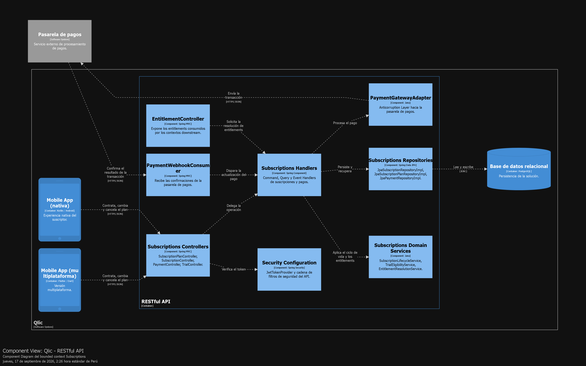

El diagrama evidencia dos rutas de entrada distintas: la iniciada por el suscriptor desde la aplicación móvil y la iniciada por la pasarela de pagos mediante webhook, que confirma de forma asíncrona el resultado de la transacción. El componente de entitlements se representa separado porque es consumido por los cuatro contextos downstream.

#### 2.6.4.6. Bounded Context Software Architecture Code Level Diagrams

##### 2.6.4.6.1. Bounded Context Domain Layer Class Diagrams

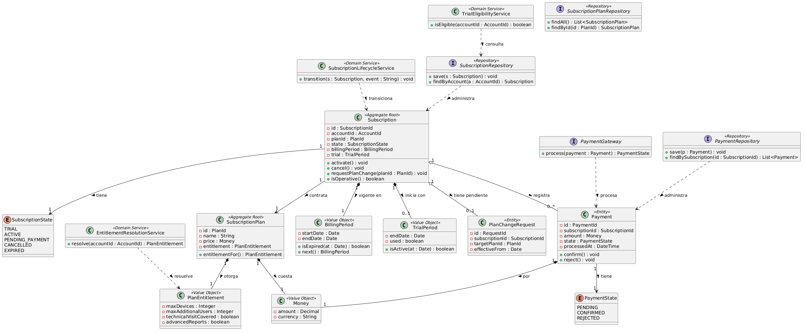

```plantuml
@startuml Subscriptions Domain Layer

enum SubscriptionState { TRIAL \n ACTIVE \n PENDING_PAYMENT \n CANCELLED \n EXPIRED }
enum PaymentState { PENDING \n CONFIRMED \n REJECTED }

class Subscription <<Aggregate Root>> {
  - id : SubscriptionId
  - accountId : AccountId
  - planId : PlanId
  - state : SubscriptionState
  - billingPeriod : BillingPeriod
  - trial : TrialPeriod
  + activate() : void
  + cancel() : void
  + requestPlanChange(planId : PlanId) : void
  + isOperative() : boolean
}

class SubscriptionPlan <<Aggregate Root>> {
  - id : PlanId
  - name : String
  - price : Money
  - entitlement : PlanEntitlement
  + entitlementFor() : PlanEntitlement
}

class PlanEntitlement <<Value Object>> {
  - maxDevices : Integer
  - maxAdditionalUsers : Integer
  - technicalVisitCovered : boolean
  - advancedReports : boolean
}

class BillingPeriod <<Value Object>> {
  - startDate : Date
  - endDate : Date
  + isExpired(at : Date) : boolean
  + next() : BillingPeriod
}

class TrialPeriod <<Value Object>> {
  - endDate : Date
  - used : boolean
  + isActive(at : Date) : boolean
}

class Payment <<Entity>> {
  - id : PaymentId
  - subscriptionId : SubscriptionId
  - amount : Money
  - state : PaymentState
  - processedAt : DateTime
  + confirm() : void
  + reject() : void
}

class Money <<Value Object>> {
  - amount : Decimal
  - currency : String
}

class PlanChangeRequest <<Entity>> {
  - id : RequestId
  - subscriptionId : SubscriptionId
  - targetPlanId : PlanId
  - effectiveFrom : Date
}

class SubscriptionLifecycleService <<Domain Service>> {
  + transition(s : Subscription, event : String) : void
}

class TrialEligibilityService <<Domain Service>> {
  + isEligible(accountId : AccountId) : boolean
}

class EntitlementResolutionService <<Domain Service>> {
  + resolve(accountId : AccountId) : PlanEntitlement
}

interface SubscriptionRepository <<Repository>> {
  + save(s : Subscription) : void
  + findByAccount(a : AccountId) : Subscription
}

interface SubscriptionPlanRepository <<Repository>> {
  + findAll() : List<SubscriptionPlan>
  + findById(id : PlanId) : SubscriptionPlan
}

interface PaymentRepository <<Repository>> {
  + save(p : Payment) : void
  + findBySubscription(id : SubscriptionId) : List<Payment>
}

interface PaymentGateway {
  + process(payment : Payment) : PaymentState
}

Subscription "1" --> "1" SubscriptionPlan : contrata >
Subscription "1" --> "1" SubscriptionState : tiene >
Subscription "1" *-- "1" BillingPeriod : vigente en >
Subscription "1" *-- "0..1" TrialPeriod : inicia con >
Subscription "1" o-- "0..*" Payment : registra >
Subscription "1" o-- "0..1" PlanChangeRequest : tiene pendiente >
SubscriptionPlan "1" *-- "1" PlanEntitlement : otorga >
SubscriptionPlan "1" *-- "1" Money : cuesta >
Payment "1" *-- "1" Money : por >
Payment "1" --> "1" PaymentState : tiene >
SubscriptionLifecycleService ..> Subscription : transiciona >
TrialEligibilityService ..> SubscriptionRepository : consulta >
EntitlementResolutionService ..> PlanEntitlement : resuelve >
PaymentGateway ..> Payment : procesa >
SubscriptionRepository ..> Subscription : administra >
PaymentRepository ..> Payment : administra >

@enduml
```

##### 2.6.4.6.2. Bounded Context Database Design Diagram

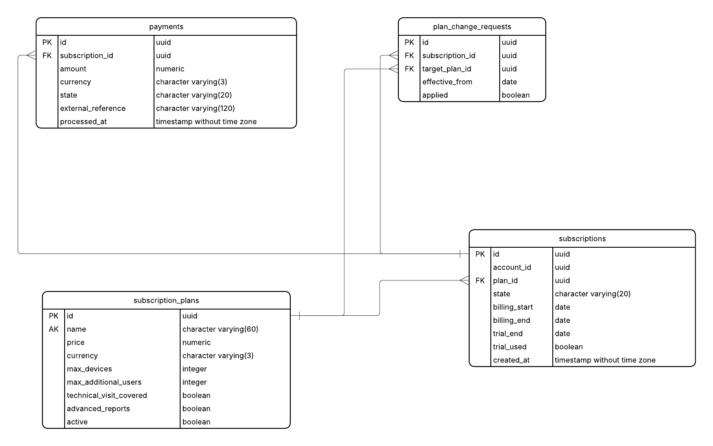

| Tabla | Columnas principales | Constraints |
|---|---|---|
| `subscription_plans` | `id` (PK), `name`, `price`, `currency`, `max_devices`, `max_additional_users`, `technical_visit_covered`, `advanced_reports`, `active` | PK sobre `id` · restricción de unicidad sobre `name` |
| `subscriptions` | `id` (PK), `account_id`, `plan_id` (FK), `state`, `billing_start`, `billing_end`, `trial_end`, `trial_used`, `created_at` | PK sobre `id` · FK `plan_id` referencia `subscription_plans(id)` · restricción de unicidad sobre `account_id` para suscripciones no canceladas |
| `payments` | `id` (PK), `subscription_id` (FK), `amount`, `currency`, `state`, `external_reference`, `processed_at` | FK `subscription_id` referencia `subscriptions(id)` · índice sobre `external_reference` |
| `plan_change_requests` | `id` (PK), `subscription_id` (FK), `target_plan_id` (FK), `effective_from`, `applied` | FK sobre `subscription_id` y `target_plan_id` |

---

### 2.6.5. Bounded Context: IAM

IAM administra la identidad de los suscriptores y el acceso compartido a una misma cuenta con permisos diferenciados. Es un subdominio genérico y actúa como upstream bajo relación Conformist para los cuatro contextos que verifican identidad y permisos.

#### 2.6.5.1. Domain Layer

| Clase | Categoría | Propósito |
|---|---|---|
| `Account` | Aggregate Root | Cuenta de un suscriptor, que agrupa al titular y a los usuarios autorizados. |
| `Subscriber` | Entity | Persona titular de una cuenta, con sus credenciales y datos de perfil. |
| `AuthorizedUser` | Entity | Persona con acceso delegado a una cuenta, con su nivel de permiso. |
| `PermissionLevel` | Value Object (enum) | Nivel de acceso otorgado: `VIEWER`, `OPERATOR`, `OWNER`. |
| `EmailAddress` | Value Object | Correo electrónico con validación de formato, único en el sistema. |
| `PasswordHash` | Value Object | Representación cifrada de la contraseña. |
| `AccessToken` | Value Object | Token de acceso emitido tras la autenticación, con su tiempo de expiración. |
| `PasswordResetToken` | Entity | Token de restablecimiento con vigencia limitada y de un solo uso. |
| `Invitation` | Entity | Invitación enviada a una persona para acceder a una cuenta. |
| `InvitationState` | Value Object (enum) | Estado de la invitación: `PENDING`, `ACCEPTED`, `EXPIRED`. |
| `AuthenticationService` | Domain Service | Valida las credenciales presentadas y emite el token de acceso. |
| `AuthorizationService` | Domain Service | Determina si un usuario cuenta con el permiso requerido sobre una cuenta. |
| `InvitationService` | Domain Service | Gestiona la emisión y aceptación de invitaciones respetando el límite del plan. |
| `AccountRepository` | Repository (interfaz) | Abstracción de persistencia y recuperación de cuentas. |
| `SubscriberRepository` | Repository (interfaz) | Abstracción de persistencia y recuperación de suscriptores. |
| `InvitationRepository` | Repository (interfaz) | Abstracción de persistencia y recuperación de invitaciones. |
| `PlanEntitlementProvider` | Interface | Abstracción de la consulta del límite de usuarios adicionales, provista por Subscriptions. |
| `AccountCreatedEvent` | Domain Event | Se publica al crearse una nueva cuenta. |
| `UserAuthorizedEvent` | Domain Event | Se publica al aceptarse una invitación de acceso. |

**Reglas de negocio implementadas en el dominio**

- `EmailAddress` es única en el sistema; el registro con un correo existente es rechazado.
- Un `AuthorizedUser` con `PermissionLevel.VIEWER` no puede ejecutar operaciones de modificación, condición evaluada por `AuthorizationService`.
- `PasswordResetToken` tiene vigencia limitada y se invalida tras su primer uso.
- La cantidad de `AuthorizedUser` por cuenta está limitada por el plan vigente, consultado mediante `PlanEntitlementProvider`.

#### 2.6.5.2. Interface Layer

| Clase | Categoría | Propósito |
|---|---|---|
| `AuthenticationController` | Controller | Expone los endpoints de registro, inicio de sesión y emisión de token. |
| `PasswordResetController` | Controller | Expone los endpoints de solicitud y confirmación del restablecimiento de contraseña. |
| `AccountController` | Controller | Expone los endpoints de consulta y actualización del perfil y de los datos de la cuenta. |
| `InvitationController` | Controller | Expone los endpoints de invitación y administración de usuarios autorizados. |
| `AuthorizationController` | Controller | Expone la verificación de permisos, consumida por los contextos downstream. |
| `AuthenticationResource` | Resource | Representación de entrada de credenciales y de salida del token emitido. |
| `AccountResource` | Resource | Representación de entrada y salida de los datos de la cuenta. |
| `InvitationResource` | Resource | Representación de entrada y salida de una invitación. |

#### 2.6.5.3. Application Layer

| Clase | Categoría | Propósito |
|---|---|---|
| `RegisterAccountCommand` | Command | Solicita crear una cuenta de suscriptor. |
| `RegisterAccountCommandHandler` | Command Handler | Valida la unicidad del correo, registra la aceptación de los términos y crea la cuenta. |
| `AuthenticateCommand` | Command | Solicita autenticar a un usuario. |
| `AuthenticateCommandHandler` | Command Handler | Invoca `AuthenticationService` y responde con el token emitido o con el rechazo. |
| `RequestPasswordResetCommand` | Command | Solicita el restablecimiento de la contraseña. |
| `RequestPasswordResetCommandHandler` | Command Handler | Emite el token de restablecimiento y dispara su envío. |
| `ConfirmPasswordResetCommand` | Command | Solicita establecer una nueva contraseña a partir de un token. |
| `ConfirmPasswordResetCommandHandler` | Command Handler | Valida la vigencia del token, actualiza la contraseña y lo invalida. |
| `InviteUserCommand` | Command | Solicita invitar a una persona a acceder a una cuenta. |
| `InviteUserCommandHandler` | Command Handler | Consulta el límite del plan, registra la invitación y dispara su notificación. |
| `UpdateProfileCommand` | Command | Solicita actualizar los datos del perfil. |
| `UpdateProfileCommandHandler` | Command Handler | Valida los datos obligatorios y persiste los cambios. |
| `VerifyPermissionQuery` | Query | Solicita verificar si un usuario cuenta con un permiso sobre una cuenta. |
| `VerifyPermissionQueryHandler` | Query Handler | Invoca `AuthorizationService` y responde con el resultado de la verificación. |
| `GetAuthorizedUsersQuery` | Query | Solicita los usuarios habilitados de una cuenta, consumida por Alerting. |
| `GetAuthorizedUsersQueryHandler` | Query Handler | Recupera los usuarios autorizados con permiso de recepción de alertas. |

#### 2.6.5.4. Infrastructure Layer

| Clase | Categoría | Propósito |
|---|---|---|
| `JpaAccountRepositoryImpl` | Repository Impl | Implementa `AccountRepository` mediante Spring Data JPA. |
| `JpaSubscriberRepositoryImpl` | Repository Impl | Implementa `SubscriberRepository` mediante Spring Data JPA. |
| `JpaInvitationRepositoryImpl` | Repository Impl | Implementa `InvitationRepository` mediante Spring Data JPA. |
| `BCryptPasswordEncoderAdapter` | Adapter | Implementa el cifrado y la verificación de contraseñas. |
| `JwtTokenProvider` | Infrastructure Service | Emite y valida los tokens de acceso utilizados por el API. |
| `SecurityConfiguration` | Configuration | Configura la cadena de filtros de seguridad y las rutas protegidas del API. |
| `EmailNotificationAdapter` | Adapter | Envía los correos de invitación y de restablecimiento de contraseña. |
| `AccountEntity` | Persistence Entity | Representación de persistencia del agregado `Account`. |

#### 2.6.5.5. Bounded Context Software Architecture Component Level Diagrams

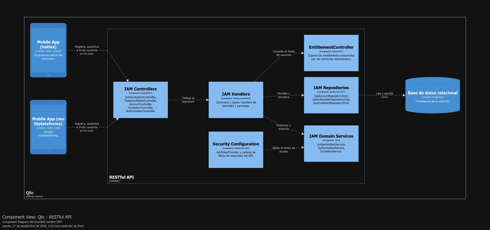

El diagrama incorpora el componente de configuración de seguridad como elemento transversal del container, dado que la validación del token se aplica a todas las solicitudes dirigidas a recursos protegidos de los demás bounded contexts.

#### 2.6.5.6. Bounded Context Software Architecture Code Level Diagrams

##### 2.6.5.6.1. Bounded Context Domain Layer Class Diagrams

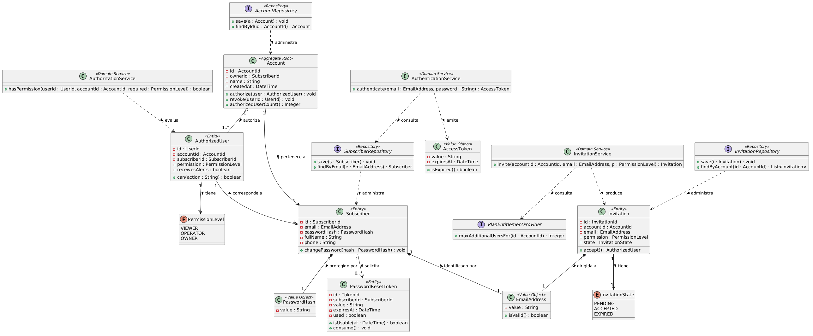

```plantuml
@startuml IAM Domain Layer

enum PermissionLevel { VIEWER \n OPERATOR \n OWNER }
enum InvitationState { PENDING \n ACCEPTED \n EXPIRED }

class Account <<Aggregate Root>> {
  - id : AccountId
  - ownerId : SubscriberId
  - name : String
  - createdAt : DateTime
  + authorize(user : AuthorizedUser) : void
  + revoke(userId : UserId) : void
  + authorizedUserCount() : Integer
}

class Subscriber <<Entity>> {
  - id : SubscriberId
  - email : EmailAddress
  - passwordHash : PasswordHash
  - fullName : String
  - phone : String
  + changePassword(hash : PasswordHash) : void
}

class AuthorizedUser <<Entity>> {
  - id : UserId
  - accountId : AccountId
  - subscriberId : SubscriberId
  - permission : PermissionLevel
  - receivesAlerts : boolean
  + can(action : String) : boolean
}

class EmailAddress <<Value Object>> {
  - value : String
  + isValid() : boolean
}

class PasswordHash <<Value Object>> {
  - value : String
}

class AccessToken <<Value Object>> {
  - value : String
  - expiresAt : DateTime
  + isExpired() : boolean
}

class PasswordResetToken <<Entity>> {
  - id : TokenId
  - subscriberId : SubscriberId
  - value : String
  - expiresAt : DateTime
  - used : boolean
  + isUsable(at : DateTime) : boolean
  + consume() : void
}

class Invitation <<Entity>> {
  - id : InvitationId
  - accountId : AccountId
  - email : EmailAddress
  - permission : PermissionLevel
  - state : InvitationState
  + accept() : AuthorizedUser
}

class AuthenticationService <<Domain Service>> {
  + authenticate(email : EmailAddress, password : String) : AccessToken
}

class AuthorizationService <<Domain Service>> {
  + hasPermission(userId : UserId, accountId : AccountId, required : PermissionLevel) : boolean
}

class InvitationService <<Domain Service>> {
  + invite(accountId : AccountId, email : EmailAddress, p : PermissionLevel) : Invitation
}

interface AccountRepository <<Repository>> {
  + save(a : Account) : void
  + findById(id : AccountId) : Account
}

interface SubscriberRepository <<Repository>> {
  + save(s : Subscriber) : void
  + findByEmail(e : EmailAddress) : Subscriber
}

interface InvitationRepository <<Repository>> {
  + save(i : Invitation) : void
  + findByAccount(id : AccountId) : List<Invitation>
}

interface PlanEntitlementProvider {
  + maxAdditionalUsersFor(id : AccountId) : Integer
}

Account "1" o-- "1..*" AuthorizedUser : autoriza >
Account "1" --> "1" Subscriber : pertenece a >
AuthorizedUser "1" --> "1" PermissionLevel : tiene >
AuthorizedUser "1" --> "1" Subscriber : corresponde a >
Subscriber "1" *-- "1" EmailAddress : identificado por >
Subscriber "1" *-- "1" PasswordHash : protegido por >
Subscriber "1" --> "0..*" PasswordResetToken : solicita >
Invitation "1" --> "1" InvitationState : tiene >
Invitation "1" *-- "1" EmailAddress : dirigida a >
AuthenticationService ..> AccessToken : emite >
AuthenticationService ..> SubscriberRepository : consulta >
AuthorizationService ..> AuthorizedUser : evalúa >
InvitationService ..> PlanEntitlementProvider : consulta >
InvitationService ..> Invitation : produce >
AccountRepository ..> Account : administra >
SubscriberRepository ..> Subscriber : administra >
InvitationRepository ..> Invitation : administra >

@enduml
```

##### 2.6.5.6.2. Bounded Context Database Design Diagram

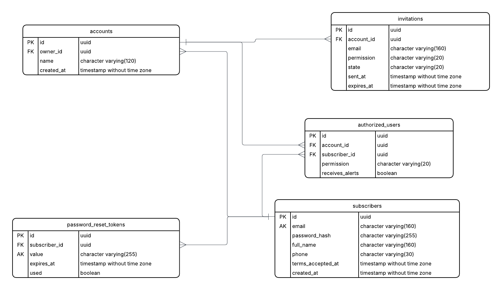

| Tabla | Columnas principales | Constraints |
|---|---|---|
| `subscribers` | `id` (PK), `email`, `password_hash`, `full_name`, `phone`, `terms_accepted_at`, `created_at` | PK sobre `id` · restricción de unicidad sobre `email` |
| `accounts` | `id` (PK), `owner_id` (FK), `name`, `created_at` | FK `owner_id` referencia `subscribers(id)` |
| `authorized_users` | `id` (PK), `account_id` (FK), `subscriber_id` (FK), `permission`, `receives_alerts` | FK sobre `account_id` y `subscriber_id` · restricción de unicidad sobre (`account_id`, `subscriber_id`) |
| `invitations` | `id` (PK), `account_id` (FK), `email`, `permission`, `state`, `sent_at`, `expires_at` | FK `account_id` referencia `accounts(id)` |
| `password_reset_tokens` | `id` (PK), `subscriber_id` (FK), `value`, `expires_at`, `used` | FK `subscriber_id` referencia `subscribers(id)` · restricción de unicidad sobre `value` |

---

### 2.6.6. Bounded Context: Support

Support gestiona el ciclo de atención de las incidencias reportadas por el suscriptor y la coordinación de las visitas técnicas. Es el contexto de menor complejidad de dominio, y su valor reside en cerrar el ciclo que inicia con una alerta y termina con la resolución del problema físico.

#### 2.6.6.1. Domain Layer

| Clase | Categoría | Propósito |
|---|---|---|
| `Incident` | Aggregate Root | Caso registrado por un suscriptor ante un problema con un dispositivo o una fuga confirmada, con su ciclo de atención. |
| `IncidentState` | Value Object (enum) | Estado del caso: `PENDING`, `VISIT_REQUESTED`, `IN_PROGRESS`, `RESOLVED`. |
| `IncidentOrigin` | Value Object (enum) | Origen del caso: `SELF_REPORTED`, `ALERT_DERIVED`. |
| `TechnicalVisit` | Entity | Visita programada para atender una incidencia en el domicilio o local del suscriptor. |
| `VisitState` | Value Object (enum) | Estado de la visita: `REQUESTED`, `ASSIGNED`, `COMPLETED`, `CANCELLED`. |
| `Technician` | Entity | Personal de soporte asignable a una visita técnica. |
| `AvailabilityWindow` | Value Object | Franja de disponibilidad declarada por el suscriptor para recibir la visita. |
| `Resolution` | Value Object | Descripción de la solución aplicada y su fecha de registro. |
| `IncidentLifecycleService` | Domain Service | Aplica las transiciones de estado válidas de una incidencia. |
| `VisitAssignmentService` | Domain Service | Determina el técnico asignable según la zona y la disponibilidad declarada. |
| `IncidentRepository` | Repository (interfaz) | Abstracción de persistencia y recuperación de incidencias. |
| `TechnicalVisitRepository` | Repository (interfaz) | Abstracción de persistencia y recuperación de visitas técnicas. |
| `TechnicianRepository` | Repository (interfaz) | Abstracción de persistencia y recuperación de técnicos. |
| `AlertDataProvider` | Interface | Abstracción de la consulta de los datos de la alerta que origina una incidencia, provista por Alerting. |
| `PlanEntitlementProvider` | Interface | Abstracción de la consulta de la cobertura de visita técnica, provista por Subscriptions. |
| `IncidentRegisteredEvent` | Domain Event | Se publica al registrarse una incidencia. |
| `TechnicianAssignedEvent` | Domain Event | Se publica al asignarse un técnico a una visita. |
| `IncidentResolvedEvent` | Domain Event | Se publica al resolverse una incidencia. Consumido por Alerting. |

**Reglas de negocio implementadas en el dominio**

- Los estados de una incidencia son `PENDING`, `VISIT_REQUESTED`, `IN_PROGRESS` y `RESOLVED`, y las transiciones válidas son aplicadas por `IncidentLifecycleService`.
- Una incidencia puede originarse de forma autónoma o a partir de una alerta activa, distinción registrada en `IncidentOrigin`.
- La solicitud de visita técnica requiere una incidencia en estado `PENDING`.
- La cobertura del servicio de visita técnica está determinada por el plan vigente, consultado mediante `PlanEntitlementProvider`.

#### 2.6.6.2. Interface Layer

| Clase | Categoría | Propósito |
|---|---|---|
| `IncidentController` | Controller | Expone los endpoints de registro, consulta y seguimiento de incidencias. |
| `TechnicalVisitController` | Controller | Expone los endpoints de solicitud de visita técnica y consulta de su estado. |
| `TechnicianController` | Controller | Expone los endpoints utilizados por el personal de soporte para registrar la atención. |
| `IncidentResource` | Resource | Representación de entrada y salida de una incidencia. |
| `TechnicalVisitResource` | Resource | Representación de entrada y salida de una visita técnica. |

#### 2.6.6.3. Application Layer

| Clase | Categoría | Propósito |
|---|---|---|
| `RegisterIncidentCommand` | Command | Solicita registrar una incidencia. |
| `RegisterIncidentCommandHandler` | Command Handler | Recupera los datos de la alerta cuando corresponde, crea la incidencia en estado `PENDING` y publica `IncidentRegisteredEvent`. |
| `RequestTechnicalVisitCommand` | Command | Solicita una visita técnica para una incidencia. |
| `RequestTechnicalVisitCommandHandler` | Command Handler | Verifica la cobertura del plan, registra la solicitud y transiciona la incidencia a `VISIT_REQUESTED`. |
| `AssignTechnicianCommand` | Command | Solicita asignar un técnico a una visita. |
| `AssignTechnicianCommandHandler` | Command Handler | Invoca `VisitAssignmentService`, registra la asignación y publica `TechnicianAssignedEvent`. |
| `ResolveIncidentCommand` | Command | Solicita registrar la resolución de una incidencia. |
| `ResolveIncidentCommandHandler` | Command Handler | Registra la `Resolution`, transiciona a `RESOLVED` y publica `IncidentResolvedEvent`. |
| `GetIncidentsByAccountQuery` | Query | Solicita el listado de incidencias de una cuenta. |
| `GetIncidentsByAccountQueryHandler` | Query Handler | Recupera las incidencias verificando los permisos del solicitante. |
| `LeakAlertGeneratedEventHandler` | Event Handler | Registra la trazabilidad de las alertas susceptibles de derivar en una incidencia. |

#### 2.6.6.4. Infrastructure Layer

| Clase | Categoría | Propósito |
|---|---|---|
| `JpaIncidentRepositoryImpl` | Repository Impl | Implementa `IncidentRepository` mediante Spring Data JPA. |
| `JpaTechnicalVisitRepositoryImpl` | Repository Impl | Implementa `TechnicalVisitRepository` mediante Spring Data JPA. |
| `JpaTechnicianRepositoryImpl` | Repository Impl | Implementa `TechnicianRepository` mediante Spring Data JPA. |
| `AlertDataAdapter` | Adapter | Implementa `AlertDataProvider` consultando al contexto Alerting. |
| `PlanEntitlementAdapter` | Adapter | Implementa `PlanEntitlementProvider` consultando al contexto Subscriptions. |
| `IncidentEntity` | Persistence Entity | Representación de persistencia del agregado `Incident`. |
| `TechnicalVisitEntity` | Persistence Entity | Representación de persistencia de una visita técnica. |

#### 2.6.6.5. Bounded Context Software Architecture Component Level Diagrams

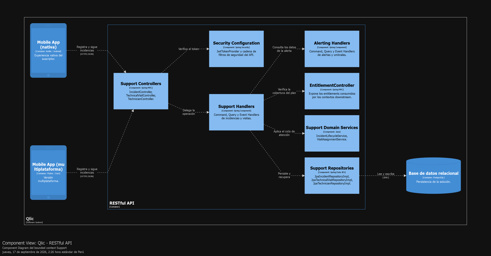

El diagrama refleja que este bounded context atiende a dos tipos de usuario distintos sobre el mismo container: el suscriptor, que registra y hace seguimiento a sus incidencias desde la aplicación móvil, y el técnico de soporte, que registra la atención realizada.

#### 2.6.6.6. Bounded Context Software Architecture Code Level Diagrams

##### 2.6.6.6.1. Bounded Context Domain Layer Class Diagrams

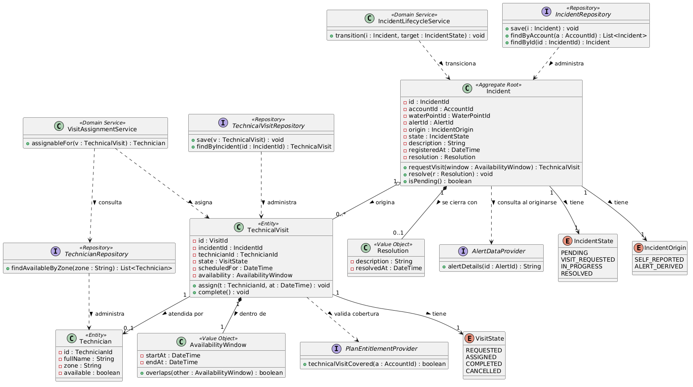

```plantuml
@startuml Support Domain Layer

enum IncidentState { PENDING \n VISIT_REQUESTED \n IN_PROGRESS \n RESOLVED }
enum IncidentOrigin { SELF_REPORTED \n ALERT_DERIVED }
enum VisitState { REQUESTED \n ASSIGNED \n COMPLETED \n CANCELLED }

class Incident <<Aggregate Root>> {
  - id : IncidentId
  - accountId : AccountId
  - waterPointId : WaterPointId
  - alertId : AlertId
  - origin : IncidentOrigin
  - state : IncidentState
  - description : String
  - registeredAt : DateTime
  - resolution : Resolution
  + requestVisit(window : AvailabilityWindow) : TechnicalVisit
  + resolve(r : Resolution) : void
  + isPending() : boolean
}

class TechnicalVisit <<Entity>> {
  - id : VisitId
  - incidentId : IncidentId
  - technicianId : TechnicianId
  - state : VisitState
  - scheduledFor : DateTime
  - availability : AvailabilityWindow
  + assign(t : TechnicianId, at : DateTime) : void
  + complete() : void
}

class Technician <<Entity>> {
  - id : TechnicianId
  - fullName : String
  - zone : String
  - available : boolean
}

class AvailabilityWindow <<Value Object>> {
  - startAt : DateTime
  - endAt : DateTime
  + overlaps(other : AvailabilityWindow) : boolean
}

class Resolution <<Value Object>> {
  - description : String
  - resolvedAt : DateTime
}

class IncidentLifecycleService <<Domain Service>> {
  + transition(i : Incident, target : IncidentState) : void
}

class VisitAssignmentService <<Domain Service>> {
  + assignableFor(v : TechnicalVisit) : Technician
}

interface IncidentRepository <<Repository>> {
  + save(i : Incident) : void
  + findByAccount(a : AccountId) : List<Incident>
  + findById(id : IncidentId) : Incident
}

interface TechnicalVisitRepository <<Repository>> {
  + save(v : TechnicalVisit) : void
  + findByIncident(id : IncidentId) : TechnicalVisit
}

interface TechnicianRepository <<Repository>> {
  + findAvailableByZone(zone : String) : List<Technician>
}

interface AlertDataProvider {
  + alertDetails(id : AlertId) : String
}

interface PlanEntitlementProvider {
  + technicalVisitCovered(a : AccountId) : boolean
}

Incident "1" --> "1" IncidentState : tiene >
Incident "1" --> "1" IncidentOrigin : tiene >
Incident "1" *-- "0..1" Resolution : se cierra con >
Incident "1" o-- "0..*" TechnicalVisit : origina >
TechnicalVisit "1" --> "1" VisitState : tiene >
TechnicalVisit "1" --> "0..1" Technician : atendida por >
TechnicalVisit "1" *-- "1" AvailabilityWindow : dentro de >
IncidentLifecycleService ..> Incident : transiciona >
VisitAssignmentService ..> TechnicianRepository : consulta >
VisitAssignmentService ..> TechnicalVisit : asigna >
Incident ..> AlertDataProvider : consulta al originarse >
TechnicalVisit ..> PlanEntitlementProvider : valida cobertura >
IncidentRepository ..> Incident : administra >
TechnicalVisitRepository ..> TechnicalVisit : administra >
TechnicianRepository ..> Technician : administra >

@enduml
```

##### 2.6.6.6.2. Bounded Context Database Design Diagram

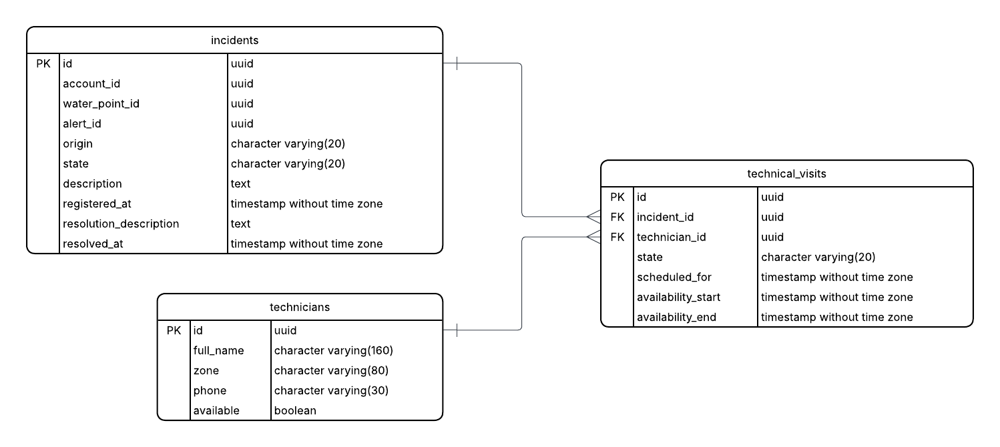

| Tabla | Columnas principales | Constraints |
|---|---|---|
| `incidents` | `id` (PK), `account_id`, `water_point_id`, `alert_id`, `origin`, `state`, `description`, `registered_at`, `resolution_description`, `resolved_at` | PK sobre `id` · índice sobre (`account_id`, `state`) |
| `technical_visits` | `id` (PK), `incident_id` (FK), `technician_id` (FK), `state`, `scheduled_for`, `availability_start`, `availability_end` | FK `incident_id` referencia `incidents(id)` · FK `technician_id` referencia `technicians(id)` |
| `technicians` | `id` (PK), `full_name`, `zone`, `phone`, `available` | PK sobre `id` · índice sobre `zone` |

---

### Resumen de la sección 2.6

| Bounded Context | Clasificación | Agregados | Clases de dominio | Endpoints expuestos | Tablas |
|---|---|---:|---:|---:|---:|
| Alerting | Core | 1 | 18 | 3 controladores + 2 consumidores | 4 |
| Consumption Analytics | Core | 1 | 22 | 4 controladores + 1 consumidor | 6 |
| Device Monitoring | Supporting | 2 | 20 | 6 controladores | 5 |
| Subscriptions | Supporting | 2 | 20 | 5 controladores + 1 consumidor | 4 |
| IAM | Generic | 1 | 19 | 5 controladores | 5 |
| Support | Supporting | 1 | 17 | 3 controladores | 3 |

La distribución evidencia la concentración de complejidad de dominio en los dos contextos core, conforme a lo establecido en el Candidate Context Discovery de la sección 2.5.1.1. En total, el modelo táctico comprende 8 agregados, 116 clases de dominio y 27 tablas de persistencia distribuidas en los seis bounded contexts.
