# Capítulo III: Solution UI/UX Design

## 3.1. Product design

En este capítulo se presenta el diseño del producto Qlic en sus tres puntos de contacto con el usuario: el sitio web estático (Landing Page), la aplicación móvil nativa Android y la aplicación móvil multiplataforma. Las decisiones de estilo, arquitectura de información y flujos de interacción se derivan de los requisitos de la sección 2.4, de los User Personas de la sección 2.3.1 (Carlos Abanto, del segmento PYMES, y Claudia Morales, del segmento Hogares y Familias) y de los artefactos de Needfinding, de modo que la experiencia sea coherente en diseño, usabilidad e interacción.

### 3.1.1. Style Guidelines

En esta sección se establece el repositorio central de decisiones visuales y de comunicación que todo el equipo aplica en el Landing Page y en las aplicaciones móviles. Se toma como base el Design System Material Design 3, adaptado a la identidad de Qlic, y se sustenta cada decisión en los principios de diseño de claridad, consistencia, jerarquía visual y diseño inclusivo.

#### 3.1.1.1. General Style Guidelines

**Branding.** Qlic transmite tranquilidad y control sobre un recurso cotidiano. La identidad se apoya en el azul como color de confianza y en el logo de Qlic en versión horizontal para cabeceras y en versión de ícono para la aplicación móvil. [COMPLETAR: imagen del logo y reglas de uso: zona de respeto y tamaño mínimo].

**Tono de comunicación.** Se ubica en las cuatro dimensiones de tono de voz de Nielsen Norman Group de la siguiente manera:

| Dimensión | Posición | Justificación |
|---|---|---|
| Divertido / Serio | Serio | Se trata de dinero y de riesgo de fugas; las alertas deben tomarse en serio. |
| Formal / Casual | Casual | Carlos y Claudia piden una interfaz sin tecnicismos y cercana. |
| Respetuoso / Irreverente | Respetuoso | La aplicación comunica problemas (fugas, consumo alto) sin culpar al usuario. |
| Entusiasta / Sereno | Sereno | Las alertas no deben alarmar de más; las personas entrevistadas rechazan la saturación de notificaciones. |

El idioma por defecto de la interfaz es inglés y se ofrece español, conforme al alcance del proyecto.

**Typography.** Se utilizan dos familias: Poppins para títulos y encabezados, por su forma geométrica limpia, y Roboto para párrafos, datos y etiquetas, por su alta legibilidad en pantallas pequeñas. La escala propuesta para móvil es:

| Nivel | Familia | Tamaño | Peso |
|---|---|---|---|
| Headline | Poppins | 24 sp | SemiBold |
| Title | Poppins | 20 sp | Medium |
| Subtitle | Roboto | 16 sp | Medium |
| Body | Roboto | 14 sp | Regular |
| Caption | Roboto | 12 sp | Regular |

Se usan unidades `sp` en Android para respetar la configuración de tamaño de texto del dispositivo, lo que apoya el diseño inclusivo.

**Colors.** La paleta parte del azul primario del sitio web y se completa con colores semánticos para los estados de la aplicación.

| Token | Hex | Uso | Estado |
|---|---|---|---|
| Primary | `#0C4AFD` | Barra superior, botones principales, elementos activos de navegación | Existente |
| On Primary | `#FFFFFF` | Texto e íconos sobre Primary | Existente |
| Text Primary | `#0F0F0F` | Títulos y texto principal | Existente |
| Text Secondary | `#6B7280` | Descripciones y texto de apoyo | Existente |
| Background | `#FFFFFF` | Fondo general y cards | Existente |
| Surface Soft | `#E8FFEE` | Secciones de énfasis suave en el Landing Page | Existente |
| Success | `#22C55E` | Dispositivo conectado, operación exitosa | Existente (se redefine su uso) |
| Warning | `#F59E0B` | Consumo por encima del umbral, dispositivo con batería baja | Propuesto |
| Error / Leak | `#DC2626` | Alerta de posible fuga, credenciales inválidas | Propuesto |
| Secondary (azul oscuro) | [COMPLETAR: hex del Figma] | Contraste y encabezados | Pendiente |

Decisiones de contraste: `#0C4AFD` sobre blanco tiene una relación aproximada de 6,1:1 y `#6B7280` sobre blanco de 4,8:1, ambas por encima del mínimo de 4,5:1 de WCAG 2.1 nivel AA para texto normal. `#22C55E` sobre blanco no alcanza ese mínimo, por lo que el verde nunca se usa como color de texto sobre fondo claro: acompaña a un ícono y a una etiqueta. Además, ningún estado se comunica solo con color; siempre lleva ícono y texto (por ejemplo, "Leak alert" con ícono de advertencia).

Regla de uso del verde: se reserva para estados de éxito y conexión. Los botones de acción principal son siempre azules, incluido el envío del formulario de contacto del Landing Page.

**Spacing.** Se usa una cuadrícula base de 8 dp (4, 8, 16, 24, 32). Las cards tienen esquinas de 12 dp y sombra suave (elevación de 1 a 2 dp), y el margen lateral de pantalla es de 16 dp. Las áreas táctiles miden como mínimo 48 × 48 dp, conforme a las pautas de accesibilidad de Android.

**Componentes móviles base** (Material 3 en Jetpack Compose):

- **Botón principal:** fondo Primary, texto On Primary, altura de 48 dp, esquinas de 12 dp.
- **Botón secundario:** contorno Primary, fondo transparente.
- **Campo de texto:** con etiqueta flotante, mensaje de error debajo en color Error y ícono de error.
- **Card de dispositivo:** nombre, Water Point, estado con ícono y última lectura.
- **Card de alerta:** ícono de severidad, título, ubicación, hora y botón "Acknowledge".
- **Barra de navegación inferior:** cinco destinos (ver 3.1.2.5).
  **Principios de diseño aplicados.** Jerarquía visual (título > dato clave > detalle) para que Claudia encuentre el consumo del día sin leer; consistencia entre Landing Page, aplicación Android y aplicación Flutter mediante los mismos tokens; retroalimentación inmediata en formularios; y diseño inclusivo (contraste, tamaños escalables, etiquetas de accesibilidad `contentDescription` en íconos y color no como único medio de información).

### 3.1.2. Information Architecture

Las decisiones de esta sección organizan el contenido del Landing Page y de la aplicación móvil para que Carlos y Claudia encuentren lo que necesitan sin esfuerzo: el estado de su agua, las alertas y sus dispositivos. Se priorizan las tareas de mayor frecuencia e importancia de la User Task Matrix (sección 2.3.2): detectar fugas o consumos anómalos, verificar el nivel de tanques y comparar el gasto entre periodos.

#### 3.1.2.1. Organization Systems

| Contenido | Sistema de organización | Justificación |
|---|---|---|
| Landing Page | Secuencial, de lo general a lo específico: propuesta de valor → funcionalidades → segmentos → planes → testimonios → preguntas frecuentes → contacto | Acompaña el proceso de decisión del visitante (US01, US02, US03). |
| Home de la aplicación | Jerárquico (visual hierarchy): estado general y consumo del día arriba, alertas activas en medio, accesos a dispositivos abajo | El dato más importante para ambos segmentos es saber si hay algo anormal. |
| Lista de dispositivos | Por tópicos (por local y por Water Point) | Responde a US13 y al segmento PYMES con más de un local. |
| Alertas | Cronológico, con filtros por estado y urgencia | Las alertas recientes son las más accionables. |
| Reportes | Cronológico (periodos) | Permite comparar entre periodos (US22). |
| Planes de suscripción | Matricial (plan × características) | Facilita la comparación de Plan Básico y Plan Gestión Pro (US02). |
| Contenido por segmento | Según audiencia (Hogares / PYMES) | Los segmentos difieren en el nivel de detalle que requieren. |
| Registro de dispositivo | Secuencial (paso a paso) | Usuarios sin conocimientos técnicos necesitan una guía lineal (US10, US16 del segmento). |

#### 3.1.2.2. Labelling Systems

Las etiquetas usan el mínimo de palabras y el mismo término en toda la experiencia. El idioma base es inglés, con su equivalente en español latinoamericano.

| Etiqueta (Ingles) | Español | Qué agrupa |
|---|---|---|
| Home | Inicio | Resumen de consumo y alertas activas |
| Devices | Dispositivos | Sensores, Water Points y estado de conexión |
| Alerts | Alertas | Fugas, consumo anómalo y nivel bajo de tanque |
| Reports | Reportes | Consumo por periodo, comparación y costo estimado |
| Account | Cuenta | Perfil, plan, usuarios autorizados, términos y condiciones |
| Sign in | Iniciar sesión | Acceso a la aplicación |
| Create account | Crear cuenta | Registro de suscriptor |
| Forgot password? | ¿Olvidaste tu contraseña? | Recuperación de acceso |
| Acknowledge | Confirmar atención | Marca una alerta como atendida |

Se evita el uso de términos técnicos como "sensor IoT" o "umbral" en las pantallas principales; en su lugar se usan "device" y "limit". Los términos del dominio coinciden con el Ubiquitous Language de la sección 2.3.6 (por ejemplo, Water Point).

#### 3.1.2.3. SEO Tags and Meta Tags

Los valores de esta sección mantienen una propuesta de valor coherente con los segmentos PYMES y Hogares y Familias: detectar fugas y consumos anómalos, consultar el consumo desde el celular y recibir alertas accionables. El idioma principal de publicación es inglés y se incluye la localización `es-419` para español latinoamericano. El campo **Author** identifica al equipo responsable del producto, no a una persona individual.

**Landing Page (sitio web estático).** La página pública utiliza una sola experiencia con navegación por anclas; por eso cada fila identifica la página o sección que debe conservar sus metadatos al generarse o compartirse.

| Página o sección | Title | Meta description | Meta keywords | Author |
|---|---|---|---|---|
| Home / propuesta de valor | `Qlic \| Smart Water Monitoring` | `Detect leaks and unusual water consumption before they become costly. Monitor your home or business with Qlic.` | `Qlic, smart water monitoring, leak detection, water consumption, home, business` | `Qlic Team` |
| Soluciones para PYMES | `Qlic for Businesses \| Prevent Water Loss` | `Give your business clear water-consumption data, timely leak alerts and practical actions to reduce operating costs.` | `water monitoring for business, leak alerts, commercial water use, Qlic` | `Qlic Team` |
| Soluciones para hogares | `Qlic for Homes \| Prevent Leaks` | `Protect your home from hidden leaks and unusual consumption with simple mobile alerts and clear water data.` | `home water monitoring, household leak detection, water alerts, Qlic` | `Qlic Team` |
| Planes | `Qlic Plans \| Choose Your Water Monitoring Plan` | `Compare Qlic plans and choose the level of water monitoring, alerts and reports that fits your needs.` | `Qlic plans, water monitoring subscription, leak detection plan, water reports` | `Qlic Team` |
| Contacto | `Contact Qlic \| Water Monitoring Support` | `Talk to the Qlic team about water monitoring, installation guidance, support and subscription plans.` | `contact Qlic, water monitoring support, sensor installation, Qlic` | `Qlic Team` |
| Términos y condiciones | `Qlic Terms and Conditions` | `Review the terms that govern access to Qlic services, accounts, alerts and water-monitoring features.` | `Qlic terms, service conditions, water monitoring privacy` | `Qlic Team` |

**Web Application.** Estas etiquetas corresponden a las vistas principales descritas en la arquitectura de información. Las rutas son nombres funcionales de pantalla; no se presentan como URL públicas hasta que se implemente el frontend.

| Vista | Title | Meta description | Meta keywords | Author |
|---|---|---|---|---|
| Sign in | `Sign in \| Qlic` | `Sign in to Qlic to review water consumption, devices and active alerts.` | `Qlic sign in, water monitoring account, water alerts` | `Qlic Team` |
| Home dashboard | `Dashboard \| Qlic` | `See today's water consumption, active alerts and device status in one place.` | `Qlic dashboard, water consumption, leak alerts, device status` | `Qlic Team` |
| Devices | `Devices \| Qlic` | `Review connected devices and Water Points, their status and latest readings.` | `Qlic devices, Water Point, connected water sensors` | `Qlic Team` |
| Alerts | `Alerts \| Qlic` | `Review, filter and acknowledge water leaks, unusual consumption and low-battery alerts.` | `Qlic alerts, leak alert, unusual water consumption` | `Qlic Team` |
| Reports | `Reports \| Qlic` | `Compare water consumption and estimated cost by period and location.` | `Qlic water reports, consumption comparison, estimated water cost` | `Qlic Team` |
| Account | `Account \| Qlic` | `Manage your Qlic profile, plan, authorized users and service preferences.` | `Qlic account, subscription plan, authorized users` | `Qlic Team` |

Además de los metadatos mínimos solicitados, el Landing Page debe declarar `lang="en"`, `hreflang="en"` y `hreflang="es-419"`, una URL canónica y etiquetas Open Graph (`og:title`, `og:description`, `og:type`, `og:url` y `og:image`) para que el enlace compartido conserve el contexto de la página. En las pantallas autenticadas se prioriza el título de la vista y la accesibilidad; el contenido no debe depender de `meta keywords` para funcionar.

Ejemplo de implementación para la página principal:

```html
<title>Qlic | Smart Water Monitoring</title>
<meta name="description" content="Monitor water use, detect unusual patterns and act on clear alerts for your home or business.">
<meta name="keywords" content="Qlic, smart water monitoring, leak detection, water consumption, home, business">
<meta name="author" content="Qlic Team">
<link rel="canonical" href="https://1acc0238-2620-13984-aplicaciones-mov.github.io/qlic-landing-page/">
<link rel="alternate" hreflang="en" href="https://1acc0238-2620-13984-aplicaciones-mov.github.io/qlic-landing-page/">
<link rel="alternate" hreflang="es-419" href="https://1acc0238-2620-13984-aplicaciones-mov.github.io/qlic-landing-page/">
<meta property="og:title" content="Qlic | Smart Water Monitoring">
<meta property="og:description" content="Monitor water use, detect unusual patterns and act on clear alerts for your home or business.">
<meta property="og:type" content="website">
<meta property="og:url" content="https://1acc0238-2620-13984-aplicaciones-mov.github.io/qlic-landing-page/">
<meta property="og:image" content="https://1acc0238-2620-13984-aplicaciones-mov.github.io/qlic-landing-page/og-image.svg">
```

La ruta `/` representa la página principal; el hosting debe resolverla al dominio público real del proyecto. La imagen Open Graph debe apuntar al recurso gráfico versionado que el equipo publique. La longitud de los títulos y descripciones se mantiene deliberadamente breve para evitar truncamiento en resultados y enlaces compartidos.

**Implementación verificada.** Los metadatos mínimos del Landing Page se implementaron en `index.html` del repositorio [qlic-landing-page](https://github.com/1ACC0238-2620-13984-Aplicaciones-Mov/qlic-landing-page) en el commit local `29e4694`: `title`, `description`, `keywords`, `author`, `canonical`, `hreflang` para `en` y `es-419`, y las etiquetas Open Graph `og:title`, `og:description`, `og:type`, `og:url` y `og:image`. La lógica JavaScript de `src/seo.js` mantiene estos valores cuando el visitante cambia el idioma mediante i18next; la descripción y las palabras clave se actualizan a la variante seleccionada, mientras que la URL canónica corresponde al único despliegue público del sitio. La imagen social se versiona como `public/og-image.svg`.

La URL pública registrada es [Qlic Landing Page](https://1acc0238-2620-13984-aplicaciones-mov.github.io/qlic-landing-page/), que responde por HTTPS. La implementación y el build de los metadatos se verificaron localmente; después de publicar estos cambios en `main`, se debe comprobar nuevamente el HTML servido y actualizar la captura de evidencia si el docente la solicita. La tabla de valores de esta sección representa la especificación para el Landing Page; las vistas de la aplicación web mantienen sus títulos y descripciones propuestos hasta que se implemente ese producto.

**ASO para las aplicaciones móviles.** Los siguientes valores se aplican a la ficha de Qlic en una tienda de aplicaciones y se localizan para inglés y español latinoamericano.

| Elemento ASO | English (en-US) | Español latinoamericano (es-419) |
|---|---|---|
| App Title | `Qlic Water Monitor` | `Qlic Monitor de Agua` |
| App subtitle | `Detect leaks. Control water use.` | `Detecta fugas. Controla tu consumo.` |
| App keywords | `water monitoring, leak detection, water alerts, consumption, smart home, business` | `monitoreo de agua, detección de fugas, alertas, consumo, hogar inteligente, negocio` |
| App description | `Qlic helps homes and businesses monitor water consumption, detect unusual use and act on clear mobile alerts. Review devices, compare periods and keep water costs under control.` | `Qlic ayuda a hogares y negocios a monitorear el consumo de agua, detectar usos inusuales y actuar con alertas móviles claras. Revisa dispositivos, compara periodos y mantén bajo control el gasto de agua.` |

La descripción ASO no promete corte automático ni ahorro garantizado; comunica únicamente capacidades contempladas en el alcance de Qlic. Las palabras clave se relacionan con las necesidades observadas en las entrevistas y no incluyen marcas de terceros.

#### 3.1.2.4. Searching Systems

La aplicación ofrece búsqueda donde el volumen de información lo justifica:

| Ubicación | Qué se busca | Filtros | Cómo se muestran los resultados |
|---|---|---|---|
| Devices | Nombre de dispositivo o de Water Point | Local, estado (Connected / Offline / Low battery) | Lista de cards de dispositivo con el término coincidente resaltado |
| Alerts | Texto de la alerta o ubicación | Estado (Open / Acknowledged), urgencia (High / Medium / Low), rango de fechas | Lista cronológica inversa con ícono de severidad |
| Reports | No aplica búsqueda de texto | Periodo (día, semana, mes) y local | Gráfico y tabla del periodo |

Si no hay coincidencias, se muestra un estado vacío con un mensaje claro ("No devices match your search") y una acción para limpiar los filtros. En el Landing Page, el acceso a la información se resuelve con navegación anclada y una sección de preguntas frecuentes, ya que su contenido es breve y no justifica un buscador.

#### 3.1.2.5. Navigation Systems

**Aplicación móvil.** Se adopta una barra de navegación inferior con cinco destinos (Home, Devices, Alerts, Reports, Account), patrón recomendado por Material Design para entre tres y cinco destinos de primer nivel y de alcance cómodo con el pulgar. Además:

- El flujo de autenticación (Sign in, Create account, Forgot password) se presenta fuera de la barra inferior y, una vez iniciada la sesión, el usuario llega a Home.
- Las pantallas de detalle (detalle de dispositivo, detalle de alerta) se abren con navegación jerárquica y botón "Back" en la barra superior.
- Las acciones de mayor frecuencia se ubican en Home: ver alertas activas y acceder al detalle de consumo.
- Las notificaciones push llevan directamente al detalle de la alerta correspondiente (deep link), lo que reduce pasos para la tarea crítica.
- El registro de un dispositivo nuevo se inicia desde Devices y usa un flujo secuencial con lectura de código QR.
  **Landing Page.** Barra de navegación superior fija con anclas a cada sección; en móvil se convierte en menú hamburguesa. El botón de llamada a la acción "Contact Sales" permanece visible, y el enlace a Terms and Conditions se ubica en el footer. [COMPLETAR: confirmar etiquetas finales de la barra].

### 3.1.3. Landing Page UI Design

El Landing Page traduce las decisiones de las secciones 3.1.1 y 3.1.2 en una página informativa que presenta el modelo de negocio, los planes de suscripción y el llamado a la descarga de la aplicación. Se diseñó primero para pantalla móvil y luego se extendió a escritorio.

#### 3.1.3.1. Landing Page Wireframe

Se presentan los wireframes para Desktop Web Browser y Mobile Web Browser. La estructura sigue el orden definido en 3.1.2.1: encabezado con logo y navegación, Hero con propuesta de valor y dos llamados a la acción, funcionalidades, soluciones por segmento, planes, testimonios, preguntas frecuentes, formulario de contacto y footer con enlaces legales. El diseño se presenta dividido en seis partes para mostrar la página completa.

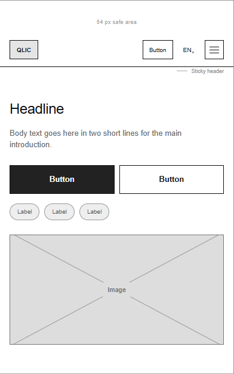

*Figura 3.1. Parte 1: encabezado con logo y navegación, y sección Hero.*

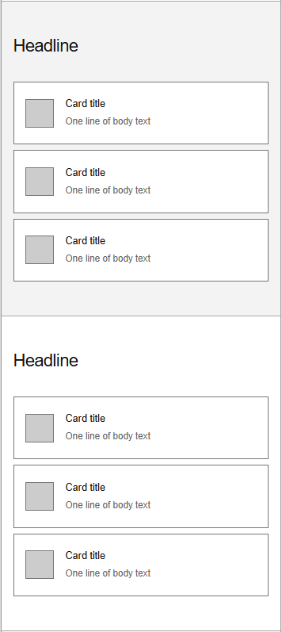

*Figura 3.2. Parte 2: secciones "Full visibility of your water" y "About Us".*

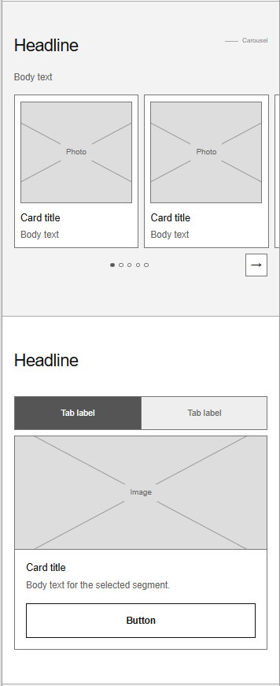

*Figura 3.3. Parte 3: secciones "Our Team" y "Solutions by segment".*

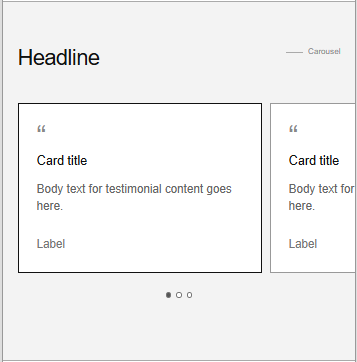

*Figura 3.4. Parte 4: secciones "What our customers say".*

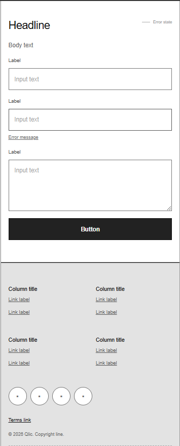

*Figura 3.5. Parte 5: sección  "Contact Sales" y footer".*

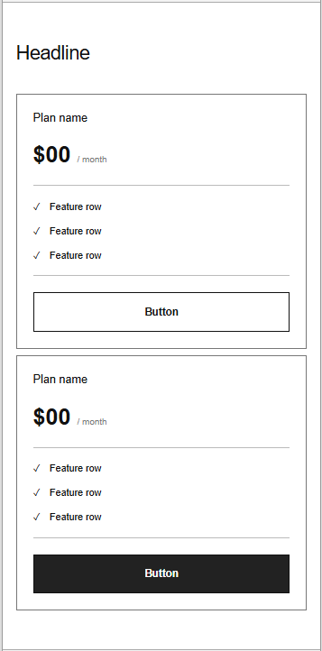

*Figura 3.6. Parte 6: secciones "Subscription plans".*

Explicación: en la versión de escritorio las funcionalidades y los planes se presentan en columnas; en móvil pasan a una sola columna y la navegación se colapsa en menú hamburguesa, manteniendo el orden de lectura. La jerarquía visual coloca la propuesta de valor y el botón principal en la primera pantalla. Se aplica diseño inclusivo con orden lógico de lectura, etiquetas claras y atributos ARIA en navegación, formulario y preguntas frecuentes.
#### 3.1.3.2. Landing Page Mock-up

Los mock-ups aplican el Design System definido en 3.1.1: Poppins y Roboto, azul `#0C4AFD` para acciones principales, cards con esquinas redondeadas y verde reservado a estados de éxito. El diseño se presenta en versión móvil, dividido en cinco partes para mostrar la página completa.

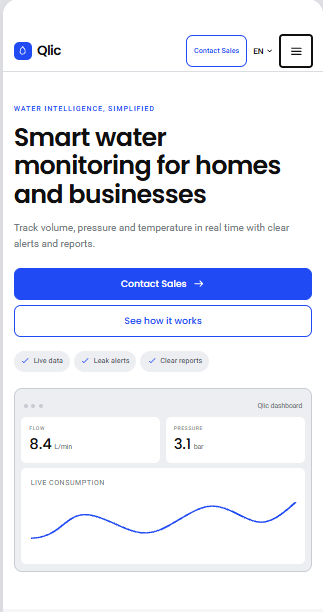

*Figura 3.7. Parte 1: encabezado con selector de idioma y menú, y sección Hero.*

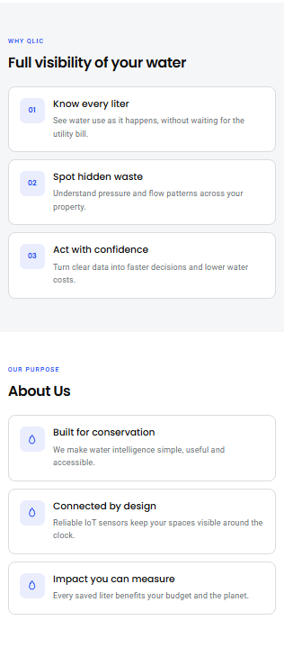

*Figura 3.8. Parte 2: secciones "Full visibility of your water" y "About Us".*

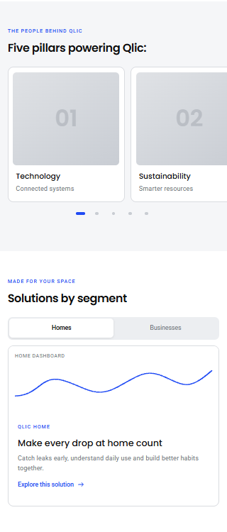

*Figura 3.9. Parte 3: sección "Our Team" y "Solutions by segment".*

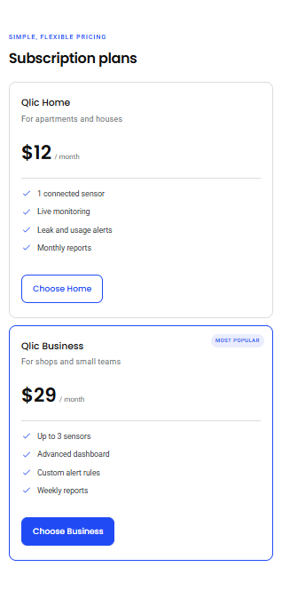

*Figura 3.10. Parte 4: "Subscription plans".*

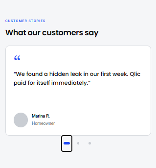

*Figura 3.11. Parte 5: sección "What our customers say".*

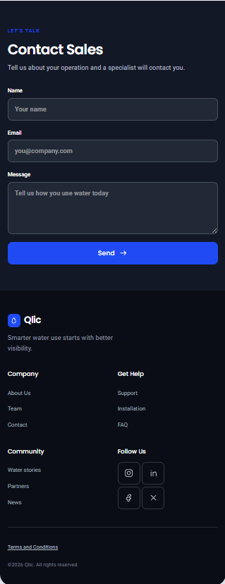

*Figura 3.12. Parte 6: "Contact Sales" y footer.*


Explicación: el Hero comunica el beneficio central de Qlic (visibilidad del consumo de agua y alertas oportunas) para hogares y PYMES. La sección de planes presenta Plan Básico y Plan Gestión Pro en formato de comparación (US02). Los testimonios provienen de las entrevistas de validación del proyecto. El formulario de contacto informa el dato faltante en caso de error (US03) y el selector de idioma permite cambiar entre inglés y español latinoamericano (US04). El footer incluye el enlace a los términos y condiciones del servicio y el video About-the-Product. [COMPLETAR: confirmar nombres de planes y precios con el equipo].

### 3.1.4. Mobile Applications UX/UI Design

En esta sección se presenta la propuesta visual y de interacción de la aplicación móvil de Qlic, que se implementa como aplicación nativa en Kotlin para Android y como aplicación multiplataforma en Flutter con la misma estructura de pantallas. Las secciones internas avanzan del nivel de estructura al de interacción: los wireframes definen la organización de cada vista, los wireflows y user flows encadenan esas vistas por User Goal, los mock-ups aplican el Design System de la sección 3.1.1 y los prototipos simulan la navegación completa. Todas las vistas respetan el sistema de navegación definido en 3.1.2.5 y las etiquetas de 3.1.2.2.

#### 3.1.4.1. Mobile Applications Wireframes

Los wireframes se elaboraron en Figma sobre un marco de 360 × 800 dp, con áreas seguras superior e inferior, cuadrícula base de 8 dp y márgenes laterales de 16 dp. Representan la estructura y la jerarquía de cada vista en escala de grises, sin decisiones de color ni tipografía final, para validar primero la arquitectura de información. La Tabla 3.1 relaciona cada pantalla con las User Stories que atiende y con el Sprint en que se implementa, de modo que el alcance del Sprint 1 quede cubierto por al menos una vista.

*Tabla 3.1. Pantallas de la aplicación móvil y su relación con el Product Backlog.*

| # | Pantalla | User Stories | Sprint | Acceso en la navegación |
|---|---|---|---|---|
| 1 | Sign in | US06 | 1 | Flujo de autenticación |
| 2 | Create account | US05, US38 | 1 | Sign in › "Create account" |
| 3 | Main Dashboard y menú "More" | US12, US15 | 1 | Barra inferior › Dashboard |
| 4 | Alerts | US15, US16, US18, US20 | 1 y 2 | Barra inferior › Alerts |
| 5 | Alert detail | US16, US20 | 1 | Alerts › tarjeta de alerta, o notificación push |
| 6 | Devices | US12, US13 | 1 | Barra inferior › Business › pestaña Devices |
| 7 | Add device (lectura de código QR) | US10 | 1 | Devices › "Add device" |
| 8 | Assign Water Point | US11 | 1 | Add device › paso 2, o detalle del dispositivo |
| 9 | Inventory + features | US28, US29, US30 | 2 y 3 | Barra inferior › Business › pestaña Tanks |
| 10 | Support & Help | US35, US36, US37 | 2 y 3 | More › Support |

Todas las pantallas autenticadas comparten la barra superior con el logo, el contador de alertas y el avatar del perfil, y la barra de navegación inferior con cinco destinos: Dashboard, Alerts, Reports, Business y More. Los dispositivos y los tanques se agrupan en Business porque ambos describen la infraestructura de agua del local o del hogar; así se conserva el límite de cinco destinos que recomienda Material Design para la barra inferior (Google, s. f.-d).

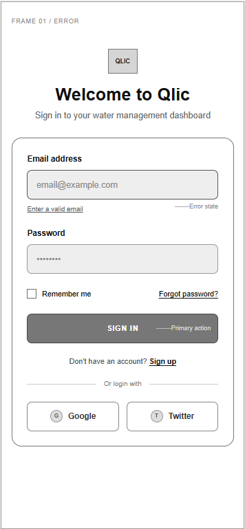

*Figura 3.13. Wireframe de la pantalla Sign in.*

Explicación: el acceso se concentra en una sola columna, con los campos de correo y contraseña en el centro y el botón "Sign in" como acción principal. Los enlaces "Forgot password?" y "Create account" llevan a las demás pantallas del flujo de autenticación, y se muestran los accesos con Google y X como alternativa; estos accesos no forman parte de las User Stories del Product Backlog, por lo que no se implementan en el Sprint 1 y quedan como mejora posterior sujeta a validación.

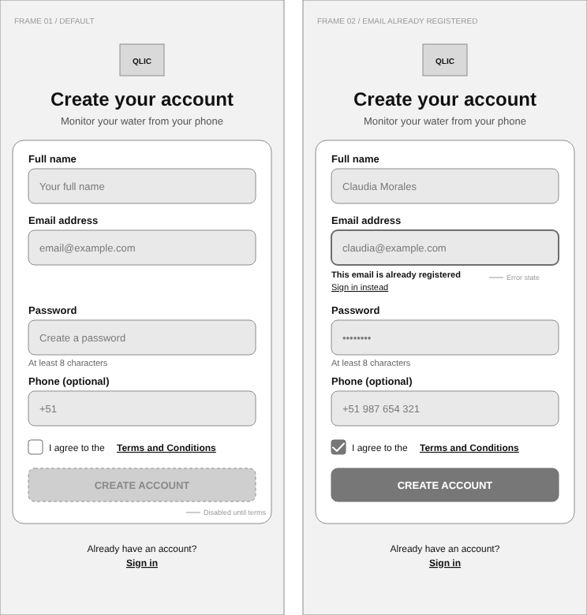

*Figura 3.14. Wireframe de la pantalla Create account, con el estado de error de correo ya registrado.*

Explicación: atiende US05 con un formulario de una sola columna y el mínimo de campos necesario: nombre completo, correo, contraseña y teléfono opcional. La casilla "I agree to the Terms and Conditions" enlaza al texto completo (US38) y el botón "Create account" permanece deshabilitado hasta que se acepta, lo que evita un error previsible. El segundo estado muestra el escenario 2 de US05: el mensaje "This email is already registered" aparece debajo del campo, con ícono, y ofrece el enlace "Sign in instead" para que el usuario no quede bloqueado. Los requisitos de la contraseña se muestran antes de escribir y no solo después del error.

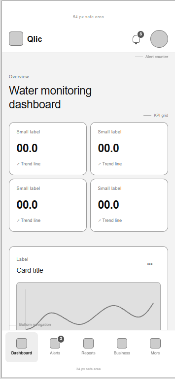

*Figura 3.15. Wireframe de la pantalla Main Dashboard y del menú "More".*

Explicación: la información se ordena de lo más importante a lo más detallado: primero los indicadores del día y las alertas activas en una cuadrícula de 2 × 2, y debajo el gráfico de consumo. El menú lateral de la versión web pasa a la barra de navegación inferior, y los destinos secundarios (Support, Billing, perfil y ajustes) quedan dentro de "More", que se abre como una hoja inferior.

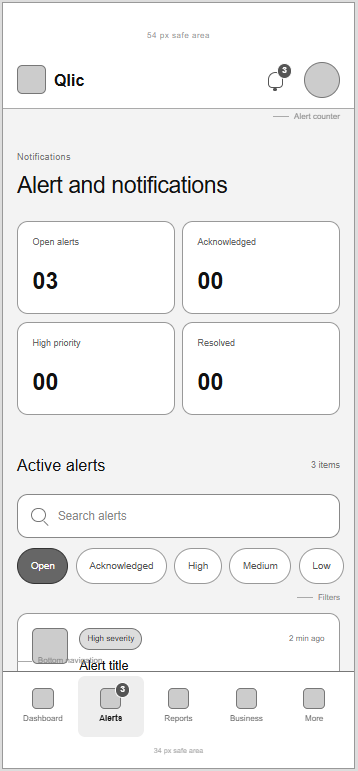

*Figura 3.16. Wireframe de la pantalla Alerts, con su estado vacío y los ajustes de notificación.*

Explicación: la pantalla prioriza la tarea más crítica, atender una alerta. Ofrece tarjetas de resumen, búsqueda, filtros por estado y urgencia, y una acción directa "Acknowledge" en cada alerta. Cuando ningún resultado coincide, se muestra un estado vacío con la acción "Clear filters", y los ajustes de notificación quedan al final porque se usan con menos frecuencia.

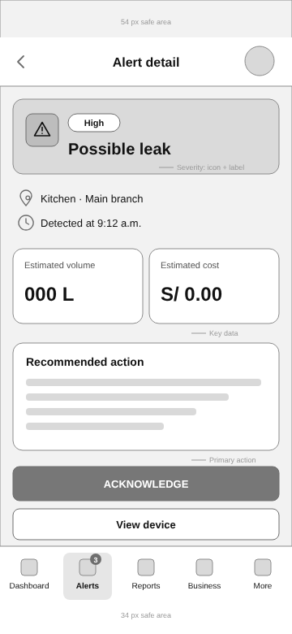

*Figura 3.17. Wireframe de la pantalla Alert detail.*

Explicación: atiende US16, cuyo objetivo es que el suscriptor comprenda la alerta sin conocimientos técnicos. La jerarquía va de la severidad y el título ("Possible leak") a la ubicación (Water Point y local), la hora de detección y el impacto estimado en litros y en soles; debajo se presenta la acción recomendada en lenguaje simple. La acción principal "Acknowledge" ocupa todo el ancho al pie de la pantalla, al alcance del pulgar, y una acción secundaria permite ver el dispositivo asociado. Se abre desde la lista de alertas o directamente desde la notificación push mediante un deep link, según 3.1.2.5.

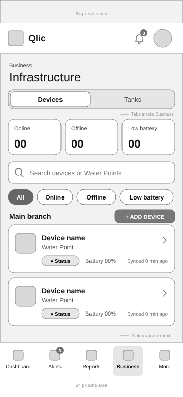

*Figura 3.18. Wireframe de la pantalla Devices dentro de Business.*

Explicación: atiende US12 y anticipa US13. Business presenta dos pestañas, Devices y Tanks; en Devices se muestran tarjetas de resumen (conectados, sin conexión y con batería baja), un buscador con filtros por estado y la lista de dispositivos agrupada por local, según el sistema de organización por tópicos de 3.1.2.1. Cada tarjeta muestra el nombre, el Water Point, el estado con ícono y texto, el nivel de batería y la última sincronización. El botón "Add device" inicia el registro y el estado vacío explica cómo registrar el primer dispositivo.

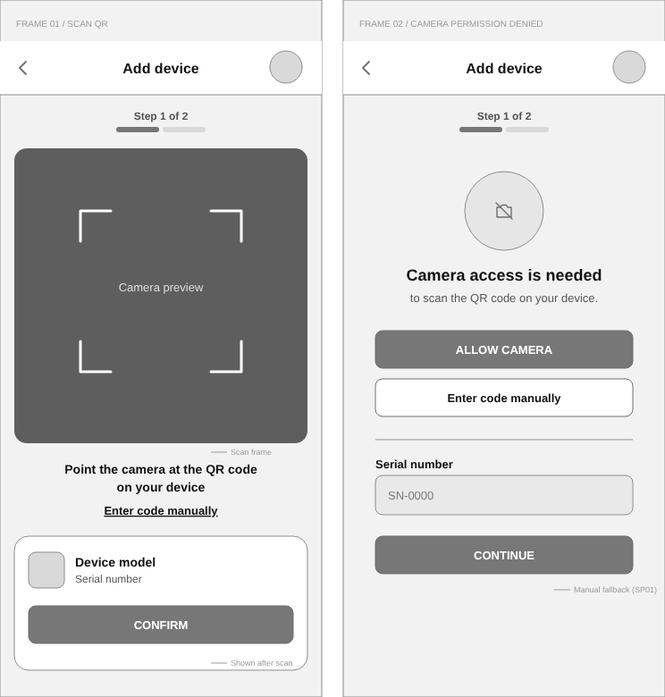

*Figura 3.19. Wireframe de la pantalla Add device, con la lectura del código QR y el ingreso manual del código.*

Explicación: atiende US10 con un flujo secuencial de dos pasos, indicado con "Step 1 of 2". El primer estado muestra el visor de la cámara con un marco guía y una instrucción breve ("Point the camera at the QR code on your device"). Si el usuario niega el permiso de cámara, el segundo estado ofrece ingresar el número de serie de forma manual, de modo que el registro no depende de un único medio de entrada; este comportamiento proviene del Spike SP01. Al reconocer el código se muestran el modelo y el número de serie para que el usuario confirme antes de continuar.

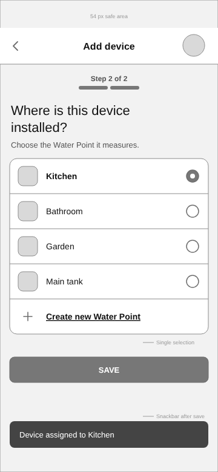

*Figura 3.20. Wireframe de la pantalla Assign Water Point.*

Explicación: atiende US11 como segundo paso del registro ("Step 2 of 2") y también desde el detalle de un dispositivo existente. Presenta la lista de Water Points del local como opciones de selección única, con ícono y nombre (por ejemplo, "Kitchen" o "Main tank"), y la opción "Create new Water Point". El botón "Save" confirma la asignación y la pantalla vuelve a Devices con un mensaje de confirmación breve, lo que da retroalimentación inmediata sin interrumpir la tarea.

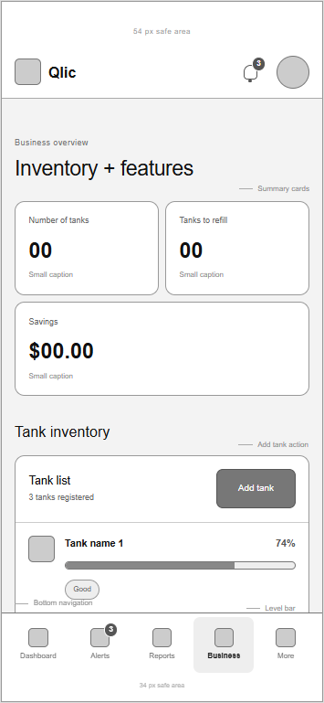

*Figura 3.21. Wireframe de la pantalla Inventory + features.*

Explicación: responde a la necesidad de verificar el nivel de los tanques. Presenta tarjetas de resumen, el inventario con el botón "Add tank" y una barra de nivel por tanque, y la sección "Cost savings" con selector de periodo (semana, mes y año) para comparar el ahorro.

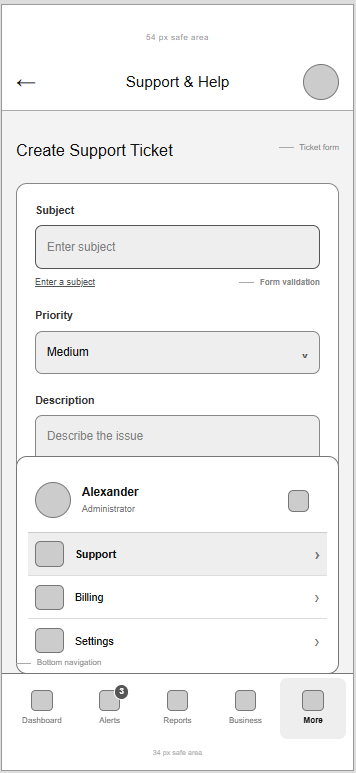

*Figura 3.22. Wireframe de la pantalla Support & Help.*

Explicación: permite pedir ayuda sin salir de la aplicación. Reúne el formulario para crear un ticket, la lista de tickets recientes con su estado y los datos de contacto, con acciones directas para llamar o escribir. Se accede desde "More" y la barra superior incluye una flecha para volver.

En conjunto, los wireframes aplican jerarquía visual (dato clave antes que detalle), consistencia de componentes entre vistas, áreas táctiles de al menos 48 × 48 dp y un orden de lectura lineal compatible con lectores de pantalla. Ninguna información depende solo de la posición o del color: los estados se acompañan siempre de una etiqueta de texto.

#### 3.1.4.2. Mobile Applications Wireflow Diagrams

Un wireflow combina los wireframes de las pantallas con un diagrama de flujo: muestra en qué elemento interactúa el usuario y cómo cambia la vista como resultado, incluidos los cambios de estado dentro de una misma pantalla, lo que lo hace adecuado para aplicaciones móviles (Laubheimer, 2016). Se presenta un wireflow por cada User Goal del Sprint 1, que corresponden a los flujos F1, F2 y F3 del prototipo (Tabla 3.2): crear una cuenta e iniciar sesión, atender una alerta de posible fuga y registrar un dispositivo. Cada wireflow se compone con los wireframes de 3.1.4.1 y usa la misma convención: el rectángulo naranja marca el elemento con el que interactúa el usuario, la flecha verde continua indica la ruta esperada, la flecha roja discontinua indica una ruta alternativa o de error y la flecha azul indica una entrada externa o una recuperación.

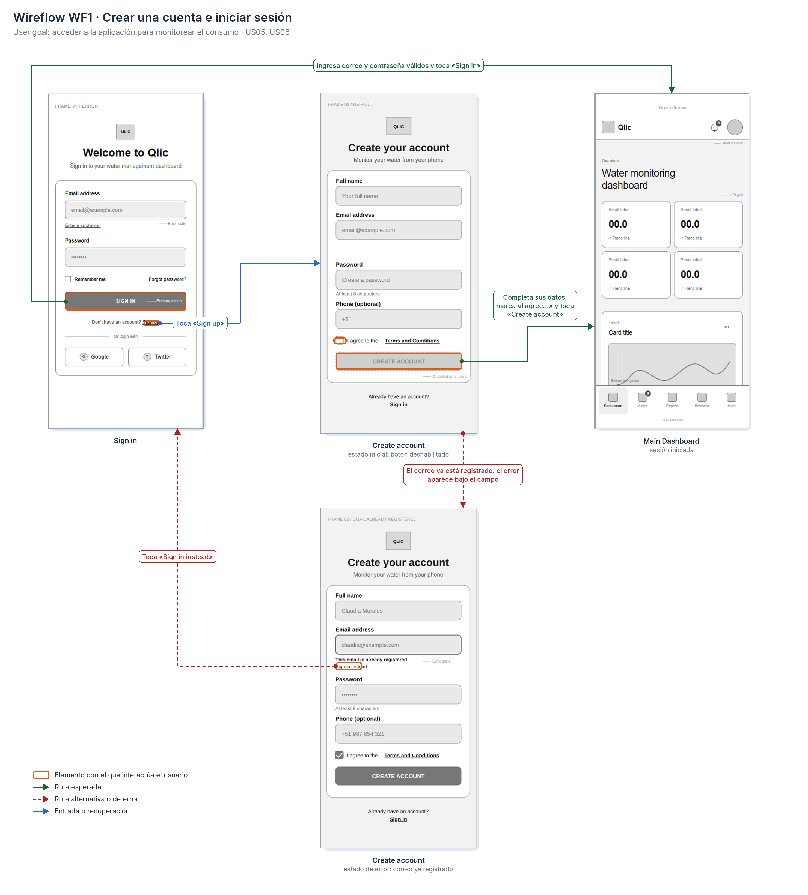

*Figura 3.23. Wireflow WF1: crear una cuenta e iniciar sesión (US05, US06).*

Explicación: desde Sign in, el usuario sin cuenta toca "Sign up" y llega a Create account, cuyo botón permanece deshabilitado hasta que acepta los términos. Al completar el formulario, la cuenta se crea y se abre el Main Dashboard. Si el correo ya está registrado, la misma pantalla cambia al estado de error con el mensaje bajo el campo y el enlace "Sign in instead", que devuelve a Sign in. El usuario que ya tiene cuenta ingresa sus credenciales y toca "Sign in" para llegar directamente al Main Dashboard.

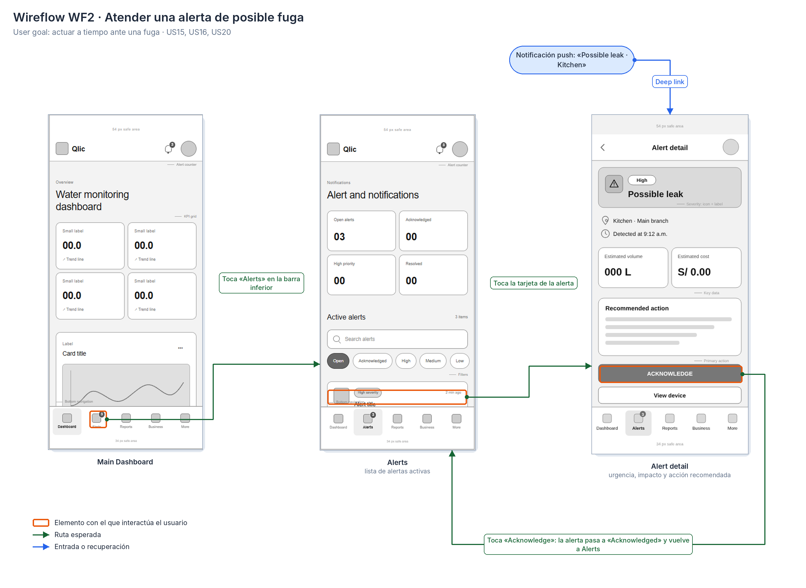

*Figura 3.24. Wireflow WF2: atender una alerta de posible fuga (US15, US16, US20).*

Explicación: el usuario llega a la lista de alertas desde el destino "Alerts" de la barra inferior del Main Dashboard y abre la alerta tocando su tarjeta. La notificación push es una segunda entrada: abre directamente Alert detail mediante un deep link, lo que reduce los pasos para la tarea más crítica. En Alert detail, "Acknowledge" registra la atención; la alerta pasa al estado "Acknowledged" y el usuario vuelve a Alerts.

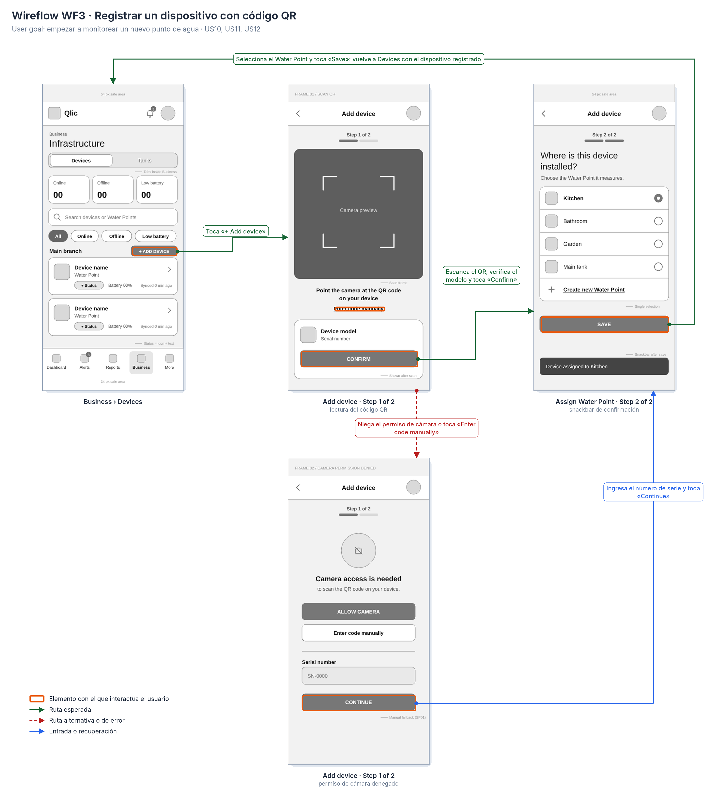

*Figura 3.25. Wireflow WF3: registrar un dispositivo con código QR (US10, US11, US12).*

Explicación: desde Business › Devices, "+ Add device" inicia el registro secuencial de dos pasos. En el paso 1 se lee el código QR y, tras verificar el modelo detectado, "Confirm" lleva al paso 2. Si el usuario niega el permiso de cámara o toca "Enter code manually", la pantalla cambia al ingreso manual del número de serie y "Continue" lleva al mismo paso 2. En Assign Water Point, el usuario elige el punto de agua y "Save" lo devuelve a Devices con un snackbar de confirmación y el dispositivo ya registrado.

#### 3.1.4.3. Mobile Applications Mock-ups

Los mock-ups se elaboraron en Figma a partir de los wireframes de 3.1.4.1 y aplican el Design System definido en 3.1.1 sobre las mismas diez pantallas: Poppins en títulos y Roboto en datos y etiquetas, con tamaños en `sp`; Primary `#0C4AFD` para las acciones principales y el destino activo de la navegación; Success, Warning y Error solo para estados, siempre acompañados de ícono y texto; cards con esquinas de 12 dp y áreas táctiles de al menos 48 dp. Los textos de la interfaz se muestran en inglés, idioma por defecto del producto, y cuentan con su equivalente en español latinoamericano según 3.1.2.2.

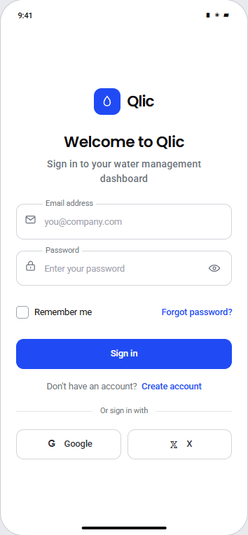

*Figura 3.26. Mock-up de la pantalla Sign in.*

Explicación: los campos tienen etiqueta flotante e íconos, y el botón "Sign in" usa el azul principal con texto blanco. Los enlaces "Forgot password?" y "Create account" se resaltan en azul, y el campo de contraseña incluye un control para mostrar u ocultar el texto.

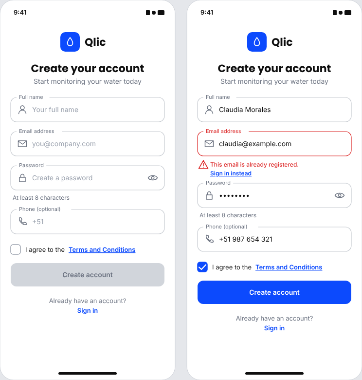

*Figura 3.27. Mock-up de la pantalla Create account, con el estado de error de correo ya registrado.*

Explicación: los campos usan etiqueta flotante e ícono a la izquierda, como en Sign in, para que ambas pantallas se perciban como un mismo flujo. El botón "Create account" usa Primary `#0C4AFD` con texto On Primary y se muestra en gris mientras no se aceptan los términos. El error de correo duplicado usa el color Error `#DC2626` junto con un ícono y un texto explícito, por lo que no depende solo del color. El enlace "Terms and Conditions" se subraya y cumple el área táctil mínima de 48 dp.

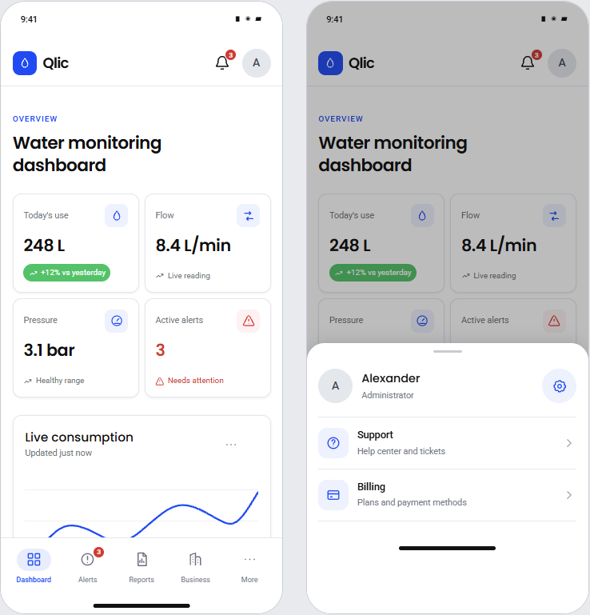

*Figura 3.28. Mock-up de la pantalla Main Dashboard y del menú "More".*

Explicación: las cifras del día se muestran en grande para que el usuario detecte consumos anómalos de un vistazo. El rojo se reserva a las alertas activas, que llevan ícono y la etiqueta "Needs attention". La hoja inferior de "More" muestra el perfil, Support y Billing, con una breve descripción de cada uno.

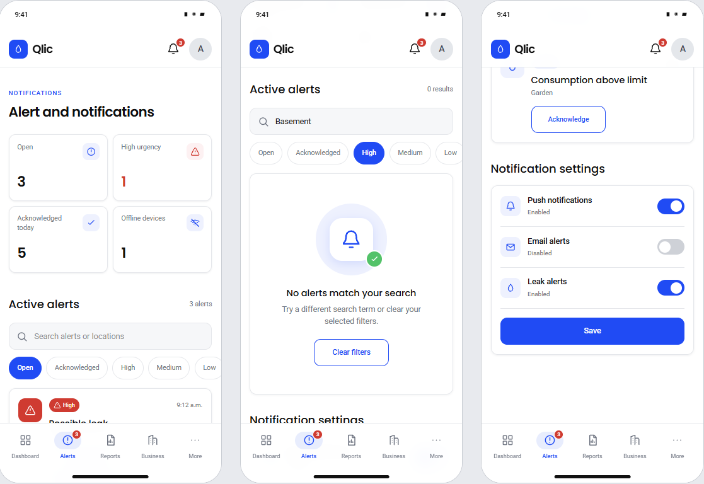

*Figura 3.29. Mock-up de la pantalla Alerts, con su estado vacío y los ajustes de notificación.*

Explicación: la severidad se comunica con ícono y etiqueta ("High"), y no solo con color. El filtro seleccionado usa el azul principal. El estado vacío incluye un mensaje claro y la acción "Clear filters", y cada ajuste de notificación muestra su estado en texto ("Enabled" o "Disabled") además del interruptor.

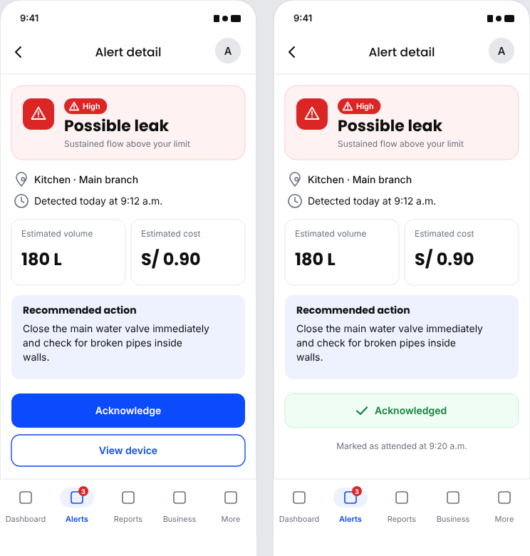

*Figura 3.30. Mock-up de la pantalla Alert detail, antes y después de confirmar la atención.*

Explicación: la cabecera usa el color Error con el ícono de advertencia y la etiqueta "High" para comunicar la severidad por tres medios. El volumen y el costo estimados se presentan en Poppins de 24 sp como datos clave, y la acción recomendada en Roboto de 14 sp dentro de una card con fondo suave. El botón "Acknowledge" usa Primary y, una vez confirmado, la etiqueta cambia a "Acknowledged" con el color Success y un ícono de verificación, lo que da retroalimentación inmediata.

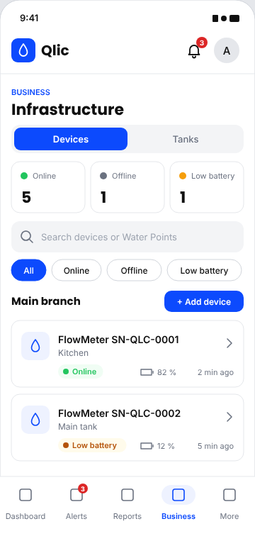

*Figura 3.31. Mock-up de la pantalla Devices dentro de Business.*

Explicación: la pestaña activa (Devices) se resalta con Primary y un indicador inferior, y el destino Business de la barra inferior conserva el estado activo. Las tarjetas de dispositivo aplican el componente "Card de dispositivo" de 3.1.1: esquinas de 12 dp, sombra de elevación baja, estado con ícono y texto ("Online", "Offline", "Low battery") en Success, Text Secondary y Warning respectivamente. El botón "Add device" es el único elemento en Primary de la sección, lo que concentra la atención en la acción principal.

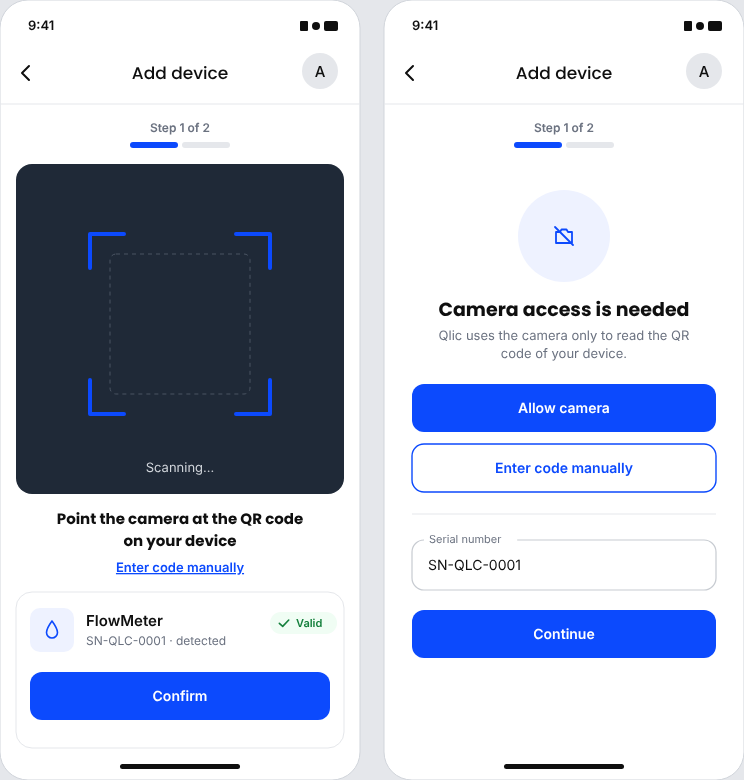

*Figura 3.32. Mock-up de la pantalla Add device, con la lectura del código QR y el ingreso manual del código.*

Explicación: el visor de la cámara ocupa la mayor parte de la pantalla y el marco guía usa Primary con esquinas redondeadas. El indicador "Step 1 of 2" orienta al usuario dentro del flujo secuencial. En el estado sin permiso de cámara, un mensaje explica por qué se necesita el permiso y ofrece dos acciones: "Allow camera" como botón principal y "Enter code manually" como botón secundario con contorno, conforme a los componentes base definidos en 3.1.1.

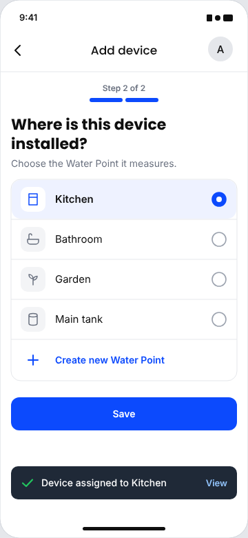

*Figura 3.33. Mock-up de la pantalla Assign Water Point.*

Explicación: las opciones de Water Point se presentan como filas de 56 dp con ícono, nombre y control de selección única; la opción elegida se marca con Primary y un ícono de verificación. El botón "Save" ocupa todo el ancho al pie de la pantalla y, al confirmar, una snackbar con el texto "Device assigned to Kitchen" confirma la operación sin bloquear la navegación.

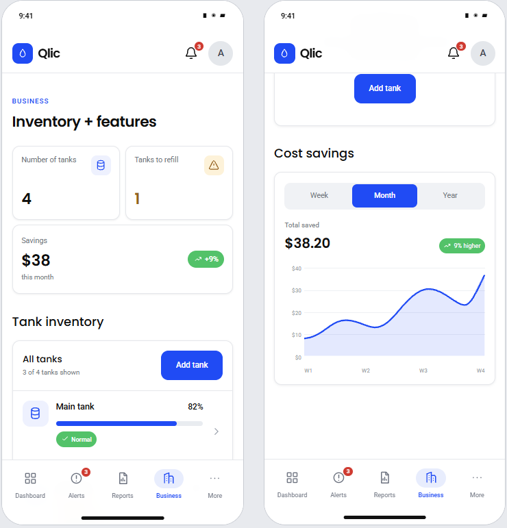

*Figura 3.34. Mock-up de la pantalla Inventory + features.*

Explicación: el estado de cada tanque se indica con ícono y etiqueta ("Normal"), y la barra de nivel muestra el porcentaje de un vistazo. El ahorro del mes se presenta con una cifra grande y su variación, y el gráfico permite compararlo por semana, mes o año.

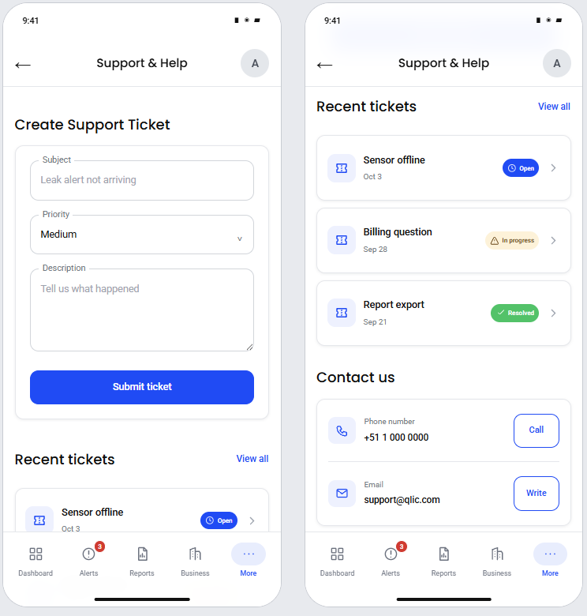

*Figura 3.35. Mock-up de la pantalla Support & Help.*

Explicación: el formulario usa campos con etiqueta flotante y un botón "Submit ticket" de ancho completo. El estado de cada ticket se comunica con ícono y texto ("Open", "In progress" y "Resolved"), y los datos de contacto ofrecen acciones directas ("Call" y "Write").

#### 3.1.4.4. Mobile Applications User Flow Diagrams

Los User Flows representan, con los mock-ups de 3.1.4.3, el camino que sigue el usuario para cumplir cada User Goal, junto con las decisiones del sistema o del usuario que lo bifurcan. Para cada flujo se distingue la ruta esperada (happy path) de las rutas alternativas (unhappy paths), que cubren los errores previsibles y la forma de recuperarse de ellos. Los tres diagramas corresponden a los mismos User Goals de los wireflows de 3.1.4.2 y usan la misma convención de colores; los rombos representan las decisiones, las cápsulas azul y verde marcan el inicio y el resultado del flujo, y los recuadros rojos, los mensajes de error que no cambian de pantalla.

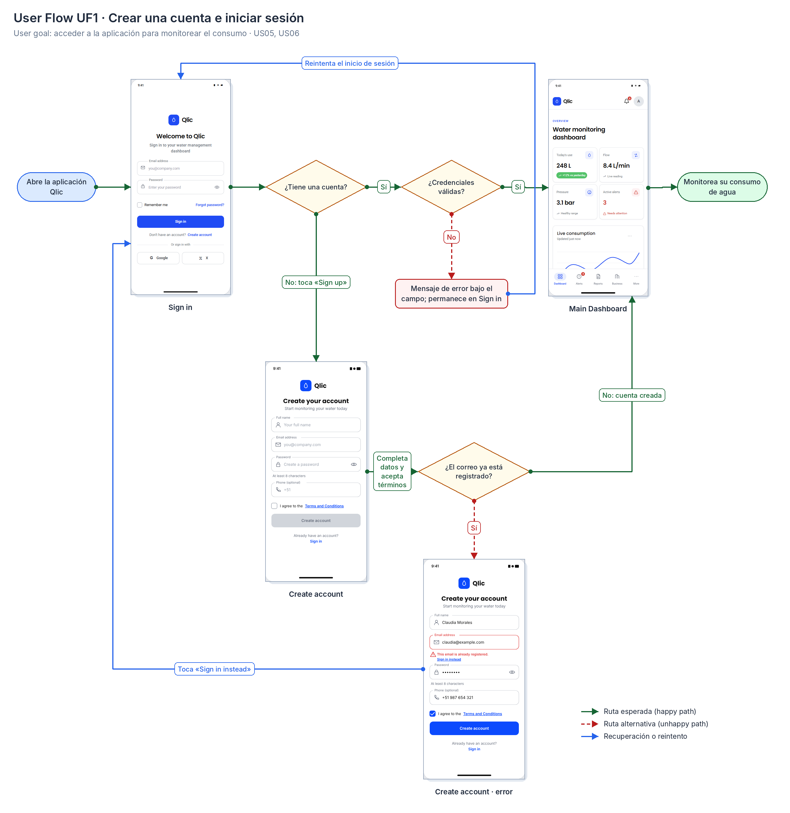

*Figura 3.36. User Flow UF1: crear una cuenta e iniciar sesión (US05, US06).*

Explicación: la ruta esperada lleva de Sign in al Main Dashboard cuando las credenciales son válidas, o pasa por Create account cuando el usuario aún no tiene cuenta. Las rutas alternativas cubren los escenarios de error de las User Stories: las credenciales inválidas muestran el mensaje bajo el campo y el usuario reintenta en la misma pantalla (US06), y un correo ya registrado muestra el estado de error de Create account con el enlace "Sign in instead" (US05).

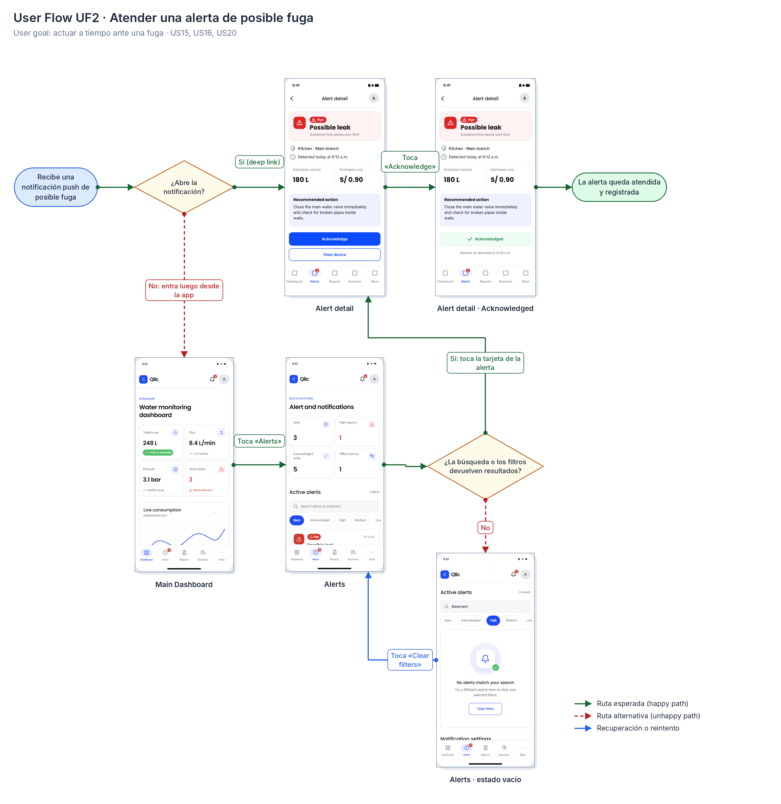

*Figura 3.37. User Flow UF2: atender una alerta de posible fuga (US15, US16, US20).*

Explicación: la ruta esperada parte de la notificación push y llega, en dos toques, a la alerta atendida: Alert detail y "Acknowledge", que deja la alerta en estado "Acknowledged" con la hora de atención. Si el usuario no abre la notificación, ingresa luego desde el Main Dashboard y busca la alerta en Alerts. Cuando la búsqueda o los filtros no devuelven resultados, se muestra el estado vacío y "Clear filters" restablece la lista.

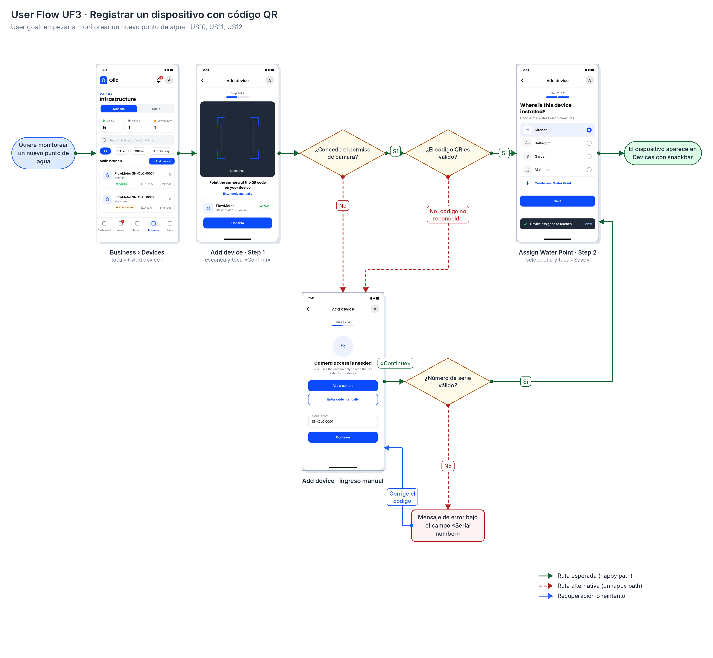

*Figura 3.38. User Flow UF3: registrar un dispositivo con código QR (US10, US11, US12).*

Explicación: la ruta esperada recorre Devices, la lectura del código QR y Assign Water Point, y termina con el dispositivo visible en Devices junto con el snackbar de confirmación. Las rutas alternativas cubren el permiso de cámara denegado y el código QR no reconocido, que llevan al ingreso manual del número de serie; si el número tampoco es válido, el error se muestra bajo el campo "Serial number" y el usuario lo corrige sin perder el avance.

#### 3.1.4.5. Mobile Applications Prototyping

El prototipo de la aplicación móvil se construyó en Figma enlazando los mock-ups de 3.1.4.3 mediante las funciones de prototipado de la herramienta (Figma, s. f.), sobre un marco Android de 360 × 800 dp. Como la aplicación nativa en Kotlin y la aplicación multiplataforma en Flutter comparten la misma propuesta de UI, un mismo prototipo representa la interacción de ambas. El prototipo simula los recorridos de los User Flows de 3.1.4.4, incluidas sus rutas alternativas, de modo que la navegación pueda evaluarse con usuarios antes de implementarse.

**Criterios de interacción.** Las decisiones de interacción se derivan del sistema de navegación definido en 3.1.2.5 y de los componentes de Material Design 3 (Google, s. f.-d):

| Decisión de interacción | Relación con la arquitectura de información | Implementación en el prototipo |
|---|---|---|
| Barra de navegación inferior con cinco destinos (Dashboard, Alerts, Reports, Business, More) | Navegación global de primer nivel, al alcance del pulgar | Cambio de destino con transición instantánea y estado activo resaltado |
| Navegación jerárquica hacia los detalles | Pantallas de detalle (Alert detail, detalle de dispositivo) dependen de una lista | Transición "Move in" desde la derecha y botón "Back" en la barra superior |
| Hoja inferior para "More" | Destinos secundarios (perfil, Support, Billing) | Overlay anclado al borde inferior que se cierra al tocar fuera |
| Flujo secuencial para registrar un dispositivo | Organización secuencial definida en 3.1.2.1 | Indicador "Step 1 of 2" y "Step 2 of 2", y botón "Back" que conserva los datos ingresados |
| Deep link desde la notificación push | Reduce pasos para la tarea crítica de atender una fuga | La notificación simulada abre directamente Alert detail |
| Búsqueda y filtros | Sistema de búsqueda de 3.1.2.4 para Devices y Alerts | Chips de filtro con variante seleccionada y estado vacío con "Clear filters" |
| Retroalimentación inmediata | Confirmación del resultado de cada acción | Snackbar tras guardar, cambio de etiqueta a "Acknowledged" y mensajes de error bajo el campo |

**Flujos prototipados.** La Tabla 3.2 resume los flujos incluidos en el prototipo y su relación con los User Goals y las User Stories.

*Tabla 3.2. Flujos de interacción cubiertos por el prototipo de la aplicación móvil.*

| Flujo | User Goal | User Stories | Ruta esperada (happy path) | Rutas alternativas (unhappy paths) |
|---|---|---|---|---|
| F1. Crear una cuenta e iniciar sesión | Acceder a la aplicación para monitorear el consumo | US05, US06 | Sign in → Create account → aceptar términos → Dashboard | Correo ya registrado → mensaje bajo el campo → "Sign in instead"; credenciales inválidas → mensaje en Sign in |
| F2. Atender una alerta de posible fuga | Actuar a tiempo ante una fuga | US15, US16, US20 | Notificación push → Alert detail → "Acknowledge" → Alerts con la alerta atendida | Búsqueda sin resultados → estado vacío → "Clear filters" |
| F3. Registrar un dispositivo con código QR | Empezar a monitorear un nuevo punto de agua | US10, US11, US12 | Business › Devices → "Add device" → lectura del QR → confirmar → Assign Water Point → "Save" → Devices con snackbar | Permiso de cámara denegado → "Enter code manually" → confirmar |
| F4. Revisar el nivel de los tanques | Evitar quedarse sin agua | US28 | Business › Tanks → detalle del tanque | Tanque con nivel bajo → indicador de advertencia en "Tanks to refill" |
| F5. Solicitar ayuda | Resolver un problema sin salir de la aplicación | US35 | More → Support → formulario → "Submit ticket" → ticket en estado "Open" | Campo obligatorio vacío → mensaje bajo el campo |

**Acceso al prototipo.** El prototipo navegable debe enlazarse desde la versión pública de "Present" en Figma cuando el equipo disponga de ese enlace. En esta entrega no se declara un video de demostración ni una captura de video porque todavía no se han realizado.
