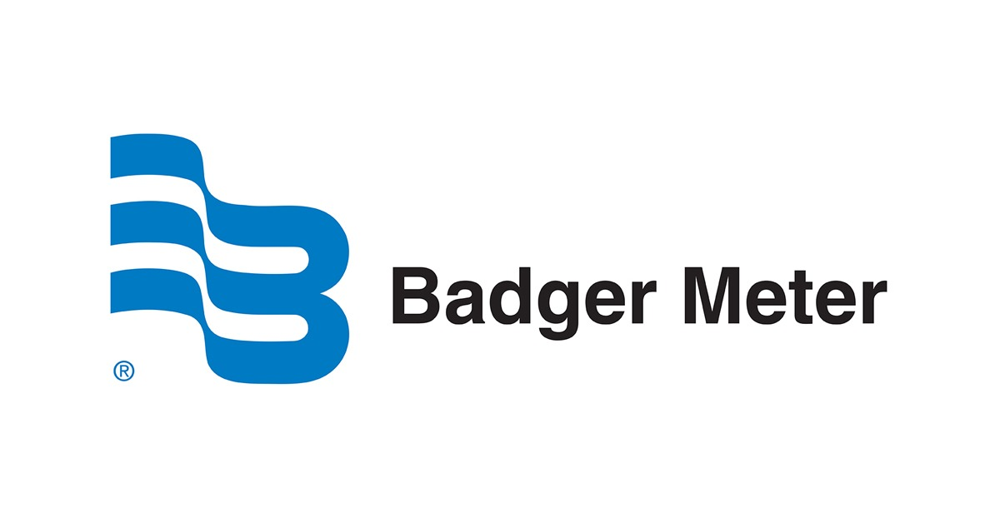
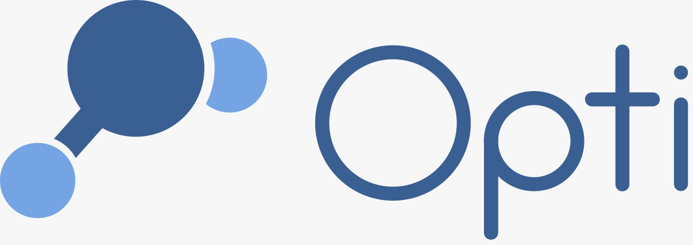
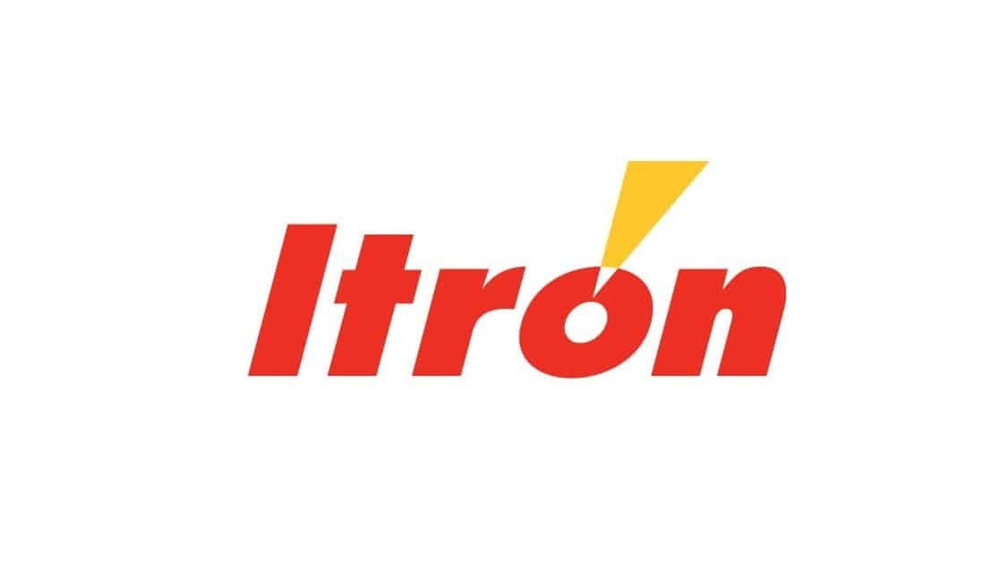
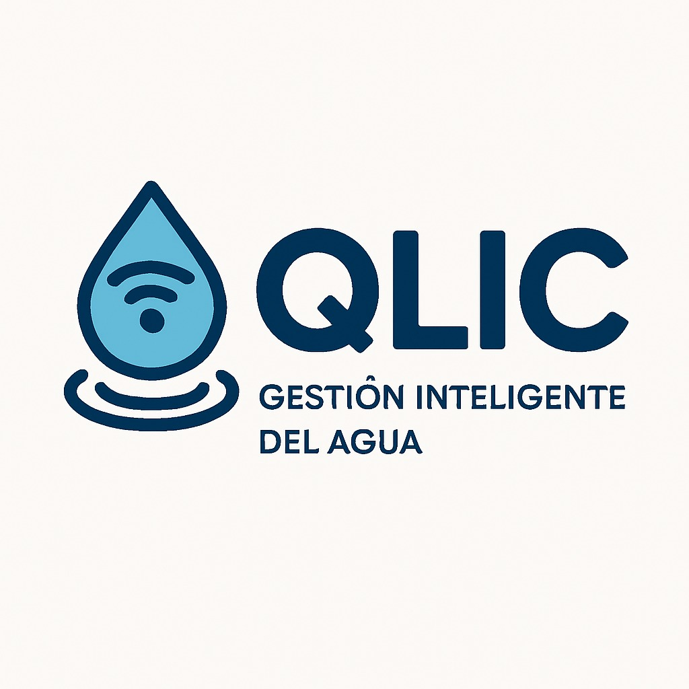

# Capítulo V: Conclusiones, Bibliografía y Anexos

## 5.1. Conclusiones

1. Qlic aborda la necesidad de mejorar la visibilidad del consumo de agua y la detección oportuna de anomalías en PYMES, comercios locales y hogares.
2. El análisis competitivo permitió reconocer capacidades relevantes del mercado: medición conectada, analítica, alertas, interoperabilidad y soporte para la toma de decisiones. La oportunidad preliminar de Qlic está en traducir esos datos a una experiencia móvil clara, accesible y cercana para usuarios locales (Badger Meter, s. f.; Itron, s. f.; Opti, s. f.; Wint, s. f.).
3. Badger Meter e Itron representan soluciones directas de smart water, mientras que OptiRTC aporta un referente adyacente de monitoreo y control de aguas pluviales. Wint se conserva como referencia secundaria para la respuesta ante fugas comerciales (Badger Meter, s. f.; Itron, s. f.; Opti, s. f.; Wint, s. f.).
4. Las estrategias propuestas —diferenciación móvil y local, escala progresiva, interoperabilidad, respuesta ante fugas, soporte cercano y sostenibilidad con evidencia— son hipótesis de diseño. Deben validarse con entrevistas antes de convertirse en requisitos del producto.
5. Las cinco entrevistas registradas —dos del segmento PYMES y comercios locales y tres del segmento hogares y familias— aportan información objetiva y subjetiva para orientar los artefactos de needfinding. Cada ficha conserva los datos disponibles, la captura, el enlace al video y el resumen descriptivo correspondiente; en la entrevista de Dick Isuiza aún falta consignar el tramo final del video porque no figura en el registro recibido.
6. En este avance no se afirma que la aplicación móvil, los sensores IoT ni los servicios hayan sido implementados. Las decisiones de desarrollo deberán basarse en los resultados de needfinding y en los siguientes hitos del proyecto.

## 5.2. Bibliografía

### 5.2.1. Dominio de negocio y competidores

Badger Meter. (s. f.). *BlueEdge Suite of Scalable Solutions*. https://www.badgermeter.com/blueedge/

Banco Interamericano de Desarrollo. (2025). *Peril and promise: Tackling climate change in Latin America and the Caribbean*. https://publications.iadb.org/publications/english/document/Peril-and-Promise-Tackling-Climate-Change-in-Latin-America-and-the-Caribbean.pdf

Itron. (s. f.). *Smart Water Solutions*. https://emea.itron.com/categories/smart-water-solutions

Ministerio de Vivienda, Construcción y Saneamiento. (2024). *¡Cifra histórica! Casi 600 mil peruanos accedieron al servicio de agua potable durante el último año con obras del MVCS*. https://www.gob.pe/institucion/vivienda/noticias/954978-cifra-historica-casi-600-mil-peruanos-accedieron-al-servicio-de-agua-potable-durante-el-ultimo-ano-con-obras-del-mvcs

Opti. (s. f.). *The Opti Solution*. https://www.optirtc.com/solution

Superintendencia Nacional de Servicios de Saneamiento. (2023). *El buen dato Sunass: El impacto del agua potable y saneamiento en la calidad de vida*. https://www.gob.pe/institucion/sunass/colecciones/47085-el-buen-dato-sunass

Superintendencia Nacional de Servicios de Saneamiento. (2025). *Agua no facturada en el Perú: Un desafío de gestión para las empresas prestadoras de servicios de agua potable*. https://cdn.www.gob.pe/uploads/document/file/8960946/7375591-agua-no-facturada-en-el-peru-un-desafio-de-gestion-para-las-empresas-prestadoras-de-servicios-de-agua-potable.pdf

U.S. Environmental Protection Agency. (2024). *The WaterSense current: Winter 2024*. https://www.epa.gov/watersense/watersense-current-winter-2024

Zipdo. (2025). *Water crisis statistics*. https://zipdo.co/water-crisis-statistics/

Wint. (s. f.). *Commercial Water Management & Leak Prevention Solutions*. https://wint.ai/

### 5.2.2. Métodos y técnicas de ingeniería de software

Colegio de Ingenieros del Perú. (2018). *Código de ética del Colegio de Ingenieros del Perú*. https://www.cip.org.pe/publicaciones/reglamentosCNCD2018/codigo_de_etica_del_cip.pdf

Congreso de la República del Perú. (2011). *Ley N.° 29733, Ley de Protección de Datos Personales*. https://www.gob.pe/institucion/congreso-de-la-republica/normas-legales/243470-29733

Conventional Commits. (s. f.). *Conventional Commits 1.0.0*. https://www.conventionalcommits.org/en/v1.0.0/

Cucumber. (s. f.). *Gherkin reference*. https://cucumber.io/docs/gherkin/reference/

Driessen, V. (2010). *A successful Git branching model*. https://nvie.com/posts/a-successful-git-branching-model/

Fielding, R., Nottingham, M., & Reschke, J. (Eds.). (2022). *HTTP semantics* (RFC 9110). RFC Editor. https://doi.org/10.17487/RFC9110

Gotterbarn, D., Miller, K., & Rogerson, S. (1999). Software engineering code of ethics is approved. *Communications of the ACM, 42*(10), 102–107. https://cacm.acm.org/magazines/1999/10/7800-software-engineering-code-of-ethics-is-approved/fulltext

Gothelf, J. (s. f.). *Lean UX Canvas*. https://jeffgothelf.com/blog/leanuxcanvas/

Gothelf, J., & Seiden, J. (2021). *Lean UX: Creating great products with agile teams* (3.ª ed.). O'Reilly Media.

Institute of Electrical and Electronics Engineers. (2012). *IEEE standard for configuration management in systems and software engineering* (IEEE Std 828-2012). https://doi.org/10.1109/IEEESTD.2012.6170935

Jones, M., Bradley, J., & Sakimura, N. (2015). *JSON Web Token (JWT)* (RFC 7519). RFC Editor. https://doi.org/10.17487/RFC7519

Jones, M., & Hardt, D. (2012). *The OAuth 2.0 authorization framework: Bearer token usage* (RFC 6750). RFC Editor. https://doi.org/10.17487/RFC6750

Laubheimer, P. (2016, 27 de noviembre). *Wireflows: A UX deliverable for workflows and apps*. Nielsen Norman Group. https://www.nngroup.com/articles/wireflows/

Nottingham, M., Wilde, E., & Dalal, S. (2023). *Problem details for HTTP APIs* (RFC 9457). RFC Editor. https://doi.org/10.17487/RFC9457

OpenAPI Initiative. (2021). *OpenAPI Specification v3.1.0*. https://spec.openapis.org/oas/v3.1.0

Preston-Werner, T. (s. f.). *Semantic Versioning 2.0.0*. https://semver.org/spec/v2.0.0.html

Sommerville, I. (2016). *Software engineering* (10.ª ed.). Pearson.

SpecFlow. (s. f.). *Gherkin conventions for readable specifications*. https://specflow.org/gherkin/gherkin-conventions-for-readable-specifications/

Universidad Peruana de Ciencias Aplicadas. (2026). *Trabajo Final 1ACC0238 202620: Rúbrica y lineamientos del proyecto* [Documento del curso].

Wiggins, A. (s. f.). *The twelve-factor app: III. Config*. https://12factor.net/config

### 5.2.3. Herramientas y documentación técnica

Dart. (s. f.). *Effective Dart: Style*. https://dart.dev/effective-dart/style

Docker. (s. f.). *Multi-stage builds*. https://docs.docker.com/build/building/multi-stage/

Figma. (s. f.). *Guide to prototyping in Figma*. https://help.figma.com/hc/en-us/articles/360040314193-Guide-to-prototyping-in-Figma

Firebase. (s. f.). *Firebase App Distribution*. https://firebase.google.com/docs/app-distribution

GitHub. (s. f.-a). *Configuring a publishing source for your GitHub Pages site*. https://docs.github.com/en/pages/getting-started-with-github-pages/configuring-a-publishing-source-for-your-github-pages-site

GitHub. (s. f.-b). *GitHub documentation*. https://docs.github.com/

Google. (s. f.-a). *Android Developers documentation*. https://developer.android.com/

Google. (s. f.-b). *Google HTML/CSS style guide*. https://google.github.io/styleguide/htmlcssguide.html

Google. (s. f.-c). *Kotlin style guide*. Android Developers. https://developer.android.com/kotlin/style-guide

Google. (s. f.-d). *Navigation bar*. Material Design 3. https://m3.material.io/components/navigation-bar/overview

Gradle. (s. f.). *Toolchains for JVM projects*. https://docs.gradle.org/current/userguide/toolchains.html

JetBrains. (s. f.). *Coding conventions*. Kotlin Documentation. https://kotlinlang.org/docs/coding-conventions.html

Render. (s. f.). *Deploy for free*. https://render.com/docs/free

Spring. (s. f.-a). *OAuth 2.0 Resource Server JWT*. Spring Security Reference. https://docs.spring.io/spring-security/reference/servlet/oauth2/resource-server/jwt.html

Spring. (s. f.-b). *Profiles*. Spring Boot Reference Documentation. https://docs.spring.io/spring-boot/reference/features/profiles.html

Spring. (s. f.-c). *Spring Boot features*. Spring Boot Reference Documentation. https://docs.spring.io/spring-boot/docs/current/reference/html/features.html

springdoc. (s. f.). *springdoc-openapi*. https://springdoc.org/

W3Schools. (s. f.). *HTML style guide and coding conventions*. https://www.w3schools.com/html/html5_syntax.asp

## 5.3. Anexos

Cada anexo inicia en una nueva página y se identifica con una letra mayúscula. Los anexos reúnen los recursos que, por su extensión o naturaleza, complementan el cuerpo del informe: recursos gráficos, videos de exposición, enlaces a los artefactos y productos, y los términos y condiciones del servicio.

### Anexo A. Recursos gráficos del análisis competitivo

Los logos utilizados en el landscape corresponden al apartado **2.1.1. Análisis competitivo** del Capítulo II.

**Nota.** Logotipos reproducidos con fines académicos. Fuentes: Badger Meter (s. f.), Opti (s. f.) e Itron (s. f.); el logotipo de Qlic es elaboración propia.

### Anexo B. Videos de Exposiciones

En este anexo se registran los enlaces privados a los videos de exposición de cada entrega, conforme a las indicaciones del curso. Cada video tiene una duración máxima de 15 minutos, inicia con la presentación de cada integrante ante cámara y se publica en el OneDrive facilitado por el docente.

| Entrega | Archivo | Contenido | Enlace |
|---|---|---|---|
| AV1 | `upc-pre-202620-1acc0238-13984-wasd-expo-av1.mp4` | Startup Profile, Solution Profile, entrevistas, needfinding y diseño de la solución (Capítulos I y II) | [COMPLETAR: enlace al video de AV1] |
| TB1 | `upc-pre-202620-1acc0238-13984-wasd-expo-tb1.mp4` | Solution UI/UX Design (Capítulo III) e implementación del Sprint 1 (Capítulo IV) | [COMPLETAR: enlace al video de TB1] |

Adicionalmente, el informe referencia los siguientes videos de evidencia, también publicados en el OneDrive del curso:

| Video | Archivo | Sección del informe | Enlace |
|---|---|---|---|
| Entrevistas de needfinding | `upc-pre-202620-1acc0238-13984-wasd-needfinding-av1.mp4` | 2.2.2. Registro de entrevistas | [COMPLETAR: enlace] |
| Navegación del prototipo | `upc-pre-202620-1acc0238-13984-wasd-prototypenavigation-tb1.mp4` | 3.1.4.5. Mobile Applications Prototyping | [COMPLETAR: enlace] |
| Navegación del producto | `upc-pre-202620-1acc0238-13984-wasd-productnavigation-tb1.mp4` | 4.2.1.6. Execution Evidence for Sprint Review | [COMPLETAR: enlace] |

### Anexo C. Artefactos, repositorios y productos desplegados

Este anexo centraliza los enlaces a los artefactos elaborados en las herramientas indicadas para el proyecto, a los repositorios de código fuente y a los productos desplegados, de modo que cada artefacto incluido como imagen en el informe pueda consultarse en su formato original.

**Artefactos de diseño y modelado**

| Artefacto | Herramienta | Sección del informe | Enlace |
|---|---|---|---|
| User Personas, Journey Maps, Empathy Maps e Impact Map | UXPressia | 2.3 y 2.4.2 | [COMPLETAR: enlace al proyecto de UXPressia] |
| Big Picture EventStorming y Context Mapping | Miro | 2.3.5, 2.5.1 y 2.5.2 | [COMPLETAR: enlace al tablero de Miro] |
| Diagramas C4 (Context, Container, Deployment y Component) | Structurizr DSL | 2.5.3 y 2.6 | [COMPLETAR: enlace al workspace de Structurizr] |
| Diagramas de clases y de base de datos | PlantUML | 2.6.x.6 | Código fuente incluido en el Capítulo II |
| Wireframes, mock-ups y prototipo del Landing Page y de la aplicación móvil | Figma | 3.1.3 y 3.1.4 | [COMPLETAR: enlace al archivo de Figma] |
| Wireflow y User Flow diagrams | LucidChart | 3.1.4.2 y 3.1.4.4 | [COMPLETAR: enlace al documento de LucidChart] |
| Product Backlog y Sprint Backlog | Trello | 2.4.3 y 4.2.1.3 | https://trello.com/invite/b/6aa1e6966e4df21cb3a4eef9/ATTIe6a46d0c84f618e9bccb9c4de3ce13f711448192/product-backlog-qlic |

**Repositorios y productos desplegados**

| Producto | Repositorio | URL desplegada |
|---|---|---|
| Project Report | https://github.com/1ACC0238-2620-13984-Aplicaciones-Mov/upc-pre-202620-1acc0238-13984-Qlic-report | No aplica |
| Landing Page | https://github.com/1ACC0238-2620-13984-Aplicaciones-Mov/qlic-landing-page | https://1acc0238-2620-13984-aplicaciones-mov.github.io/qlic-landing-page/ |
| RESTful API | https://github.com/1ACC0238-2620-13984-Aplicaciones-Mov/qlic-backend-api | https://qlic-backend-api.onrender.com/swagger-ui.html |

### Anexo D. Términos y condiciones del servicio

Los términos y condiciones de Qlic se exponen mediante un enlace en el footer del Landing Page y en la pantalla Create account de la aplicación móvil, donde el suscriptor debe aceptarlos para registrar su cuenta (US05 y US38). Su redacción aplica los principios del Software Engineering Code of Ethics and Professional Practice de ACM e IEEE Computer Society, en particular los de interés público, cliente y empleador, y producto (Gotterbarn et al., 1999); los deberes de veracidad y de responsabilidad profesional del Código de Ética del Colegio de Ingenieros del Perú (Colegio de Ingenieros del Perú, 2018); y los principios de consentimiento, finalidad y seguridad de la Ley N.° 29733, Ley de Protección de Datos Personales (Congreso de la República del Perú, 2011). En consecuencia, el texto describe con veracidad el alcance del servicio, no promete resultados que el producto no garantiza y explica qué datos se recopilan y con qué finalidad.

El texto se publica en inglés, idioma por defecto del producto, y se muestra en español latinoamericano cuando el usuario selecciona ese idioma.

**Qlic Terms and Conditions**

*Last updated: October 2026*

**1. Acceptance of the terms.** By creating a Qlic account you accept these Terms and Conditions. If you do not agree with them, you must not use the service. Qlic is provided by WASD, a startup formed by students of the Universidad Peruana de Ciencias Aplicadas.

**2. The service.** Qlic is a water monitoring service for homes and small businesses. It combines IoT measurement devices installed at Water Points, a mobile application and a web platform to show water consumption, detect unusual consumption and possible leaks, and send alerts and reports.

**3. Account and security.** You must provide accurate information when you register and keep it up to date. You are responsible for keeping your password confidential and for all activity in your account. Passwords are stored encrypted and are never shown to Qlic staff. Notify us immediately at the contact address below if you suspect unauthorized access.

**4. Authorized users.** The account holder may invite other people to access the account with the permission level they choose. The account holder is responsible for the people they invite and may revoke their access at any time. The number of authorized users depends on the subscription plan.

**5. Devices and installation.** Measurements depend on the correct installation, power supply and connectivity of the devices. You must not tamper with the devices or use them for purposes other than water monitoring.

**6. Alerts and limitations.** Alerts, estimates of volume and cost, and recommendations are informative and are based on the readings received from your devices. Qlic does not close valves or act on your installation, and it does not guarantee that every leak will be detected or that damage or costs will be avoided. In an emergency, act according to the recommended action and contact a qualified technician.

**7. Personal data.** Qlic collects your name, email, phone number, the data of your devices and Water Points, and your consumption readings. This data is used only to provide the service: showing consumption, generating alerts and reports, and providing support. Qlic does not sell your data and does not share it with third parties, except with the providers needed to operate the service, such as push notification and payment providers, which receive only the minimum data required. Push notifications do not include sensitive account data. You may request access to, correction of or deletion of your data at any time, in accordance with Peruvian Law N.° 29733 on Personal Data Protection.

**8. Plans and payments.** Paid plans are billed according to the conditions shown before contracting them. You may change or cancel your plan from the application; the cancellation takes effect at the end of the current billing period.

**9. Availability.** We work to keep the service available, but it may be interrupted for maintenance, failures of third-party providers or causes beyond our control. Planned maintenance will be announced in advance whenever possible.

**10. Intellectual property.** The Qlic brand, the application and its content belong to WASD. Your consumption data belongs to you.

**11. Termination.** You may delete your account at any time. We may suspend accounts that breach these terms or use the service fraudulently, after notifying the account holder whenever possible.

**12. Changes to these terms.** We will notify you of relevant changes through the application or by email before they take effect. Continuing to use the service after that date means that you accept the new terms.

**13. Applicable law and contact.** These terms are governed by the laws of Peru. For questions or requests about these terms or your personal data, contact us at [COMPLETAR: correo de contacto del equipo].

